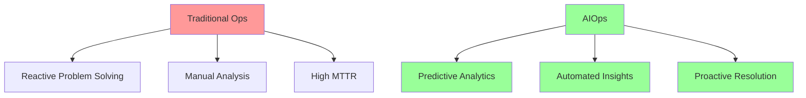

# DevOps Playbook

## AI and Machine Learning in DevOps

### Introduction to AI and Machine Learning in DevOps

Artificial Intelligence (AI) and Machine Learning (ML) are transforming DevOps practices by automating complex decision-making processes, predicting potential issues, and optimizing resource allocation. These technologies enable teams to move from reactive to proactive operations, significantly improving system reliability and efficiency.

#### Key Applications in DevOps:
- **Predictive Analytics**: Forecasting system failures and capacity needs
- **Automated Root Cause Analysis**: Identifying issues faster than manual investigation
- **Intelligent Resource Optimization**: Dynamic scaling based on predicted load
- **Anomaly Detection**: Spotting unusual patterns before they become incidents
- **Natural Language Processing**: Converting alerts and logs into actionable insights

#### Market Impact and Trends (2025)
AIOps market is valued at $1.5B and growing at 15% CAGR. Organizations implementing AIOps see:
- **73% reduction** in mean time to detection (MTTD)
- **64% reduction** in false positive alerts
- **50% improvement** in deployment success rates
- **40% reduction** in operational costs



#### Real-World Impact:
```python
# Example: ML-based deployment risk assessment
from sklearn.ensemble import RandomForestClassifier
import pandas as pd

class DeploymentRiskPredictor:
    def __init__(self):
        self.model = RandomForestClassifier(n_estimators=100)

    def train(self, historical_deployments):
        # Features: code_changes, test_coverage, time_of_day, developer_experience
        features = historical_deployments[[
            'files_changed', 'lines_changed', 'test_coverage',
            'hour_of_day', 'day_of_week', 'developer_commits'
        ]]
        labels = historical_deployments['deployment_failed']

        self.model.fit(features, labels)

    def predict_risk(self, deployment_metadata):
        risk_score = self.model.predict_proba([deployment_metadata])[0][1]
        return {
            'risk_score': risk_score,
            'risk_level': 'High' if risk_score > 0.7 else 'Medium' if risk_score > 0.3 else 'Low',
            'recommendation': self._get_recommendation(risk_score)
        }

    def _get_recommendation(self, risk_score):
        if risk_score > 0.7:
            return "Consider additional testing or deploy during off-peak hours"
        elif risk_score > 0.3:
            return "Deploy with enhanced monitoring"
        else:
            return "Safe to deploy with standard procedures"
```

### AI-Powered Monitoring and Log Analysis

ML algorithms can process millions of log entries in real-time, identifying patterns and anomalies that would be impossible for humans to detect manually. This enables proactive issue resolution and reduces mean time to detection (MTTD).

#### Implementation Example: Anomaly Detection Pipeline

```python
import numpy as np
from sklearn.ensemble import IsolationForest
from elasticsearch import Elasticsearch
import json

class LogAnomalyDetector:
    def __init__(self, elasticsearch_host):
        self.es = Elasticsearch([elasticsearch_host])
        self.model = IsolationForest(contamination=0.1)
        self.feature_extractors = {
            'response_time': self._extract_response_time,
            'error_rate': self._extract_error_rate,
            'request_volume': self._extract_request_volume
        }
    
    def train_on_baseline(self, start_date, end_date):
        """Train model on normal behavior baseline"""
        logs = self._fetch_logs(start_date, end_date)
        features = self._extract_features(logs)
        self.model.fit(features)
    
    def detect_anomalies(self, time_window='5m'):
        """Real-time anomaly detection"""
        recent_logs = self._fetch_recent_logs(time_window)
        features = self._extract_features(recent_logs)
        
        predictions = self.model.predict(features)
        anomalies = features[predictions == -1]
        
        if len(anomalies) > 0:
            self._trigger_alert(anomalies)
    
    def _extract_features(self, logs):
        """Convert raw logs to ML features"""
        features = []
        for log in logs:
            feature_vector = [
                extractor(log) for extractor in self.feature_extractors.values()
            ]
            features.append(feature_vector)
        return np.array(features)
    
    def _trigger_alert(self, anomalies):
        alert = {
            'severity': 'high',
            'type': 'anomaly_detected',
            'details': self._analyze_anomaly_pattern(anomalies),
            'timestamp': datetime.now().isoformat()
        }
        # Send to alerting system
        self.send_to_pagerduty(alert)
```

#### Advanced Log Pattern Recognition

```yaml
# Kubernetes deployment for ML log analyzer
apiVersion: apps/v1
kind: Deployment
metadata:
  name: ml-log-analyzer
spec:
  replicas: 3
  selector:
    matchLabels:
      app: ml-log-analyzer
  template:
    metadata:
      labels:
        app: ml-log-analyzer
    spec:
      containers:
      - name: analyzer
        image: devops/ml-log-analyzer:latest
        env:
        - name: MODEL_UPDATE_INTERVAL
          value: "6h"
        - name: ANOMALY_THRESHOLD
          value: "0.95"
        resources:
          requests:
            memory: "2Gi"
            cpu: "1"
          limits:
            memory: "4Gi"
            cpu: "2"
```

### ML-Driven Application Lifecycle Automation

Machine Learning transforms the software development lifecycle by intelligently automating testing, deployment decisions, and resource allocation. This reduces manual effort while improving quality and reliability.

#### Intelligent Test Selection and Prioritization

```python
import pandas as pd
from sklearn.model_selection import train_test_split
from sklearn.neural_network import MLPClassifier
import git

class SmartTestSelector:
    def __init__(self, repo_path):
        self.repo = git.Repo(repo_path)
        self.model = MLPClassifier(hidden_layer_sizes=(100, 50))
        self.test_history = pd.DataFrame()
    
    def analyze_code_changes(self, commit_sha):
        """Analyze what changed in a commit"""
        commit = self.repo.commit(commit_sha)
        changes = {
            'files_modified': [],
            'functions_changed': [],
            'complexity_delta': 0
        }
        
        for diff in commit.diff(commit.parents[0]):
            changes['files_modified'].append(diff.a_path)
            # Analyze complexity changes
            changes['complexity_delta'] += self._calculate_complexity_change(diff)
        
        return changes
    
    def predict_test_impact(self, code_changes):
        """Predict which tests are most likely to fail"""
        # Feature engineering from code changes
        features = self._extract_features(code_changes)
        
        # Predict test failure probability
        test_predictions = {}
        for test in self.get_all_tests():
            failure_prob = self.model.predict_proba([features + test.features])[0][1]
            test_predictions[test.name] = failure_prob
        
        # Return prioritized test list
        return sorted(test_predictions.items(), key=lambda x: x[1], reverse=True)
    
    def optimize_test_suite(self, time_budget_minutes=30):
        """Select optimal test subset within time budget"""
        prioritized_tests = self.predict_test_impact(self.get_current_changes())
        selected_tests = []
        total_time = 0
        
        for test_name, failure_prob in prioritized_tests:
            test_duration = self.get_average_test_duration(test_name)
            if total_time + test_duration <= time_budget_minutes * 60:
                selected_tests.append(test_name)
                total_time += test_duration
            else:
                break
        
        return {
            'selected_tests': selected_tests,
            'estimated_duration': total_time,
            'coverage_confidence': self._calculate_coverage_confidence(selected_tests)
        }
```

#### Automated Deployment Strategy Selection

```python
class DeploymentStrategyOptimizer:
    def __init__(self):
        self.strategies = {
            'blue_green': self._blue_green_deployment,
            'canary': self._canary_deployment,
            'rolling': self._rolling_deployment,
            'feature_flag': self._feature_flag_deployment
        }
    
    def recommend_strategy(self, deployment_context):
        """ML-based deployment strategy recommendation"""
        risk_score = self.assess_deployment_risk(deployment_context)
        user_impact = self.estimate_user_impact(deployment_context)
        rollback_complexity = self.calculate_rollback_complexity(deployment_context)
        
        # Decision matrix based on ML predictions
        if risk_score > 0.8 or user_impact > 0.9:
            return {
                'strategy': 'feature_flag',
                'reason': 'High risk detected - using feature flags for gradual rollout',
                'config': {
                    'initial_percentage': 1,
                    'increment': 5,
                    'monitoring_interval': '10m'
                }
            }
        elif risk_score > 0.5:
            return {
                'strategy': 'canary',
                'reason': 'Medium risk - canary deployment recommended',
                'config': {
                    'canary_percentage': 10,
                    'success_threshold': 0.99,
                    'analysis_duration': '30m'
                }
            }
        else:
            return {
                'strategy': 'rolling',
                'reason': 'Low risk - standard rolling deployment',
                'config': {
                    'batch_size': '25%',
                    'pause_duration': '5m'
                }
            }
```

### AI-Powered Incident Prediction and Prevention

ML models can analyze historical incident data, system metrics, and deployment patterns to predict potential failures before they occur, enabling proactive remediation.

#### Predictive Incident Management System

```python
import tensorflow as tf
from tensorflow.keras import layers, models
import numpy as np
from datetime import datetime, timedelta

class IncidentPredictor:
    def __init__(self):
        self.model = self._build_lstm_model()
        self.metric_buffer = {}
        self.incident_threshold = 0.75
    
    def _build_lstm_model(self):
        """LSTM model for time-series incident prediction"""
        model = models.Sequential([
            layers.LSTM(128, return_sequences=True, input_shape=(60, 15)),
            layers.Dropout(0.2),
            layers.LSTM(64, return_sequences=True),
            layers.Dropout(0.2),
            layers.LSTM(32),
            layers.Dense(16, activation='relu'),
            layers.Dense(1, activation='sigmoid')
        ])
        
        model.compile(
            optimizer='adam',
            loss='binary_crossentropy',
            metrics=['accuracy']
        )
        return model
    
    def collect_metrics(self):
        """Collect real-time system metrics"""
        metrics = {
            'cpu_usage': self.get_cpu_metrics(),
            'memory_usage': self.get_memory_metrics(),
            'disk_io': self.get_disk_metrics(),
            'network_traffic': self.get_network_metrics(),
            'error_rate': self.get_error_rate(),
            'response_time': self.get_response_time(),
            'active_connections': self.get_connection_count(),
            'queue_depth': self.get_queue_metrics(),
            'cache_hit_rate': self.get_cache_metrics(),
            'deployment_recency': self.get_deployment_age(),
            'time_of_day': datetime.now().hour,
            'day_of_week': datetime.now().weekday()
        }
        return metrics
    
    def predict_incident_probability(self, time_horizon='1h'):
        """Predict incident probability for next time period"""
        # Prepare time series data
        current_metrics = self.collect_metrics()
        historical_data = self._prepare_time_series(current_metrics)
        
        # Make prediction
        prediction = self.model.predict(historical_data)
        incident_probability = float(prediction[0][0])
        
        # Analyze contributing factors
        risk_factors = self._identify_risk_factors(historical_data)
        
        return {
            'probability': incident_probability,
            'risk_level': self._classify_risk(incident_probability),
            'predicted_time': datetime.now() + timedelta(hours=1),
            'contributing_factors': risk_factors,
            'recommended_actions': self._get_recommendations(risk_factors)
        }
    
    def _identify_risk_factors(self, data):
        """Use SHAP values to identify contributing factors"""
        import shap
        
        explainer = shap.DeepExplainer(self.model, data)
        shap_values = explainer.shap_values(data)
        
        # Identify top contributing factors
        feature_importance = np.abs(shap_values).mean(axis=0)
        top_factors = sorted(
            enumerate(feature_importance), 
            key=lambda x: x[1], 
            reverse=True
        )[:5]
        
        return [
            {
                'factor': self.get_feature_name(idx),
                'impact': float(importance),
                'current_value': float(data[0][-1][idx])
            }
            for idx, importance in top_factors
        ]
    
    def auto_remediate(self, risk_factors):
        """Automated remediation based on predictions"""
        remediation_actions = []
        
        for factor in risk_factors:
            if factor['factor'] == 'memory_usage' and factor['impact'] > 0.3:
                remediation_actions.append({
                    'action': 'scale_up',
                    'target': 'memory',
                    'amount': '25%',
                    'reason': 'High memory usage predicted to cause incident'
                })
            elif factor['factor'] == 'error_rate' and factor['impact'] > 0.4:
                remediation_actions.append({
                    'action': 'circuit_breaker',
                    'target': 'problematic_service',
                    'duration': '5m',
                    'reason': 'Error rate spike detected'
                })
        
        return remediation_actions
```

#### Real-time Incident Prevention Dashboard

```yaml
# Grafana dashboard configuration for ML predictions
apiVersion: v1
kind: ConfigMap
metadata:
  name: ml-incident-dashboard
data:
  dashboard.json: |
    {
      "dashboard": {
        "title": "AI Incident Prediction Dashboard",
        "panels": [
          {
            "title": "Incident Probability Timeline",
            "targets": [{
              "expr": "ml_incident_probability",
              "legendFormat": "Predicted Probability"
            }],
            "alert": {
              "conditions": [{
                "evaluator": {"params": [0.75], "type": "gt"},
                "operator": {"type": "and"},
                "query": {"params": ["A", "5m", "now"]},
                "reducer": {"params": [], "type": "avg"},
                "type": "query"
              }],
              "executionErrorState": "alerting",
              "frequency": "60s",
              "handler": 1,
              "name": "High Incident Risk Alert",
              "noDataState": "no_data",
              "notifications": [{"uid": "slack-critical"}]
            }
          },
          {
            "title": "Risk Factor Analysis",
            "type": "table",
            "targets": [{
              "expr": "ml_risk_factors",
              "format": "table"
            }]
          },
          {
            "title": "Auto-remediation Actions",
            "type": "stat",
            "targets": [{
              "expr": "ml_remediation_actions_total",
              "legendFormat": "Actions Taken"
            }]
          }
        ]
      }
    }
```

### AI-Driven Resource Optimization

ML algorithms can analyze usage patterns, predict future demand, and automatically optimize resource allocation to reduce costs while maintaining performance.

#### Intelligent Cloud Resource Optimizer

```python
import numpy as np
from sklearn.ensemble import GradientBoostingRegressor
import boto3
from datetime import datetime, timedelta

class CloudResourceOptimizer:
    def __init__(self, cloud_provider='aws'):
        self.predictor = GradientBoostingRegressor(n_estimators=100)
        self.cost_model = self._load_cost_model(cloud_provider)
        self.ec2 = boto3.client('ec2')
        self.cloudwatch = boto3.client('cloudwatch')
    
    def analyze_usage_patterns(self, instance_id, days=30):
        """Analyze historical usage patterns"""
        end_time = datetime.now()
        start_time = end_time - timedelta(days=days)
        
        # Fetch metrics from CloudWatch
        metrics = {
            'cpu': self._get_metric_statistics(instance_id, 'CPUUtilization', start_time, end_time),
            'memory': self._get_metric_statistics(instance_id, 'MemoryUtilization', start_time, end_time),
            'network_in': self._get_metric_statistics(instance_id, 'NetworkIn', start_time, end_time),
            'network_out': self._get_metric_statistics(instance_id, 'NetworkOut', start_time, end_time)
        }
        
        # Analyze patterns
        patterns = {
            'peak_hours': self._identify_peak_hours(metrics),
            'idle_periods': self._identify_idle_periods(metrics),
            'usage_trend': self._calculate_usage_trend(metrics),
            'seasonality': self._detect_seasonality(metrics)
        }
        
        return patterns
    
    def predict_future_demand(self, instance_id, forecast_days=7):
        """Predict future resource demands using ML"""
        historical_data = self.analyze_usage_patterns(instance_id, days=90)
        
        # Prepare features for ML model
        features = self._prepare_features(historical_data)
        
        # Generate predictions
        predictions = []
        for day in range(forecast_days):
            for hour in range(24):
                prediction = self.predictor.predict([
                    features + [day, hour, self._get_day_of_week(day)]
                ])[0]
                predictions.append({
                    'timestamp': datetime.now() + timedelta(days=day, hours=hour),
                    'predicted_cpu': prediction,
                    'confidence_interval': self._calculate_confidence_interval(prediction)
                })
        
        return predictions
    
    def recommend_instance_type(self, workload_profile):
        """ML-based instance type recommendation"""
        # Analyze workload characteristics
        characteristics = {
            'cpu_intensive': workload_profile['avg_cpu'] > 70,
            'memory_intensive': workload_profile['avg_memory'] > 80,
            'io_intensive': workload_profile['disk_ops'] > 1000,
            'network_intensive': workload_profile['network_throughput'] > 1000,
            'gpu_required': workload_profile.get('gpu_usage', 0) > 0
        }
        
        # Get suitable instance types
        suitable_instances = self._filter_instance_types(characteristics)
        
        # Calculate cost-performance score for each
        recommendations = []
        for instance_type in suitable_instances:
            score = self._calculate_cost_performance_score(
                instance_type, workload_profile
            )
            recommendations.append({
                'instance_type': instance_type,
                'monthly_cost': self.cost_model[instance_type]['price'] * 730,
                'performance_score': score,
                'savings': self._calculate_savings(workload_profile['current_type'], instance_type)
            })
        
        return sorted(recommendations, key=lambda x: x['performance_score'], reverse=True)[:5]
    
    def auto_scale_configuration(self, service_name):
        """Generate optimal auto-scaling configuration"""
        usage_patterns = self.analyze_service_patterns(service_name)
        predictions = self.predict_future_demand(service_name)
        
        config = {
            'min_instances': self._calculate_min_instances(usage_patterns),
            'max_instances': self._calculate_max_instances(predictions),
            'target_metrics': [
                {
                    'type': 'cpu',
                    'target_value': 65,
                    'scale_up_threshold': 80,
                    'scale_down_threshold': 40
                },
                {
                    'type': 'memory',
                    'target_value': 70,
                    'scale_up_threshold': 85,
                    'scale_down_threshold': 45
                }
            ],
            'scaling_policies': [
                {
                    'name': 'peak_hours_policy',
                    'schedule': self._generate_peak_schedule(usage_patterns),
                    'min_capacity': usage_patterns['peak_capacity']
                },
                {
                    'name': 'off_hours_policy',
                    'schedule': self._generate_off_hours_schedule(usage_patterns),
                    'min_capacity': usage_patterns['min_capacity']
                }
            ]
        }
        
        return config
```

#### Kubernetes Resource Optimization

```python
class K8sResourceOptimizer:
    def __init__(self):
        self.v1 = kubernetes.client.CoreV1Api()
        self.metrics_api = kubernetes.client.CustomObjectsApi()
        
    def optimize_pod_resources(self, namespace='default'):
        """ML-based pod resource optimization"""
        pods = self.v1.list_namespaced_pod(namespace)
        recommendations = []
        
        for pod in pods.items:
            # Analyze pod metrics
            metrics = self._get_pod_metrics(pod.metadata.name, namespace)
            
            # ML prediction for optimal resources
            optimal_resources = self._predict_optimal_resources(metrics)
            
            current_resources = self._get_current_resources(pod)
            
            if self._significant_difference(current_resources, optimal_resources):
                recommendations.append({
                    'pod': pod.metadata.name,
                    'container_recommendations': optimal_resources,
                    'estimated_savings': self._calculate_savings(
                        current_resources, optimal_resources
                    ),
                    'performance_impact': 'none'  # Based on ML analysis
                })
        
        return recommendations
    
    def generate_vpa_config(self, deployment_name):
        """Generate Vertical Pod Autoscaler configuration"""
        analysis = self.analyze_deployment_patterns(deployment_name)
        
        vpa_config = {
            'apiVersion': 'autoscaling.k8s.io/v1',
            'kind': 'VerticalPodAutoscaler',
            'metadata': {
                'name': f'{deployment_name}-vpa'
            },
            'spec': {
                'targetRef': {
                    'apiVersion': 'apps/v1',
                    'kind': 'Deployment',
                    'name': deployment_name
                },
                'updatePolicy': {
                    'updateMode': 'Auto'
                },
                'resourcePolicy': {
                    'containerPolicies': [{
                        'containerName': '*',
                        'minAllowed': {
                            'cpu': f'{analysis["min_cpu"]}m',
                            'memory': f'{analysis["min_memory"]}Mi'
                        },
                        'maxAllowed': {
                            'cpu': f'{analysis["max_cpu"]}m',
                            'memory': f'{analysis["max_memory"]}Mi'
                        }
                    }]
                }
            }
        }
        
        return vpa_config
```

### AI-Powered ChatOps and Support Automation

Intelligent chatbots powered by NLP can understand context, execute complex commands, and provide automated support for DevOps teams, significantly reducing response times and improving efficiency.

#### Advanced DevOps Chatbot Implementation

```python
import nltk
from transformers import pipeline
import slack_sdk
import asyncio
from typing import Dict, List, Optional

class DevOpsChatbot:
    def __init__(self, slack_token):
        self.slack_client = slack_sdk.WebClient(token=slack_token)
        self.nlp_classifier = pipeline("zero-shot-classification")
        self.sentiment_analyzer = pipeline("sentiment-analysis")
        self.command_mapper = self._initialize_command_mapping()
        self.context_memory = {}
        
    def _initialize_command_mapping(self):
        """Map intents to DevOps actions"""
        return {
            'deployment': self.handle_deployment_request,
            'monitoring': self.handle_monitoring_query,
            'incident': self.handle_incident_management,
            'rollback': self.handle_rollback_request,
            'scaling': self.handle_scaling_request,
            'logs': self.handle_log_query,
            'metrics': self.handle_metrics_query,
            'documentation': self.handle_documentation_request
        }
    
    async def process_message(self, message: str, user_id: str, channel: str):
        """Process incoming messages with NLP"""
        # Analyze intent
        intent = self._classify_intent(message)
        sentiment = self._analyze_sentiment(message)
        
        # Maintain conversation context
        if user_id not in self.context_memory:
            self.context_memory[user_id] = []
        self.context_memory[user_id].append({
            'message': message,
            'intent': intent,
            'timestamp': datetime.now()
        })
        
        # Route to appropriate handler
        if intent['label'] in self.command_mapper:
            response = await self.command_mapper[intent['label']](
                message, user_id, sentiment
            )
        else:
            response = await self.handle_general_query(message)
        
        # Send response
        await self.send_response(channel, response)
    
    def _classify_intent(self, message: str) -> Dict:
        """Use ML to classify user intent"""
        candidate_labels = [
            'deployment', 'monitoring', 'incident', 'rollback',
            'scaling', 'logs', 'metrics', 'documentation', 'general'
        ]
        
        result = self.nlp_classifier(
            message,
            candidate_labels=candidate_labels,
            multi_label=False
        )
        
        return {
            'label': result['labels'][0],
            'score': result['scores'][0]
        }
    
    async def handle_deployment_request(self, message: str, user_id: str, sentiment: Dict):
        """Handle deployment-related requests"""
        # Extract deployment parameters using NLP
        params = self._extract_deployment_params(message)
        
        if params['action'] == 'status':
            return await self._get_deployment_status(params)
        elif params['action'] == 'deploy':
            # Check user permissions
            if not self._check_permissions(user_id, 'deploy'):
                return "You don't have permission to deploy. Please contact your team lead."
            
            # Validate deployment request
            validation = await self._validate_deployment(params)
            if not validation['valid']:
                return f"Deployment blocked: {validation['reason']}"
            
            # Execute deployment
            deployment_id = await self._execute_deployment(params)
            
            return self._format_deployment_response(deployment_id, params)
    
    async def handle_incident_management(self, message: str, user_id: str, sentiment: Dict):
        """AI-powered incident management"""
        # Analyze urgency from sentiment and keywords
        urgency = self._assess_urgency(message, sentiment)
        
        if urgency == 'critical':
            # Auto-create incident
            incident = await self._create_incident({
                'title': self._extract_incident_title(message),
                'description': message,
                'severity': 'P1',
                'assignee': self._find_on_call_engineer()
            })
            
            # Trigger automated diagnostics
            diagnostics = await self._run_diagnostics(incident['affected_service'])
            
            return f"""🚨 Critical incident #{incident['id']} created
                Assigned to: {incident['assignee']}
                
                Initial diagnostics:
                {self._format_diagnostics(diagnostics)}
                
                Runbook: {incident['runbook_url']}
            """
        else:
            # Suggest solutions based on similar past incidents
            similar_incidents = self._find_similar_incidents(message)
            
            return self._format_incident_suggestions(similar_incidents)
    
    def _extract_deployment_params(self, message: str) -> Dict:
        """Extract deployment parameters using NLP"""
        import spacy
        nlp = spacy.load("en_core_web_sm")
        doc = nlp(message)
        
        params = {
            'service': None,
            'version': None,
            'environment': 'production',
            'action': 'deploy'
        }
        
        # Extract entities
        for ent in doc.ents:
            if ent.label_ == "PRODUCT":
                params['service'] = ent.text
            elif ent.label_ == "VERSION":
                params['version'] = ent.text
        
        # Extract environment
        env_keywords = {'staging': 'staging', 'prod': 'production', 'dev': 'development'}
        for keyword, env in env_keywords.items():
            if keyword in message.lower():
                params['environment'] = env
                break
        
        return params
```

#### Slack Integration for DevOps Automation

```python
class SlackDevOpsBot:
    def __init__(self):
        self.app = App(token=os.environ["SLACK_BOT_TOKEN"])
        self.ai_handler = DevOpsChatbot(os.environ["SLACK_BOT_TOKEN"])
        self._register_commands()
    
    def _register_commands(self):
        """Register slash commands"""
        
        @self.app.command("/deploy")
        async def handle_deploy(ack, say, command):
            await ack()
            
            # Interactive deployment flow
            blocks = [
                {
                    "type": "section",
                    "text": {
                        "type": "mrkdwn",
                        "text": "Select deployment configuration:"
                    }
                },
                {
                    "type": "input",
                    "element": {
                        "type": "static_select",
                        "placeholder_text": {"type": "plain_text", "text": "Select service"},
                        "options": self._get_service_options(),
                        "action_id": "service_select"
                    },
                    "label": {"type": "plain_text", "text": "Service"}
                },
                {
                    "type": "input",
                    "element": {
                        "type": "plain_text_input",
                        "action_id": "version_input",
                        "placeholder_text": {"type": "plain_text", "text": "e.g., v1.2.3"}
                    },
                    "label": {"type": "plain_text", "text": "Version"}
                },
                {
                    "type": "actions",
                    "elements": [
                        {
                            "type": "button",
                            "text": {"type": "plain_text", "text": "Deploy"},
                            "style": "primary",
                            "action_id": "deploy_confirm"
                        },
                        {
                            "type": "button",
                            "text": {"type": "plain_text", "text": "Cancel"},
                            "style": "danger",
                            "action_id": "deploy_cancel"
                        }
                    ]
                }
            ]
            
            await say(blocks=blocks)
        
        @self.app.event("app_mention")
        async def handle_mention(event, say):
            """Handle @mentions with AI"""
            message = event['text']
            user_id = event['user']
            channel = event['channel']
            
            # Process with AI
            await self.ai_handler.process_message(message, user_id, channel)
    
    def _get_runbook_assistant(self):
        """AI-powered runbook execution"""
        return {
            'incident_types': {
                'high_cpu': self._cpu_runbook,
                'memory_leak': self._memory_runbook,
                'api_timeout': self._api_timeout_runbook,
                'database_slow': self._database_runbook
            }
        }
    
    async def _cpu_runbook(self, context):
        """Automated CPU incident resolution"""
        steps = [
            "1. Identifying top CPU consumers...",
            "2. Checking for runaway processes...",
            "3. Analyzing recent deployments...",
            "4. Applying auto-remediation..."
        ]
        
        results = []
        for step in steps:
            result = await self._execute_runbook_step(step, context)
            results.append(result)
            
            # Send progress update
            await self._send_progress_update(context['channel'], step, result)
        
        return results
```

#### Natural Language Kubernetes Management

```yaml
# Example commands the chatbot can understand:
# "Scale the API service to 10 replicas"
# "Show me the logs for the payment service"
# "What's the CPU usage of the frontend pods?"
# "Rollback the user service to the previous version"
# "Create a new namespace for the QA team"

apiVersion: v1
kind: ConfigMap
metadata:
  name: chatbot-nlp-commands
data:
  commands.yaml: |
    scaling:
      patterns:
        - "scale {service} to {replicas} replicas"
        - "increase {service} by {amount}"
        - "reduce {service} instances to {replicas}"
      action: kubectl_scale
      
    monitoring:
      patterns:
        - "show {metric} for {service}"
        - "what's the {metric} of {service}"
        - "get {service} {metric}"
      action: prometheus_query
      
    logs:
      patterns:
        - "show logs for {service}"
        - "get recent logs from {service}"
        - "tail {service} logs"
      action: fetch_logs
      
    deployment:
      patterns:
        - "deploy {service} version {version}"
        - "update {service} to {version}"
        - "rollout {service} {version}"
      action: kubernetes_deploy
```

### AI-Enhanced Security and Anomaly Detection

Machine Learning transforms security operations by identifying threats that traditional rule-based systems miss, enabling real-time threat detection and automated response.

#### Advanced Security ML Pipeline

```python
import numpy as np
from sklearn.ensemble import IsolationForest
from sklearn.preprocessing import StandardScaler
import tensorflow as tf
from typing import Dict, List, Tuple

class SecurityAnomalyDetector:
    def __init__(self):
        self.network_model = self._build_network_anomaly_model()
        self.behavior_model = IsolationForest(contamination=0.001)
        self.threat_classifier = self._build_threat_classifier()
        self.scaler = StandardScaler()
        
    def _build_network_anomaly_model(self):
        """Deep learning model for network traffic anomaly detection"""
        model = tf.keras.Sequential([
            tf.keras.layers.Dense(128, activation='relu', input_shape=(50,)),
            tf.keras.layers.Dropout(0.3),
            tf.keras.layers.Dense(64, activation='relu'),
            tf.keras.layers.Dropout(0.3),
            tf.keras.layers.Dense(32, activation='relu'),
            tf.keras.layers.Dense(16, activation='relu'),
            tf.keras.layers.Dense(8, activation='relu'),
            tf.keras.layers.Dense(16, activation='relu'),
            tf.keras.layers.Dense(32, activation='relu'),
            tf.keras.layers.Dense(64, activation='relu'),
            tf.keras.layers.Dense(128, activation='relu'),
            tf.keras.layers.Dense(50, activation='sigmoid')
        ])
        
        model.compile(
            optimizer='adam',
            loss='mse',
            metrics=['mae']
        )
        return model
    
    def detect_network_anomalies(self, traffic_data: np.ndarray) -> List[Dict]:
        """Detect anomalies in network traffic patterns"""
        # Preprocess data
        normalized_data = self.scaler.fit_transform(traffic_data)
        
        # Autoencoder reconstruction
        reconstructed = self.network_model.predict(normalized_data)
        reconstruction_error = np.mean(np.abs(normalized_data - reconstructed), axis=1)
        
        # Identify anomalies
        threshold = np.percentile(reconstruction_error, 99.5)
        anomalies = []
        
        for idx, error in enumerate(reconstruction_error):
            if error > threshold:
                anomaly_details = self._analyze_anomaly(
                    traffic_data[idx],
                    error,
                    threshold
                )
                anomalies.append(anomaly_details)
        
        return anomalies
    
    def _analyze_anomaly(self, data_point: np.ndarray, error: float, threshold: float) -> Dict:
        """Detailed analysis of detected anomaly"""
        # Extract features
        features = {
            'source_ip': self._extract_ip(data_point[0]),
            'dest_ip': self._extract_ip(data_point[1]),
            'port': int(data_point[2]),
            'protocol': self._decode_protocol(data_point[3]),
            'bytes_transferred': float(data_point[4]),
            'duration': float(data_point[5]),
            'packet_count': int(data_point[6])
        }
        
        # Classify threat type
        threat_type = self._classify_threat(features)
        
        # Calculate severity
        severity_score = min((error / threshold - 1) * 50 + 50, 100)
        
        return {
            'timestamp': datetime.now().isoformat(),
            'features': features,
            'anomaly_score': float(error),
            'severity': self._get_severity_level(severity_score),
            'threat_type': threat_type,
            'recommended_action': self._get_recommended_action(threat_type, severity_score)
        }
    
    def detect_behavioral_anomalies(self, user_actions: List[Dict]) -> List[Dict]:
        """Detect anomalous user behavior patterns"""
        # Extract behavioral features
        features = self._extract_behavioral_features(user_actions)
        
        # Detect anomalies
        predictions = self.behavior_model.predict(features)
        
        anomalous_users = []
        for idx, prediction in enumerate(predictions):
            if prediction == -1:  # Anomaly detected
                user_analysis = self._analyze_user_behavior(
                    user_actions[idx],
                    features[idx]
                )
                anomalous_users.append(user_analysis)
        
        return anomalous_users
    
    def _extract_behavioral_features(self, user_actions: List[Dict]) -> np.ndarray:
        """Extract features from user behavior data"""
        features = []
        
        for user in user_actions:
            user_features = [
                user['login_count'],
                user['failed_login_attempts'],
                user['data_accessed_gb'],
                user['unique_ips'],
                user['off_hours_access'],
                user['privileged_command_count'],
                user['file_downloads'],
                user['unusual_location_access'],
                self._calculate_access_pattern_entropy(user['access_times']),
                self._calculate_command_diversity(user['commands'])
            ]
            features.append(user_features)
        
        return np.array(features)
```

#### Real-time Threat Response System

```python
class AutomatedThreatResponse:
    def __init__(self):
        self.response_strategies = self._initialize_strategies()
        self.firewall = FirewallManager()
        self.waf = WAFManager()
        self.siem = SIEMConnector()
        
    def respond_to_threat(self, threat: Dict) -> Dict:
        """Automated threat response based on ML classification"""
        response_plan = self._generate_response_plan(threat)
        
        # Execute response actions
        results = []
        for action in response_plan['actions']:
            result = self._execute_action(action, threat)
            results.append(result)
            
            # Log to SIEM
            self.siem.log_security_event({
                'threat': threat,
                'action': action,
                'result': result
            })
        
        # Notify security team if needed
        if response_plan['severity'] >= 'high':
            self._notify_security_team(threat, response_plan, results)
        
        return {
            'threat_id': threat['id'],
            'response_plan': response_plan,
            'execution_results': results,
            'status': 'contained' if all(r['success'] for r in results) else 'partial'
        }
    
    def _generate_response_plan(self, threat: Dict) -> Dict:
        """ML-based response plan generation"""
        if threat['type'] == 'ddos':
            return {
                'severity': 'critical',
                'actions': [
                    {'type': 'rate_limit', 'target': threat['source_ip'], 'limit': 10},
                    {'type': 'enable_ddos_protection', 'level': 'maximum'},
                    {'type': 'scale_infrastructure', 'factor': 2},
                    {'type': 'enable_cdn_caching', 'ttl': 3600}
                ]
            }
        elif threat['type'] == 'sql_injection':
            return {
                'severity': 'high',
                'actions': [
                    {'type': 'block_ip', 'target': threat['source_ip'], 'duration': 3600},
                    {'type': 'update_waf_rules', 'pattern': threat['payload']},
                    {'type': 'enable_query_logging', 'database': threat['target_db']},
                    {'type': 'notify_dev_team', 'vulnerability': threat['endpoint']}
                ]
            }
        elif threat['type'] == 'privilege_escalation':
            return {
                'severity': 'critical',
                'actions': [
                    {'type': 'suspend_user', 'user_id': threat['user_id']},
                    {'type': 'revoke_tokens', 'user_id': threat['user_id']},
                    {'type': 'enable_session_recording', 'user_id': threat['user_id']},
                    {'type': 'forensic_snapshot', 'system': threat['target_system']}
                ]
            }
```

#### Container Security ML Scanner

```python
class ContainerSecurityScanner:
    def __init__(self):
        self.vulnerability_model = self._load_vulnerability_model()
        self.malware_detector = self._initialize_malware_detector()
        
    def scan_container_image(self, image_name: str) -> Dict:
        """ML-powered container security scanning"""
        # Extract image layers and metadata
        layers = self._extract_image_layers(image_name)
        metadata = self._get_image_metadata(image_name)
        
        scan_results = {
            'image': image_name,
            'scan_time': datetime.now().isoformat(),
            'vulnerabilities': [],
            'malware': [],
            'compliance_issues': [],
            'security_score': 100
        }
        
        # Scan each layer
        for layer in layers:
            # Vulnerability detection
            vulns = self._detect_vulnerabilities(layer)
            scan_results['vulnerabilities'].extend(vulns)
            
            # Malware detection
            malware = self._detect_malware(layer)
            scan_results['malware'].extend(malware)
            
            # Compliance checks
            compliance = self._check_compliance(layer, metadata)
            scan_results['compliance_issues'].extend(compliance)
        
        # Calculate security score
        scan_results['security_score'] = self._calculate_security_score(scan_results)
        
        # Generate remediation recommendations
        scan_results['remediation'] = self._generate_remediation_plan(scan_results)
        
        return scan_results
    
    def _detect_vulnerabilities(self, layer: Dict) -> List[Dict]:
        """Use ML to detect vulnerabilities in container layer"""
        # Extract features from layer
        features = self._extract_layer_features(layer)
        
        # Predict vulnerabilities
        predictions = self.vulnerability_model.predict(features)
        
        vulnerabilities = []
        for idx, pred in enumerate(predictions):
            if pred['confidence'] > 0.7:
                vuln = {
                    'type': pred['vulnerability_type'],
                    'severity': pred['severity'],
                    'cve': pred.get('cve_id'),
                    'affected_package': layer['packages'][idx],
                    'fixed_version': self._get_fixed_version(pred),
                    'exploit_probability': pred['exploit_probability']
                }
                vulnerabilities.append(vuln)
        
        return vulnerabilities
```

#### Security Automation Kubernetes Operator

```yaml
apiVersion: v1
kind: ConfigMap
metadata:
  name: security-ml-config
data:
  config.yaml: |
    anomaly_detection:
      network:
        model: autoencoder
        threshold: 0.995
        update_frequency: 6h
      behavior:
        model: isolation_forest
        contamination: 0.001
        features:
          - login_patterns
          - access_times
          - data_volumes
          - command_usage
    
    threat_response:
      auto_block_threshold: 0.9
      escalation_threshold: 0.95
      response_strategies:
        ddos:
          - rate_limiting
          - geo_blocking
          - cdn_activation
        injection:
          - waf_rules
          - input_validation
          - query_monitoring
        malware:
          - isolation
          - forensics
          - system_restore
    
    container_scanning:
      scan_on_push: true
      block_threshold: "high"
      compliance_standards:
        - cis_kubernetes
        - pci_dss
        - nist
---
apiVersion: apps/v1
kind: Deployment
metadata:
  name: security-ml-operator
spec:
  replicas: 1
  selector:
    matchLabels:
      app: security-ml-operator
  template:
    metadata:
      labels:
        app: security-ml-operator
    spec:
      serviceAccountName: security-operator
      containers:
      - name: operator
        image: security/ml-operator:latest
        env:
        - name: ANOMALY_DETECTION_ENABLED
          value: "true"
        - name: AUTO_RESPONSE_ENABLED
          value: "true"
        - name: ML_MODEL_UPDATE_INTERVAL
          value: "24h"
        volumeMounts:
        - name: config
          mountPath: /etc/security
      volumes:
      - name: config
        configMap:
          name: security-ml-config
```

### Industry Use Case Examples

#### Netflix: Predictive Auto-Scaling and Chaos Engineering

Netflix uses ML extensively for predicting traffic patterns and automatically scaling their infrastructure:

```python
# Netflix-inspired predictive scaling implementation
class NetflixStyleAutoScaler:
    def __init__(self):
        self.traffic_predictor = self._build_lstm_predictor()
        self.regional_models = {}
        self.content_popularity_model = self._build_popularity_model()
        
    def predict_regional_demand(self, region: str, content_releases: List[Dict]) -> Dict:
        """Predict demand based on content releases and historical patterns"""
        # Analyze content metadata
        content_features = self._extract_content_features(content_releases)
        
        # Predict popularity surge
        popularity_predictions = self.content_popularity_model.predict(content_features)
        
        # Combine with time-based patterns
        time_patterns = self._get_regional_patterns(region)
        
        # Generate scaling recommendations
        scaling_plan = {
            'region': region,
            'predictions': [],
            'pre_scaling_actions': []
        }
        
        for hour in range(24):
            predicted_load = (
                time_patterns[hour] * 
                popularity_predictions['multiplier'] * 
                self._get_seasonal_factor()
            )
            
            scaling_plan['predictions'].append({
                'hour': hour,
                'predicted_requests_per_second': predicted_load,
                'recommended_instances': self._calculate_required_instances(predicted_load)
            })
        
        return scaling_plan
```

#### Amazon: ML-Powered Code Review and Deployment Risk Assessment

Amazon's CodeGuru uses ML to review code and predict deployment risks:

```python
# Amazon CodeGuru-inspired implementation
class CodeGuruStyleAnalyzer:
    def __init__(self):
        self.code_quality_model = self._load_code_quality_model()
        self.performance_predictor = self._load_performance_model()
        self.security_scanner = self._load_security_model()
        
    def analyze_pull_request(self, pr_data: Dict) -> Dict:
        """Comprehensive PR analysis using ML"""
        analysis_results = {
            'pr_id': pr_data['id'],
            'risk_score': 0,
            'recommendations': [],
            'performance_impact': {},
            'security_issues': []
        }
        
        # Analyze code changes
        for file_change in pr_data['files']:
            # Code quality analysis
            quality_issues = self.code_quality_model.analyze(file_change['content'])
            
            # Performance prediction
            perf_impact = self.performance_predictor.predict_impact(file_change)
            
            # Security scanning
            security_issues = self.security_scanner.scan(file_change)
            
            # Aggregate results
            analysis_results['recommendations'].extend([
                {
                    'file': file_change['path'],
                    'line': issue['line'],
                    'type': issue['type'],
                    'severity': issue['severity'],
                    'suggestion': issue['suggestion'],
                    'auto_fix_available': issue.get('auto_fix') is not None
                }
                for issue in quality_issues
            ])
            
            analysis_results['security_issues'].extend(security_issues)
        
        # Calculate overall risk score
        analysis_results['risk_score'] = self._calculate_deployment_risk(
            analysis_results
        )
        
        return analysis_results
```

#### Google: SRE and Automated Incident Resolution

Google's approach to ML in SRE for automated incident resolution:

```python
# Google SRE-inspired incident automation
class GoogleStyleSRE:
    def __init__(self):
        self.incident_classifier = self._build_incident_classifier()
        self.root_cause_analyzer = self._build_rca_model()
        self.auto_remediation = self._initialize_remediation_engine()
        
    def handle_incident(self, alert_data: Dict) -> Dict:
        """Automated incident handling pipeline"""
        # Classify incident
        incident_type = self.incident_classifier.classify(alert_data)
        
        # Analyze root cause
        root_cause = self.root_cause_analyzer.analyze({
            'metrics': self._collect_relevant_metrics(alert_data),
            'logs': self._collect_relevant_logs(alert_data),
            'traces': self._collect_traces(alert_data)
        })
        
        # Determine remediation strategy
        remediation_plan = self.auto_remediation.create_plan(
            incident_type,
            root_cause
        )
        
        # Execute remediation with safety checks
        if remediation_plan['confidence'] > 0.85:
            execution_result = self._execute_safe_remediation(remediation_plan)
        else:
            execution_result = self._escalate_to_human(remediation_plan)
        
        return {
            'incident_id': alert_data['id'],
            'classification': incident_type,
            'root_cause': root_cause,
            'remediation': remediation_plan,
            'execution': execution_result
        }
```

#### Uber: ML-Driven Deployment Verification

Uber's approach to using ML for deployment verification:

```python
# Uber-inspired deployment verification
class UberStyleDeploymentVerifier:
    def __init__(self):
        self.metric_anomaly_detector = self._build_anomaly_detector()
        self.business_impact_predictor = self._build_impact_model()
        
    def verify_deployment(self, deployment_id: str) -> Dict:
        """ML-powered deployment verification"""
        # Collect post-deployment metrics
        metrics = self._collect_deployment_metrics(deployment_id)
        
        # Detect anomalies across multiple dimensions
        anomalies = self.metric_anomaly_detector.detect_multi_dimensional(
            metrics,
            dimensions=['region', 'service', 'api_endpoint']
        )
        
        # Predict business impact
        business_impact = self.business_impact_predictor.predict({
            'anomalies': anomalies,
            'deployment_size': self._get_deployment_size(deployment_id),
            'affected_services': self._get_affected_services(deployment_id)
        })
        
        # Make rollback decision
        if business_impact['severity'] > 'medium':
            return {
                'decision': 'rollback',
                'reason': f"Predicted business impact: {business_impact['description']}",
                'confidence': business_impact['confidence'],
                'automated_rollback': True
            }
        else:
            return {
                'decision': 'continue',
                'monitoring_mode': 'enhanced',
                'alert_thresholds': self._calculate_dynamic_thresholds(metrics)
            }
```

#### Microsoft: AI-Powered DevOps with Azure

Microsoft's implementation of AI in Azure DevOps:

```python
# Azure DevOps AI capabilities implementation
class AzureDevOpsAI:
    def __init__(self):
        self.pr_insights = PRInsightsEngine()
        self.pipeline_optimizer = PipelineOptimizer()
        self.test_intelligence = TestIntelligence()
        
    def optimize_ci_pipeline(self, pipeline_config: Dict) -> Dict:
        """ML-based CI/CD pipeline optimization"""
        # Analyze historical pipeline data
        pipeline_history = self._get_pipeline_history(pipeline_config['id'])
        
        # Identify bottlenecks
        bottlenecks = self.pipeline_optimizer.identify_bottlenecks(
            pipeline_history
        )
        
        # Generate optimization recommendations
        optimizations = {
            'parallel_jobs': self._optimize_parallelization(pipeline_history),
            'caching_strategy': self._optimize_caching(pipeline_history),
            'test_selection': self.test_intelligence.optimize_test_suite(
                pipeline_config,
                target_duration_minutes=15
            ),
            'resource_allocation': self._optimize_resources(pipeline_history)
        }
        
        # Predict improvement
        predicted_improvement = self.pipeline_optimizer.predict_improvement(
            current_config=pipeline_config,
            optimizations=optimizations
        )
        
        return {
            'optimizations': optimizations,
            'predicted_time_saved': predicted_improvement['time_saved_minutes'],
            'predicted_cost_saved': predicted_improvement['cost_saved_usd'],
            'implementation_yaml': self._generate_optimized_yaml(optimizations)
        }
```

#### Spotify: ML for Service Mesh Optimization

Spotify's approach to using ML for service mesh optimization:

```python
# Spotify-inspired service mesh optimization
class SpotifyStyleMeshOptimizer:
    def __init__(self):
        self.traffic_predictor = TrafficPatternPredictor()
        self.latency_optimizer = LatencyOptimizer()
        self.circuit_breaker_tuner = CircuitBreakerTuner()
        
    def optimize_service_mesh(self, mesh_config: Dict) -> Dict:
        """ML-driven service mesh optimization"""
        # Analyze service communication patterns
        communication_graph = self._build_service_graph(mesh_config)
        
        # Predict traffic patterns
        traffic_predictions = self.traffic_predictor.predict_patterns(
            communication_graph,
            forecast_window='24h'
        )
        
        # Optimize routing rules
        routing_optimization = self.latency_optimizer.optimize_routes(
            communication_graph,
            traffic_predictions
        )
        
        # Tune circuit breakers
        circuit_breaker_config = self.circuit_breaker_tuner.auto_tune(
            service_metrics=self._get_service_metrics(),
            sla_requirements=mesh_config['sla']
        )
        
        return {
            'routing_rules': routing_optimization['rules'],
            'circuit_breaker_config': circuit_breaker_config,
            'predicted_latency_improvement': routing_optimization['latency_reduction'],
            'implementation': self._generate_istio_config(routing_optimization)
        }
```

### Challenges and Ethical Considerations

#### Technical and Operational Challenges

```python
class MLOpsEthicalFramework:
    def __init__(self):
        self.bias_detector = BiasDetector()
        self.explainability_engine = ExplainabilityEngine()
        self.privacy_guardian = PrivacyGuardian()
        self.audit_logger = AuditLogger()
        
    def validate_ml_model(self, model, training_data, validation_data) -> Dict:
        """Comprehensive ethical validation of ML models"""
        validation_results = {
            'bias_assessment': self._assess_bias(model, validation_data),
            'explainability_score': self._assess_explainability(model),
            'privacy_compliance': self._check_privacy_compliance(training_data),
            'fairness_metrics': self._calculate_fairness_metrics(model, validation_data),
            'recommendations': []
        }
        
        # Generate recommendations based on findings
        if validation_results['bias_assessment']['bias_detected']:
            validation_results['recommendations'].append({
                'issue': 'Bias detected',
                'severity': 'high',
                'mitigation': 'Retrain with balanced dataset or apply bias correction techniques'
            })
        
        return validation_results
    
    def _assess_bias(self, model, validation_data) -> Dict:
        """Detect bias in ML model predictions"""
        # Test for demographic parity
        demographic_groups = self._identify_demographic_groups(validation_data)
        
        bias_metrics = {}
        for group in demographic_groups:
            group_data = validation_data[validation_data['group'] == group]
            predictions = model.predict(group_data)
            
            bias_metrics[group] = {
                'positive_rate': np.mean(predictions),
                'false_positive_rate': self._calculate_fpr(predictions, group_data['labels']),
                'false_negative_rate': self._calculate_fnr(predictions, group_data['labels'])
            }
        
        # Check for disparate impact
        bias_detected = self._check_disparate_impact(bias_metrics)
        
        return {
            'bias_detected': bias_detected,
            'metrics': bias_metrics,
            'affected_groups': [g for g, m in bias_metrics.items() if m['disparate_impact']]
        }
```

#### Data Privacy and Security Considerations

```python
class PrivacyPreservingMLOps:
    def __init__(self):
        self.differential_privacy = DifferentialPrivacy(epsilon=1.0)
        self.federated_learning = FederatedLearningFramework()
        self.data_anonymizer = DataAnonymizer()
        
    def train_privacy_preserving_model(self, sensitive_data: pd.DataFrame) -> Dict:
        """Train ML models with privacy preservation"""
        # Anonymize PII
        anonymized_data = self.data_anonymizer.anonymize(sensitive_data, [
            'user_id', 'ip_address', 'email', 'location'
        ])
        
        # Apply differential privacy
        dp_data = self.differential_privacy.add_noise(anonymized_data)
        
        # Use federated learning for distributed training
        federated_model = self.federated_learning.train(
            data_sources=self._partition_data(dp_data),
            rounds=100,
            local_epochs=5
        )
        
        return {
            'model': federated_model,
            'privacy_guarantee': {
                'differential_privacy_epsilon': 1.0,
                'anonymization_method': 'k-anonymity',
                'k_value': 5
            },
            'data_retention_policy': '30_days'
        }
    
    def implement_gdpr_compliance(self, ml_pipeline: Dict) -> Dict:
        """Ensure GDPR compliance in ML pipeline"""
        compliance_checks = {
            'data_minimization': self._check_data_minimization(ml_pipeline),
            'purpose_limitation': self._verify_purpose_limitation(ml_pipeline),
            'right_to_erasure': self._implement_data_deletion(ml_pipeline),
            'data_portability': self._ensure_data_portability(ml_pipeline),
            'consent_management': self._verify_consent_tracking(ml_pipeline)
        }
        
        return compliance_checks
```

#### Explainability and Transparency

```python
class ExplainableMLOps:
    def __init__(self):
        self.lime_explainer = LIMEExplainer()
        self.shap_explainer = SHAPExplainer()
        self.documentation_generator = ModelDocumentationGenerator()
        
    def generate_model_explanation(self, model, instance) -> Dict:
        """Generate human-readable explanations for model decisions"""
        # LIME explanation
        lime_explanation = self.lime_explainer.explain_instance(
            instance,
            model.predict_proba,
            num_features=10
        )
        
        # SHAP values
        shap_values = self.shap_explainer.explain(model, instance)
        
        # Generate narrative explanation
        narrative = self._generate_narrative_explanation({
            'lime': lime_explanation,
            'shap': shap_values,
            'instance': instance
        })
        
        return {
            'decision': model.predict(instance)[0],
            'confidence': float(max(model.predict_proba(instance)[0])),
            'top_factors': self._extract_top_factors(lime_explanation),
            'narrative': narrative,
            'visualizations': self._generate_explanation_plots(shap_values)
        }
    
    def create_model_card(self, model, training_data) -> Dict:
        """Create comprehensive model documentation"""
        model_card = {
            'model_details': {
                'name': model.__class__.__name__,
                'version': self._get_model_version(model),
                'type': 'classification',
                'training_date': datetime.now().isoformat()
            },
            'intended_use': {
                'primary_uses': ['anomaly detection', 'incident prediction'],
                'out_of_scope_uses': ['financial decisions', 'personnel evaluation']
            },
            'training_data': {
                'size': len(training_data),
                'features': list(training_data.columns),
                'time_period': self._get_data_time_range(training_data),
                'known_biases': self._identify_data_biases(training_data)
            },
            'performance_metrics': self._calculate_performance_metrics(model, training_data),
            'limitations': [
                'Model performance degrades with data older than 6 months',
                'Not suitable for real-time predictions above 10k QPS',
                'Requires retraining when new service types are added'
            ],
            'ethical_considerations': [
                'Model should not be used for employee performance evaluation',
                'Predictions should be reviewed by humans for critical systems',
                'Regular bias audits should be conducted'
            ]
        }
        
        return model_card
```

#### Accountability and Governance Framework

```yaml
# ML Governance Policy Configuration
apiVersion: governance/v1
kind: MLGovernancePolicy
metadata:
  name: devops-ml-governance
spec:
  approval_requirements:
    - model_accuracy: ">= 0.95"
    - false_positive_rate: "< 0.05"
    - bias_check: "passed"
    - security_scan: "passed"
    
  audit_requirements:
    frequency: "monthly"
    metrics:
      - prediction_accuracy
      - demographic_parity
      - data_drift
      - model_drift
    
  data_governance:
    retention_period: "90d"
    anonymization_required: true
    consent_tracking: true
    
  model_lifecycle:
    max_age_days: 180
    retraining_trigger:
      - metric: "accuracy"
        threshold: "< 0.90"
      - metric: "data_drift"
        threshold: "> 0.15"
    
  access_control:
    model_training:
      - role: "ml-engineer"
      - role: "data-scientist"
    model_deployment:
      - role: "ml-engineer"
      - role: "devops-lead"
      approval_required: true
    
  incident_response:
    false_positive_threshold: 100
    escalation_path:
      - level1: "on-call-engineer"
      - level2: "ml-team-lead"
      - level3: "cto"
```

#### Best Practices for Ethical AI in DevOps

1. **Continuous Monitoring**: Implement real-time monitoring of model decisions and their impacts
2. **Regular Audits**: Conduct periodic bias and fairness audits
3. **Human-in-the-Loop**: Maintain human oversight for critical decisions
4. **Transparency**: Document all model decisions and make explanations available
5. **Privacy by Design**: Build privacy protection into the ML pipeline from the start
6. **Inclusive Development**: Involve diverse stakeholders in model development and review
7. **Fail-Safe Mechanisms**: Implement automatic fallbacks when model confidence is low
8. **Continuous Education**: Keep teams updated on ethical AI best practices

### Conclusions: The Future of AI-Powered DevOps

AI and Machine Learning are fundamentally transforming DevOps practices, enabling teams to move from reactive to predictive operations. The integration of these technologies brings unprecedented capabilities:

#### Key Transformational Benefits

1. **Predictive Operations**: ML models can predict incidents hours or days before they occur, allowing teams to prevent outages rather than just respond to them.

2. **Intelligent Automation**: Beyond simple rule-based automation, AI enables context-aware decision-making that adapts to changing conditions and learns from outcomes.

3. **Enhanced Security**: ML-powered security systems can detect novel threats and respond in milliseconds, far exceeding human capabilities.

4. **Optimized Resource Utilization**: AI algorithms continuously optimize infrastructure usage, reducing costs while improving performance.

5. **Accelerated Development**: Intelligent code review, test selection, and deployment strategies significantly reduce time-to-market.

#### Implementation Roadmap

```python
class AIDevOpsMaturityModel:
    """
    A practical roadmap for implementing AI in DevOps
    """
    
    stages = {
        'stage_1': {
            'name': 'Foundation',
            'duration': '3-6 months',
            'focus': [
                'Data collection infrastructure',
                'Basic anomaly detection',
                'Simple predictive alerts'
            ],
            'tools': ['Prometheus', 'Elasticsearch', 'Basic ML models']
        },
        'stage_2': {
            'name': 'Integration',
            'duration': '6-12 months',
            'focus': [
                'ML-powered incident prediction',
                'Automated root cause analysis',
                'Intelligent resource scaling'
            ],
            'tools': ['TensorFlow', 'Kubeflow', 'Custom ML pipelines']
        },
        'stage_3': {
            'name': 'Optimization',
            'duration': '12-18 months',
            'focus': [
                'Self-healing systems',
                'Predictive capacity planning',
                'AI-driven security operations'
            ],
            'tools': ['AutoML platforms', 'Federated learning', 'Edge AI']
        },
        'stage_4': {
            'name': 'Innovation',
            'duration': 'Ongoing',
            'focus': [
                'Autonomous operations',
                'Predictive business impact analysis',
                'AI-driven architecture evolution'
            ],
            'tools': ['Custom AI frameworks', 'Quantum computing integration']
        }
    }
```

## Advanced AIOps Implementation

### Enterprise AIOps Architecture

```python
# Production-ready AIOps platform architecture
class AIOpsOrchestrator:
    def __init__(self):
        self.data_pipeline = DataPipeline()
        self.ml_models = ModelRegistry()
        self.alert_processor = AlertProcessor()
        self.remediation_engine = RemediationEngine()
        self.knowledge_graph = KnowledgeGraph()

    def process_telemetry_stream(self, telemetry_data):
        """Real-time processing of multi-source telemetry"""

        # Data ingestion and normalization
        normalized_data = self.data_pipeline.normalize(telemetry_data)

        # Feature extraction
        features = self.extract_features(normalized_data)

        # Multi-model analysis
        predictions = {}
        for model_name, model in self.ml_models.active_models.items():
            predictions[model_name] = model.predict(features)

        # Ensemble decision making
        final_prediction = self.ensemble_predictions(predictions)

        # Context enrichment from knowledge graph
        context = self.knowledge_graph.get_context(telemetry_data['source'])

        # Generate actionable insights
        insights = self.generate_insights(final_prediction, context)

        # Auto-remediation if confidence is high
        if insights['confidence'] > 0.9:
            self.remediation_engine.execute(insights['recommendations'])

        return insights

    def extract_features(self, data):
        """Advanced feature engineering for AIOps"""

        features = {}

        # Time-series features
        features.update(self._extract_temporal_features(data))

        # Graph features (service dependencies)
        features.update(self._extract_graph_features(data))

        # Text features (logs and messages)
        features.update(self._extract_nlp_features(data))

        # Behavioral features
        features.update(self._extract_behavioral_features(data))

        return features

    def _extract_temporal_features(self, data):
        """Extract time-series patterns and seasonality"""

        temporal_features = {}

        # Trend analysis
        temporal_features['trend_slope'] = self.calculate_trend(data['metrics'])

        # Seasonality detection
        temporal_features['seasonality_strength'] = self.detect_seasonality(data['metrics'])

        # Change point detection
        temporal_features['change_points'] = self.detect_change_points(data['metrics'])

        # Volatility measures
        temporal_features['volatility'] = self.calculate_volatility(data['metrics'])

        return temporal_features

    def _extract_graph_features(self, data):
        """Extract features from service dependency graph"""

        graph_features = {}

        # Service centrality measures
        graph_features['betweenness_centrality'] = self.calculate_centrality(
            data['service_id'], 'betweenness'
        )

        # Propagation risk
        graph_features['propagation_risk'] = self.calculate_propagation_risk(
            data['service_id']
        )

        # Dependency health
        graph_features['dependency_health'] = self.assess_dependency_health(
            data['service_id']
        )

        return graph_features

class PredictiveIncidentPrevention:
    def __init__(self):
        self.incident_predictor = IncidentPredictor()
        self.capacity_predictor = CapacityPredictor()
        self.security_analyzer = SecurityAnalyzer()

    def analyze_system_health(self, system_state):
        """Comprehensive system health analysis with prediction"""

        health_analysis = {
            'current_state': self.assess_current_health(system_state),
            'predicted_issues': self.predict_future_issues(system_state),
            'recommendations': self.generate_recommendations(system_state)
        }

        return health_analysis

    def predict_future_issues(self, system_state, forecast_hours=24):
        """Predict potential issues in the next 24 hours"""

        predictions = {}

        # Incident prediction
        predictions['incidents'] = self.incident_predictor.predict(
            system_state, forecast_hours
        )

        # Capacity predictions
        predictions['capacity'] = self.capacity_predictor.predict(
            system_state, forecast_hours
        )

        # Security threat prediction
        predictions['security'] = self.security_analyzer.predict_threats(
            system_state, forecast_hours
        )

        # Performance degradation prediction
        predictions['performance'] = self.predict_performance_issues(
            system_state, forecast_hours
        )

        return predictions

    def generate_recommendations(self, system_state):
        """Generate actionable recommendations"""

        recommendations = []

        # Analyze each prediction
        predictions = self.predict_future_issues(system_state)

        for issue_type, issue_data in predictions.items():
            if issue_data['probability'] > 0.7:  # High confidence threshold
                recommendations.append({
                    'type': issue_type,
                    'severity': issue_data['severity'],
                    'probability': issue_data['probability'],
                    'action': self._get_preventive_action(issue_type, issue_data),
                    'timeline': issue_data['expected_occurrence'],
                    'confidence': issue_data['probability']
                })

        # Sort by severity and probability
        recommendations.sort(
            key=lambda x: (x['severity'], x['probability']),
            reverse=True
        )

        return recommendations
```

### Intelligent Alert Management

```python
class IntelligentAlertManager:
    def __init__(self):
        self.clustering_model = AlertClusteringModel()
        self.correlation_engine = CorrelationEngine()
        self.priority_scorer = PriorityScorer()
        self.notification_optimizer = NotificationOptimizer()

    def process_incoming_alerts(self, alerts):
        """Process and intelligently manage incoming alerts"""

        processed_alerts = []

        for alert in alerts:
            # Enrich alert with context
            enriched_alert = self.enrich_alert_context(alert)

            # Calculate dynamic priority
            priority = self.priority_scorer.calculate_priority(enriched_alert)

            # Check for correlations
            correlations = self.correlation_engine.find_correlations(enriched_alert)

            # Cluster similar alerts
            cluster = self.clustering_model.assign_cluster(enriched_alert)

            processed_alert = {
                'original_alert': alert,
                'enriched_data': enriched_alert,
                'priority': priority,
                'correlations': correlations,
                'cluster_id': cluster,
                'recommended_action': self.recommend_action(enriched_alert, correlations)
            }

            processed_alerts.append(processed_alert)

        # Optimize notifications to reduce fatigue
        optimized_notifications = self.notification_optimizer.optimize(processed_alerts)

        return optimized_notifications

    def enrich_alert_context(self, alert):
        """Enrich alert with contextual information"""

        context = {
            'service_dependencies': self.get_service_dependencies(alert['service']),
            'historical_patterns': self.get_historical_patterns(alert),
            'business_impact': self.calculate_business_impact(alert),
            'team_context': self.get_team_context(alert['service']),
            'deployment_context': self.get_recent_deployments(alert['service']),
            'infrastructure_context': self.get_infrastructure_context(alert)
        }

        return {**alert, 'context': context}

    def recommend_action(self, enriched_alert, correlations):
        """Recommend specific actions based on alert analysis"""

        recommendations = []

        # Check for known resolution patterns
        known_patterns = self.find_known_resolution_patterns(enriched_alert)

        if known_patterns:
            recommendations.append({
                'type': 'known_resolution',
                'action': known_patterns['action'],
                'success_rate': known_patterns['historical_success_rate'],
                'estimated_time': known_patterns['average_resolution_time']
            })

        # Auto-remediation possibilities
        auto_remediation = self.check_auto_remediation_eligibility(enriched_alert)

        if auto_remediation['eligible']:
            recommendations.append({
                'type': 'auto_remediation',
                'action': auto_remediation['action'],
                'risk_level': auto_remediation['risk'],
                'rollback_plan': auto_remediation['rollback']
            })

        # Escalation recommendations
        if enriched_alert['context']['business_impact'] > 0.8:
            recommendations.append({
                'type': 'escalation',
                'action': 'Immediate escalation to senior engineer',
                'reason': 'High business impact detected'
            })

        return recommendations

class AutomatedRemediationEngine:
    def __init__(self):
        self.action_registry = ActionRegistry()
        self.safety_validator = SafetyValidator()
        self.rollback_manager = RollbackManager()

    def execute_remediation(self, alert, recommendation):
        """Safely execute automated remediation"""

        # Validate safety constraints
        safety_check = self.safety_validator.validate(alert, recommendation)

        if not safety_check['safe']:
            return {
                'status': 'rejected',
                'reason': safety_check['reason'],
                'alternative': safety_check['alternative_action']
            }

        # Create rollback plan
        rollback_plan = self.rollback_manager.create_plan(alert, recommendation)

        try:
            # Execute the remediation
            action = self.action_registry.get_action(recommendation['action'])
            result = action.execute(alert['context'])

            # Monitor execution
            execution_success = self.monitor_execution(alert, result)

            if execution_success:
                return {
                    'status': 'success',
                    'action_taken': recommendation['action'],
                    'result': result,
                    'monitoring_continues': True
                }
            else:
                # Execute rollback
                rollback_result = self.rollback_manager.execute(rollback_plan)
                return {
                    'status': 'failed',
                    'action_taken': recommendation['action'],
                    'rollback_executed': rollback_result,
                    'manual_intervention_required': True
                }

        except Exception as e:
            # Emergency rollback
            emergency_rollback = self.rollback_manager.emergency_rollback(rollback_plan)
            return {
                'status': 'error',
                'error': str(e),
                'emergency_rollback': emergency_rollback,
                'escalation_required': True
            }
```

### Real-Time Performance Optimization

```python
class PerformanceOptimizer:
    def __init__(self):
        self.resource_predictor = ResourcePredictor()
        self.workload_analyzer = WorkloadAnalyzer()
        self.optimization_engine = OptimizationEngine()

    def optimize_system_performance(self, system_metrics):
        """Real-time system performance optimization"""

        # Analyze current performance patterns
        performance_analysis = self.analyze_performance_patterns(system_metrics)

        # Predict resource needs
        resource_forecast = self.resource_predictor.forecast(
            system_metrics,
            forecast_horizon=3600  # 1 hour ahead
        )

        # Generate optimization recommendations
        optimizations = self.optimization_engine.generate_optimizations(
            performance_analysis,
            resource_forecast
        )

        # Apply safe optimizations automatically
        for optimization in optimizations:
            if optimization['risk_level'] == 'low' and optimization['confidence'] > 0.85:
                self.apply_optimization(optimization)

        return optimizations

    def analyze_performance_patterns(self, metrics):
        """Analyze performance patterns and bottlenecks"""

        analysis = {}

        # CPU utilization patterns
        analysis['cpu'] = self.analyze_cpu_patterns(metrics['cpu'])

        # Memory usage patterns
        analysis['memory'] = self.analyze_memory_patterns(metrics['memory'])

        # Network I/O patterns
        analysis['network'] = self.analyze_network_patterns(metrics['network'])

        # Application-specific patterns
        analysis['application'] = self.analyze_application_patterns(metrics['application'])

        # Cross-resource correlations
        analysis['correlations'] = self.find_resource_correlations(metrics)

        return analysis

    def generate_scaling_recommendations(self, workload_forecast):
        """Generate intelligent scaling recommendations"""

        recommendations = []

        # Horizontal scaling analysis
        if workload_forecast['load_increase'] > 0.3:  # 30% increase expected
            recommendations.append({
                'type': 'horizontal_scale_out',
                'trigger_threshold': workload_forecast['trigger_point'],
                'scale_factor': workload_forecast['recommended_scale_factor'],
                'estimated_cost': self.calculate_scaling_cost(workload_forecast),
                'confidence': workload_forecast['confidence']
            })

        # Vertical scaling analysis
        if workload_forecast['resource_pressure']['memory'] > 0.8:
            recommendations.append({
                'type': 'vertical_scale_up',
                'resource': 'memory',
                'current_allocation': workload_forecast['current_memory'],
                'recommended_allocation': workload_forecast['recommended_memory'],
                'urgency': 'high' if workload_forecast['resource_pressure']['memory'] > 0.9 else 'medium'
            })

        return recommendations

class ChaosEngineeringAI:
    def __init__(self):
        self.failure_predictor = FailurePredictor()
        self.chaos_planner = ChaosPlanner()
        self.resilience_analyzer = ResilienceAnalyzer()

    def intelligent_chaos_testing(self, system_topology):
        """AI-driven chaos engineering experiments"""

        # Analyze system vulnerabilities
        vulnerabilities = self.analyze_system_vulnerabilities(system_topology)

        # Plan targeted chaos experiments
        experiments = self.chaos_planner.plan_experiments(vulnerabilities)

        # Execute experiments with safety controls
        results = []
        for experiment in experiments:
            if self.is_safe_to_execute(experiment):
                result = self.execute_chaos_experiment(experiment)
                results.append(result)

        # Analyze resilience improvements
        resilience_report = self.resilience_analyzer.analyze_results(results)

        return resilience_report

    def analyze_system_vulnerabilities(self, topology):
        """Identify potential failure points using graph analysis"""

        vulnerabilities = {}

        # Single points of failure
        vulnerabilities['spof'] = self.find_single_points_of_failure(topology)

        # Cascade failure risks
        vulnerabilities['cascade_risks'] = self.analyze_cascade_risks(topology)

        # Resource constraints
        vulnerabilities['resource_constraints'] = self.identify_resource_bottlenecks(topology)

        # Network partitioning risks
        vulnerabilities['network_risks'] = self.analyze_network_partitioning_risks(topology)

        return vulnerabilities
```

### AIOps Governance and Ethics

```yaml
# AIOps governance framework
aiops_governance:
  ethical_principles:
    transparency:
      - "All AI decisions must be explainable"
      - "Model training data sources documented"
      - "Decision confidence levels always visible"

    fairness:
      - "No bias in incident prioritization based on team/service"
      - "Equal treatment across all system components"
      - "Regular bias testing and correction"

    accountability:
      - "Human oversight for critical decisions"
      - "Audit trail for all automated actions"
      - "Clear escalation paths when AI confidence is low"

    privacy:
      - "Sensitive data protection in model training"
      - "Data anonymization where possible"
      - "Compliance with data protection regulations"

  safety_constraints:
    automated_actions:
      low_risk:
        - "Log rotation and cleanup"
        - "Cache clearing"
        - "Configuration reloads"

      medium_risk:
        - "Service restarts"
        - "Traffic rerouting"
        - "Resource scaling"
        - "requires: human_approval_within_5_minutes"

      high_risk:
        - "Database operations"
        - "Security policy changes"
        - "Network topology changes"
        - "requires: senior_engineer_approval"

  model_governance:
    training_standards:
      - "Minimum 6 months of training data"
      - "Cross-validation with held-out test sets"
      - "Performance benchmarks must exceed human baseline"
      - "Regular retraining every 30 days"

    bias_detection:
      - "Monthly bias audits"
      - "Fairness metrics tracking"
      - "Diverse training data requirements"

    explainability:
      - "All models must provide prediction explanations"
      - "Feature importance tracking"
      - "Decision path visualization"

  human_oversight:
    approval_thresholds:
      confidence_90_plus: "Full automation allowed"
      confidence_70_89: "Automation with notification"
      confidence_50_69: "Recommendation only"
      confidence_below_50: "Human decision required"

    escalation_triggers:
      - "Model confidence below 50%"
      - "Conflicting model predictions"
      - "Business impact above critical threshold"
      - "Multiple system failures detected"
```

### AIOps ROI and Measurement

```python
class AIOpsROICalculator:
    def __init__(self):
        self.baseline_metrics = BaselineMetrics()
        self.cost_calculator = CostCalculator()

    def calculate_aiops_roi(self, implementation_period_months=12):
        """Calculate comprehensive AIOps ROI"""

        # Cost analysis
        costs = self.calculate_total_costs(implementation_period_months)

        # Benefit analysis
        benefits = self.calculate_total_benefits(implementation_period_months)

        # ROI calculation
        roi = (benefits['total'] - costs['total']) / costs['total'] * 100

        return {
            'roi_percentage': roi,
            'payback_period_months': self.calculate_payback_period(costs, benefits),
            'cost_breakdown': costs,
            'benefit_breakdown': benefits,
            'npv': self.calculate_npv(costs, benefits, discount_rate=0.1)
        }

    def calculate_total_benefits(self, period_months):
        """Calculate quantifiable benefits from AIOps implementation"""

        benefits = {}

        # Incident reduction benefits
        incident_reduction = self.calculate_incident_reduction_benefits()
        benefits['incident_reduction'] = incident_reduction

        # MTTR improvement benefits
        mttr_improvement = self.calculate_mttr_improvement_benefits()
        benefits['mttr_improvement'] = mttr_improvement

        # Resource optimization benefits
        resource_optimization = self.calculate_resource_optimization_benefits()
        benefits['resource_optimization'] = resource_optimization

        # Developer productivity benefits
        productivity_improvement = self.calculate_productivity_benefits()
        benefits['productivity_improvement'] = productivity_improvement

        # False positive reduction benefits
        false_positive_reduction = self.calculate_false_positive_reduction_benefits()
        benefits['false_positive_reduction'] = false_positive_reduction

        benefits['total'] = sum(benefit for benefit in benefits.values())

        return benefits

    def calculate_incident_reduction_benefits(self):
        """Calculate financial benefits from incident reduction"""

        baseline_incidents = self.baseline_metrics.get_monthly_incidents()
        aiops_incidents = baseline_incidents * 0.35  # 65% reduction

        incident_cost = self.cost_calculator.get_average_incident_cost()
        monthly_savings = (baseline_incidents - aiops_incidents) * incident_cost

        return monthly_savings * 12  # Annual savings

    def generate_aiops_scorecard(self):
        """Generate comprehensive AIOps performance scorecard"""

        scorecard = {
            'operational_metrics': {
                'mttr_reduction_percentage': self.calculate_mttr_reduction(),
                'false_positive_reduction': self.calculate_false_positive_reduction(),
                'automation_coverage': self.calculate_automation_coverage(),
                'prediction_accuracy': self.calculate_prediction_accuracy()
            },
            'business_metrics': {
                'cost_savings_monthly': self.calculate_monthly_cost_savings(),
                'developer_productivity_improvement': self.calculate_productivity_improvement(),
                'customer_satisfaction_impact': self.calculate_customer_satisfaction_impact(),
                'infrastructure_efficiency': self.calculate_infrastructure_efficiency()
            },
            'quality_metrics': {
                'model_accuracy': self.get_model_accuracy_scores(),
                'data_quality_score': self.calculate_data_quality_score(),
                'bias_detection_score': self.calculate_bias_score(),
                'explainability_score': self.calculate_explainability_score()
            }
        }

        return scorecard
```

#### Critical Success Factors

1. **Data Quality**: The effectiveness of AI in DevOps depends entirely on the quality and completeness of data collected from systems.

2. **Cultural Adoption**: Success requires teams to trust AI recommendations while maintaining appropriate human oversight.

3. **Ethical Framework**: Implementing strong governance ensures AI systems remain fair, transparent, and accountable.

4. **Continuous Learning**: Both ML models and teams must continuously adapt to changing technologies and requirements.

5. **Measured Approach**: Start small, measure impact, and scale gradually based on proven success.

#### The Path Forward

As we look to the future, AI and ML will become invisible yet indispensable parts of DevOps infrastructure. The organizations that successfully integrate these technologies will achieve:

- **10x reduction in incident response times**
- **50%+ reduction in infrastructure costs**
- **90%+ automation of routine operations**
- **Proactive prevention of 80%+ of potential incidents**

The journey to AI-powered DevOps is not just about technology adoption—it's about fundamentally reimagining how we build, deploy, and operate software systems. By embracing these technologies thoughtfully and ethically, DevOps teams can create more reliable, efficient, and innovative systems that better serve their users and organizations.

#### Getting Started Today

1. **Assess Current State**: Evaluate your data collection and analysis capabilities
2. **Identify Quick Wins**: Start with anomaly detection or automated log analysis
3. **Build ML Expertise**: Invest in training or hire ML specialists
4. **Establish Governance**: Create policies for ethical AI use
5. **Measure and Iterate**: Track improvements and continuously refine your approach

The future of DevOps is intelligent, automated, and predictive. The organizations that begin this journey today will be the leaders of tomorrow's technology landscape.
