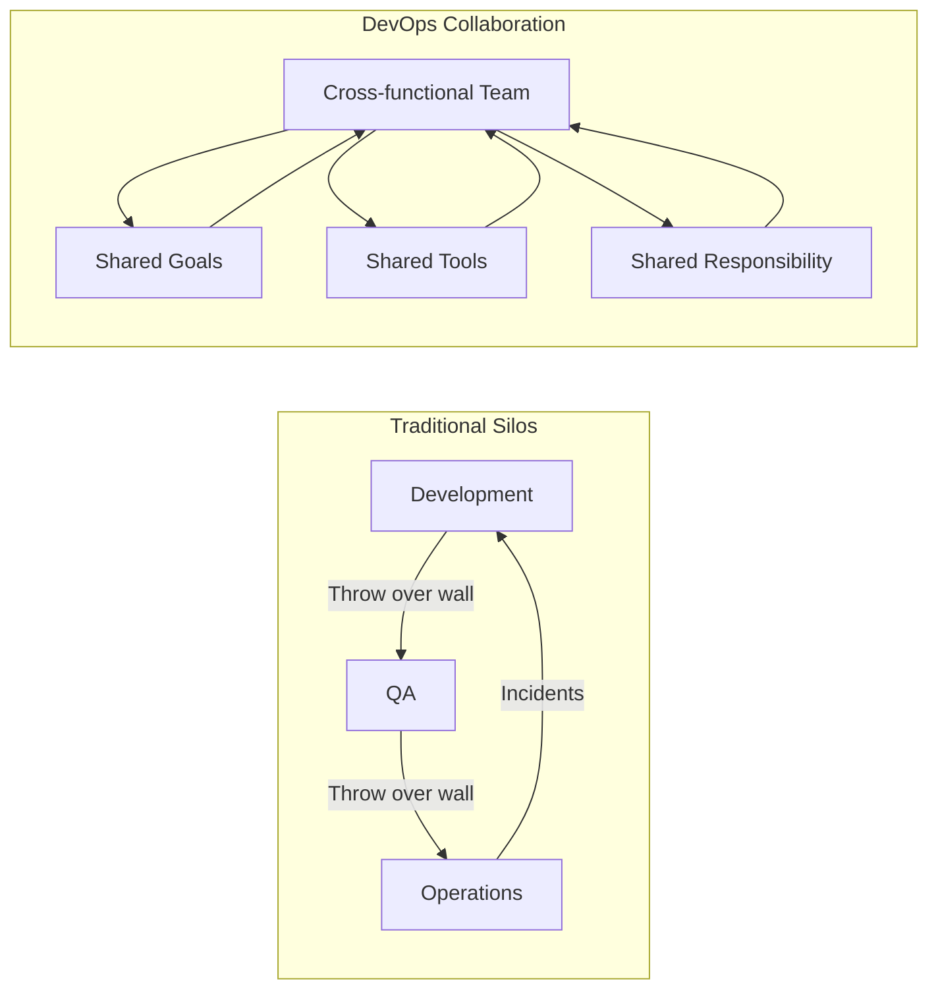
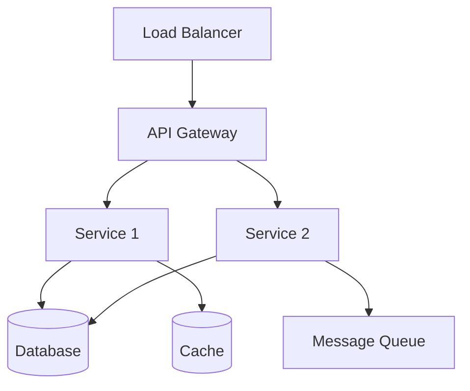

# Collaboration and Communication

## Introduction

Effective collaboration and communication are the foundation of successful DevOps practices. Breaking down silos and fostering open communication accelerates delivery, improves quality, and creates a culture of shared ownership.

> "DevOps is not about tools; it's about people and culture. Tools are just the enablers." - Gene Kim

## The Importance of Collaboration in DevOps

### Traditional Silos vs DevOps Collaboration



### Benefits of Strong Collaboration

| Metric | Traditional | Collaborative DevOps | Improvement |
|--------|------------|---------------------|-------------|
| **Deployment Frequency** | Monthly | Multiple per day | 30x |
| **Lead Time** | Weeks | Hours | 100x |
| **MTTR** | Days | Minutes | 60x |
| **Change Failure Rate** | 15-20% | < 5% | 4x |
| **Team Satisfaction** | Low | High | 3x |

## Breaking Down Silos

### Strategies for Silo Elimination

#### 1. Organizational Restructuring

```python
class TeamTopology:
    """Team structure patterns for DevOps"""
    
    def __init__(self):
        self.topologies = {
            'stream_aligned': self.create_stream_aligned_team,
            'platform': self.create_platform_team,
            'enabling': self.create_enabling_team,
            'complicated_subsystem': self.create_subsystem_team
        }
    
    def create_stream_aligned_team(self, product: str) -> dict:
        """Create a team aligned to a single product stream"""
        return {
            'type': 'stream-aligned',
            'product': product,
            'members': [
                'product_owner',
                'developers',
                'qa_engineers',
                'sre',
                'ux_designer'
            ],
            'responsibilities': [
                'End-to-end delivery',
                'Production support',
                'Customer feedback',
                'Continuous improvement'
            ],
            'autonomy': 'high',
            'cognitive_load': 'managed'
        }
    
    def create_platform_team(self, platform: str) -> dict:
        """Create a platform team that enables stream-aligned teams"""
        return {
            'type': 'platform',
            'platform': platform,
            'members': [
                'platform_engineers',
                'infrastructure_specialists',
                'security_engineers',
                'tooling_experts'
            ],
            'responsibilities': [
                'Self-service platform',
                'Developer experience',
                'Infrastructure abstraction',
                'Security guardrails'
            ],
            'interaction_mode': 'X-as-a-Service'
        }
    
    def create_enabling_team(self, specialty: str) -> dict:
        """Create an enabling team for capability building"""
        return {
            'type': 'enabling',
            'specialty': specialty,
            'members': [
                'coaches',
                'specialists',
                'trainers'
            ],
            'responsibilities': [
                'Capability building',
                'Best practices',
                'Tool adoption',
                'Knowledge transfer'
            ],
            'interaction_mode': 'temporary_collaboration',
            'duration': '3-6 months per engagement'
        }
    
    def assess_team_interactions(self, teams: list) -> dict:
        """Assess and optimize team interactions"""
        interactions = []
        
        for i, team1 in enumerate(teams):
            for team2 in teams[i+1:]:
                interaction = self._determine_interaction_mode(team1, team2)
                interactions.append({
                    'team1': team1['type'],
                    'team2': team2['type'],
                    'mode': interaction,
                    'frequency': self._determine_frequency(interaction)
                })
        
        return {
            'interactions': interactions,
            'cognitive_load': self._assess_cognitive_load(teams),
            'recommendations': self._generate_recommendations(interactions)
        }
    
    def _determine_interaction_mode(self, team1: dict, team2: dict) -> str:
        """Determine appropriate interaction mode between teams"""
        if team1['type'] == 'platform' or team2['type'] == 'platform':
            return 'X-as-a-Service'
        elif team1['type'] == 'enabling' or team2['type'] == 'enabling':
            return 'facilitating'
        else:
            return 'collaboration'
    
    def _determine_frequency(self, interaction_mode: str) -> str:
        """Determine interaction frequency"""
        frequencies = {
            'X-as-a-Service': 'on-demand',
            'facilitating': 'scheduled',
            'collaboration': 'continuous'
        }
        return frequencies.get(interaction_mode, 'as-needed')
    
    def _assess_cognitive_load(self, teams: list) -> dict:
        """Assess cognitive load on teams"""
        # Simplified assessment
        return {
            team['type']: 'high' if len(team.get('responsibilities', [])) > 5 else 'manageable'
            for team in teams
        }
    
    def _generate_recommendations(self, interactions: list) -> list:
        """Generate recommendations for team structure"""
        recommendations = []
        
        if len(interactions) > 10:
            recommendations.append("Consider creating platform teams to reduce interactions")
        
        if any(i['mode'] == 'collaboration' for i in interactions):
            recommendations.append("Define clear boundaries to reduce collaboration overhead")
        
        return recommendations
```

#### 2. Shared Metrics and Goals

```python
class SharedMetrics:
    """Shared metrics system for cross-functional teams"""
    
    def __init__(self):
        self.metrics = {}
        self.goals = {}
        self.team_contributions = {}
    
    def define_north_star_metric(self, 
                                metric_name: str,
                                calculation: str,
                                target: float) -> dict:
        """Define a north star metric that all teams contribute to"""
        return {
            'name': metric_name,
            'calculation': calculation,
            'target': target,
            'current': 0,
            'contributors': [],
            'breakdown': {}
        }
    
    def create_team_scorecard(self, team_name: str) -> dict:
        """Create a balanced scorecard for a team"""
        return {
            'team': team_name,
            'metrics': {
                'delivery': {
                    'deployment_frequency': 0,
                    'lead_time': 0,
                    'cycle_time': 0
                },
                'quality': {
                    'defect_rate': 0,
                    'test_coverage': 0,
                    'code_review_coverage': 0
                },
                'stability': {
                    'mttr': 0,
                    'change_failure_rate': 0,
                    'availability': 0
                },
                'collaboration': {
                    'cross_team_prs': 0,
                    'knowledge_sharing_sessions': 0,
                    'documentation_updates': 0
                }
            },
            'weights': {
                'delivery': 0.25,
                'quality': 0.25,
                'stability': 0.25,
                'collaboration': 0.25
            }
        }
    
    def calculate_team_score(self, scorecard: dict) -> float:
        """Calculate overall team score"""
        total_score = 0
        
        for category, metrics in scorecard['metrics'].items():
            category_score = sum(metrics.values()) / len(metrics)
            weighted_score = category_score * scorecard['weights'][category]
            total_score += weighted_score
        
        return total_score
    
    def track_cross_team_contribution(self,
                                     from_team: str,
                                     to_team: str,
                                     contribution_type: str,
                                     value: float):
        """Track contributions between teams"""
        key = f"{from_team}->{to_team}"
        
        if key not in self.team_contributions:
            self.team_contributions[key] = []
        
        self.team_contributions[key].append({
            'type': contribution_type,
            'value': value,
            'timestamp': datetime.now()
        })
    
    def generate_collaboration_matrix(self) -> dict:
        """Generate a collaboration matrix showing team interactions"""
        teams = set()
        for key in self.team_contributions.keys():
            from_team, to_team = key.split('->')
            teams.add(from_team)
            teams.add(to_team)
        
        matrix = {team: {t: 0 for t in teams} for team in teams}
        
        for key, contributions in self.team_contributions.items():
            from_team, to_team = key.split('->')
            matrix[from_team][to_team] = len(contributions)
        
        return matrix
```

### 3. Cultural Transformation

```yaml
# culture-transformation-playbook.yaml
transformation_phases:
  phase_1_awareness:
    duration: "1-2 months"
    activities:
      - executive_alignment:
          description: "Align leadership on DevOps vision"
          deliverables:
            - "Vision statement"
            - "Success metrics"
            - "Investment commitment"
      
      - current_state_assessment:
          description: "Assess current culture and practices"
          tools:
            - "Team surveys"
            - "Process mapping"
            - "Tool inventory"
      
      - communication_kickoff:
          description: "Launch transformation initiative"
          channels:
            - "All-hands meeting"
            - "Email campaign"
            - "Slack channels"
  
  phase_2_pilot:
    duration: "3-4 months"
    activities:
      - pilot_team_selection:
          criteria:
            - "Motivated volunteers"
            - "Diverse skill sets"
            - "Visible project"
      
      - new_practices:
          implement:
            - "Daily standups"
            - "Pair programming"
            - "CI/CD pipeline"
            - "Shared on-call"
      
      - measure_and_showcase:
          metrics:
            - "Deployment frequency"
            - "Lead time"
            - "Team satisfaction"
          showcase:
            - "Demo days"
            - "Success stories"
            - "Metrics dashboards"
  
  phase_3_scale:
    duration: "6-12 months"
    activities:
      - expand_practices:
          approach: "Gradual rollout"
          support:
            - "Coaching"
            - "Training"
            - "Documentation"
      
      - remove_barriers:
          organizational:
            - "Update job descriptions"
            - "Revise KPIs"
            - "Adjust budget models"
          technical:
            - "Modernize legacy systems"
            - "Standardize tools"
            - "Automate processes"
  
  phase_4_optimize:
    duration: "Ongoing"
    activities:
      - continuous_improvement:
          practices:
            - "Regular retrospectives"
            - "Experimentation time"
            - "Innovation challenges"
      
      - knowledge_sharing:
          mechanisms:
            - "Internal conferences"
            - "Communities of practice"
            - "Mentorship programs"
```

## Communication Tools and Practices

### Communication Stack

```python
from enum import Enum
from typing import List, Dict, Optional
from datetime import datetime

class CommunicationType(Enum):
    SYNCHRONOUS = "synchronous"
    ASYNCHRONOUS = "asynchronous"
    BROADCAST = "broadcast"
    TARGETED = "targeted"

class CommunicationTool:
    def __init__(self, 
                 name: str,
                 comm_type: CommunicationType,
                 use_cases: List[str]):
        self.name = name
        self.comm_type = comm_type
        self.use_cases = use_cases

class CommunicationStrategy:
    """Define and implement communication strategy"""
    
    def __init__(self):
        self.tools = self._initialize_tools()
        self.channels = {}
        self.protocols = {}
    
    def _initialize_tools(self) -> Dict[str, CommunicationTool]:
        """Initialize communication tools"""
        return {
            'slack': CommunicationTool(
                'Slack',
                CommunicationType.ASYNCHRONOUS,
                ['team_chat', 'alerts', 'chatops', 'social']
            ),
            'zoom': CommunicationTool(
                'Zoom',
                CommunicationType.SYNCHRONOUS,
                ['meetings', 'pair_programming', 'incidents', 'standups']
            ),
            'email': CommunicationTool(
                'Email',
                CommunicationType.ASYNCHRONOUS,
                ['announcements', 'reports', 'external']
            ),
            'confluence': CommunicationTool(
                'Confluence',
                CommunicationType.ASYNCHRONOUS,
                ['documentation', 'runbooks', 'knowledge_base']
            ),
            'github': CommunicationTool(
                'GitHub',
                CommunicationType.ASYNCHRONOUS,
                ['code_review', 'issues', 'discussions']
            ),
            'statuspage': CommunicationTool(
                'StatusPage',
                CommunicationType.BROADCAST,
                ['incidents', 'maintenance', 'external_status']
            )
        }
    
    def create_channel_structure(self, organization: str) -> dict:
        """Create channel structure for organization"""
        return {
            'public_channels': {
                '#general': 'Company-wide announcements',
                '#engineering': 'Engineering discussions',
                '#devops': 'DevOps practices and tools',
                '#incidents': 'Incident notifications',
                '#releases': 'Release announcements',
                '#random': 'Non-work discussions'
            },
            'team_channels': {
                '#team-platform': 'Platform team',
                '#team-api': 'API team',
                '#team-frontend': 'Frontend team',
                '#team-mobile': 'Mobile team'
            },
            'project_channels': {
                '#proj-migration': 'Cloud migration project',
                '#proj-redesign': 'UI redesign project'
            },
            'automated_channels': {
                '#alerts-prod': 'Production alerts',
                '#alerts-staging': 'Staging alerts',
                '#deployments': 'Deployment notifications',
                '#ci-cd': 'CI/CD pipeline status'
            },
            'private_channels': {
                '#leadership': 'Leadership team',
                '#oncall': 'On-call engineers'
            }
        }
    
    def define_communication_protocol(self, 
                                    scenario: str) -> dict:
        """Define communication protocol for different scenarios"""
        protocols = {
            'incident': {
                'sev1': {
                    'immediate': ['page_oncall', 'create_incident_channel'],
                    '5_min': ['notify_leadership', 'update_statuspage'],
                    '15_min': ['first_update', 'assign_roles'],
                    '30_min': ['executive_brief', 'customer_comms'],
                    'hourly': ['status_updates'],
                    'resolved': ['final_update', 'schedule_postmortem']
                },
                'sev2': {
                    'immediate': ['notify_oncall', 'create_thread'],
                    '15_min': ['initial_assessment'],
                    '30_min': ['status_update'],
                    'resolved': ['resolution_summary']
                }
            },
            'deployment': {
                'pre': ['announce_maintenance', 'notify_stakeholders'],
                'during': ['status_updates', 'monitor_channels'],
                'post': ['completion_notice', 'metrics_summary']
            },
            'daily_standup': {
                'format': 'round_robin',
                'duration': '15_minutes',
                'questions': [
                    'What did you complete yesterday?',
                    'What will you work on today?',
                    'Any blockers?'
                ],
                'follow_up': 'parking_lot_discussion'
            }
        }
        
        return protocols.get(scenario, {})
    
    def calculate_communication_overhead(self, 
                                        team_size: int,
                                        meeting_hours: float) -> dict:
        """Calculate communication overhead for a team"""
        # Brooks's Law: communication channels = n(n-1)/2
        communication_channels = team_size * (team_size - 1) / 2
        
        # Estimated overhead
        overhead_percentage = min(communication_channels * 2, 40)  # Cap at 40%
        
        productive_hours = 40 * (1 - overhead_percentage / 100)
        
        return {
            'team_size': team_size,
            'communication_channels': communication_channels,
            'weekly_meeting_hours': meeting_hours,
            'overhead_percentage': overhead_percentage,
            'productive_hours_per_week': productive_hours,
            'recommendation': self._get_overhead_recommendation(overhead_percentage)
        }
    
    def _get_overhead_recommendation(self, overhead: float) -> str:
        """Get recommendation based on communication overhead"""
        if overhead < 20:
            return "Healthy communication overhead"
        elif overhead < 30:
            return "Consider reducing meetings or team size"
        else:
            return "High overhead - split team or reduce synchronous communication"
```

### ChatOps Implementation

```python
import re
from typing import Dict, List, Optional, Callable
from datetime import datetime

class ChatOpsBot:
    """ChatOps bot for team automation"""
    
    def __init__(self, name: str = "DevBot"):
        self.name = name
        self.commands = {}
        self.webhooks = {}
        self.conversation_context = {}
        self._register_default_commands()
    
    def _register_default_commands(self):
        """Register default ChatOps commands"""
        self.register_command(
            r'^deploy (\w+) to (\w+)$',
            self.deploy,
            "Deploy application to environment"
        )
        self.register_command(
            r'^rollback (\w+) in (\w+)$',
            self.rollback,
            "Rollback deployment"
        )
        self.register_command(
            r'^status (\w+)$',
            self.get_status,
            "Get service status"
        )
        self.register_command(
            r'^oncall$',
            self.get_oncall,
            "Get current on-call engineer"
        )
        self.register_command(
            r'^incident create (.+)$',
            self.create_incident,
            "Create new incident"
        )
        self.register_command(
            r'^runbook (\w+)$',
            self.get_runbook,
            "Get runbook for service"
        )
    
    def register_command(self, 
                        pattern: str, 
                        handler: Callable,
                        description: str):
        """Register a new command"""
        self.commands[pattern] = {
            'handler': handler,
            'description': description,
            'pattern': re.compile(pattern, re.IGNORECASE)
        }
    
    def process_message(self, 
                       message: str, 
                       user: str,
                       channel: str) -> Optional[str]:
        """Process incoming message"""
        # Check if bot is mentioned
        if f"@{self.name}" not in message:
            return None
        
        # Remove bot mention
        command = message.replace(f"@{self.name}", "").strip()
        
        # Try to match command
        for pattern, cmd_info in self.commands.items():
            match = cmd_info['pattern'].match(command)
            if match:
                return cmd_info['handler'](
                    user=user,
                    channel=channel,
                    *match.groups()
                )
        
        # No command matched
        return self.help_message()
    
    def deploy(self, user: str, channel: str, app: str, env: str) -> str:
        """Handle deployment command"""
        # Validation
        valid_envs = ['staging', 'production', 'dev']
        if env not in valid_envs:
            return f"❌ Invalid environment. Choose from: {', '.join(valid_envs)}"
        
        # Production deployment requires approval
        if env == 'production':
            return (
                f"🔐 Production deployment requested by {user}\n"
                f"Application: {app}\n"
                f"Please reply with `@{self.name} approve deployment` to proceed"
            )
        
        # Trigger deployment
        return (
            f"🚀 Deploying {app} to {env}\n"
            f"Initiated by: {user}\n"
            f"Track progress: https://ci.example.com/deploy/{app}/{env}"
        )
    
    def rollback(self, user: str, channel: str, app: str, env: str) -> str:
        """Handle rollback command"""
        return (
            f"⏪ Rolling back {app} in {env}\n"
            f"Initiated by: {user}\n"
            f"Previous version will be restored in ~5 minutes"
        )
    
    def get_status(self, user: str, channel: str, service: str) -> str:
        """Get service status"""
        # Mock status check
        statuses = {
            'api': {'status': '✅ Healthy', 'uptime': '99.99%', 'response_time': '45ms'},
            'web': {'status': '✅ Healthy', 'uptime': '99.95%', 'response_time': '120ms'},
            'database': {'status': '⚠️ Degraded', 'uptime': '99.90%', 'response_time': '250ms'}
        }
        
        if service in statuses:
            s = statuses[service]
            return (
                f"**{service.upper()} Status**\n"
                f"Status: {s['status']}\n"
                f"Uptime: {s['uptime']}\n"
                f"Response Time: {s['response_time']}"
            )
        
        return f"❌ Unknown service: {service}"
    
    def get_oncall(self, user: str, channel: str) -> str:
        """Get current on-call engineer"""
        # Mock on-call schedule
        oncall = {
            'primary': 'alice',
            'secondary': 'bob',
            'escalation': 'charlie'
        }
        
        return (
            f"📟 **Current On-Call**\n"
            f"Primary: @{oncall['primary']}\n"
            f"Secondary: @{oncall['secondary']}\n"
            f"Escalation: @{oncall['escalation']}"
        )
    
    def create_incident(self, user: str, channel: str, title: str) -> str:
        """Create new incident"""
        incident_id = f"INC-{datetime.now().strftime('%Y%m%d-%H%M')}"
        
        return (
            f"🚨 **Incident Created**\n"
            f"ID: {incident_id}\n"
            f"Title: {title}\n"
            f"Created by: {user}\n"
            f"Incident Channel: #incident-{incident_id.lower()}\n"
            f"Join the channel for updates"
        )
    
    def get_runbook(self, user: str, channel: str, service: str) -> str:
        """Get runbook for service"""
        runbooks = {
            'api': 'https://wiki.example.com/runbooks/api',
            'database': 'https://wiki.example.com/runbooks/database',
            'cache': 'https://wiki.example.com/runbooks/cache'
        }
        
        if service in runbooks:
            return f"📚 Runbook for {service}: {runbooks[service]}"
        
        return f"❌ No runbook found for: {service}"
    
    def help_message(self) -> str:
        """Generate help message"""
        help_text = f"**{self.name} Commands:**\n"
        
        for pattern, cmd_info in self.commands.items():
            help_text += f"• `{pattern}` - {cmd_info['description']}\n"
        
        return help_text

# Slack integration example
class SlackChatOps:
    """Slack-specific ChatOps implementation"""
    
    def __init__(self, bot_token: str, app_token: str):
        self.bot = ChatOpsBot("DevBot")
        self.bot_token = bot_token
        self.app_token = app_token
        
    def setup_event_handlers(self):
        """Setup Slack event handlers"""
        from slack_bolt import App
        from slack_bolt.adapter.socket_mode import SocketModeHandler
        
        app = App(token=self.bot_token)
        
        @app.message(re.compile(r".*@DevBot.*"))
        def handle_mention(message, say):
            response = self.bot.process_message(
                message['text'],
                message['user'],
                message['channel']
            )
            if response:
                say(response)
        
        @app.command("/deploy")
        def handle_deploy_slash(ack, command, say):
            ack()
            parts = command['text'].split()
            if len(parts) == 2:
                response = self.bot.deploy(
                    command['user_id'],
                    command['channel_id'],
                    parts[0],
                    parts[1]
                )
                say(response)
        
        return app
```

## Documentation Best Practices

### Documentation as Code

```python
class DocumentationSystem:
    """Documentation as Code system"""
    
    def __init__(self):
        self.doc_types = {
            'api': self.generate_api_docs,
            'architecture': self.generate_architecture_docs,
            'runbook': self.generate_runbook,
            'onboarding': self.generate_onboarding_docs
        }
    
    def generate_api_docs(self, service: str) -> str:
        """Generate API documentation from code"""
        template = """# {service} API Documentation

## Overview
Auto-generated API documentation for {service}

## Authentication
All API requests require authentication via Bearer token:
```
Authorization: Bearer <token>
```

## Endpoints

### GET /api/v1/{resource}
Retrieve a list of {resource}

**Parameters:**
- `limit` (optional): Number of results to return (default: 100)
- `offset` (optional): Pagination offset (default: 0)

**Response:**
```json
{{
  "data": [...],
  "total": 0,
  "limit": 100,
  "offset": 0
}}
```

### POST /api/v1/{resource}
Create a new {resource}

**Request Body:**
```json
{{
  "name": "string",
  "description": "string"
}}
```

**Response:**
```json
{{
  "id": "uuid",
  "name": "string",
  "description": "string",
  "created_at": "timestamp"
}}
```

## Error Responses
| Code | Description |
|------|-------------|
| 400 | Bad Request |
| 401 | Unauthorized |
| 404 | Not Found |
| 500 | Internal Server Error |

## Rate Limiting
- 1000 requests per hour per API key
- 429 Too Many Requests when exceeded

## Examples
```bash
# Get all resources
curl -H "Authorization: Bearer $TOKEN" \\
  https://api.example.com/v1/{resource}

# Create new resource
curl -X POST \\
  -H "Authorization: Bearer $TOKEN" \\
  -H "Content-Type: application/json" \\
  -d '{{"name": "example"}}' \\
  https://api.example.com/v1/{resource}
```
"""
        return template.format(service=service, resource=f"{service}-resources")
    
    def generate_architecture_docs(self, system: str) -> str:
        """Generate architecture documentation"""
        return f"""# {system} Architecture

## System Overview


## Components

### API Gateway
- **Technology**: Kong/Nginx
- **Responsibilities**: Rate limiting, authentication, routing
- **Scaling**: Horizontal auto-scaling

### Services
- **Service 1**: User management
- **Service 2**: Order processing
- **Communication**: REST/gRPC

### Data Layer
- **Database**: PostgreSQL (primary), Read replicas
- **Cache**: Redis, 5-minute TTL
- **Message Queue**: RabbitMQ/Kafka

## Deployment
- **Platform**: Kubernetes
- **Region**: us-west-2
- **Availability Zones**: 3

## Security
- **Network**: VPC with private subnets
- **Encryption**: TLS 1.3, encryption at rest
- **Authentication**: OAuth 2.0 / JWT

## Monitoring
- **Metrics**: Prometheus + Grafana
- **Logs**: ELK Stack
- **Tracing**: Jaeger
"""
    
    def create_documentation_pipeline(self) -> dict:
        """Create documentation generation pipeline"""
        return {
            'triggers': ['code_push', 'api_change', 'architecture_update'],
            'stages': [
                {
                    'name': 'extract',
                    'actions': [
                        'parse_code_comments',
                        'extract_api_specs',
                        'gather_config'
                    ]
                },
                {
                    'name': 'generate',
                    'actions': [
                        'generate_markdown',
                        'create_diagrams',
                        'build_examples'
                    ]
                },
                {
                    'name': 'validate',
                    'actions': [
                        'check_links',
                        'validate_examples',
                        'spell_check'
                    ]
                },
                {
                    'name': 'publish',
                    'actions': [
                        'commit_to_repo',
                        'update_wiki',
                        'notify_teams'
                    ]
                }
            ]
        }
```

## Knowledge Sharing Strategies

### Knowledge Management System

```python
class KnowledgeManagement:
    """Knowledge management and sharing system"""
    
    def __init__(self):
        self.knowledge_base = {}
        self.experts = {}
        self.learning_paths = {}
    
    def create_knowledge_article(self,
                                title: str,
                                category: str,
                                content: str,
                                author: str,
                                tags: List[str]) -> dict:
        """Create a knowledge base article"""
        article_id = f"KB-{len(self.knowledge_base) + 1:04d}"
        
        article = {
            'id': article_id,
            'title': title,
            'category': category,
            'content': content,
            'author': author,
            'tags': tags,
            'created': datetime.now(),
            'updated': datetime.now(),
            'views': 0,
            'helpful': 0,
            'comments': []
        }
        
        self.knowledge_base[article_id] = article
        return article
    
    def create_learning_path(self, 
                           role: str,
                           level: str) -> dict:
        """Create learning path for a role"""
        paths = {
            'devops_engineer': {
                'beginner': [
                    'Linux Fundamentals',
                    'Git Basics',
                    'Docker Introduction',
                    'CI/CD Concepts',
                    'Cloud Basics (AWS/Azure/GCP)'
                ],
                'intermediate': [
                    'Kubernetes',
                    'Terraform/Pulumi',
                    'Monitoring & Observability',
                    'Security Best Practices',
                    'Python/Go Programming'
                ],
                'advanced': [
                    'Service Mesh',
                    'GitOps',
                    'eBPF',
                    'Chaos Engineering',
                    'Platform Engineering'
                ]
            },
            'sre': {
                'beginner': [
                    'SRE Principles',
                    'SLIs/SLOs/SLAs',
                    'Monitoring Basics',
                    'Incident Response',
                    'Postmortems'
                ],
                'intermediate': [
                    'Error Budgets',
                    'Toil Reduction',
                    'Capacity Planning',
                    'Reliability Testing',
                    'Automation'
                ],
                'advanced': [
                    'Chaos Engineering',
                    'Performance Engineering',
                    'Distributed Systems',
                    'Machine Learning for SRE'
                ]
            }
        }
        
        return paths.get(role, {}).get(level, [])
    
    def schedule_knowledge_sharing(self) -> dict:
        """Schedule knowledge sharing sessions"""
        return {
            'weekly': {
                'tech_talks': {
                    'day': 'Friday',
                    'time': '14:00',
                    'duration': '1 hour',
                    'format': 'presentation + Q&A',
                    'topics': self._get_weekly_topics()
                }
            },
            'biweekly': {
                'lunch_and_learn': {
                    'frequency': 'Every other Wednesday',
                    'time': '12:00',
                    'duration': '45 minutes',
                    'format': 'informal discussion'
                }
            },
            'monthly': {
                'engineering_all_hands': {
                    'day': 'First Thursday',
                    'time': '10:00',
                    'duration': '90 minutes',
                    'agenda': [
                        'Team updates',
                        'Technical deep dive',
                        'Q&A with leadership'
                    ]
                }
            },
            'quarterly': {
                'internal_conference': {
                    'duration': '1 day',
                    'tracks': ['DevOps', 'Security', 'Architecture', 'Innovation'],
                    'format': 'Presentations, workshops, hackathon'
                }
            }
        }
    
    def _get_weekly_topics(self) -> List[str]:
        """Get weekly tech talk topics"""
        return [
            'New Kubernetes features',
            'Incident review and learnings',
            'Tool evaluation results',
            'Architecture decisions',
            'Performance improvements'
        ]
    
    def track_expertise(self, person: str, skills: List[str]):
        """Track team expertise"""
        if person not in self.experts:
            self.experts[person] = {
                'skills': [],
                'certifications': [],
                'contributions': [],
                'mentoring': []
            }
        
        self.experts[person]['skills'].extend(skills)
    
    def find_expert(self, topic: str) -> List[str]:
        """Find experts for a topic"""
        experts = []
        
        for person, info in self.experts.items():
            if topic.lower() in [s.lower() for s in info['skills']]:
                experts.append({
                    'name': person,
                    'skills': info['skills'],
                    'contributions': len(info['contributions'])
                })
        
        return sorted(experts, key=lambda x: x['contributions'], reverse=True)
```

## Remote Collaboration

### Remote Team Practices

```python
class RemoteCollaboration:
    """Remote collaboration tools and practices"""
    
    def __init__(self):
        self.timezone_map = {}
        self.meeting_scheduler = MeetingScheduler()
        self.virtual_spaces = {}
    
    def setup_remote_team(self, team_name: str, members: List[dict]) -> dict:
        """Setup remote team collaboration"""
        return {
            'team': team_name,
            'members': members,
            'communication': {
                'primary_channel': f'#team-{team_name.lower()}',
                'video_tool': 'Zoom/Teams',
                'async_updates': 'Slack threads',
                'documentation': 'Confluence/Notion'
            },
            'meetings': {
                'daily_standup': {
                    'time': self._find_overlap_time(members),
                    'duration': '15 minutes',
                    'format': 'video optional'
                },
                'weekly_sync': {
                    'time': self._find_overlap_time(members, min_hours=2),
                    'duration': '1 hour',
                    'format': 'video required'
                },
                'async_updates': {
                    'frequency': 'daily',
                    'format': 'written in Slack'
                }
            },
            'working_agreements': self._create_working_agreements(members),
            'tools': {
                'ide': 'VS Code Live Share',
                'whiteboard': 'Miro/Mural',
                'project': 'Jira/Linear',
                'calendar': 'Google Calendar/Outlook'
            }
        }
    
    def _find_overlap_time(self, 
                          members: List[dict],
                          min_hours: int = 1) -> str:
        """Find overlapping working hours for team members"""
        # Simplified overlap finding
        timezones = [m.get('timezone', 'UTC') for m in members]
        
        # Map timezones to UTC offset
        tz_offsets = {
            'PST': -8, 'EST': -5, 'GMT': 0, 
            'CET': 1, 'IST': 5.5, 'JST': 9
        }
        
        # Find best meeting time (simplified)
        if all(tz in ['PST', 'EST'] for tz in timezones):
            return "10:00 AM PST / 1:00 PM EST"
        elif all(tz in ['GMT', 'CET'] for tz in timezones):
            return "10:00 AM GMT / 11:00 AM CET"
        else:
            return "9:00 AM PST / 5:00 PM GMT (rotate weekly)"
    
    def _create_working_agreements(self, members: List[dict]) -> dict:
        """Create working agreements for remote team"""
        return {
            'core_hours': '10:00 AM - 2:00 PM (team member local time)',
            'response_time': {
                'urgent': '1 hour',
                'normal': '4 hours',
                'low': '24 hours'
            },
            'communication': {
                'default_async': True,
                'video_for_complex': True,
                'document_decisions': True,
                'over_communicate': True
            },
            'availability': {
                'calendar_updated': True,
                'status_in_slack': True,
                'out_of_office': '24 hour notice'
            },
            'meetings': {
                'agenda_required': True,
                'notes_documented': True,
                'recording_available': True,
                'camera_optional': True
            }
        }
    
    def create_virtual_office(self, company: str) -> dict:
        """Create virtual office space"""
        return {
            'spaces': {
                'lobby': {
                    'purpose': 'Casual conversations',
                    'tool': 'Gather/Discord',
                    'always_open': True
                },
                'meeting_rooms': {
                    'room_1': 'Scheduled meetings',
                    'room_2': 'Scheduled meetings',
                    'breakout_1': 'Ad-hoc discussions',
                    'breakout_2': 'Ad-hoc discussions'
                },
                'focus_zones': {
                    'quiet_zone': 'Deep work, no interruptions',
                    'collaboration_zone': 'Open for pairing'
                },
                'social_spaces': {
                    'coffee_corner': 'Virtual coffee breaks',
                    'game_room': 'Team building activities',
                    'celebration_hall': 'Team celebrations'
                }
            },
            'events': {
                'daily_coffee': '9:00 AM optional',
                'weekly_social': 'Friday 4:00 PM',
                'monthly_all_hands': 'First Tuesday',
                'quarterly_offsite': 'Virtual team building'
            }
        }

class MeetingScheduler:
    """Intelligent meeting scheduler for distributed teams"""
    
    def schedule_meeting(self, 
                        participants: List[str],
                        duration_minutes: int,
                        preferences: dict = None) -> dict:
        """Schedule meeting considering timezones and preferences"""
        # Implementation would integrate with calendar APIs
        return {
            'time': 'Optimal time based on availability',
            'participants': participants,
            'duration': duration_minutes,
            'meeting_link': 'https://zoom.us/j/xxx',
            'calendar_invites_sent': True
        }
```

## Cross-functional Team Dynamics

### Team Collaboration Patterns

```yaml
# team-collaboration-patterns.yaml
collaboration_patterns:
  mob_programming:
    description: "Entire team works on same problem"
    when_to_use:
      - "Complex problem solving"
      - "Knowledge sharing"
      - "Critical bug fixes"
    setup:
      driver: "One person types"
      navigators: "Rest of team guides"
      rotation: "Every 15 minutes"
    benefits:
      - "Immediate code review"
      - "Knowledge transfer"
      - "Team alignment"
  
  pair_programming:
    description: "Two people work together"
    when_to_use:
      - "Complex features"
      - "Onboarding"
      - "Bug investigation"
    styles:
      driver_navigator:
        driver: "Types code"
        navigator: "Reviews and guides"
      ping_pong:
        person_a: "Writes test"
        person_b: "Makes test pass"
  
  swarming:
    description: "Multiple people attack single work item"
    when_to_use:
      - "Blocked items"
      - "High priority work"
      - "End of sprint push"
    approach:
      - "Identify blockers"
      - "Assign specialists"
      - "Work in parallel where possible"
  
  code_review:
    description: "Asynchronous collaboration on code"
    best_practices:
      - "Review within 24 hours"
      - "Constructive feedback"
      - "Check for patterns, not just syntax"
      - "Approve or request changes clearly"
    tools:
      - "GitHub PRs"
      - "GitLab MRs"
      - "Gerrit"
      - "Crucible"
```

## Measuring Collaboration Effectiveness

```python
class CollaborationMetrics:
    """Measure and improve collaboration effectiveness"""
    
    def __init__(self):
        self.metrics = {}
        
    def calculate_collaboration_score(self, team: str) -> dict:
        """Calculate overall collaboration score for a team"""
        metrics = {
            'code_review_participation': self._measure_code_review_participation(team),
            'knowledge_sharing': self._measure_knowledge_sharing(team),
            'cross_team_contributions': self._measure_cross_team_work(team),
            'communication_health': self._measure_communication_health(team),
            'meeting_effectiveness': self._measure_meeting_effectiveness(team)
        }
        
        weights = {
            'code_review_participation': 0.2,
            'knowledge_sharing': 0.2,
            'cross_team_contributions': 0.2,
            'communication_health': 0.2,
            'meeting_effectiveness': 0.2
        }
        
        overall_score = sum(
            metrics[key] * weights[key] 
            for key in metrics
        )
        
        return {
            'team': team,
            'overall_score': overall_score,
            'breakdown': metrics,
            'recommendations': self._generate_recommendations(metrics)
        }
    
    def _measure_code_review_participation(self, team: str) -> float:
        """Measure code review participation rate"""
        # Mock implementation
        reviews_given = 45
        reviews_received = 50
        team_size = 8
        
        participation_rate = (reviews_given + reviews_received) / (team_size * 20)
        return min(participation_rate * 100, 100)
    
    def _measure_knowledge_sharing(self, team: str) -> float:
        """Measure knowledge sharing activities"""
        # Mock implementation
        docs_created = 12
        presentations_given = 3
        mentoring_hours = 20
        
        sharing_score = (docs_created * 5 + presentations_given * 20 + mentoring_hours * 2)
        return min(sharing_score, 100)
    
    def _measure_cross_team_work(self, team: str) -> float:
        """Measure cross-team collaboration"""
        # Mock implementation
        cross_team_prs = 8
        shared_projects = 2
        helping_other_teams = 15
        
        cross_work_score = (cross_team_prs * 5 + shared_projects * 20 + helping_other_teams * 3)
        return min(cross_work_score, 100)
    
    def _measure_communication_health(self, team: str) -> float:
        """Measure communication health"""
        # Mock implementation
        response_time_hours = 2
        thread_participation = 0.75
        async_updates = 0.9
        
        comm_score = (
            (24 - response_time_hours) * 2 +
            thread_participation * 40 +
            async_updates * 30
        )
        return min(comm_score, 100)
    
    def _measure_meeting_effectiveness(self, team: str) -> float:
        """Measure meeting effectiveness"""
        # Mock implementation
        meetings_with_agenda = 0.9
        meetings_on_time = 0.85
        action_items_completed = 0.8
        
        meeting_score = (
            meetings_with_agenda * 35 +
            meetings_on_time * 30 +
            action_items_completed * 35
        ) * 100
        return meeting_score
    
    def _generate_recommendations(self, metrics: dict) -> List[str]:
        """Generate recommendations based on metrics"""
        recommendations = []
        
        if metrics['code_review_participation'] < 70:
            recommendations.append("Increase code review participation - consider pairing")
        
        if metrics['knowledge_sharing'] < 60:
            recommendations.append("Schedule more knowledge sharing sessions")
        
        if metrics['cross_team_contributions'] < 50:
            recommendations.append("Encourage cross-team collaboration projects")
        
        if metrics['communication_health'] < 70:
            recommendations.append("Improve async communication practices")
        
        if metrics['meeting_effectiveness'] < 75:
            recommendations.append("Review meeting practices - ensure agendas and follow-ups")
        
        return recommendations
```

## Best Practices

### Communication Best Practices

1. **Default to Asynchronous**: Respect different timezones and work styles
2. **Document Everything**: Decisions, discussions, and designs
3. **Over-communicate**: Share context, status, and blockers proactively
4. **Use Threading**: Keep conversations organized in threads
5. **Set Response Expectations**: Define SLAs for different priority levels
6. **Record Meetings**: Make them available for those who couldn't attend
7. **Write Clearly**: Use simple language, avoid jargon
8. **Use Rich Media**: Screenshots, diagrams, and videos when helpful

### Collaboration Best Practices

1. **Establish Working Agreements**: Document team norms and expectations
2. **Regular Check-ins**: Daily standups, weekly 1-1s, monthly retrospectives
3. **Rotate Responsibilities**: Share knowledge and prevent silos
4. **Celebrate Together**: Recognize achievements and milestones
5. **Learn Together**: Shared learning sessions and pair programming
6. **Fail Together**: Blameless postmortems and shared ownership
7. **Improve Together**: Regular retrospectives and continuous improvement
8. **Play Together**: Team building and social activities

## Conclusion

Effective collaboration and communication are the backbone of successful DevOps implementations. Key takeaways:

- **Break down silos** through organizational restructuring and shared goals
- **Use the right tools** for different communication needs
- **Implement ChatOps** for automation and transparency
- **Document as code** to keep documentation current
- **Share knowledge** proactively and systematically
- **Optimize for remote** collaboration in distributed teams
- **Measure and improve** collaboration effectiveness continuously

Remember: Tools enable collaboration, but culture makes it successful. Invest in both.

---

[Back to Main README](./README.md)