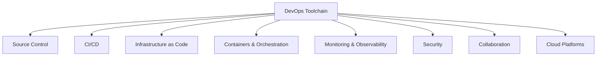

# DevOps Tools and Technologies

## Introduction

The DevOps ecosystem offers hundreds of tools across different categories. This guide provides a comprehensive overview of essential DevOps tools, helping you make informed decisions for your toolchain.

## Tool Categories Overview



## Source Control Systems

### Git Platforms

| Platform | Strengths | Best For | Pricing |
|----------|-----------|----------|---------|
| **GitHub** | Largest community, Actions CI/CD, Copilot AI | Open source, community projects | Free - $21/user/month |
| **GitLab** | Complete DevOps platform, built-in CI/CD | All-in-one solution seekers | Free - $29/user/month |
| **Bitbucket** | Atlassian integration, Jira sync | Teams using Atlassian suite | Free - $15/user/month |
| **Azure DevOps** | Microsoft integration, enterprise features | Microsoft-centric organizations | Free - $45/user/month |

### Best Practices
- Use Git Flow or GitHub Flow branching strategy
- Implement branch protection rules
- Require code reviews via pull requests
- Sign commits with GPG keys
- Use semantic versioning for releases

## CI/CD Tools

### Comparison Matrix

| Tool | Type | Strengths | Weaknesses | Best For |
|------|------|-----------|------------|----------|
| **Jenkins** | Self-hosted | Highly customizable, vast plugin ecosystem | Complex setup, maintenance overhead | Large enterprises with specific needs |
| **GitHub Actions** | Cloud | GitHub integration, marketplace | Vendor lock-in, limited self-hosted runners | GitHub-based projects |
| **GitLab CI** | Both | Integrated with GitLab, powerful pipelines | Learning curve, resource intensive | Complete DevOps platform users |
| **CircleCI** | Cloud | Fast builds, Docker support | Pricing, limited free tier | Modern cloud-native teams |
| **ArgoCD** | GitOps | Kubernetes native, declarative | Kubernetes only | Kubernetes deployments |
| **Tekton** | Cloud-native | Kubernetes native, reusable | Complex, Kubernetes required | Kubernetes-first organizations |

### Pipeline Example (GitHub Actions)
```yaml
name: DevOps Pipeline
on:
  push:
    branches: [main, develop]
  pull_request:
    branches: [main]

jobs:
  build:
    runs-on: ubuntu-latest
    steps:
      - uses: actions/checkout@v3
      - name: Build
        run: docker build -t myapp:${{ github.sha }} .
      
  test:
    needs: build
    runs-on: ubuntu-latest
    steps:
      - name: Unit Tests
        run: npm test
      - name: Integration Tests
        run: npm run test:integration
      
  deploy:
    needs: test
    if: github.ref == 'refs/heads/main'
    runs-on: ubuntu-latest
    steps:
      - name: Deploy to Production
        run: kubectl apply -f manifests/
```

## Infrastructure as Code (IaC)

### Pulumi - Modern IaC with Real Programming Languages

**Why Pulumi?**
- Use familiar languages (TypeScript, Python, Go, C#, Java)
- Strong typing and IDE support
- Reusable components and packages
- State management built-in
- Multi-cloud support

#### Pulumi Example (TypeScript)
```typescript
import * as pulumi from "@pulumi/pulumi";
import * as aws from "@pulumi/aws";
import * as k8s from "@pulumi/kubernetes";

// Create a VPC
const vpc = new aws.ec2.Vpc("production-vpc", {
    cidrBlock: "10.0.0.0/16",
    enableDnsHostnames: true,
    enableDnsSupport: true,
    tags: {
        Name: "production",
        ManagedBy: "pulumi"
    }
});

// Create an EKS cluster
const cluster = new aws.eks.Cluster("production-cluster", {
    vpcId: vpc.id,
    subnetIds: vpc.privateSubnetIds,
    instanceType: "t3.medium",
    desiredCapacity: 3,
    minSize: 1,
    maxSize: 5,
});

// Deploy a Kubernetes application
const appLabels = { app: "nginx" };
const deployment = new k8s.apps.v1.Deployment("nginx", {
    spec: {
        selector: { matchLabels: appLabels },
        replicas: 3,
        template: {
            metadata: { labels: appLabels },
            spec: {
                containers: [{
                    name: "nginx",
                    image: "nginx:latest",
                    ports: [{ containerPort: 80 }]
                }]
            }
        }
    }
}, { provider: cluster.provider });

// Export the cluster endpoint
export const kubeconfig = cluster.kubeconfig;
export const vpcId = vpc.id;
```

#### Pulumi vs Other IaC Tools

| Feature | Pulumi | Terraform | CloudFormation | ARM/Bicep | Ansible |
|---------|--------|-----------|----------------|-----------|---------|
| **Language** | Real programming languages | HCL | JSON/YAML | JSON/Bicep | YAML |
| **State Management** | Built-in (cloud/local) | Required | Managed by AWS | Managed by Azure | Stateless |
| **IDE Support** | Excellent | Good | Limited | Good | Limited |
| **Testing** | Unit tests possible | Limited | Limited | Limited | Molecule |
| **Multi-cloud** | ✅ Native | ✅ Native | ❌ AWS only | ❌ Azure only | ✅ Via modules |
| **Learning Curve** | Low (if you know the language) | Medium | High | Medium | Low |
| **Reusability** | NPM/PyPI packages | Modules | Nested stacks | Modules | Roles |
| **Type Safety** | ✅ Full | ❌ Limited | ❌ No | ❌ No | ❌ No |

### IaC Best Practices with Pulumi

1. **Component Resources**: Create reusable components
```typescript
export class MicroserviceStack extends pulumi.ComponentResource {
    public readonly url: pulumi.Output<string>;
    
    constructor(name: string, args: MicroserviceArgs, opts?: pulumi.ComponentResourceOptions) {
        super("custom:app:Microservice", name, {}, opts);
        
        // Create resources...
        const service = new k8s.core.v1.Service(...);
        const deployment = new k8s.apps.v1.Deployment(...);
        
        this.url = service.status.loadBalancer.ingress[0].hostname;
    }
}
```

1. **Stack Configuration**: Separate environments
```bash
pulumi stack init dev
pulumi config set aws:region us-east-1
pulumi config set instanceType t3.micro

pulumi stack init prod
pulumi config set aws:region us-west-2
pulumi config set instanceType t3.large
```

1. **Policy as Code**: Enforce compliance
```typescript
new pulumi.policy.PolicyPack("security-policies", {
    policies: [{
        name: "prohibited-public-access",
        description: "S3 buckets cannot be public",
        enforcementLevel: "mandatory",
        validateResource: (args, reportViolation) => {
            if (args.type === "aws:s3/bucket:Bucket") {
                if (args.props.acl === "public-read" || args.props.acl === "public-read-write") {
                    reportViolation("S3 buckets must not be publicly accessible");
                }
            }
        }
    }]
});
```

### Other IaC Tools Overview

#### Terraform
- **Pros**: Large community, extensive provider support, mature
- **Cons**: HCL learning curve, state management complexity
- **Use when**: Multi-cloud deployments, team prefers DSL

#### CloudFormation/CDK
- **Pros**: Native AWS support, no state management needed
- **Cons**: AWS-only, verbose syntax (CloudFormation)
- **Use when**: AWS-only infrastructure, want AWS-managed state

#### Ansible
- **Pros**: Agentless, simple YAML, configuration management
- **Cons**: Not ideal for infrastructure provisioning, slow for large deployments
- **Use when**: Configuration management, multi-OS support needed

## Container & Orchestration Tools

### Container Ecosystem

#### Container Runtimes
- **Docker**: Industry standard, vast ecosystem
- **Podman**: Daemonless, rootless containers
- **containerd**: Lightweight, Kubernetes default
- **CRI-O**: Optimized for Kubernetes

#### Container Registries
- **Docker Hub**: Public registry, official images
- **Amazon ECR**: AWS integrated, scanning built-in
- **Azure ACR**: Azure integrated, geo-replication
- **Harbor**: Open source, enterprise features
- **JFrog Artifactory**: Universal repository manager

#### Orchestration Platforms

| Platform | Complexity | Use Case | Key Features |
|----------|------------|----------|--------------|
| **Kubernetes** | High | Enterprise, microservices | Industry standard, vast ecosystem |
| **Docker Swarm** | Low | Simple clustering | Easy setup, Docker native |
| **Amazon ECS** | Medium | AWS workloads | AWS integration, Fargate support |
| **HashiCorp Nomad** | Medium | Multi-workload | Supports containers, VMs, binaries |
| **Apache Mesos** | High | Large scale | Data center OS, Marathon framework |

### Kubernetes Tools Ecosystem

#### Package Management
- **Helm**: Kubernetes package manager
- **Kustomize**: Template-free configuration
- **Helmfile**: Declarative Helm chart deployment

#### Service Mesh
- **Istio**: Feature-rich, complex
- **Linkerd**: Lightweight, easy setup
- **Consul Connect**: HashiCorp integration
- **AWS App Mesh**: AWS managed

#### Development Tools
- **Skaffold**: Local Kubernetes development
- **Tilt**: Multi-service development
- **Telepresence**: Local-to-remote debugging
- **K9s**: Terminal UI for Kubernetes

## Monitoring & Observability

### The Three Pillars

#### 1. Metrics

| Tool | Type | Strengths | Best For |
|------|------|-----------|----------|
| **Prometheus + Grafana** | Open source | Kubernetes native, powerful queries | Cloud-native monitoring |
| **Datadog** | SaaS | All-in-one platform, APM | Enterprise full-stack |
| **New Relic** | SaaS | APM focus, AI insights | Application performance |
| **CloudWatch** | AWS | AWS integration | AWS-only workloads |
| **Azure Monitor** | Azure | Azure integration | Azure workloads |

#### 2. Logging

| Tool | Use Case | Scalability | Cost |
|------|----------|-------------|------|
| **ELK Stack** | Self-hosted full-text search | High | Infrastructure cost |
| **Splunk** | Enterprise log analysis | Very High | Expensive |
| **Fluentd/Fluent Bit** | Log forwarding | High | Free |
| **Loki** | Kubernetes logs | High | Low (storage efficient) |
| **CloudWatch Logs** | AWS logs | High | Pay per GB |

#### 3. Tracing
- **Jaeger**: Open source, CNCF graduated
- **Zipkin**: Twitter's distributed tracing
- **AWS X-Ray**: AWS integrated tracing
- **Google Cloud Trace**: GCP tracing
- **LightStep**: Enterprise distributed tracing

### Observability Stack Example
```yaml
# Prometheus + Grafana + Loki + Tempo Stack
apiVersion: v1
kind: ConfigMap
metadata:
  name: observability-stack
data:
  prometheus.yml: |
    global:
      scrape_interval: 15s
    scrape_configs:
      - job_name: 'kubernetes-pods'
        kubernetes_sd_configs:
          - role: pod
        
  loki.yml: |
    auth_enabled: false
    server:
      http_listen_port: 3100
    ingester:
      lifecycler:
        address: 127.0.0.1
        ring:
          kvstore:
            store: inmemory
            
  tempo.yml: |
    server:
      http_listen_port: 3200
    distributor:
      receivers:
        jaeger:
          protocols:
            thrift_http:
              endpoint: 0.0.0.0:14268
```

## Security Tools (DevSecOps)

### Security Scanning Categories

#### Static Application Security Testing (SAST)
- **SonarQube**: Code quality and security
- **Checkmarx**: Enterprise SAST
- **Snyk Code**: Developer-friendly SAST
- **GitHub Advanced Security**: Integrated with GitHub
- **Semgrep**: Open source, custom rules

#### Dynamic Application Security Testing (DAST)
- **OWASP ZAP**: Open source web scanner
- **Burp Suite**: Professional web testing
- **Acunetix**: Automated vulnerability scanner
- **Qualys**: Cloud-based scanning

#### Software Composition Analysis (SCA)
- **Snyk Open Source**: Dependency scanning
- **WhiteSource**: License compliance
- **Black Duck**: Comprehensive SCA
- **Dependabot**: Automated dependency updates
- **OWASP Dependency Check**: Free vulnerability detection

#### Container Security
- **Trivy**: Comprehensive vulnerability scanner
- **Clair**: Static analysis for containers
- **Anchore**: Policy-based compliance
- **Twistlock/Prisma Cloud**: Runtime protection
- **Falco**: Runtime security monitoring

### Security Pipeline Integration
```yaml
# GitLab CI Security Pipeline
stages:
  - build
  - test
  - security
  - deploy

sast:
  stage: security
  script:
    - semgrep --config=auto --json -o sast-report.json .
  artifacts:
    reports:
      sast: sast-report.json

dependency_scanning:
  stage: security
  script:
    - snyk test --all-projects --json > dependency-report.json
  artifacts:
    reports:
      dependency_scanning: dependency-report.json

container_scanning:
  stage: security
  script:
    - trivy image --format json -o container-report.json $IMAGE
  artifacts:
    reports:
      container_scanning: container-report.json

dast:
  stage: security
  script:
    - zap-baseline.py -t $TARGET_URL -J dast-report.json
  artifacts:
    reports:
      dast: dast-report.json
```

## Collaboration Tools

### Communication Platforms
- **Slack**: Most popular, extensive integrations
- **Microsoft Teams**: Microsoft ecosystem integration
- **Discord**: Developer communities
- **Mattermost**: Open source Slack alternative

### Documentation & Knowledge Management
- **Confluence**: Atlassian ecosystem
- **Notion**: All-in-one workspace
- **GitBook**: Docs from Git
- **Read the Docs**: Open source documentation
- **Docusaurus**: Facebook's doc framework

### Project Management
- **Jira**: Agile project management
- **Azure Boards**: Microsoft ecosystem
- **Linear**: Modern, fast, developer-focused
- **GitHub Projects**: Integrated with GitHub
- **Trello**: Simple Kanban boards

### Incident Management
- **PagerDuty**: Industry standard
- **Opsgenie**: Atlassian's incident management
- **VictorOps/Splunk On-Call**: Collaborative incident response
- **Incident.io**: Modern incident management

## Cloud Platforms

### Major Cloud Providers Comparison

| Feature | AWS | Azure | GCP | Best For |
|---------|-----|-------|-----|----------|
| **Market Share** | 32% | 23% | 10% | - |
| **Services** | 200+ | 200+ | 100+ | AWS: Variety |
| **Kubernetes** | EKS | AKS | GKE | GCP: Best K8s |
| **ML/AI** | SageMaker | ML Studio | Vertex AI | GCP: Best AI |
| **Enterprise** | Strong | Strongest | Growing | Azure: Enterprise |
| **Pricing** | Complex | Complex | Simpler | GCP: Predictable |
| **Regions** | 31 | 60+ | 35 | Azure: Coverage |

### Multi-Cloud & Hybrid Solutions
- **Anthos**: Google's hybrid/multi-cloud platform
- **Azure Arc**: Azure's hybrid management
- **AWS Outposts**: AWS on-premises
- **OpenShift**: Red Hat's Kubernetes platform
- **Rancher**: Multi-cluster Kubernetes management

## Tool Selection Criteria

### Decision Framework

#### 1. Technical Requirements
- **Scalability**: Can it handle your growth?
- **Performance**: Does it meet SLAs?
- **Integration**: Works with existing tools?
- **Platform Support**: Covers your tech stack?

#### 2. Organizational Fit
- **Team Skills**: Learning curve acceptable?
- **Support**: Vendor/community support available?
- **Documentation**: Well-documented?
- **Ecosystem**: Active community?

#### 3. Financial Considerations
- **Licensing**: Open source vs commercial?
- **Total Cost**: Including infrastructure, training?
- **ROI**: Measurable benefits?
- **Lock-in**: Can you migrate away?

#### 4. Compliance & Security
- **Certifications**: SOC2, ISO, HIPAA?
- **Audit Trail**: Compliance logging?
- **Access Control**: RBAC, SSO support?
- **Data Residency**: Regional requirements?

### Tool Evaluation Matrix Template

```markdown
| Criteria | Weight | Tool A | Tool B | Tool C |
|----------|--------|--------|--------|--------|
| Cost | 20% | 8/10 | 6/10 | 9/10 |
| Features | 25% | 9/10 | 10/10 | 7/10 |
| Ease of Use | 20% | 7/10 | 9/10 | 8/10 |
| Support | 15% | 8/10 | 10/10 | 6/10 |
| Integration | 20% | 9/10 | 8/10 | 7/10 |
| **Total Score** | | **8.2** | **8.7** | **7.4** |
```

## Building Your DevOps Toolchain

### Starter Stack (Small Teams)
```yaml
Source Control: GitHub
CI/CD: GitHub Actions
IaC: Pulumi (using TypeScript/Python)
Containers: Docker + Docker Compose
Monitoring: Prometheus + Grafana
Security: Snyk + Trivy
Communication: Slack
Cloud: AWS/GCP (single cloud)
```

### Growth Stack (Medium Teams)
```yaml
Source Control: GitLab
CI/CD: GitLab CI + ArgoCD
IaC: Pulumi with Policy Packs
Orchestration: Kubernetes (EKS/GKE)
Monitoring: Datadog or Prometheus Stack
Security: SonarQube + Snyk + Falco
Collaboration: Slack + Confluence
Cloud: Multi-cloud with primary focus
```

### Enterprise Stack (Large Organizations)
```yaml
Source Control: GitHub Enterprise or GitLab
CI/CD: Jenkins/Tekton + ArgoCD + Flux
IaC: Pulumi with Enterprise features
Orchestration: Kubernetes + Service Mesh (Istio)
Monitoring: Datadog/New Relic + Custom
Security: Full DevSecOps pipeline
Collaboration: Integrated suite (Atlassian/Microsoft)
Cloud: Multi-cloud with management platform
```

## Tool Integration Best Practices

### 1. API-First Integration
- Choose tools with robust APIs
- Automate tool interactions
- Build custom integrations when needed

### 2. Single Source of Truth
- Centralize configuration in Git
- Use IaC for all infrastructure
- Document decisions in one place

### 3. Observability Throughout
- Instrument all tools
- Centralize metrics and logs
- Create unified dashboards

### 4. Security at Every Layer
- Scan at every stage
- Automate security policies
- Continuous compliance monitoring

### 5. Progressive Adoption
- Start with pilot projects
- Measure improvements
- Scale successful patterns

## Future Trends in DevOps Tools

### Emerging Categories

#### 1. AI/ML-Powered Tools
- **GitHub Copilot**: AI pair programming
- **DeepCode**: AI code review
- **Moogsoft**: AIOps incident management

#### 2. GitOps Tools
- **Flux**: CNCF GitOps toolkit
- **ArgoCD**: Declarative GitOps
- **Rancher Fleet**: Multi-cluster GitOps

#### 3. Platform Engineering
- **Backstage**: Developer portals
- **Humanitec**: Platform orchestration
- **Port**: Internal developer platform

#### 4. FinOps Tools
- **CloudHealth**: Multi-cloud cost management
- **Kubecost**: Kubernetes cost monitoring
- **Infracost**: IaC cost estimation

#### 5. Chaos Engineering
- **Chaos Monkey**: Netflix's chaos tool
- **Litmus**: Cloud-native chaos
- **Gremlin**: Enterprise chaos engineering

## Conclusion

The DevOps toolchain is vast and constantly evolving. Success comes not from using every tool, but from selecting the right tools that:
- Solve real problems
- Integrate well together
- Match team capabilities
- Support business objectives
- Enable continuous improvement

Start simple, measure impact, and evolve your toolchain based on actual needs rather than industry hype.

## Resources

### Learning Platforms
- [CNCF Landscape](https://landscape.cncf.io/)
- [DevOps Roadmap](https://roadmap.sh/devops)
- [Awesome DevOps](https://github.com/awesome-soft/awesome-devops)

### Tool Comparisons
- [StackShare](https://stackshare.io/)
- [G2 DevOps Tools](https://www.g2.com/categories/devops)
- [ThoughtWorks Tech Radar](https://www.thoughtworks.com/radar)

### Communities
- [DevOps Subreddit](https://reddit.com/r/devops)
- [DevOps.com](https://devops.com/)
- [CNCF Slack](https://cloud-native.slack.com/)

---

[Back to Main README](./README.md)
