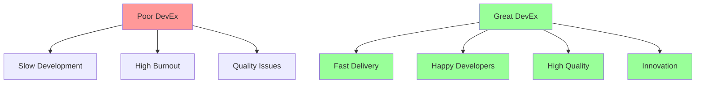

# Developer Experience and SPACE Framework

## Introduction to Developer Experience (DevEx)

Developer Experience is the journey of developers as they learn and deploy technology. It encompasses all the tools, processes, and frameworks that enable developers to be productive, engaged, and effective. Think of it as UX for developers - the easier and more enjoyable the experience, the better the outcomes.

### Why DevEx Matters in 2025

Studies show that 81% of companies see direct profitability gains from DevEx investments. Organizations with strong developer experience see:
- **50% faster feature delivery**
- **65% fewer production incidents**
- **40% higher developer retention**
- **3x faster onboarding for new developers**



## The SPACE Framework Explained

SPACE is a holistic framework developed by researchers from GitHub, Microsoft, and the University of Victoria. It measures developer productivity across five dimensions, moving beyond simple output metrics to understand the full developer experience.

### The Five Dimensions of SPACE

#### 🎯 **S - Satisfaction and Well-being**
How fulfilled developers feel with their work, tools, and environment.

#### ⚡ **P - Performance**
The outcome of a system or process, focused on business value delivery.

#### 📊 **A - Activity**
A count of actions or outputs completed in the development process.

#### 🤝 **C - Communication and Collaboration**
How people and teams communicate and work together.

#### ⏱️ **E - Efficiency and Flow**
The ability to complete work with minimal interruptions and delays.

### SPACE Implementation Framework

```python
# SPACE Metrics Implementation
class SPACEMetrics:
    def __init__(self):
        self.satisfaction_metrics = SatisfactionMetrics()
        self.performance_metrics = PerformanceMetrics()
        self.activity_metrics = ActivityMetrics()
        self.collaboration_metrics = CollaborationMetrics()
        self.efficiency_metrics = EfficiencyMetrics()

    def calculate_space_score(self, team_id, time_period='monthly'):
        """Calculate overall SPACE score for a team"""

        # Get metrics for each dimension
        satisfaction = self.satisfaction_metrics.get_team_score(team_id, time_period)
        performance = self.performance_metrics.get_team_score(team_id, time_period)
        activity = self.activity_metrics.get_team_score(team_id, time_period)
        collaboration = self.collaboration_metrics.get_team_score(team_id, time_period)
        efficiency = self.efficiency_metrics.get_team_score(team_id, time_period)

        # Weighted score (adjust weights based on organizational priorities)
        weights = {
            'satisfaction': 0.25,
            'performance': 0.25,
            'activity': 0.15,
            'collaboration': 0.20,
            'efficiency': 0.15
        }

        overall_score = (
            satisfaction * weights['satisfaction'] +
            performance * weights['performance'] +
            activity * weights['activity'] +
            collaboration * weights['collaboration'] +
            efficiency * weights['efficiency']
        )

        return {
            'overall_score': overall_score,
            'dimension_scores': {
                'satisfaction': satisfaction,
                'performance': performance,
                'activity': activity,
                'collaboration': collaboration,
                'efficiency': efficiency
            },
            'recommendations': self.generate_recommendations(
                satisfaction, performance, activity, collaboration, efficiency
            )
        }

    def generate_recommendations(self, s, p, a, c, e):
        """Generate actionable recommendations based on SPACE scores"""
        recommendations = []

        if s < 3.0:  # Satisfaction below threshold
            recommendations.append({
                'dimension': 'Satisfaction',
                'priority': 'High',
                'action': 'Conduct developer surveys, improve tooling, reduce toil',
                'expected_impact': 'Higher retention, better code quality'
            })

        if p < 3.0:  # Performance needs improvement
            recommendations.append({
                'dimension': 'Performance',
                'priority': 'High',
                'action': 'Focus on DORA metrics, improve deployment pipeline',
                'expected_impact': 'Faster delivery, better business outcomes'
            })

        if e < 3.0:  # Efficiency issues
            recommendations.append({
                'dimension': 'Efficiency',
                'priority': 'Medium',
                'action': 'Reduce context switching, improve development environment',
                'expected_impact': 'Increased throughput, less developer frustration'
            })

        if c < 3.0:  # Collaboration challenges
            recommendations.append({
                'dimension': 'Collaboration',
                'priority': 'Medium',
                'action': 'Improve documentation, async communication practices',
                'expected_impact': 'Better knowledge sharing, reduced silos'
            })

        return recommendations
```

## Implementing SPACE Metrics

### Satisfaction and Well-being Metrics

```python
class SatisfactionMetrics:
    def __init__(self):
        self.survey_client = SurveyClient()
        self.hr_system = HRSystem()

    def collect_satisfaction_data(self, team_id):
        """Collect satisfaction metrics through multiple channels"""

        # Developer satisfaction surveys (quarterly)
        survey_results = self.survey_client.get_latest_survey(team_id)

        # Pulse surveys (weekly/bi-weekly)
        pulse_data = self.survey_client.get_pulse_surveys(team_id, weeks=4)

        # HR metrics
        retention_data = self.hr_system.get_retention_metrics(team_id)

        # Tool satisfaction from usage analytics
        tool_satisfaction = self.analyze_tool_usage_patterns(team_id)

        return {
            'overall_satisfaction': survey_results.get('overall_rating', 0),
            'tool_satisfaction': tool_satisfaction,
            'work_life_balance': survey_results.get('work_life_balance', 0),
            'learning_opportunities': survey_results.get('learning_rating', 0),
            'autonomy_rating': survey_results.get('autonomy', 0),
            'retention_rate': retention_data['retention_rate'],
            'pulse_trend': self.calculate_pulse_trend(pulse_data)
        }

    def create_satisfaction_survey(self):
        """Template for developer satisfaction survey"""
        return {
            'questions': [
                {
                    'id': 'overall_satisfaction',
                    'question': 'How satisfied are you with your current development experience?',
                    'type': 'scale_1_5',
                    'required': True
                },
                {
                    'id': 'tool_effectiveness',
                    'question': 'How effective are your development tools?',
                    'type': 'scale_1_5',
                    'required': True
                },
                {
                    'id': 'cognitive_load',
                    'question': 'How often do you feel overwhelmed by complexity?',
                    'type': 'scale_1_5_reverse',  # Higher number = less overwhelmed
                    'required': True
                },
                {
                    'id': 'learning_opportunities',
                    'question': 'Do you have adequate opportunities to learn and grow?',
                    'type': 'scale_1_5',
                    'required': True
                },
                {
                    'id': 'work_life_balance',
                    'question': 'How would you rate your work-life balance?',
                    'type': 'scale_1_5',
                    'required': True
                },
                {
                    'id': 'team_dynamics',
                    'question': 'How well does your team collaborate?',
                    'type': 'scale_1_5',
                    'required': True
                },
                {
                    'id': 'feedback_culture',
                    'question': 'How effective is feedback in your team?',
                    'type': 'scale_1_5',
                    'required': True
                }
            ],
            'frequency': 'quarterly',
            'anonymous': True,
            'follow_up_questions': [
                'What tools or processes cause the most friction?',
                'What would improve your development experience most?',
                'What are you most excited about in your work?'
            ]
        }
```

### Performance Metrics

```python
class PerformanceMetrics:
    def __init__(self):
        self.dora_client = DORAMetricsClient()
        self.business_metrics = BusinessMetricsClient()

    def collect_performance_data(self, team_id, time_period):
        """Collect performance metrics focusing on business outcomes"""

        # DORA metrics (foundational performance indicators)
        dora_metrics = self.dora_client.get_metrics(team_id, time_period)

        # Business value metrics
        feature_adoption = self.business_metrics.get_feature_adoption(team_id)
        customer_satisfaction = self.business_metrics.get_customer_metrics(team_id)

        # Quality metrics
        bug_escape_rate = self.calculate_bug_escape_rate(team_id, time_period)
        technical_debt_ratio = self.calculate_technical_debt(team_id)

        return {
            'deployment_frequency': dora_metrics['deployment_frequency'],
            'lead_time_for_changes': dora_metrics['lead_time'],
            'mean_time_to_recovery': dora_metrics['mttr'],
            'change_failure_rate': dora_metrics['change_failure_rate'],
            'feature_adoption_rate': feature_adoption,
            'customer_satisfaction_score': customer_satisfaction,
            'bug_escape_rate': bug_escape_rate,
            'technical_debt_ratio': technical_debt_ratio,
            'code_review_effectiveness': self.calculate_review_effectiveness(team_id)
        }

    def calculate_performance_score(self, metrics):
        """Calculate normalized performance score (0-5)"""

        # DORA benchmarks for scoring
        dora_benchmarks = {
            'deployment_frequency': {
                'elite': 'multiple_per_day',  # Score: 5
                'high': 'daily_to_weekly',    # Score: 4
                'medium': 'weekly_to_monthly', # Score: 3
                'low': 'monthly_to_yearly'    # Score: 2
            },
            'lead_time': {
                'elite': 3600,     # < 1 hour (seconds)
                'high': 604800,    # < 1 week
                'medium': 2592000, # < 1 month
                'low': float('inf')
            },
            'mttr': {
                'elite': 3600,     # < 1 hour
                'high': 86400,     # < 1 day
                'medium': 604800,  # < 1 week
                'low': float('inf')
            },
            'change_failure_rate': {
                'elite': 0.05,     # < 5%
                'high': 0.15,      # < 15%
                'medium': 0.30,    # < 30%
                'low': 1.0
            }
        }

        # Calculate individual scores
        scores = {}

        # Score DORA metrics
        for metric, value in metrics.items():
            if metric in dora_benchmarks:
                scores[metric] = self.score_against_benchmark(
                    value, dora_benchmarks[metric]
                )

        # Score business metrics
        scores['customer_satisfaction'] = min(5, metrics['customer_satisfaction_score'])
        scores['quality'] = max(1, 5 - (metrics['bug_escape_rate'] * 5))

        # Calculate weighted average
        weights = {
            'deployment_frequency': 0.20,
            'lead_time': 0.20,
            'mttr': 0.15,
            'change_failure_rate': 0.15,
            'customer_satisfaction': 0.15,
            'quality': 0.15
        }

        weighted_score = sum(scores[metric] * weights[metric]
                           for metric in weights.keys())

        return min(5.0, max(1.0, weighted_score))
```

### Activity Metrics

```python
class ActivityMetrics:
    def __init__(self):
        self.git_client = GitClient()
        self.jira_client = JiraClient()
        self.ci_client = CIClient()

    def collect_activity_data(self, team_id, time_period):
        """Collect activity metrics with context"""

        # Code activity (with quality context)
        commits = self.git_client.get_commits(team_id, time_period)
        pull_requests = self.git_client.get_pull_requests(team_id, time_period)

        # Work item activity
        stories_completed = self.jira_client.get_completed_stories(team_id, time_period)
        bugs_fixed = self.jira_client.get_bugs_resolved(team_id, time_period)

        # CI/CD activity
        builds = self.ci_client.get_build_count(team_id, time_period)
        deployments = self.ci_client.get_deployment_count(team_id, time_period)

        # Calculate meaningful ratios
        commit_pr_ratio = len(commits) / max(1, len(pull_requests))
        deployment_story_ratio = deployments / max(1, len(stories_completed))

        return {
            'commits_per_developer': len(commits) / self.get_team_size(team_id),
            'pull_requests_merged': len([pr for pr in pull_requests if pr['merged']]),
            'stories_completed': len(stories_completed),
            'bugs_resolved': len(bugs_fixed),
            'builds_per_day': builds / self.days_in_period(time_period),
            'deployments_per_week': deployments / (self.days_in_period(time_period) / 7),
            'commit_pr_ratio': commit_pr_ratio,
            'deployment_story_ratio': deployment_story_ratio,
            'code_review_participation': self.calculate_review_participation(team_id),
            'average_pr_size': self.calculate_average_pr_size(pull_requests)
        }

    def calculate_activity_score(self, metrics, team_type='product'):
        """Calculate activity score based on team type and context"""

        # Different expectations for different team types
        benchmarks = {
            'product': {
                'commits_per_dev_per_day': 3.0,
                'stories_per_week': 2.0,
                'pr_size_lines': 200  # Smaller PRs are better
            },
            'platform': {
                'commits_per_dev_per_day': 2.5,
                'stories_per_week': 1.5,
                'pr_size_lines': 300
            },
            'infrastructure': {
                'commits_per_dev_per_day': 2.0,
                'stories_per_week': 1.0,
                'pr_size_lines': 150
            }
        }

        benchmark = benchmarks.get(team_type, benchmarks['product'])

        # Score based on healthy activity patterns
        commit_score = min(5, metrics['commits_per_developer'] / benchmark['commits_per_dev_per_day'] * 3)
        story_score = min(5, metrics['stories_completed'] / benchmark['stories_per_week'] * 3)

        # Penalize large PRs (harder to review)
        pr_size_score = max(1, 5 - (metrics['average_pr_size'] / benchmark['pr_size_lines']))

        # Reward good collaboration patterns
        collaboration_score = min(5, metrics['code_review_participation'] * 5)

        return {
            'overall_score': (commit_score + story_score + pr_size_score + collaboration_score) / 4,
            'commit_score': commit_score,
            'delivery_score': story_score,
            'pr_quality_score': pr_size_score,
            'collaboration_score': collaboration_score
        }
```

### Collaboration and Communication Metrics

```python
class CollaborationMetrics:
    def __init__(self):
        self.slack_client = SlackClient()
        self.github_client = GitHubClient()
        self.confluence_client = ConfluenceClient()

    def collect_collaboration_data(self, team_id, time_period):
        """Collect collaboration metrics across platforms"""

        # Code collaboration
        code_reviews = self.github_client.get_code_reviews(team_id, time_period)
        pair_programming = self.detect_pair_programming(team_id, time_period)

        # Documentation collaboration
        docs_created = self.confluence_client.get_docs_created(team_id, time_period)
        docs_updated = self.confluence_client.get_docs_updated(team_id, time_period)

        # Knowledge sharing
        tech_talks = self.get_tech_talk_participation(team_id, time_period)
        mentoring = self.detect_mentoring_activity(team_id, time_period)

        # Cross-team collaboration
        cross_team_prs = self.github_client.get_cross_team_prs(team_id, time_period)

        # Communication patterns
        meeting_effectiveness = self.analyze_meeting_patterns(team_id, time_period)

        return {
            'code_review_participation': self.calculate_review_participation(code_reviews),
            'review_response_time': self.calculate_review_response_time(code_reviews),
            'pair_programming_hours': pair_programming['total_hours'],
            'knowledge_sharing_sessions': tech_talks + mentoring,
            'documentation_updates': docs_created + docs_updated,
            'cross_team_collaboration': len(cross_team_prs),
            'meeting_efficiency_score': meeting_effectiveness,
            'async_communication_ratio': self.calculate_async_ratio(team_id, time_period)
        }

    def calculate_review_participation(self, reviews):
        """Calculate how evenly code reviews are distributed"""
        if not reviews:
            return 0

        # Count reviews per person
        review_counts = {}
        for review in reviews:
            reviewer = review['reviewer']
            review_counts[reviewer] = review_counts.get(reviewer, 0) + 1

        # Calculate distribution using Gini coefficient (0 = perfect equality)
        values = sorted(review_counts.values())
        n = len(values)

        if n == 0:
            return 0

        cumsum = 0
        for i, value in enumerate(values):
            cumsum += (i + 1) * value

        gini = (2 * cumsum) / (n * sum(values)) - (n + 1) / n

        # Convert to participation score (higher is better)
        participation_score = 1 - gini
        return min(1.0, max(0.0, participation_score))

    def detect_pair_programming(self, team_id, time_period):
        """Detect pair programming sessions from commit patterns"""

        commits = self.github_client.get_commits(team_id, time_period)

        pair_sessions = []
        co_authored_commits = 0

        for commit in commits:
            # Look for co-authored commits
            if 'Co-authored-by:' in commit['message']:
                co_authored_commits += 1
                pair_sessions.append({
                    'date': commit['date'],
                    'authors': self.extract_co_authors(commit['message']),
                    'commit_hash': commit['hash']
                })

        # Estimate pair programming hours (rough estimate)
        estimated_hours = co_authored_commits * 2  # Assume 2 hours per paired commit

        return {
            'total_hours': estimated_hours,
            'sessions': len(pair_sessions),
            'co_authored_commits': co_authored_commits,
            'pair_programming_ratio': co_authored_commits / max(1, len(commits))
        }

    def analyze_meeting_patterns(self, team_id, time_period):
        """Analyze meeting effectiveness patterns"""

        # This would integrate with calendar APIs
        meetings = self.get_team_meetings(team_id, time_period)

        total_meeting_time = sum(m['duration'] for m in meetings)
        productive_meetings = len([m for m in meetings if m.get('had_outcome', False)])

        # Calculate metrics
        avg_meeting_size = sum(m['attendee_count'] for m in meetings) / max(1, len(meetings))
        meeting_outcome_ratio = productive_meetings / max(1, len(meetings))

        # Score based on healthy meeting patterns
        if total_meeting_time == 0:
            return 3.0  # Neutral score if no data

        # Penalize excessive meeting time (> 20 hours/week per person)
        excessive_meetings = total_meeting_time > (20 * len(self.get_team_members(team_id)))

        efficiency_score = meeting_outcome_ratio * 5

        if excessive_meetings:
            efficiency_score *= 0.7  # Penalty for too many meetings

        return min(5.0, efficiency_score)
```

### Efficiency and Flow Metrics

```python
class EfficiencyMetrics:
    def __init__(self):
        self.jira_client = JiraClient()
        self.github_client = GitHubClient()
        self.calendar_client = CalendarClient()

    def collect_efficiency_data(self, team_id, time_period):
        """Collect efficiency and flow metrics"""

        # Flow metrics
        cycle_times = self.calculate_cycle_times(team_id, time_period)
        context_switches = self.detect_context_switches(team_id, time_period)

        # Interruption patterns
        interruptions = self.analyze_interruptions(team_id, time_period)

        # Development environment efficiency
        build_times = self.get_build_performance(team_id, time_period)
        test_run_times = self.get_test_performance(team_id, time_period)

        # Focus time analysis
        focus_time = self.calculate_focus_time(team_id, time_period)

        return {
            'average_cycle_time': cycle_times['average'],
            'cycle_time_variability': cycle_times['std_dev'],
            'context_switches_per_day': context_switches,
            'interruption_frequency': interruptions['frequency'],
            'average_build_time': build_times['average'],
            'test_feedback_time': test_run_times['average'],
            'focus_time_percentage': focus_time['percentage'],
            'rework_percentage': self.calculate_rework_rate(team_id, time_period),
            'deployment_lead_time': self.calculate_deployment_lead_time(team_id, time_period)
        }

    def calculate_cycle_times(self, team_id, time_period):
        """Calculate work item cycle times"""

        completed_stories = self.jira_client.get_completed_stories(team_id, time_period)

        cycle_times = []
        for story in completed_stories:
            # Calculate time from start to completion
            start_time = story['start_date']
            end_time = story['completion_date']

            cycle_time = (end_time - start_time).total_seconds() / 3600  # Hours
            cycle_times.append(cycle_time)

        if not cycle_times:
            return {'average': 0, 'std_dev': 0, 'percentile_95': 0}

        return {
            'average': sum(cycle_times) / len(cycle_times),
            'std_dev': self.calculate_std_dev(cycle_times),
            'percentile_95': sorted(cycle_times)[int(len(cycle_times) * 0.95)],
            'median': sorted(cycle_times)[len(cycle_times) // 2]
        }

    def detect_context_switches(self, team_id, time_period):
        """Detect context switches from work patterns"""

        # Analyze commit patterns across different projects/repos
        commits = self.github_client.get_commits(team_id, time_period)

        context_switches = 0
        developers = {}

        for commit in sorted(commits, key=lambda x: x['date']):
            author = commit['author']
            repo = commit['repository']
            date = commit['date'].date()

            if author not in developers:
                developers[author] = {}

            if date not in developers[author]:
                developers[author][date] = []

            developers[author][date].append(repo)

        # Count unique repos per developer per day
        for author, dates in developers.items():
            for date, repos in dates.items():
                unique_repos = len(set(repos))
                if unique_repos > 1:
                    context_switches += (unique_repos - 1)

        total_dev_days = sum(len(dates) for dates in developers.values())

        return context_switches / max(1, total_dev_days)

    def calculate_focus_time(self, team_id, time_period):
        """Calculate percentage of time in focused work"""

        team_members = self.get_team_members(team_id)
        total_focus_time = 0
        total_work_time = 0

        for member in team_members:
            # Get calendar data
            calendar_events = self.calendar_client.get_events(member, time_period)

            # Calculate meeting time vs focus time
            work_days = self.get_work_days(time_period)
            daily_work_hours = 8

            for day in work_days:
                meetings = [e for e in calendar_events if e['date'].date() == day]
                meeting_hours = sum(e['duration'] for e in meetings)

                # Assume focus time is work time minus meetings minus interruptions
                focus_hours = max(0, daily_work_hours - meeting_hours - 1)  # 1 hour for interruptions

                total_focus_time += focus_hours
                total_work_time += daily_work_hours

        focus_percentage = (total_focus_time / max(1, total_work_time)) * 100

        return {
            'percentage': focus_percentage,
            'average_daily_focus_hours': total_focus_time / max(1, len(work_days) * len(team_members)),
            'meeting_overhead': ((total_work_time - total_focus_time) / max(1, total_work_time)) * 100
        }

    def calculate_efficiency_score(self, metrics):
        """Calculate overall efficiency score"""

        # Ideal benchmarks
        benchmarks = {
            'cycle_time_days': 5,      # 5 days or less
            'context_switches': 2,     # 2 or fewer per day
            'focus_time_percentage': 70,  # 70% or more
            'build_time_minutes': 10,  # 10 minutes or less
            'rework_percentage': 15    # 15% or less
        }

        scores = {}

        # Score cycle time (lower is better)
        cycle_time_days = metrics['average_cycle_time'] / 24
        scores['cycle_time'] = max(1, 5 - (cycle_time_days / benchmarks['cycle_time_days']) * 4)

        # Score context switches (lower is better)
        scores['context_switches'] = max(1, 5 - (metrics['context_switches_per_day'] / benchmarks['context_switches']) * 4)

        # Score focus time (higher is better)
        scores['focus_time'] = min(5, (metrics['focus_time_percentage'] / benchmarks['focus_time_percentage']) * 5)

        # Score build time (lower is better)
        build_time_minutes = metrics['average_build_time'] / 60
        scores['build_time'] = max(1, 5 - (build_time_minutes / benchmarks['build_time_minutes']) * 4)

        # Score rework (lower is better)
        scores['rework'] = max(1, 5 - (metrics['rework_percentage'] / benchmarks['rework_percentage']) * 4)

        # Calculate weighted average
        weights = {
            'cycle_time': 0.25,
            'focus_time': 0.25,
            'context_switches': 0.20,
            'build_time': 0.15,
            'rework': 0.15
        }

        overall_score = sum(scores[metric] * weights[metric] for metric in weights.keys())

        return {
            'overall_score': min(5.0, max(1.0, overall_score)),
            'dimension_scores': scores
        }
```

## SPACE Dashboard Implementation

### Real-time SPACE Dashboard

```typescript
// React component for SPACE dashboard
interface SPACEDashboardProps {
  teamId: string;
  timePeriod: string;
}

const SPACEDashboard: React.FC<SPACEDashboardProps> = ({ teamId, timePeriod }) => {
  const [spaceData, setSPaceData] = useState<SPACEMetrics | null>(null);
  const [loading, setLoading] = useState(true);

  useEffect(() => {
    fetchSPACEMetrics(teamId, timePeriod)
      .then(setSPaceData)
      .finally(() => setLoading(false));
  }, [teamId, timePeriod]);

  if (loading) return <LoadingSpinner />;
  if (!spaceData) return <ErrorMessage />;

  return (
    <div className="space-dashboard">
      <DashboardHeader
        teamId={teamId}
        overallScore={spaceData.overall_score}
        timePeriod={timePeriod}
      />

      <div className="metrics-grid">
        <MetricCard
          title="Satisfaction & Well-being"
          score={spaceData.dimension_scores.satisfaction}
          icon="😊"
          color="purple"
          details={[
            `Developer satisfaction: ${spaceData.details.satisfaction.overall_satisfaction}/5`,
            `Tool effectiveness: ${spaceData.details.satisfaction.tool_satisfaction}/5`,
            `Work-life balance: ${spaceData.details.satisfaction.work_life_balance}/5`,
            `Learning opportunities: ${spaceData.details.satisfaction.learning_opportunities}/5`
          ]}
        />

        <MetricCard
          title="Performance"
          score={spaceData.dimension_scores.performance}
          icon="🎯"
          color="green"
          details={[
            `Deployment frequency: ${spaceData.details.performance.deployment_frequency}`,
            `Lead time: ${spaceData.details.performance.lead_time_for_changes}`,
            `MTTR: ${spaceData.details.performance.mean_time_to_recovery}`,
            `Change failure rate: ${spaceData.details.performance.change_failure_rate}%`
          ]}
        />

        <MetricCard
          title="Activity"
          score={spaceData.dimension_scores.activity}
          icon="📊"
          color="blue"
          details={[
            `Commits per developer: ${spaceData.details.activity.commits_per_developer}`,
            `PRs merged: ${spaceData.details.activity.pull_requests_merged}`,
            `Stories completed: ${spaceData.details.activity.stories_completed}`,
            `Code review participation: ${spaceData.details.activity.code_review_participation * 100}%`
          ]}
        />

        <MetricCard
          title="Communication & Collaboration"
          score={spaceData.dimension_scores.collaboration}
          icon="🤝"
          color="orange"
          details={[
            `Review response time: ${spaceData.details.collaboration.review_response_time}h`,
            `Cross-team collaboration: ${spaceData.details.collaboration.cross_team_collaboration}`,
            `Knowledge sharing: ${spaceData.details.collaboration.knowledge_sharing_sessions}`,
            `Meeting efficiency: ${spaceData.details.collaboration.meeting_efficiency_score}/5`
          ]}
        />

        <MetricCard
          title="Efficiency & Flow"
          score={spaceData.dimension_scores.efficiency}
          icon="⚡"
          color="red"
          details={[
            `Average cycle time: ${spaceData.details.efficiency.average_cycle_time}h`,
            `Context switches/day: ${spaceData.details.efficiency.context_switches_per_day}`,
            `Focus time: ${spaceData.details.efficiency.focus_time_percentage}%`,
            `Build time: ${spaceData.details.efficiency.average_build_time}min`
          ]}
        />
      </div>

      <RecommendationsPanel recommendations={spaceData.recommendations} />

      <TrendsChart teamId={teamId} timePeriod="6_months" />
    </div>
  );
};

// Metric card component
const MetricCard: React.FC<{
  title: string;
  score: number;
  icon: string;
  color: string;
  details: string[];
}> = ({ title, score, icon, color, details }) => {
  const getScoreColor = (score: number) => {
    if (score >= 4) return 'text-green-600';
    if (score >= 3) return 'text-yellow-600';
    return 'text-red-600';
  };

  const getScoreBackground = (score: number) => {
    if (score >= 4) return 'bg-green-100';
    if (score >= 3) return 'bg-yellow-100';
    return 'bg-red-100';
  };

  return (
    <div className={`metric-card border-l-4 border-${color}-500 p-4 bg-white rounded-lg shadow`}>
      <div className="flex items-center justify-between mb-2">
        <h3 className="text-lg font-semibold text-gray-800">{title}</h3>
        <span className="text-2xl">{icon}</span>
      </div>

      <div className={`text-3xl font-bold ${getScoreColor(score)} mb-3`}>
        {score.toFixed(1)}/5
      </div>

      <div className={`w-full ${getScoreBackground(score)} rounded-full h-2 mb-3`}>
        <div
          className={`bg-${color}-500 h-2 rounded-full transition-all duration-300`}
          style={{ width: `${(score / 5) * 100}%` }}
        ></div>
      </div>

      <ul className="text-sm text-gray-600 space-y-1">
        {details.map((detail, index) => (
          <li key={index} className="flex items-center">
            <span className="w-2 h-2 bg-gray-400 rounded-full mr-2"></span>
            {detail}
          </li>
        ))}
      </ul>
    </div>
  );
};
```

## Platform Team Implementation Guide

### Setting Up SPACE for Platform Teams

```yaml
# Platform team SPACE configuration
platform_team_space_config:
  satisfaction_metrics:
    surveys:
      frequency: "quarterly"
      custom_questions:
        - "How effective are our internal tools?"
        - "How well do we support product teams?"
        - "Rate the quality of our documentation"
        - "How much time do you spend on toil vs innovation?"

    pulse_surveys:
      frequency: "bi-weekly"
      questions:
        - "Developer experience rating this sprint"
        - "Infrastructure stability satisfaction"
        - "Tool effectiveness rating"

  performance_metrics:
    focus_areas:
      - "Platform adoption rate"
      - "Developer self-service success rate"
      - "Infrastructure uptime"
      - "Incident response time"
      - "Time to onboard new teams"

    custom_kpis:
      - metric: "platform_adoption"
        calculation: "teams_using_platform / total_teams"
        target: "> 80%"

      - metric: "self_service_success"
        calculation: "successful_self_service / total_requests"
        target: "> 90%"

      - metric: "developer_velocity_impact"
        calculation: "product_team_deployment_frequency_change"
        target: "> 20% improvement"

  activity_metrics:
    platform_specific:
      - "Internal tool releases"
      - "Documentation updates"
      - "Developer enablement sessions"
      - "Platform API usage growth"
      - "Support request resolution"

  collaboration_metrics:
    cross_team_focus:
      - "Product team feedback sessions"
      - "Architecture review participation"
      - "Internal tech talk delivery"
      - "Cross-team pairing sessions"

  efficiency_metrics:
    platform_efficiency:
      - "Time to provision new environments"
      - "Deployment pipeline performance"
      - "Alert noise reduction"
      - "Automation coverage"
```

### Product Team vs Platform Team SPACE Differences

```python
class TeamTypeSPACEConfig:
    def __init__(self):
        self.configs = {
            'product': {
                'satisfaction_weight': 0.25,
                'performance_weight': 0.30,  # Higher focus on delivery
                'activity_weight': 0.15,
                'collaboration_weight': 0.15,
                'efficiency_weight': 0.15,
                'key_metrics': [
                    'feature_delivery_speed',
                    'customer_satisfaction',
                    'bug_fix_rate',
                    'sprint_goal_achievement'
                ]
            },
            'platform': {
                'satisfaction_weight': 0.30,  # Higher - internal customer focus
                'performance_weight': 0.25,
                'activity_weight': 0.10,  # Lower - quality over quantity
                'collaboration_weight': 0.25,  # Higher - cross-team work
                'efficiency_weight': 0.10,
                'key_metrics': [
                    'platform_adoption_rate',
                    'developer_productivity_impact',
                    'infrastructure_reliability',
                    'support_response_time'
                ]
            },
            'infrastructure': {
                'satisfaction_weight': 0.20,
                'performance_weight': 0.35,  # Highest - uptime critical
                'activity_weight': 0.10,
                'collaboration_weight': 0.15,
                'efficiency_weight': 0.20,  # Higher - automation focus
                'key_metrics': [
                    'system_uptime',
                    'incident_response_time',
                    'automation_coverage',
                    'infrastructure_as_code_adoption'
                ]
            }
        }

    def get_team_config(self, team_type):
        return self.configs.get(team_type, self.configs['product'])

    def calculate_team_space_score(self, team_type, raw_metrics):
        config = self.get_team_config(team_type)

        weighted_score = (
            raw_metrics['satisfaction'] * config['satisfaction_weight'] +
            raw_metrics['performance'] * config['performance_weight'] +
            raw_metrics['activity'] * config['activity_weight'] +
            raw_metrics['collaboration'] * config['collaboration_weight'] +
            raw_metrics['efficiency'] * config['efficiency_weight']
        )

        return {
            'overall_score': weighted_score,
            'team_type': team_type,
            'weights_applied': config,
            'recommendations': self.generate_team_specific_recommendations(
                team_type, raw_metrics
            )
        }
```

## Integration with Platform Engineering

### Developer Portal Integration

```typescript
// Backstage plugin for SPACE metrics
export const SpaceMetricsPlugin = createPlugin({
  id: 'space-metrics',
  apis: [
    createApiFactory({
      api: spaceMetricsApiRef,
      deps: { configApi: configApiRef },
      factory: ({ configApi }) => new SpaceMetricsApiClient(configApi)
    })
  ],
  routes: {
    root: rootRouteRef,
    teamMetrics: teamMetricsRouteRef
  }
});

// Component for Backstage catalog
export const EntitySPACEMetricsCard = () => {
  const { entity } = useEntity();
  const spaceApi = useApi(spaceMetricsApiRef);

  const [metrics, setMetrics] = useState<SPACEMetrics | null>(null);

  useEffect(() => {
    if (entity.metadata.annotations?.['space.io/team-id']) {
      spaceApi.getTeamMetrics(entity.metadata.annotations['space.io/team-id'])
        .then(setMetrics);
    }
  }, [entity, spaceApi]);

  if (!metrics) return <InfoCard title="SPACE Metrics" loading />;

  return (
    <InfoCard title="Developer Experience (SPACE)">
      <div className="space-metrics-summary">
        <div className="overall-score">
          <Typography variant="h4" component="div">
            {metrics.overall_score.toFixed(1)}/5
          </Typography>
          <Typography variant="body2" color="textSecondary">
            Overall SPACE Score
          </Typography>
        </div>

        <div className="dimension-scores">
          {Object.entries(metrics.dimension_scores).map(([dimension, score]) => (
            <div key={dimension} className="dimension-item">
              <Typography variant="body2">{dimension}</Typography>
              <LinearProgress
                variant="determinate"
                value={(score / 5) * 100}
                color={score >= 4 ? 'primary' : score >= 3 ? 'secondary' : 'error'}
              />
              <Typography variant="caption">{score.toFixed(1)}</Typography>
            </div>
          ))}
        </div>

        <Button
          component={Link}
          to={`/space-metrics/${entity.metadata.annotations['space.io/team-id']}`}
          variant="outlined"
          size="small"
        >
          View Detailed Metrics
        </Button>
      </div>
    </InfoCard>
  );
};
```

### Self-Service Developer Experience

```python
# Developer experience automation
class DevExAutomation:
    def __init__(self):
        self.space_client = SPACEMetricsClient()
        self.platform_client = PlatformClient()

    def auto_improve_devex(self, team_id):
        """Automatically improve developer experience based on SPACE metrics"""

        metrics = self.space_client.get_latest_metrics(team_id)
        improvements = []

        # Satisfaction improvements
        if metrics.satisfaction < 3.0:
            if metrics.details.satisfaction.tool_satisfaction < 3.0:
                improvements.append(self.suggest_tool_improvements(team_id))

            if metrics.details.satisfaction.cognitive_load > 3.0:
                improvements.append(self.reduce_complexity(team_id))

        # Performance improvements
        if metrics.performance < 3.0:
            if metrics.details.performance.deployment_frequency < 'daily':
                improvements.append(self.improve_ci_cd(team_id))

            if metrics.details.performance.lead_time > 604800:  # > 1 week
                improvements.append(self.optimize_development_flow(team_id))

        # Efficiency improvements
        if metrics.efficiency < 3.0:
            if metrics.details.efficiency.build_time > 600:  # > 10 minutes
                improvements.append(self.optimize_build_pipeline(team_id))

            if metrics.details.efficiency.focus_time_percentage < 60:
                improvements.append(self.reduce_interruptions(team_id))

        return self.execute_improvements(improvements)

    def suggest_tool_improvements(self, team_id):
        """Suggest tool improvements based on team needs"""

        current_tools = self.platform_client.get_team_tools(team_id)

        suggestions = []

        # IDE improvements
        if 'vscode' not in current_tools:
            suggestions.append({
                'type': 'ide_setup',
                'action': 'Setup standardized VS Code with team extensions',
                'impact': 'Reduce tool friction and improve consistency',
                'effort': 'Low',
                'automation': self.setup_vscode_config
            })

        # Development environment
        if 'devcontainer' not in current_tools:
            suggestions.append({
                'type': 'dev_environment',
                'action': 'Create development containers for consistent environments',
                'impact': 'Eliminate "works on my machine" issues',
                'effort': 'Medium',
                'automation': self.create_devcontainer_config
            })

        # CI/CD tooling
        if 'github_actions' not in current_tools:
            suggestions.append({
                'type': 'cicd',
                'action': 'Migrate to GitHub Actions for better developer experience',
                'impact': 'Faster feedback loops and easier pipeline maintenance',
                'effort': 'High',
                'automation': self.migrate_to_github_actions
            })

        return suggestions

    def reduce_complexity(self, team_id):
        """Reduce cognitive complexity for developers"""

        complexity_sources = self.analyze_complexity_sources(team_id)

        reductions = []

        # Documentation improvements
        if complexity_sources['documentation_gaps'] > 0.3:
            reductions.append({
                'type': 'documentation',
                'action': 'Auto-generate missing API documentation',
                'automation': self.generate_api_docs
            })

        # Architecture simplification
        if complexity_sources['service_dependencies'] > 10:
            reductions.append({
                'type': 'architecture',
                'action': 'Identify opportunities for service consolidation',
                'automation': self.analyze_service_dependencies
            })

        # Process simplification
        if complexity_sources['manual_processes'] > 5:
            reductions.append({
                'type': 'automation',
                'action': 'Automate manual development processes',
                'automation': self.automate_manual_processes
            })

        return reductions

    def improve_ci_cd(self, team_id):
        """Improve CI/CD pipeline for better performance"""

        pipeline_analysis = self.analyze_pipeline_performance(team_id)

        improvements = []

        # Pipeline optimization
        if pipeline_analysis['build_time'] > 600:  # > 10 minutes
            improvements.append({
                'type': 'build_optimization',
                'action': 'Implement build caching and parallelization',
                'automation': self.optimize_build_performance
            })

        # Deployment frequency
        if pipeline_analysis['deployment_frequency'] < 1:  # < 1 per day
            improvements.append({
                'type': 'deployment_automation',
                'action': 'Setup automated deployment on merge to main',
                'automation': self.setup_auto_deployment
            })

        # Test optimization
        if pipeline_analysis['test_time'] > 300:  # > 5 minutes
            improvements.append({
                'type': 'test_optimization',
                'action': 'Implement test parallelization and smart test selection',
                'automation': self.optimize_test_execution
            })

        return improvements

    def execute_improvements(self, improvements):
        """Execute the suggested improvements"""

        results = []

        for improvement_set in improvements:
            for improvement in improvement_set:
                try:
                    if improvement.get('automation'):
                        result = improvement['automation']()
                        results.append({
                            'improvement': improvement,
                            'status': 'completed',
                            'result': result
                        })
                    else:
                        results.append({
                            'improvement': improvement,
                            'status': 'manual_action_required'
                        })
                except Exception as e:
                    results.append({
                        'improvement': improvement,
                        'status': 'failed',
                        'error': str(e)
                    })

        return results
```

## SPACE Best Practices

### Implementation Guidelines

1. **Start Small**: Begin with 2-3 dimensions that are easiest to measure
2. **Team-Level Focus**: SPACE works best at the team level (5-15 people)
3. **Combine with DORA**: Use DORA metrics as foundation for Performance dimension
4. **Avoid Individual Measurement**: Never use SPACE to evaluate individual developers
5. **Regular Review**: Review metrics monthly, adjust quarterly

### Common Anti-Patterns to Avoid

❌ **Using SPACE for individual performance reviews**
❌ **Over-indexing on Activity metrics only**
❌ **Ignoring context and team differences**
❌ **Not acting on survey feedback**
❌ **Measuring everything without clear goals**

### SPACE Maturity Levels

```python
space_maturity_levels = {
    'level_1_basic': {
        'characteristics': [
            'Basic satisfaction surveys',
            'DORA metrics implementation',
            'Simple activity tracking',
            'Manual data collection'
        ],
        'focus': 'Establish baseline measurements',
        'timeline': '0-3 months'
    },
    'level_2_integrated': {
        'characteristics': [
            'Automated metric collection',
            'Cross-dimensional analysis',
            'Regular team retrospectives',
            'Tool integration'
        ],
        'focus': 'Connect metrics to team health',
        'timeline': '3-6 months'
    },
    'level_3_optimized': {
        'characteristics': [
            'Predictive analytics',
            'Automated improvement suggestions',
            'Cultural adoption',
            'Business value correlation'
        ],
        'focus': 'Continuous improvement culture',
        'timeline': '6-12 months'
    },
    'level_4_advanced': {
        'characteristics': [
            'AI-driven insights',
            'Real-time optimization',
            'Cross-team benchmarking',
            'Business impact measurement'
        ],
        'focus': 'Strategic competitive advantage',
        'timeline': '12+ months'
    }
}
```

## Integration with Other Frameworks

### SPACE + DORA Integration

```python
class SPACEDORAIntegration:
    def __init__(self):
        self.dora_client = DORAMetricsClient()
        self.space_client = SPACEMetricsClient()

    def create_unified_dashboard(self, team_id, time_period):
        """Create unified SPACE + DORA dashboard"""

        dora_metrics = self.dora_client.get_metrics(team_id, time_period)
        space_metrics = self.space_client.get_metrics(team_id, time_period)

        # Map DORA metrics to SPACE Performance dimension
        performance_correlation = {
            'deployment_frequency': dora_metrics['deployment_frequency'],
            'lead_time': dora_metrics['lead_time_for_changes'],
            'mttr': dora_metrics['mean_time_to_recovery'],
            'change_failure_rate': dora_metrics['change_failure_rate'],
            'space_performance_score': space_metrics['dimension_scores']['performance']
        }

        # Correlate efficiency with DORA
        efficiency_correlation = {
            'lead_time_breakdown': self.analyze_lead_time_components(team_id),
            'space_efficiency_score': space_metrics['dimension_scores']['efficiency']
        }

        return {
            'unified_score': self.calculate_unified_score(dora_metrics, space_metrics),
            'performance_correlation': performance_correlation,
            'efficiency_correlation': efficiency_correlation,
            'recommendations': self.generate_unified_recommendations(
                dora_metrics, space_metrics
            )
        }

    def calculate_unified_score(self, dora_metrics, space_metrics):
        """Calculate a unified DevEx score combining DORA and SPACE"""

        # DORA contributes to Performance and Efficiency dimensions
        dora_performance_score = self.dora_to_performance_score(dora_metrics)

        # Weight SPACE dimensions with DORA influence
        unified_score = (
            space_metrics['dimension_scores']['satisfaction'] * 0.25 +
            dora_performance_score * 0.30 +
            space_metrics['dimension_scores']['activity'] * 0.10 +
            space_metrics['dimension_scores']['collaboration'] * 0.20 +
            space_metrics['dimension_scores']['efficiency'] * 0.15
        )

        return {
            'overall_score': unified_score,
            'dora_contribution': dora_performance_score,
            'space_contribution': space_metrics['overall_score'],
            'balance_score': self.calculate_balance_score(dora_metrics, space_metrics)
        }
```

---

## Conclusion

The SPACE framework provides a holistic approach to measuring and improving developer experience beyond traditional productivity metrics. By focusing on satisfaction, performance, activity, collaboration, and efficiency, teams can:

- **Make data-driven decisions** about developer tooling and processes
- **Identify bottlenecks** before they impact delivery
- **Improve developer retention** through better working conditions
- **Correlate developer experience** with business outcomes
- **Build a culture** of continuous improvement

### Key Success Factors

1. **Leadership Support**: Executive sponsorship for developer experience initiatives
2. **Team Participation**: Active involvement from developers in defining and improving metrics
3. **Tool Integration**: Automated collection to reduce measurement overhead
4. **Action-Oriented**: Focus on metrics that lead to actionable improvements
5. **Cultural Adoption**: Embed SPACE thinking into team retrospectives and planning

### Next Steps

1. **Start with a pilot team** to test SPACE implementation
2. **Integrate with existing tools** (GitHub, Jira, Slack, etc.)
3. **Establish baseline measurements** across all five dimensions
4. **Create feedback loops** between metrics and team actions
5. **Scale gradually** to other teams based on learnings

Remember: The goal isn't perfect scores—it's sustainable improvements that make developers more effective and satisfied with their work.

For platform teams specifically, SPACE metrics can help measure the impact of internal tools and services on overall developer productivity, making the business case for continued platform investment.