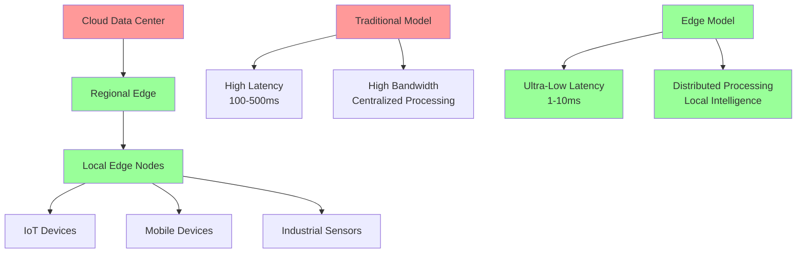

# Edge Computing and IoT DevOps

## Introduction to Edge Computing

Edge computing brings computation and data storage closer to where it's needed, dramatically reducing latency and bandwidth usage. Combined with IoT (Internet of Things), it's creating a new paradigm for distributed systems that require real-time processing and autonomous operation.

### Why Edge Computing Matters in 2025

The edge computing market is projected to reach $101 billion by 2025, driven by:
- **5G network rollout** enabling ultra-low latency applications
- **IoT device explosion** with 75 billion connected devices expected by 2025
- **Real-time AI requirements** for autonomous vehicles, healthcare, and industrial automation
- **Data sovereignty regulations** requiring local data processing
- **Bandwidth cost optimization** reducing cloud data transfer expenses



## Edge Computing Architecture Patterns

### Three-Tier Edge Architecture

```python
# Edge computing architecture implementation
class EdgeComputingArchitecture:
    def __init__(self):
        self.cloud_tier = CloudTier()
        self.edge_tier = EdgeTier()
        self.device_tier = DeviceTier()
        self.orchestrator = EdgeOrchestrator()

    def deploy_edge_workload(self, workload_spec):
        """Deploy workload across edge infrastructure"""

        # Analyze workload requirements
        requirements = self.analyze_workload_requirements(workload_spec)

        # Determine optimal placement
        placement_strategy = self.orchestrator.calculate_placement(requirements)

        # Deploy to appropriate tiers
        deployment_result = {}

        for tier, components in placement_strategy.items():
            if tier == 'cloud':
                deployment_result['cloud'] = self.cloud_tier.deploy(components)
            elif tier == 'edge':
                deployment_result['edge'] = self.edge_tier.deploy(components)
            elif tier == 'device':
                deployment_result['device'] = self.device_tier.deploy(components)

        # Setup communication channels
        self.setup_tier_communication(deployment_result)

        return deployment_result

    def analyze_workload_requirements(self, workload_spec):
        """Analyze workload to determine edge requirements"""

        requirements = {
            'latency_sensitivity': self.calculate_latency_requirements(workload_spec),
            'bandwidth_requirements': self.calculate_bandwidth_needs(workload_spec),
            'processing_complexity': self.analyze_compute_needs(workload_spec),
            'data_locality_needs': self.analyze_data_requirements(workload_spec),
            'availability_requirements': self.calculate_availability_needs(workload_spec)
        }

        return requirements

    def calculate_latency_requirements(self, workload_spec):
        """Calculate latency requirements for workload placement"""

        latency_categories = {
            'ultra_low': {'max_latency_ms': 1, 'use_cases': ['autonomous_driving', 'industrial_control']},
            'low': {'max_latency_ms': 10, 'use_cases': ['gaming', 'ar_vr', 'real_time_analytics']},
            'moderate': {'max_latency_ms': 100, 'use_cases': ['video_streaming', 'content_delivery']},
            'tolerant': {'max_latency_ms': 1000, 'use_cases': ['batch_processing', 'data_aggregation']}
        }

        workload_type = workload_spec.get('type', 'unknown')

        for category, specs in latency_categories.items():
            if workload_type in specs['use_cases']:
                return {
                    'category': category,
                    'max_latency_ms': specs['max_latency_ms'],
                    'recommended_tier': self.get_recommended_tier(category)
                }

        return {'category': 'moderate', 'max_latency_ms': 100, 'recommended_tier': 'edge'}

    def get_recommended_tier(self, latency_category):
        """Get recommended deployment tier based on latency requirements"""

        tier_mapping = {
            'ultra_low': 'device',  # Deploy on device or nearest edge
            'low': 'edge',          # Deploy on edge nodes
            'moderate': 'edge',     # Can use edge or regional cloud
            'tolerant': 'cloud'     # Can use centralized cloud
        }

        return tier_mapping.get(latency_category, 'edge')

class EdgeOrchestrator:
    def __init__(self):
        self.node_registry = EdgeNodeRegistry()
        self.workload_scheduler = WorkloadScheduler()
        self.resource_monitor = ResourceMonitor()

    def calculate_placement(self, requirements):
        """Calculate optimal workload placement across edge infrastructure"""

        available_nodes = self.node_registry.get_available_nodes()

        # Score nodes based on requirements
        node_scores = {}
        for node in available_nodes:
            score = self.score_node_fitness(node, requirements)
            node_scores[node.id] = score

        # Select optimal placement
        placement = self.workload_scheduler.schedule(requirements, node_scores)

        return placement

    def score_node_fitness(self, node, requirements):
        """Score how well a node fits the workload requirements"""

        fitness_score = 0

        # Latency fitness
        if requirements['latency_sensitivity']['max_latency_ms'] <= node.latency_to_user:
            fitness_score += 40
        else:
            fitness_score -= 20

        # Resource availability fitness
        cpu_availability = node.available_cpu / node.total_cpu
        memory_availability = node.available_memory / node.total_memory

        fitness_score += (cpu_availability * 20)
        fitness_score += (memory_availability * 15)

        # Network bandwidth fitness
        if node.available_bandwidth >= requirements['bandwidth_requirements']:
            fitness_score += 15
        else:
            fitness_score -= 10

        # Geographic proximity fitness
        distance_penalty = min(node.distance_to_users / 100, 10)  # Max 10 point penalty
        fitness_score -= distance_penalty

        return max(0, fitness_score)  # Ensure non-negative score
```

### Edge-Native Application Design

```python
class EdgeNativeApplication:
    def __init__(self, app_config):
        self.config = app_config
        self.state_manager = DistributedStateManager()
        self.communication_layer = EdgeCommunication()
        self.resilience_manager = EdgeResilienceManager()

    def design_for_edge(self):
        """Design application for edge deployment"""

        edge_design = {
            'architecture_patterns': self.apply_edge_patterns(),
            'data_strategy': self.design_data_strategy(),
            'communication_strategy': self.design_communication_strategy(),
            'resilience_strategy': self.design_resilience_strategy(),
            'deployment_strategy': self.design_deployment_strategy()
        }

        return edge_design

    def apply_edge_patterns(self):
        """Apply edge-specific architectural patterns"""

        patterns = {}

        # Micro-service decomposition for edge
        patterns['microservices'] = self.decompose_for_edge()

        # Event-driven architecture
        patterns['event_driven'] = self.design_event_architecture()

        # Data locality patterns
        patterns['data_locality'] = self.implement_data_locality()

        # Offline-first design
        patterns['offline_first'] = self.design_offline_capabilities()

        return patterns

    def decompose_for_edge(self):
        """Decompose application into edge-appropriate microservices"""

        edge_services = {}

        # Real-time processing services (deploy to edge)
        edge_services['real_time'] = {
            'services': ['sensor_processor', 'local_analytics', 'immediate_response'],
            'deployment_tier': 'edge',
            'characteristics': ['low_latency', 'stateless', 'lightweight']
        }

        # Data aggregation services (deploy to edge/cloud boundary)
        edge_services['aggregation'] = {
            'services': ['data_collector', 'batch_processor', 'uplink_manager'],
            'deployment_tier': 'regional_edge',
            'characteristics': ['stateful', 'high_throughput', 'resilient']
        }

        # Heavy computation services (deploy to cloud)
        edge_services['computation'] = {
            'services': ['ml_training', 'complex_analytics', 'long_term_storage'],
            'deployment_tier': 'cloud',
            'characteristics': ['compute_intensive', 'unlimited_resources', 'batch_oriented']
        }

        return edge_services

    def design_data_strategy(self):
        """Design data management strategy for edge"""

        data_strategy = {
            'local_storage': {
                'pattern': 'edge_caching',
                'retention_policy': 'intelligent_tiering',
                'sync_strategy': 'eventual_consistency'
            },
            'data_synchronization': {
                'upstream_sync': 'batch_with_priority',
                'downstream_sync': 'real_time_critical_only',
                'conflict_resolution': 'last_writer_wins_with_timestamps'
            },
            'data_governance': {
                'privacy_compliance': 'local_processing_first',
                'data_classification': 'automatic_tagging',
                'retention_management': 'automated_lifecycle'
            }
        }

        return data_strategy

class IoTDeviceManagement:
    def __init__(self):
        self.device_registry = DeviceRegistry()
        self.firmware_manager = FirmwareManager()
        self.telemetry_processor = TelemetryProcessor()
        self.security_manager = IoTSecurityManager()

    def manage_iot_fleet(self, fleet_config):
        """Comprehensive IoT device fleet management"""

        management_strategy = {
            'device_onboarding': self.design_onboarding_process(),
            'firmware_management': self.design_firmware_strategy(),
            'telemetry_collection': self.design_telemetry_strategy(),
            'security_management': self.design_security_strategy(),
            'lifecycle_management': self.design_lifecycle_strategy()
        }

        return management_strategy

    def design_onboarding_process(self):
        """Design secure and scalable device onboarding"""

        onboarding_process = {
            'zero_touch_provisioning': {
                'certificate_based_auth': True,
                'automated_configuration': True,
                'secure_bootstrap': 'TPM_based'
            },
            'device_identity_management': {
                'unique_device_certificates': True,
                'identity_rotation_policy': '90_days',
                'revocation_mechanism': 'CRL_with_OCSP'
            },
            'configuration_management': {
                'template_based_config': True,
                'environment_specific_params': True,
                'config_validation': 'schema_based'
            }
        }

        return onboarding_process

    def design_firmware_strategy(self):
        """Design OTA firmware update strategy"""

        firmware_strategy = {
            'update_delivery': {
                'mechanism': 'differential_updates',
                'delivery_method': 'edge_cached',
                'rollback_capability': 'automatic',
                'verification': 'cryptographic_signatures'
            },
            'update_orchestration': {
                'staging_strategy': 'canary_rollouts',
                'scheduling': 'maintenance_windows',
                'bandwidth_management': 'adaptive_throttling',
                'failure_handling': 'automatic_rollback'
            },
            'version_management': {
                'compatibility_matrix': 'automated_testing',
                'deprecation_policy': 'gradual_sunset',
                'security_patches': 'expedited_deployment'
            }
        }

        return firmware_strategy
```

## IoT DevOps Pipeline

### CI/CD for IoT and Edge

```yaml
# CI/CD pipeline for IoT/Edge applications
name: IoT Edge Deployment Pipeline

on:
  push:
    branches: [main, develop]
  pull_request:
    branches: [main]

env:
  EDGE_REGISTRY: "edge-registry.company.com"
  IOT_DEVICE_FAMILIES: "industrial,automotive,healthcare"

jobs:
  # Multi-architecture builds for different edge devices
  build-multi-arch:
    runs-on: ubuntu-latest
    strategy:
      matrix:
        arch: [amd64, arm64, armv7]
        platform: [linux, embedded]

    steps:
    - uses: actions/checkout@v3

    - name: Set up Docker Buildx
      uses: docker/setup-buildx-action@v2
      with:
        platforms: linux/${{ matrix.arch }}

    - name: Build for ${{ matrix.arch }}
      run: |
        docker buildx build \
          --platform linux/${{ matrix.arch }} \
          --build-arg TARGET_PLATFORM=${{ matrix.platform }} \
          --tag ${{ env.EDGE_REGISTRY }}/app:${{ github.sha }}-${{ matrix.arch }} \
          --push .

  # Security scanning for edge/IoT specific vulnerabilities
  security-scan:
    runs-on: ubuntu-latest
    needs: build-multi-arch

    steps:
    - name: IoT Security Scan
      run: |
        # Scan for IoT-specific vulnerabilities
        docker run --rm \
          -v /var/run/docker.sock:/var/run/docker.sock \
          aquasec/trivy image \
          --format json \
          --severity HIGH,CRITICAL \
          ${{ env.EDGE_REGISTRY }}/app:${{ github.sha }}-amd64

    - name: Firmware Analysis
      run: |
        # Custom firmware security analysis
        python scripts/analyze_firmware_security.py \
          --image ${{ env.EDGE_REGISTRY }}/app:${{ github.sha }}-arm64 \
          --output security-report.json

  # Edge-specific testing
  edge-testing:
    runs-on: ubuntu-latest
    needs: build-multi-arch

    steps:
    - name: Latency Testing
      run: |
        # Test application latency requirements
        python tests/test_edge_latency.py \
          --target-latency 10ms \
          --test-duration 300s

    - name: Offline Capability Testing
      run: |
        # Test offline functionality
        python tests/test_offline_mode.py \
          --disconnection-duration 60s \
          --data-consistency-check true

    - name: Resource Constraint Testing
      run: |
        # Test under resource constraints
        docker run --rm \
          --memory=512m \
          --cpus=0.5 \
          ${{ env.EDGE_REGISTRY }}/app:${{ github.sha }}-arm64 \
          python tests/test_resource_limits.py

  # Canary deployment to edge nodes
  deploy-canary:
    runs-on: ubuntu-latest
    needs: [security-scan, edge-testing]
    if: github.ref == 'refs/heads/main'

    steps:
    - name: Deploy to Canary Edge Nodes
      run: |
        # Deploy to 5% of edge nodes first
        kubectl apply -f - <<EOF
        apiVersion: argoproj.io/v1alpha1
        kind: Rollout
        metadata:
          name: edge-app-rollout
        spec:
          replicas: 100
          strategy:
            canary:
              steps:
              - setWeight: 5
              - pause: {duration: 10m}
              - setWeight: 25
              - pause: {duration: 20m}
              - setWeight: 50
              - pause: {duration: 30m}
          selector:
            matchLabels:
              app: edge-app
          template:
            metadata:
              labels:
                app: edge-app
            spec:
              containers:
              - name: app
                image: ${{ env.EDGE_REGISTRY }}/app:${{ github.sha }}-amd64
        EOF

    - name: Monitor Canary Metrics
      run: |
        # Monitor edge-specific metrics during canary
        python scripts/monitor_edge_deployment.py \
          --deployment edge-app-rollout \
          --metrics latency,error_rate,resource_usage \
          --duration 10m

  # OTA update simulation
  ota-testing:
    runs-on: ubuntu-latest
    needs: deploy-canary

    steps:
    - name: Simulate OTA Update
      run: |
        # Test OTA update process
        python scripts/test_ota_update.py \
          --device-families ${{ env.IOT_DEVICE_FAMILIES }} \
          --update-method differential \
          --rollback-test true
```

### Edge Infrastructure as Code

```hcl
# Terraform configuration for edge infrastructure
terraform {
  required_providers {
    aws = {
      source  = "hashicorp/aws"
      version = "~> 5.0"
    }
    azure = {
      source  = "hashicorp/azurerm"
      version = "~> 3.0"
    }
  }
}

# Multi-cloud edge deployment
module "aws_edge_locations" {
  source = "./modules/aws-wavelength"

  for_each = var.aws_edge_regions

  region                = each.key
  availability_zones    = each.value.azs
  instance_types       = var.edge_instance_types

  # Edge-specific configurations
  ultra_low_latency    = true
  local_storage_gb     = 1000
  bandwidth_gbps       = 10

  tags = {
    Environment = var.environment
    EdgeTier    = "regional"
    Latency     = "ultra-low"
  }
}

module "azure_edge_zones" {
  source = "./modules/azure-edge-zones"

  for_each = var.azure_edge_locations

  location            = each.key
  edge_zone          = each.value.zone
  vm_sizes           = var.edge_vm_sizes

  # Network configuration for edge
  enable_accelerated_networking = true
  proximity_placement_group     = true

  tags = {
    Environment = var.environment
    EdgeTier    = "metro"
    Provider    = "azure"
  }
}

# Edge Kubernetes clusters
resource "aws_eks_cluster" "edge_cluster" {
  for_each = module.aws_edge_locations

  name     = "edge-cluster-${each.key}"
  role_arn = aws_iam_role.edge_cluster_role.arn
  version  = var.kubernetes_version

  vpc_config {
    subnet_ids              = each.value.subnet_ids
    endpoint_private_access = true
    endpoint_public_access  = false  # Edge security
  }

  # Edge-specific add-ons
  addon {
    name    = "aws-ebs-csi-driver"
    version = "latest"
  }

  addon {
    name    = "aws-efs-csi-driver"
    version = "latest"
  }
}

# Edge node groups with mixed instance types
resource "aws_eks_node_group" "edge_nodes" {
  for_each = aws_eks_cluster.edge_cluster

  cluster_name    = each.value.name
  node_group_name = "edge-nodes-${each.key}"
  node_role_arn   = aws_iam_role.edge_node_role.arn
  subnet_ids      = each.value.vpc_config[0].subnet_ids

  # Mixed instance types for different workloads
  instance_types = ["c5n.large", "c5n.xlarge", "m5n.large"]

  # Edge-optimized configuration
  capacity_type = "SPOT"  # Cost optimization

  scaling_config {
    desired_size = 3
    max_size     = 10
    min_size     = 1
  }

  # Taints for edge workloads
  taint {
    key    = "edge-workload"
    value  = "true"
    effect = "NO_SCHEDULE"
  }

  tags = {
    EdgeCapable = "true"
    InstanceType = "edge-compute"
  }
}

# IoT device simulation infrastructure
resource "aws_iot_thing_type" "edge_device_type" {
  name = "EdgeComputeDevice"

  properties {
    description = "Edge computing device with local processing capabilities"
    searchable_attributes = [
      "deviceType",
      "firmwareVersion",
      "edgeCapabilities"
    ]
  }
}

resource "aws_iot_policy" "edge_device_policy" {
  name = "EdgeDevicePolicy"

  policy = jsonencode({
    Version = "2012-10-17"
    Statement = [
      {
        Effect = "Allow"
        Action = [
          "iot:Connect",
          "iot:Subscribe",
          "iot:Publish",
          "iot:Receive"
        ]
        Resource = [
          "arn:aws:iot:*:*:client/${iot:Connection.Thing.ThingName}",
          "arn:aws:iot:*:*:topic/edge/telemetry/${iot:Connection.Thing.ThingName}/*",
          "arn:aws:iot:*:*:topic/edge/commands/${iot:Connection.Thing.ThingName}/*",
          "arn:aws:iot:*:*:topicfilter/edge/broadcast/*"
        ]
      }
    ]
  })
}
```

## Edge-Specific Monitoring and Observability

```python
# Edge monitoring and observability
class EdgeObservability:
    def __init__(self):
        self.metrics_collector = EdgeMetricsCollector()
        self.log_aggregator = EdgeLogAggregator()
        self.trace_collector = DistributedTracer()
        self.alerting_system = EdgeAlertingSystem()

    def setup_edge_monitoring(self, edge_topology):
        """Setup comprehensive monitoring for edge infrastructure"""

        monitoring_config = {
            'metrics_collection': self.configure_metrics_collection(edge_topology),
            'logging_strategy': self.configure_edge_logging(edge_topology),
            'distributed_tracing': self.configure_edge_tracing(edge_topology),
            'alerting_rules': self.configure_edge_alerting(edge_topology),
            'dashboards': self.create_edge_dashboards(edge_topology)
        }

        return monitoring_config

    def configure_metrics_collection(self, topology):
        """Configure edge-specific metrics collection"""

        edge_metrics = {
            'latency_metrics': {
                'edge_to_cloud_latency': 'histogram',
                'local_processing_latency': 'histogram',
                'device_to_edge_latency': 'histogram',
                'end_to_end_latency': 'histogram'
            },
            'resource_metrics': {
                'edge_cpu_utilization': 'gauge',
                'edge_memory_usage': 'gauge',
                'edge_storage_usage': 'gauge',
                'network_bandwidth_usage': 'gauge',
                'device_battery_level': 'gauge'
            },
            'reliability_metrics': {
                'edge_node_availability': 'gauge',
                'connection_stability': 'counter',
                'data_synchronization_lag': 'histogram',
                'offline_operation_duration': 'histogram'
            },
            'business_metrics': {
                'processed_events_per_second': 'counter',
                'local_decision_accuracy': 'gauge',
                'data_freshness': 'histogram',
                'cost_per_processed_event': 'gauge'
            }
        }

        return edge_metrics

    def configure_edge_logging(self, topology):
        """Configure logging strategy for edge environments"""

        logging_strategy = {
            'local_logging': {
                'retention_policy': 'intelligent_tiering',
                'compression': 'adaptive',
                'rotation_strategy': 'size_and_time_based',
                'local_analysis': 'real_time_anomaly_detection'
            },
            'log_forwarding': {
                'strategy': 'batch_with_priority',
                'compression': 'high_ratio',
                'retry_mechanism': 'exponential_backoff',
                'filtering': 'severity_based'
            },
            'structured_logging': {
                'format': 'json',
                'correlation_ids': 'distributed_tracing',
                'contextual_info': 'device_metadata'
            }
        }

        return logging_strategy

    def create_edge_dashboards(self, topology):
        """Create edge-specific monitoring dashboards"""

        dashboards = {
            'edge_infrastructure_overview': {
                'panels': [
                    'edge_node_health_map',
                    'latency_heatmap',
                    'resource_utilization_trends',
                    'connectivity_status'
                ]
            },
            'iot_device_fleet_dashboard': {
                'panels': [
                    'device_connectivity_status',
                    'firmware_version_distribution',
                    'battery_level_distribution',
                    'telemetry_data_flow'
                ]
            },
            'edge_application_performance': {
                'panels': [
                    'local_processing_latency',
                    'data_synchronization_status',
                    'cache_hit_ratios',
                    'edge_error_rates'
                ]
            }
        }

        return dashboards

class EdgeSecurityManager:
    def __init__(self):
        self.certificate_manager = EdgeCertificateManager()
        self.encryption_manager = EdgeEncryptionManager()
        self.access_controller = EdgeAccessController()
        self.threat_detector = EdgeThreatDetector()

    def implement_edge_security(self, security_requirements):
        """Implement comprehensive edge security"""

        security_implementation = {
            'device_identity': self.implement_device_identity(),
            'data_protection': self.implement_data_protection(),
            'network_security': self.implement_network_security(),
            'access_control': self.implement_access_control(),
            'threat_detection': self.implement_threat_detection()
        }

        return security_implementation

    def implement_device_identity(self):
        """Implement secure device identity management"""

        identity_strategy = {
            'certificate_based_auth': {
                'root_ca': 'hardware_security_module',
                'device_certificates': 'unique_per_device',
                'certificate_rotation': 'automated_90_day',
                'revocation_mechanism': 'real_time_crl'
            },
            'hardware_root_of_trust': {
                'tpm_requirement': 'tpm_2_0_minimum',
                'secure_boot': 'uefi_secure_boot',
                'hardware_attestation': 'remote_attestation'
            },
            'identity_lifecycle': {
                'provisioning': 'zero_touch',
                'updates': 'secure_ota',
                'decommissioning': 'secure_wipe'
            }
        }

        return identity_strategy

    def implement_data_protection(self):
        """Implement data protection for edge computing"""

        data_protection = {
            'encryption_at_rest': {
                'algorithm': 'aes_256_gcm',
                'key_management': 'hardware_key_store',
                'key_rotation': 'automated_annual'
            },
            'encryption_in_transit': {
                'protocol': 'tls_1_3_minimum',
                'certificate_pinning': 'enabled',
                'perfect_forward_secrecy': 'required'
            },
            'data_classification': {
                'automatic_tagging': 'ml_based',
                'processing_rules': 'policy_driven',
                'retention_policies': 'compliance_based'
            }
        }

        return data_protection

    def implement_threat_detection(self):
        """Implement edge-specific threat detection"""

        threat_detection = {
            'behavioral_analysis': {
                'device_behavior_profiling': 'ml_based',
                'anomaly_detection': 'real_time',
                'threat_intelligence': 'cloud_fed'
            },
            'network_monitoring': {
                'traffic_analysis': 'deep_packet_inspection',
                'lateral_movement_detection': 'graph_analysis',
                'c2_communication_detection': 'signature_based'
            },
            'response_automation': {
                'quarantine_capability': 'automatic',
                'incident_response': 'playbook_driven',
                'forensics_collection': 'automated'
            }
        }

        return threat_detection
```

## Edge Computing Cost Optimization

```python
class EdgeCostOptimizer:
    def __init__(self):
        self.resource_analyzer = EdgeResourceAnalyzer()
        self.workload_optimizer = EdgeWorkloadOptimizer()
        self.cost_calculator = EdgeCostCalculator()

    def optimize_edge_costs(self, edge_infrastructure):
        """Optimize costs across edge infrastructure"""

        optimization_strategies = {
            'resource_optimization': self.optimize_resource_allocation(edge_infrastructure),
            'workload_placement': self.optimize_workload_placement(edge_infrastructure),
            'network_optimization': self.optimize_network_costs(edge_infrastructure),
            'operational_optimization': self.optimize_operations(edge_infrastructure)
        }

        return optimization_strategies

    def optimize_resource_allocation(self, infrastructure):
        """Optimize resource allocation across edge nodes"""

        optimizations = []

        # Analyze resource utilization patterns
        utilization_analysis = self.resource_analyzer.analyze_utilization(infrastructure)

        # Right-size edge nodes
        for node in infrastructure['edge_nodes']:
            utilization = utilization_analysis[node['id']]

            if utilization['cpu_avg'] < 0.3 and utilization['memory_avg'] < 0.4:
                optimizations.append({
                    'type': 'downsize_node',
                    'node_id': node['id'],
                    'current_size': node['instance_type'],
                    'recommended_size': self.get_smaller_instance_type(node['instance_type']),
                    'estimated_savings': self.calculate_downsizing_savings(node),
                    'risk_level': 'low'
                })

        # Consolidate underutilized workloads
        consolidation_opportunities = self.find_consolidation_opportunities(
            infrastructure, utilization_analysis
        )

        optimizations.extend(consolidation_opportunities)

        return optimizations

    def optimize_workload_placement(self, infrastructure):
        """Optimize workload placement for cost and performance"""

        placement_optimizations = []

        # Analyze current workload placement
        current_placements = self.analyze_current_placements(infrastructure)

        # Find better placement options
        for workload in current_placements:
            alternative_placements = self.find_alternative_placements(
                workload, infrastructure
            )

            best_alternative = min(alternative_placements,
                                 key=lambda x: x['total_cost'])

            if best_alternative['total_cost'] < workload['current_cost']:
                placement_optimizations.append({
                    'workload_id': workload['id'],
                    'current_placement': workload['current_node'],
                    'recommended_placement': best_alternative['node_id'],
                    'cost_savings': workload['current_cost'] - best_alternative['total_cost'],
                    'performance_impact': best_alternative['performance_score'],
                    'migration_complexity': best_alternative['migration_effort']
                })

        return placement_optimizations

    def optimize_network_costs(self, infrastructure):
        """Optimize network costs for edge infrastructure"""

        network_optimizations = {
            'bandwidth_optimization': self.optimize_bandwidth_usage(infrastructure),
            'data_transfer_optimization': self.optimize_data_transfers(infrastructure),
            'cdn_optimization': self.optimize_cdn_usage(infrastructure)
        }

        return network_optimizations

    def calculate_total_cost_savings(self, optimizations):
        """Calculate total potential cost savings"""

        total_savings = {
            'monthly_savings': 0,
            'annual_savings': 0,
            'implementation_cost': 0,
            'payback_period_months': 0,
            'roi_percentage': 0
        }

        for optimization_category in optimizations.values():
            if isinstance(optimization_category, list):
                for optimization in optimization_category:
                    total_savings['monthly_savings'] += optimization.get('estimated_savings', 0)
            else:
                total_savings['monthly_savings'] += optimization_category.get('monthly_savings', 0)

        total_savings['annual_savings'] = total_savings['monthly_savings'] * 12
        total_savings['implementation_cost'] = self.calculate_implementation_cost(optimizations)

        if total_savings['implementation_cost'] > 0:
            total_savings['payback_period_months'] = (
                total_savings['implementation_cost'] / total_savings['monthly_savings']
            )
            total_savings['roi_percentage'] = (
                (total_savings['annual_savings'] - total_savings['implementation_cost']) /
                total_savings['implementation_cost'] * 100
            )

        return total_savings
```

## Edge DevOps Best Practices

### Deployment Strategies for Edge

```yaml
# GitOps configuration for edge deployments
apiVersion: argoproj.io/v1alpha1
kind: Application
metadata:
  name: edge-app-global
  namespace: argocd
spec:
  project: edge-computing

  source:
    repoURL: https://github.com/company/edge-apps
    targetRevision: HEAD
    path: applications/edge-app

    # Helm values for different edge regions
    helm:
      valueFiles:
        - values-global.yaml
        - values-edge.yaml

  destination:
    server: https://kubernetes.default.svc
    namespace: edge-applications

  syncPolicy:
    automated:
      prune: true
      selfHeal: true

    # Edge-specific sync options
    syncOptions:
      - CreateNamespace=true
      - RespectIgnoreDifferences=true
      - ApplyOutOfSyncOnly=true

  # Progressive rollout across edge regions
  revisionHistoryLimit: 5

---
# ApplicationSet for multi-region edge deployment
apiVersion: argoproj.io/v1alpha1
kind: ApplicationSet
metadata:
  name: edge-regions
  namespace: argocd
spec:
  generators:
  - clusters:
      selector:
        matchLabels:
          environment: edge
          region: us-west
      values:
        region: "{{metadata.labels.region}}"
        latency_tier: "{{metadata.labels.latency_tier}}"

  template:
    metadata:
      name: "edge-app-{{values.region}}"
    spec:
      project: edge-computing
      source:
        repoURL: https://github.com/company/edge-apps
        targetRevision: HEAD
        path: applications/edge-app
        helm:
          valueFiles:
            - "values-{{values.region}}.yaml"
            - "values-{{values.latency_tier}}.yaml"

      destination:
        server: "{{server}}"
        namespace: edge-applications

      syncPolicy:
        automated:
          prune: true
          selfHeal: true

        # Region-specific rollout strategy
        retry:
          limit: 5
          backoff:
            duration: 5s
            factor: 2
            maxDuration: 3m
```

### Edge Testing Strategies

```python
# Edge testing framework
class EdgeTestingFramework:
    def __init__(self):
        self.latency_tester = LatencyTester()
        self.reliability_tester = ReliabilityTester()
        self.resource_tester = ResourceConstraintTester()
        self.connectivity_tester = ConnectivityTester()

    def run_edge_test_suite(self, application_config):
        """Run comprehensive edge testing suite"""

        test_results = {
            'latency_tests': self.run_latency_tests(application_config),
            'reliability_tests': self.run_reliability_tests(application_config),
            'resource_tests': self.run_resource_constraint_tests(application_config),
            'connectivity_tests': self.run_connectivity_tests(application_config),
            'security_tests': self.run_edge_security_tests(application_config)
        }

        return self.generate_test_report(test_results)

    def run_latency_tests(self, config):
        """Test latency requirements for edge applications"""

        latency_tests = []

        # Test local processing latency
        local_latency = self.latency_tester.test_local_processing(
            workload=config['workload'],
            target_latency_ms=config['requirements']['max_latency_ms']
        )
        latency_tests.append(local_latency)

        # Test edge-to-cloud latency
        cloud_latency = self.latency_tester.test_edge_to_cloud(
            data_size=config['typical_payload_size'],
            target_latency_ms=config['requirements']['cloud_sync_latency_ms']
        )
        latency_tests.append(cloud_latency)

        # Test end-to-end latency
        e2e_latency = self.latency_tester.test_end_to_end(
            user_location=config['test_locations'],
            application_flow=config['critical_paths']
        )
        latency_tests.append(e2e_latency)

        return latency_tests

    def run_reliability_tests(self, config):
        """Test reliability in edge conditions"""

        reliability_tests = []

        # Test intermittent connectivity
        connectivity_test = self.reliability_tester.test_intermittent_connectivity(
            disconnection_patterns=config['connectivity_patterns'],
            data_consistency_requirements=config['consistency_requirements']
        )
        reliability_tests.append(connectivity_test)

        # Test failover scenarios
        failover_test = self.reliability_tester.test_edge_failover(
            failure_scenarios=config['failure_scenarios'],
            recovery_time_objectives=config['rto_requirements']
        )
        reliability_tests.append(failover_test)

        # Test data synchronization
        sync_test = self.reliability_tester.test_data_synchronization(
            sync_scenarios=config['sync_scenarios'],
            conflict_resolution=config['conflict_resolution_strategy']
        )
        reliability_tests.append(sync_test)

        return reliability_tests

    def run_resource_constraint_tests(self, config):
        """Test performance under resource constraints"""

        resource_tests = []

        # Test CPU constraints
        cpu_test = self.resource_tester.test_cpu_constraints(
            cpu_limits=config['resource_limits']['cpu'],
            workload_intensity=config['peak_workload']
        )
        resource_tests.append(cpu_test)

        # Test memory constraints
        memory_test = self.resource_tester.test_memory_constraints(
            memory_limits=config['resource_limits']['memory'],
            data_processing_volume=config['data_volume']
        )
        resource_tests.append(memory_test)

        # Test storage constraints
        storage_test = self.resource_tester.test_storage_constraints(
            storage_limits=config['resource_limits']['storage'],
            data_retention_policy=config['retention_policy']
        )
        resource_tests.append(storage_test)

        return resource_tests
```

## Future Trends and Considerations

### Emerging Edge Technologies

```python
# Future edge computing trends
edge_computing_trends_2025 = {
    'hardware_evolution': {
        'edge_ai_chips': {
            'description': 'Specialized AI processing units for edge devices',
            'impact': 'Enable complex ML inference at the edge',
            'adoption_timeline': '2024-2026',
            'key_players': ['NVIDIA', 'Intel', 'Qualcomm', 'Google']
        },
        'quantum_edge_computing': {
            'description': 'Quantum processing capabilities at edge locations',
            'impact': 'Solve complex optimization problems locally',
            'adoption_timeline': '2027-2030',
            'use_cases': ['cryptography', 'optimization', 'simulation']
        },
        'neuromorphic_computing': {
            'description': 'Brain-inspired computing architectures',
            'impact': 'Ultra-low power AI processing',
            'adoption_timeline': '2025-2028',
            'benefits': ['power_efficiency', 'real_time_learning', 'adaptability']
        }
    },

    'software_evolution': {
        'edge_native_kubernetes': {
            'description': 'Kubernetes distributions optimized for edge',
            'impact': 'Simplified edge orchestration',
            'key_projects': ['K3s', 'MicroK8s', 'KubeEdge', 'OpenYurt']
        },
        'wasm_at_edge': {
            'description': 'WebAssembly for edge computing',
            'impact': 'Portable, secure edge applications',
            'benefits': ['portability', 'security', 'performance', 'language_agnostic']
        },
        'serverless_edge': {
            'description': 'Function-as-a-Service at edge locations',
            'impact': 'Simplified edge application deployment',
            'platforms': ['Cloudflare Workers', 'AWS Lambda@Edge', 'Azure Functions Edge']
        }
    },

    'network_evolution': {
        '6g_integration': {
            'description': '6G networks with native edge computing',
            'impact': 'Sub-millisecond latency applications',
            'timeline': '2028-2035',
            'capabilities': ['holographic_communications', 'brain_computer_interfaces']
        },
        'satellite_edge': {
            'description': 'Edge computing in satellite constellations',
            'impact': 'Global edge coverage including remote areas',
            'key_players': ['SpaceX Starlink', 'Amazon Kuiper', 'OneWeb']
        }
    }
}
```

### Implementation Roadmap

```yaml
# Edge computing adoption roadmap
edge_adoption_roadmap:
  phase_1_foundation:
    duration: "3-6 months"
    objectives:
      - "Assess current infrastructure for edge readiness"
      - "Identify edge computing use cases"
      - "Setup pilot edge deployment"
      - "Establish edge DevOps practices"

    deliverables:
      - "Edge readiness assessment report"
      - "Pilot edge application deployment"
      - "Edge CI/CD pipeline"
      - "Basic edge monitoring setup"

    success_criteria:
      - "Latency reduction of 50% for pilot workload"
      - "Successful edge deployment automation"
      - "Edge monitoring and alerting functional"

  phase_2_scaling:
    duration: "6-12 months"
    objectives:
      - "Scale edge deployments across regions"
      - "Implement advanced edge security"
      - "Optimize edge costs and performance"
      - "Develop edge-native applications"

    deliverables:
      - "Multi-region edge infrastructure"
      - "Edge security framework implementation"
      - "Cost optimization automation"
      - "Edge-native application architecture"

    success_criteria:
      - "Edge infrastructure in 5+ regions"
      - "Zero security incidents in edge deployments"
      - "20% reduction in edge operational costs"

  phase_3_optimization:
    duration: "12-18 months"
    objectives:
      - "Implement AI/ML at the edge"
      - "Advanced edge orchestration"
      - "Edge-cloud hybrid optimization"
      - "IoT fleet management at scale"

    deliverables:
      - "AI-powered edge applications"
      - "Intelligent edge orchestration"
      - "Hybrid edge-cloud architecture"
      - "Large-scale IoT management platform"

    success_criteria:
      - "Real-time AI inference at edge"
      - "Autonomous edge operations"
      - "Optimal workload distribution"
      - "Management of 10,000+ IoT devices"
```

---

## Conclusion

Edge computing and IoT DevOps represent the next frontier in distributed systems architecture. As we move towards 2025 and beyond, organizations that master edge computing will gain significant competitive advantages through:

- **Ultra-low latency applications** enabling new use cases
- **Reduced bandwidth costs** through local processing
- **Enhanced data privacy** with local data processing
- **Improved reliability** through distributed architecture
- **Real-time intelligence** at the point of data generation

### Key Success Factors

1. **Start with Use Cases**: Focus on applications that truly benefit from edge processing
2. **Invest in Security**: Edge environments require robust security from day one
3. **Embrace Automation**: Manual management doesn't scale in distributed edge environments
4. **Plan for Heterogeneity**: Edge infrastructure will be diverse and distributed
5. **Design for Resilience**: Edge applications must handle connectivity issues gracefully

### Getting Started

1. **Assess Current Applications** for edge computing suitability
2. **Pilot with Low-Risk Workloads** to gain experience
3. **Invest in Team Training** on edge technologies and patterns
4. **Build Edge-Native DevOps Practices** from the beginning
5. **Plan for Scale** with automation and orchestration in mind

The future of computing is distributed, intelligent, and closer to users than ever before. Edge computing and IoT DevOps are not just technological shifts—they're fundamental changes in how we architect, deploy, and operate applications in a hyper-connected world.