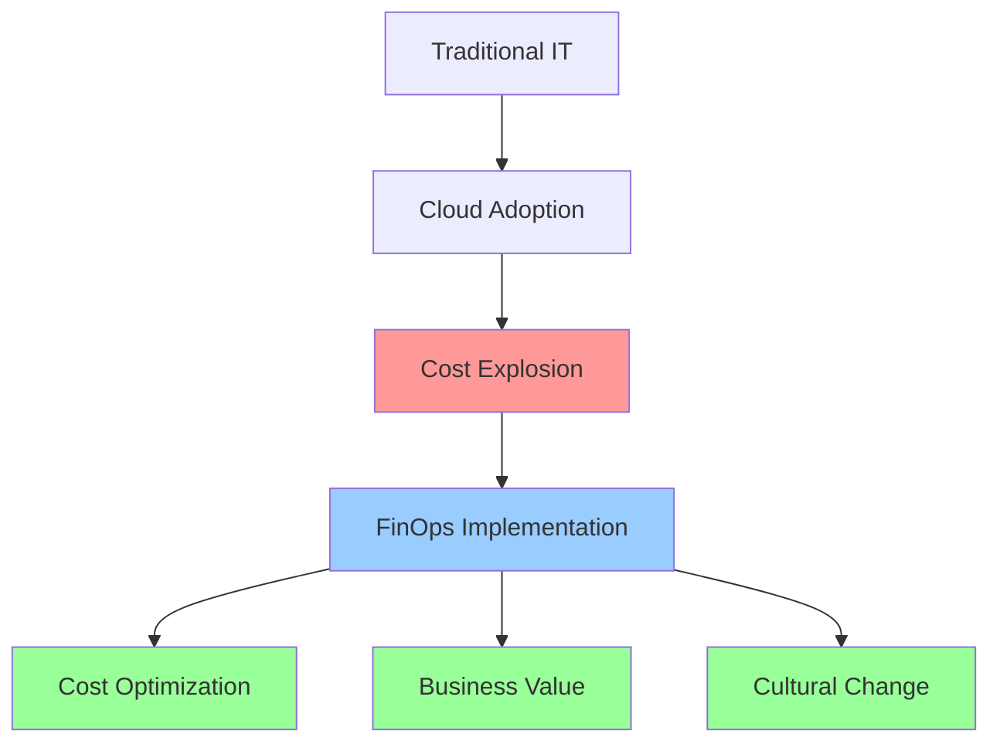

# FinOps - Cloud Financial Operations

## Introduction to FinOps

FinOps is an evolving cloud financial management discipline that enables organizations to get maximum business value by helping engineering, finance, and business teams collaborate on data-driven spending decisions. It's like having a CFO for your cloud infrastructure.

### Why FinOps Matters in 2025

Cloud spending is projected to hit $723.4 billion in 2025, with approximately 35% being wasted on inefficient practices. Organizations implementing FinOps practices can save up to 40% of their cloud costs while maintaining or improving performance.



## 📚 Comprehensive FinOps Guide

For detailed FinOps implementation, tools, strategies, and best practices, check out our dedicated **FinOps Playbook**:

🔗 **[FinOps Playbook Repository](https://github.com/jefrnc/finops-playbook)**

The FinOps Playbook covers:
- Complete implementation roadmaps
- Cost optimization automation scripts
- Real-world case studies and examples
- Advanced analytics and forecasting
- Tool integrations and comparisons
- Governance frameworks and policies

## The Three Pillars of FinOps

### 1. Inform (See)
Understanding cloud usage and costs through visibility and allocation.

### 2. Optimize (Save)
Right-sizing, scheduling, and purchasing optimization.

### 3. Operate (Scale)
Continuous improvement and cultural adoption.

## Quick Start Guide

### Essential FinOps Concepts for DevOps Teams

As DevOps teams, you're already familiar with automation, monitoring, and optimization. FinOps applies these same principles to cloud costs:

#### Core Principles
- **Visibility First**: Tag everything, measure everything
- **Automate Optimization**: Right-sizing, scheduling, purchasing
- **Cultural Adoption**: Make cost everyone's responsibility

#### Basic Implementation

```yaml
# Essential tagging strategy for DevOps teams
resource_tags:
  mandatory:
    Environment: [dev, staging, prod]
    Team: [platform, product, data]
    Project: [project-name]
    Owner: [team-lead-email]

  financial:
    CostCenter: [department-code]
    BudgetCode: [budget-allocation]

  operational:
    AutoShutdown: [true/false]
    BackupRequired: [true/false]
```

#### Quick Wins for DevOps

1. **Auto-shutdown dev/staging environments**
   ```bash
   # Simple auto-shutdown script
   aws ec2 stop-instances --instance-ids $(aws ec2 describe-instances \
     --filters "Name=tag:Environment,Values=dev" \
     "Name=instance-state-name,Values=running" \
     --query "Reservations[].Instances[].InstanceId" --output text)
   ```

2. **Right-size based on CloudWatch metrics**
3. **Implement spot instances for fault-tolerant workloads**
4. **Set up cost anomaly alerts**

## Integration with DevOps Practices

### Cost as Code
Integrate cost controls directly into your infrastructure code:

```hcl
# Terraform cost controls
resource "aws_instance" "app" {
  instance_type = var.environment == "prod" ? "m5.large" : "t3.medium"

  tags = {
    Environment = var.environment
    AutoShutdown = var.environment != "prod" ? "true" : "false"
    CostCenter = var.cost_center
  }
}

# Cost budget as code
resource "aws_budgets_budget" "team_budget" {
  name = "${var.team_name}-monthly-budget"
  budget_type = "COST"
  limit_amount = var.monthly_budget
  limit_unit = "USD"
  time_unit = "MONTHLY"

  cost_filters {
    tag {
      key = "Team"
      values = [var.team_name]
    }
  }
}
```

### CI/CD Cost Gates
Add cost estimation to your deployment pipeline:

```yaml
# GitHub Actions cost estimation
- name: Estimate Infrastructure Costs
  uses: infracost/infracost-gh-action@v1
  with:
    path: terraform/
    fail_on_cost_increase: true
    percentage_threshold: 20
```

---

## Next Steps

For comprehensive FinOps implementation including:
- Advanced cost optimization strategies
- ML-powered anomaly detection
- Executive dashboards and reporting
- Detailed automation scripts
- Enterprise governance frameworks

Visit our dedicated **[FinOps Playbook](https://github.com/jefrnc/finops-playbook)** for complete implementation guides and real-world examples.