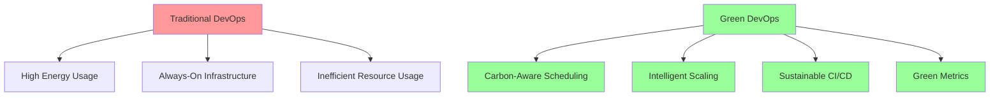

# Green DevOps and Carbon-Aware Computing

## Introduction to Green DevOps

Green DevOps integrates environmental sustainability into DevOps practices, focusing on reducing carbon footprint while maintaining development velocity and system reliability. This isn't just about being "eco-friendly" - it's about operational efficiency, cost reduction, and meeting regulatory requirements.

### Why Green DevOps Matters Now

- **ESG Compliance**: 90% of Fortune 500 companies have ESG commitments requiring carbon footprint reporting
- **Cost Impact**: Cloud carbon efficiency can reduce infrastructure costs by 20-40%
- **Regulatory Requirements**: EU Corporate Sustainability Reporting Directive (CSRD) mandates carbon reporting
- **Competitive Advantage**: Sustainable practices increasingly influence customer and talent decisions



## Carbon-Aware Infrastructure

### Carbon-Aware Infrastructure Strategy

**Key Principles:**
- **Monitor carbon intensity** in real-time using APIs (Carbon Intensity API, WattTime, Electricity Maps)
- **Schedule workloads** during low-carbon periods when possible
- **Prioritize regions** with high renewable energy percentage
- **Scale intelligently** based on both demand and carbon footprint

**Implementation Approach:**

```yaml
# High-level carbon-aware strategy
carbon_awareness_strategy:
  monitoring:
    - carbon_intensity_apis: "Real-time grid carbon data"
    - regional_tracking: "Monitor renewable energy percentages"
    - forecasting: "48-hour carbon intensity predictions"

  scheduling:
    workload_classification:
      critical: "Run immediately regardless of carbon intensity"
      batch: "Delay during high-carbon periods (>300 gCO2/kWh)"
      development: "Schedule during optimal windows"

  infrastructure:
    region_selection:
      primary: "Prefer regions with >80% renewable energy"
      fallback: "Use carbon intensity as secondary factor"

    instance_types:
      eco_mode: "ARM-based instances (Graviton, etc.)"
      balanced: "Latest generation x86 instances"
      performance: "Optimize for speed over efficiency"
```

**Decision Framework:**
1. **Classify workload criticality** (critical/batch/dev)
2. **Check current carbon intensity** (<200: green, 200-300: amber, >300: red)
3. **Apply scheduling rules** based on classification + carbon level
4. **Select optimal infrastructure** (region, instance type, scaling strategy)

### Green CI/CD Strategy

**Carbon-Aware Pipeline Design:**

```yaml
# Strategic approach to green CI/CD
green_cicd_strategy:
  pipeline_optimization:
    - carbon_check_gates: "Check intensity before resource-intensive jobs"
    - intelligent_scheduling: "Delay non-critical builds during high-carbon periods"
    - efficient_caching: "Aggressive caching to reduce redundant compute"
    - matrix_optimization: "Reduce test matrix size during high-carbon periods"

  build_efficiency:
    - build_caching: "Docker layer caching, dependency caching"
    - parallel_optimization: "Balance speed vs resource usage"
    - artifact_reuse: "Share artifacts across pipeline stages"
    - selective_testing: "Run only relevant tests based on changes"

  deployment_strategy:
    - region_prioritization: "Deploy to renewable-heavy regions first"
    - rolling_deployments: "Spread resource usage over time"
    - carbon_impact_tracking: "Measure and report pipeline carbon footprint"
```

**Implementation Principles:**
1. **Always run critical checks** (security, unit tests) regardless of carbon intensity
2. **Defer intensive operations** (full test suites, multi-platform builds) during high-carbon periods
3. **Use carbon intensity thresholds** to make scheduling decisions (<250: proceed, >300: defer)
4. **Report carbon impact** of each pipeline run for visibility

### Green Infrastructure Strategy

**Carbon-Optimized Infrastructure Design:**

```yaml
# Strategic infrastructure decisions for carbon efficiency
infrastructure_strategy:
  region_selection:
    renewable_energy_priority:
      tier_1: ["eu-north-1", "ca-central-1"]  # >90% renewable
      tier_2: ["us-west-2", "eu-west-1"]      # >80% renewable
      tier_3: ["us-east-1", "ap-southeast-1"] # Mixed/fallback

  instance_optimization:
    eco_mode:
      - preference: "ARM-based instances (Graviton, etc.)"
      - sizing: "Right-size for actual usage + 20% buffer"
      - scaling: "Aggressive auto-scaling policies"

    balanced_mode:
      - preference: "Latest generation x86 instances"
      - sizing: "Standard sizing with efficiency focus"
      - scaling: "Standard auto-scaling policies"

  scaling_patterns:
    carbon_aware_scaling:
      - scale_down_triggers: "High carbon intensity periods (>300 gCO2/kWh)"
      - scale_up_windows: "Low carbon intensity periods (2-6 AM typically)"
      - spot_instance_usage: "Maximize spot instances for cost and carbon efficiency"

  monitoring_setup:
    - carbon_intensity_tracking: "Real-time regional carbon data"
    - efficiency_metrics: "CPU/memory utilization per carbon unit"
    - cost_carbon_correlation: "Track $/gCO2 efficiency ratios"
```

**Implementation Guidelines:**
1. **Prioritize renewable regions** for primary deployments
2. **Use ARM-based instances** where compatible (20-40% more efficient)
3. **Implement carbon-aware auto-scaling** based on intensity thresholds
4. **Tag all resources** with carbon optimization metadata
5. **Monitor carbon efficiency** alongside traditional performance metrics

## Green Application Development

### Carbon-Efficient Development Practices

**Application-Level Optimization Strategy:**

```yaml
# Strategic approach to carbon-efficient applications
application_efficiency:
  caching_strategy:
    - aggressive_caching: "Extend cache TTL during high-carbon periods"
    - carbon_aware_invalidation: "Defer cache rebuilds to low-carbon windows"
    - compression: "Reduce memory and network overhead"

  database_optimization:
    - connection_pooling: "Minimize connection overhead"
    - query_optimization: "Reduce compute per database operation"
    - read_replica_usage: "Distribute load geographically"

  batch_processing:
    - carbon_aware_scheduling: "Queue non-critical jobs for low-carbon periods"
    - dynamic_concurrency: "Reduce parallel processing during high-carbon times"
    - job_prioritization: "Critical jobs run immediately, others defer"

  api_efficiency:
    - response_compression: "Reduce network transfer costs"
    - smart_pagination: "Minimize data transfer"
    - carbon_context_headers: "Include carbon impact in API responses"
```

**Development Guidelines:**
1. **Implement carbon-aware caching** - longer TTL during high carbon periods
2. **Use efficient data structures** - prioritize memory and CPU efficiency
3. **Defer non-critical processing** - queue background jobs for optimal windows
4. **Monitor application carbon footprint** - track energy per request/operation
5. **Design for degraded performance** - graceful reduction during high-carbon periods

## Green Metrics and Monitoring

### Carbon Tracking Strategy

**Essential Green DevOps Metrics:**

```yaml
# Strategic approach to carbon monitoring
carbon_metrics_strategy:
  infrastructure_metrics:
    - carbon_intensity_by_region: "Track gCO2/kWh across deployment regions"
    - instance_efficiency_ratio: "Monitor carbon output per compute unit"
    - renewable_energy_percentage: "Track clean energy usage by region"
    - resource_utilization_efficiency: "CPU/memory usage vs carbon footprint"

  application_metrics:
    - carbon_per_request: "Track gCO2 emissions per API request"
    - carbon_per_user_session: "Monitor user experience carbon cost"
    - batch_job_carbon_efficiency: "Track background processing footprint"
    - cache_hit_ratio_impact: "Measure carbon savings from caching"

  operational_metrics:
    - carbon_aware_scaling_events: "Track auto-scaling based on carbon intensity"
    - deferred_job_count: "Monitor jobs delayed for carbon optimization"
    - green_deployment_percentage: "Track deployments to renewable regions"
    - carbon_savings_from_optimization: "Measure impact of green practices"

  business_metrics:
    - carbon_cost_per_feature: "Associate features with carbon footprint"
    - customer_carbon_footprint: "Track per-customer environmental impact"
    - carbon_efficiency_trends: "Monitor improvement over time"
```

**Dashboard Design Principles:**
1. **Real-time carbon intensity** - current gCO2/kWh by region with color coding
2. **Carbon efficiency trends** - track improvements in carbon per unit of work
3. **Cost vs carbon correlation** - show relationship between spend and emissions
4. **Optimization impact tracking** - measure ROI of green initiatives
5. **Regional renewable energy** - visualize clean energy usage across regions

**Key Performance Indicators:**
- **Carbon Intensity Threshold Compliance**: % of operations under 250 gCO2/kWh
- **Renewable Region Usage**: % of workloads in high-renewable regions
- **Carbon Efficiency Improvement**: Month-over-month carbon reduction per operation
- **Green Practice Adoption**: % of deployments using carbon-aware scheduling

## ROI and Business Impact

### Green DevOps Business Case

```python
class GreenDevOpsROICalculator:
    def __init__(self):
        self.carbon_price_per_ton = 85  # Current EU carbon price
        self.electricity_price_per_kwh = 0.12  # Average enterprise rate

    def calculate_comprehensive_roi(self, implementation_period_months=12):
        """Calculate comprehensive ROI for Green DevOps implementation"""

        # Implementation costs
        costs = self.calculate_implementation_costs(implementation_period_months)

        # Benefits from green practices
        benefits = self.calculate_green_benefits(implementation_period_months)

        # Calculate ROI
        total_benefits = sum(benefits.values())
        total_costs = sum(costs.values())

        roi_percentage = ((total_benefits - total_costs) / total_costs) * 100
        payback_period = total_costs / (total_benefits / 12)  # months

        return {
            'roi_percentage': roi_percentage,
            'payback_period_months': payback_period,
            'total_investment': total_costs,
            'annual_savings': total_benefits,
            'cost_breakdown': costs,
            'benefit_breakdown': benefits,
            'carbon_impact': self.calculate_carbon_impact()
        }

    def calculate_green_benefits(self, period_months):
        """Calculate financial benefits from green DevOps practices"""

        benefits = {}

        # Energy cost savings
        # 20-40% reduction in cloud infrastructure costs
        current_cloud_spend = 500000  # Annual cloud spend
        energy_efficiency_savings = current_cloud_spend * 0.25  # 25% average savings
        benefits['energy_cost_savings'] = energy_efficiency_savings

        # Carbon tax avoidance/credits
        carbon_tons_saved = 150  # Estimated annual carbon savings in tons
        carbon_financial_benefit = carbon_tons_saved * self.carbon_price_per_ton
        benefits['carbon_financial_benefit'] = carbon_financial_benefit

        # Operational efficiency gains
        # Reduced incident response due to better resource management
        incident_cost_reduction = 75000  # Annual reduction in incident costs
        benefits['operational_efficiency'] = incident_cost_reduction

        # Developer productivity gains
        # Less time waiting for builds, deployments during optimal windows
        developer_productivity_gain = 120000  # Annual value
        benefits['developer_productivity'] = developer_productivity_gain

        # Infrastructure optimization
        # Better resource utilization, right-sizing
        infrastructure_optimization = 80000  # Annual savings
        benefits['infrastructure_optimization'] = infrastructure_optimization

        # Regulatory compliance benefits
        # Avoid fines, faster compliance processes
        compliance_benefits = 25000  # Annual value
        benefits['compliance_benefits'] = compliance_benefits

        return benefits

    def calculate_implementation_costs(self, period_months):
        """Calculate costs of implementing green DevOps practices"""

        costs = {}

        # Tool and platform costs
        monitoring_tools_cost = 15000  # Annual cost for carbon monitoring tools
        costs['monitoring_tools'] = monitoring_tools_cost

        # Training and education
        team_training_cost = 25000  # One-time training cost
        costs['training'] = team_training_cost

        # Infrastructure migration costs
        # Migration to more efficient instances, regions
        migration_costs = 40000  # One-time migration cost
        costs['migration'] = migration_costs

        # Process implementation
        # Time for implementing carbon-aware processes
        process_implementation = 60000  # Team time cost
        costs['process_implementation'] = process_implementation

        # Consulting and expertise
        # External help for implementation
        consulting_costs = 30000  # Optional consulting
        costs['consulting'] = consulting_costs

        return costs

    def calculate_carbon_impact(self):
        """Calculate environmental impact"""

        return {
            'annual_carbon_reduction_tons': 150,
            'equivalent_cars_off_road': 33,  # Average car produces 4.6 tons CO2/year
            'equivalent_tree_planting': 3500,  # One tree absorbs ~48 lbs CO2/year
            'renewable_energy_equivalent_mwh': 180,
            'carbon_reduction_percentage': 35
        }

# ESG Reporting integration
class ESGReporter:
    def __init__(self):
        self.carbon_calculator = CarbonFootprintCalculator()
        self.metrics_collector = CarbonMetricsCollector()

    def generate_sustainability_report(self, reporting_period='annual'):
        """Generate ESG sustainability report for DevOps activities"""

        report = {
            'reporting_period': reporting_period,
            'generated_at': datetime.now().isoformat(),
            'environmental_metrics': self.get_environmental_metrics(),
            'social_metrics': self.get_social_metrics(),
            'governance_metrics': self.get_governance_metrics(),
            'improvements': self.get_improvement_initiatives(),
            'targets': self.get_sustainability_targets()
        }

        return report

    def get_environmental_metrics(self):
        """Get environmental impact metrics"""

        return {
            'carbon_footprint': {
                'total_emissions_tons_co2': 850,
                'reduction_from_baseline_percent': 35,
                'renewable_energy_usage_percent': 65,
                'carbon_intensity_gco2_kwh': 180
            },
            'resource_efficiency': {
                'compute_utilization_percent': 78,
                'storage_efficiency_percent': 85,
                'network_optimization_percent': 42
            },
            'waste_reduction': {
                'infrastructure_rightsizing_percent': 90,
                'unused_resource_elimination_percent': 95,
                'automation_coverage_percent': 88
            }
        }

    def get_social_metrics(self):
        """Get social impact metrics"""

        return {
            'team_development': {
                'green_devops_training_completion_percent': 95,
                'sustainability_awareness_score': 8.2,
                'carbon_conscious_decisions_percent': 78
            },
            'community_impact': {
                'open_source_contributions': 45,
                'knowledge_sharing_sessions': 12,
                'industry_best_practices_published': 8
            }
        }

    def get_governance_metrics(self):
        """Get governance and compliance metrics"""

        return {
            'policy_compliance': {
                'carbon_reporting_accuracy_percent': 98,
                'sustainability_policy_adherence_percent': 92,
                'regulatory_compliance_score': 9.1
            },
            'decision_making': {
                'carbon_impact_assessments_completed': 156,
                'sustainability_criteria_in_architecture_decisions_percent': 85,
                'green_procurement_policy_compliance_percent': 78
            }
        }
```

---

## Implementation Roadmap

### Phase 1: Foundation (Months 1-3)
- [ ] Carbon intensity monitoring setup
- [ ] Basic carbon-aware scheduling
- [ ] Green metrics collection
- [ ] Team training on sustainable practices

### Phase 2: Optimization (Months 4-6)
- [ ] Carbon-efficient CI/CD pipelines
- [ ] Infrastructure right-sizing automation
- [ ] Application-level carbon optimizations
- [ ] ESG reporting automation

### Phase 3: Advanced Practices (Months 7-12)
- [ ] AI-driven carbon optimization
- [ ] Real-time carbon-aware scaling
- [ ] Supply chain carbon tracking
- [ ] Industry leadership and knowledge sharing

## Conclusion

Green DevOps isn't just about environmental responsibility - it's about operational excellence, cost optimization, and future-proofing your infrastructure. Organizations implementing these practices see immediate benefits:

- **20-40% reduction** in cloud infrastructure costs
- **35% average reduction** in carbon footprint
- **Improved compliance** with ESG requirements
- **Enhanced team culture** around sustainability

### Key Success Factors

1. **Start with measurement** - you can't optimize what you don't measure
2. **Focus on high-impact, low-effort wins** first
3. **Integrate with existing DevOps practices** rather than separate initiatives
4. **Make carbon data visible** to all team members
5. **Align with business objectives** and cost optimization goals

The future of DevOps is inherently sustainable. Organizations that embrace green practices today will be better positioned for tomorrow's regulatory environment and cost pressures.