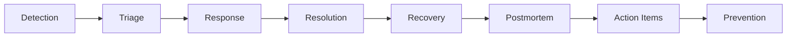

# Incident Management and Postmortems

## Introduction

Incident management is the process of responding to unplanned interruptions or reductions in quality of IT services. A strong incident management culture, combined with blameless postmortems, transforms failures into learning opportunities.

## The Incident Lifecycle



## Incident Response Framework

### Incident Definition

An incident is an event that:
- Causes service degradation or outage
- Impacts customers or revenue
- Requires immediate human intervention
- Violates SLAs or SLOs
- Poses security or compliance risks

### Incident Severity Levels

| Severity | Impact | Response Time | Escalation | Examples |
|----------|--------|---------------|------------|----------|
| **SEV-1** | Critical business impact | < 15 min | Immediate page, all hands | Complete outage, data loss, security breach |
| **SEV-2** | Major service degradation | < 30 min | Page on-call, notify management | Partial outage, significant performance degradation |
| **SEV-3** | Minor service issues | < 2 hours | Notify on-call | Feature unavailable, minor performance issues |
| **SEV-4** | Low impact | < 24 hours | Ticket | Cosmetic issues, non-critical bugs |
| **SEV-5** | No immediate impact | Best effort | Track only | Technical debt, minor improvements |

### Severity Determination Matrix

```python
class SeverityCalculator:
    def __init__(self):
        self.criteria = {
            'user_impact': {
                'all_users': 5,
                'majority': 4,
                'significant_subset': 3,
                'small_subset': 2,
                'individual': 1
            },
            'revenue_impact': {
                'complete_loss': 5,
                'major_loss': 4,
                'moderate_loss': 3,
                'minor_loss': 2,
                'no_loss': 1
            },
            'data_integrity': {
                'data_loss': 5,
                'data_corruption': 4,
                'data_inconsistency': 3,
                'data_delay': 2,
                'no_impact': 1
            },
            'security': {
                'active_breach': 5,
                'vulnerability_exploited': 4,
                'vulnerability_exposed': 3,
                'potential_vulnerability': 2,
                'no_security_impact': 1
            }
        }
    
    def calculate_severity(self, impacts: dict) -> int:
        """Calculate incident severity based on multiple factors"""
        scores = []
        
        for category, level in impacts.items():
            if category in self.criteria and level in self.criteria[category]:
                scores.append(self.criteria[category][level])
        
        if not scores:
            return 5  # Default to lowest severity
        
        max_score = max(scores)
        
        # Map score to severity
        if max_score == 5:
            return 1  # SEV-1
        elif max_score == 4:
            return 2  # SEV-2
        elif max_score == 3:
            return 3  # SEV-3
        elif max_score == 2:
            return 4  # SEV-4
        else:
            return 5  # SEV-5
    
    def get_response_requirements(self, severity: int) -> dict:
        """Get response requirements based on severity"""
        requirements = {
            1: {
                'response_time': 15,
                'notification': ['page_all', 'executive_escalation'],
                'incident_commander': True,
                'status_page': True,
                'customer_comms': True
            },
            2: {
                'response_time': 30,
                'notification': ['page_oncall', 'manager_notification'],
                'incident_commander': True,
                'status_page': True,
                'customer_comms': False
            },
            3: {
                'response_time': 120,
                'notification': ['notify_oncall'],
                'incident_commander': False,
                'status_page': False,
                'customer_comms': False
            },
            4: {
                'response_time': 1440,
                'notification': ['ticket'],
                'incident_commander': False,
                'status_page': False,
                'customer_comms': False
            },
            5: {
                'response_time': None,
                'notification': ['backlog'],
                'incident_commander': False,
                'status_page': False,
                'customer_comms': False
            }
        }
        
        return requirements.get(severity, requirements[5])
```

## Incident Response Process

### 1. Detection

Detection methods:
- **Automated Monitoring**: Alerts from monitoring systems
- **Customer Reports**: Support tickets, social media
- **Internal Discovery**: Engineers noticing issues
- **Synthetic Monitoring**: Automated user journey tests

#### Alert Quality Framework

```python
from dataclasses import dataclass
from typing import List, Optional
from datetime import datetime

@dataclass
class Alert:
    """Alert data structure"""
    id: str
    title: str
    description: str
    severity: int
    service: str
    timestamp: datetime
    metrics: dict
    runbook_url: Optional[str] = None
    
class AlertQualityAnalyzer:
    def __init__(self):
        self.alert_history = []
        
    def evaluate_alert(self, alert: Alert) -> dict:
        """Evaluate alert quality"""
        quality_score = 0
        issues = []
        
        # Check for actionable information
        if alert.description and len(alert.description) > 50:
            quality_score += 20
        else:
            issues.append("Description too brief")
        
        # Check for runbook
        if alert.runbook_url:
            quality_score += 25
        else:
            issues.append("Missing runbook")
        
        # Check for metrics context
        if alert.metrics and len(alert.metrics) >= 3:
            quality_score += 20
        else:
            issues.append("Insufficient metrics context")
        
        # Check for clear title
        if alert.title and not alert.title.startswith("ALERT"):
            quality_score += 15
        else:
            issues.append("Generic alert title")
        
        # Check for service identification
        if alert.service:
            quality_score += 20
        else:
            issues.append("Service not identified")
        
        return {
            'quality_score': quality_score,
            'grade': self._calculate_grade(quality_score),
            'issues': issues,
            'actionable': quality_score >= 60
        }
    
    def _calculate_grade(self, score: int) -> str:
        if score >= 90:
            return 'A'
        elif score >= 75:
            return 'B'
        elif score >= 60:
            return 'C'
        elif score >= 40:
            return 'D'
        else:
            return 'F'
    
    def calculate_alert_fatigue(self, 
                              alerts: List[Alert], 
                              time_window_hours: int = 24) -> dict:
        """Calculate alert fatigue metrics"""
        from collections import defaultdict
        
        # Group alerts by service
        by_service = defaultdict(list)
        for alert in alerts:
            by_service[alert.service].append(alert)
        
        fatigue_analysis = {}
        for service, service_alerts in by_service.items():
            alert_count = len(service_alerts)
            
            # Calculate noise ratio (non-actionable alerts)
            non_actionable = sum(
                1 for a in service_alerts 
                if self.evaluate_alert(a)['quality_score'] < 60
            )
            
            noise_ratio = (non_actionable / alert_count * 100) if alert_count > 0 else 0
            
            fatigue_analysis[service] = {
                'total_alerts': alert_count,
                'alerts_per_hour': alert_count / time_window_hours,
                'noise_ratio': noise_ratio,
                'fatigue_level': self._calculate_fatigue_level(
                    alert_count / time_window_hours, noise_ratio
                )
            }
        
        return fatigue_analysis
    
    def _calculate_fatigue_level(self, alerts_per_hour: float, noise_ratio: float) -> str:
        if alerts_per_hour > 5 or noise_ratio > 50:
            return 'CRITICAL'
        elif alerts_per_hour > 2 or noise_ratio > 30:
            return 'HIGH'
        elif alerts_per_hour > 1 or noise_ratio > 20:
            return 'MEDIUM'
        else:
            return 'LOW'
```

### 2. Triage

The triage phase determines severity, impact, and response requirements.

#### Triage Checklist

```yaml
# triage-checklist.yaml
triage_checklist:
  immediate_assessment:
    - question: "Is the service completely down?"
      yes_action: "Declare SEV-1"
    - question: "Are customers actively impacted?"
      yes_action: "Check scope of impact"
    - question: "Is there data loss or corruption?"
      yes_action: "Escalate to data team"
    - question: "Is this a security incident?"
      yes_action: "Engage security team"
  
  impact_assessment:
    - metric: "Error rate"
      threshold: "> 10%"
      severity_modifier: "+1"
    - metric: "Response time"
      threshold: "> 5s"
      severity_modifier: "+0"
    - metric: "Active users affected"
      threshold: "> 1000"
      severity_modifier: "+1"
  
  resource_needs:
    - role: "Incident Commander"
      required_for: ["SEV-1", "SEV-2"]
    - role: "Communications Lead"
      required_for: ["SEV-1", "SEV-2"]
    - role: "Technical Lead"
      required_for: ["SEV-1", "SEV-2", "SEV-3"]
    - role: "Scribe"
      required_for: ["SEV-1"]
```

### 3. Response

#### Incident Command System (ICS)

```python
from enum import Enum
from typing import List, Optional
from datetime import datetime

class IncidentRole(Enum):
    INCIDENT_COMMANDER = "incident_commander"
    TECHNICAL_LEAD = "technical_lead"
    COMMUNICATIONS_LEAD = "communications_lead"
    SCRIBE = "scribe"
    SUBJECT_MATTER_EXPERT = "sme"

class IncidentTeam:
    def __init__(self, incident_id: str):
        self.incident_id = incident_id
        self.roles = {}
        self.timeline = []
        self.status = "ACTIVE"
        
    def assign_role(self, person: str, role: IncidentRole):
        """Assign a role to a team member"""
        self.roles[role] = person
        self.log_event(f"{person} assigned as {role.value}")
    
    def log_event(self, event: str, important: bool = False):
        """Log incident timeline event"""
        self.timeline.append({
            'timestamp': datetime.now(),
            'event': event,
            'important': important
        })
    
    def change_status(self, new_status: str):
        """Change incident status"""
        old_status = self.status
        self.status = new_status
        self.log_event(f"Status changed from {old_status} to {new_status}", True)
    
    def get_timeline_summary(self) -> str:
        """Generate timeline summary"""
        summary = []
        for entry in self.timeline:
            timestamp = entry['timestamp'].strftime('%H:%M:%S')
            marker = "🔴" if entry['important'] else "⚪"
            summary.append(f"{timestamp} {marker} {entry['event']}")
        return "\n".join(summary)

class IncidentCommander:
    def __init__(self, name: str):
        self.name = name
        self.active_incident = None
        
    def take_command(self, incident: IncidentTeam):
        """Take command of an incident"""
        self.active_incident = incident
        incident.assign_role(self.name, IncidentRole.INCIDENT_COMMANDER)
        
    def delegate_task(self, task: str, assignee: str) -> dict:
        """Delegate a task during incident"""
        if not self.active_incident:
            raise ValueError("No active incident")
        
        task_record = {
            'task': task,
            'assignee': assignee,
            'assigned_at': datetime.now(),
            'status': 'IN_PROGRESS'
        }
        
        self.active_incident.log_event(f"Task '{task}' assigned to {assignee}")
        return task_record
    
    def declare_resolution(self):
        """Declare incident resolved"""
        if not self.active_incident:
            raise ValueError("No active incident")
        
        self.active_incident.change_status("RESOLVED")
        self.active_incident.log_event("Incident declared resolved", True)
```

#### Communication Templates

```python
class IncidentCommunication:
    def __init__(self):
        self.templates = {
            'initial': """
🚨 INCIDENT DECLARED - {severity}
Service: {service}
Impact: {impact}
Status Page: {status_url}
Incident Channel: {channel}
Commander: {commander}
""",
            'update': """
📊 INCIDENT UPDATE - {incident_id}
Time: {timestamp}
Status: {status}
Progress: {progress}
Next Update: {next_update}
""",
            'resolution': """
✅ INCIDENT RESOLVED - {incident_id}
Duration: {duration}
Root Cause: {root_cause}
Customer Impact: {customer_impact}
Postmortem: Scheduled for {postmortem_date}
""",
            'customer_facing': """
We are currently experiencing {issue_description}.
Our team is actively working on a resolution.
Current Status: {status}
Estimated Resolution: {eta}
Updates: {status_page_url}
"""
        }
    
    def generate_message(self, 
                        template_type: str, 
                        variables: dict) -> str:
        """Generate communication message"""
        template = self.templates.get(template_type)
        if not template:
            raise ValueError(f"Unknown template type: {template_type}")
        
        return template.format(**variables)
    
    def get_stakeholder_list(self, severity: int) -> List[str]:
        """Get stakeholder notification list based on severity"""
        stakeholders = {
            1: ['executives', 'all-engineering', 'support', 'sales', 'customers'],
            2: ['engineering-managers', 'on-call', 'support-leads'],
            3: ['on-call', 'team-channel'],
            4: ['team-channel'],
            5: []
        }
        
        return stakeholders.get(severity, [])
```

### 4. Resolution and Recovery

#### Rollback Strategies

```python
import subprocess
from typing import Optional

class RollbackManager:
    def __init__(self):
        self.rollback_strategies = {
            'kubernetes': self.rollback_kubernetes,
            'database': self.rollback_database,
            'feature_flag': self.rollback_feature_flag,
            'cdn': self.rollback_cdn,
            'dns': self.rollback_dns
        }
    
    def execute_rollback(self, 
                        strategy: str, 
                        target: str,
                        version: Optional[str] = None) -> dict:
        """Execute rollback strategy"""
        if strategy not in self.rollback_strategies:
            raise ValueError(f"Unknown rollback strategy: {strategy}")
        
        result = self.rollback_strategies[strategy](target, version)
        return result
    
    def rollback_kubernetes(self, deployment: str, version: Optional[str] = None):
        """Rollback Kubernetes deployment"""
        if version:
            cmd = f"kubectl rollout undo deployment/{deployment} --to-revision={version}"
        else:
            cmd = f"kubectl rollout undo deployment/{deployment}"
        
        result = subprocess.run(cmd, shell=True, capture_output=True)
        
        return {
            'strategy': 'kubernetes',
            'target': deployment,
            'success': result.returncode == 0,
            'output': result.stdout.decode(),
            'verification_cmd': f"kubectl rollout status deployment/{deployment}"
        }
    
    def rollback_database(self, migration: str, version: Optional[str] = None):
        """Rollback database migration"""
        # Example using a migration tool
        if version:
            cmd = f"migrate -path ./migrations -database $DATABASE_URL down {version}"
        else:
            cmd = f"migrate -path ./migrations -database $DATABASE_URL down 1"
        
        return {
            'strategy': 'database',
            'target': migration,
            'success': True,
            'warning': 'Ensure data integrity before rollback',
            'verification_query': 'SELECT version FROM schema_migrations ORDER BY version DESC LIMIT 1;'
        }
    
    def rollback_feature_flag(self, flag: str, version: Optional[str] = None):
        """Disable feature flag"""
        # Example using LaunchDarkly or similar
        return {
            'strategy': 'feature_flag',
            'target': flag,
            'success': True,
            'action': f"Feature flag '{flag}' disabled",
            'instant': True
        }
    
    def rollback_cdn(self, distribution: str, version: Optional[str] = None):
        """Rollback CDN configuration"""
        return {
            'strategy': 'cdn',
            'target': distribution,
            'success': True,
            'action': 'CDN cache purged and configuration reverted',
            'propagation_time': '5-10 minutes'
        }
    
    def rollback_dns(self, record: str, version: Optional[str] = None):
        """Rollback DNS changes"""
        return {
            'strategy': 'dns',
            'target': record,
            'success': True,
            'action': f"DNS record '{record}' reverted",
            'propagation_time': '5-60 minutes depending on TTL'
        }

class RecoveryVerification:
    def __init__(self):
        self.checks = []
        
    def add_check(self, name: str, check_fn, expected_result):
        """Add a recovery verification check"""
        self.checks.append({
            'name': name,
            'function': check_fn,
            'expected': expected_result
        })
    
    def run_verification(self) -> dict:
        """Run all verification checks"""
        results = {
            'passed': [],
            'failed': [],
            'summary': None
        }
        
        for check in self.checks:
            try:
                result = check['function']()
                if result == check['expected']:
                    results['passed'].append(check['name'])
                else:
                    results['failed'].append({
                        'name': check['name'],
                        'expected': check['expected'],
                        'actual': result
                    })
            except Exception as e:
                results['failed'].append({
                    'name': check['name'],
                    'error': str(e)
                })
        
        results['summary'] = {
            'total': len(self.checks),
            'passed': len(results['passed']),
            'failed': len(results['failed']),
            'success': len(results['failed']) == 0
        }
        
        return results
```

## Blameless Postmortems

### Postmortem Philosophy

Blameless postmortems focus on understanding systemic failures rather than assigning blame to individuals. The goal is learning and prevention, not punishment.

### Postmortem Template

```markdown
# Incident Postmortem: [Incident ID]

## Incident Summary
- **Date**: [YYYY-MM-DD]
- **Duration**: [X hours Y minutes]
- **Severity**: [SEV-X]
- **Services Affected**: [List of services]
- **Customer Impact**: [Number of customers, revenue impact]
- **Incident Commander**: [Name]

## Timeline
| Time (UTC) | Event |
|------------|-------|
| HH:MM | Initial alert triggered |
| HH:MM | Incident declared |
| HH:MM | Root cause identified |
| HH:MM | Fix deployed |
| HH:MM | Incident resolved |

## Impact Analysis
### Customer Impact
- Number of affected users:
- Types of errors experienced:
- Business impact:

### Technical Impact
- Services degraded:
- Data loss/corruption:
- SLA/SLO violations:

## Root Cause Analysis

### What Happened
[Detailed description of the incident]

### Why It Happened
[Root cause analysis using 5 Whys or similar technique]

### Contributing Factors
- [ ] Recent deployment
- [ ] Configuration change
- [ ] Infrastructure issue
- [ ] Dependency failure
- [ ] Traffic spike
- [ ] Other: [specify]

## Response Analysis

### What Went Well
- [List things that worked well during the incident]

### What Could Be Improved
- [List areas for improvement]

### Lucky Factors
- [Things that could have made it worse but didn't]

## Action Items
| Action | Owner | Priority | Due Date |
|--------|-------|----------|----------|
| [Action description] | [Name] | P0/P1/P2 | [Date] |

## Lessons Learned
1. [Key learning #1]
2. [Key learning #2]
3. [Key learning #3]

## Supporting Documentation
- [Link to logs]
- [Link to graphs]
- [Link to runbook]
```

### Postmortem Automation

```python
from datetime import datetime, timedelta
from typing import List, Dict, Optional
import json

class PostmortemGenerator:
    def __init__(self, incident_id: str):
        self.incident_id = incident_id
        self.data = {
            'incident_id': incident_id,
            'created_at': datetime.now(),
            'timeline': [],
            'metrics': {},
            'action_items': []
        }
    
    def import_incident_data(self, incident_data: dict):
        """Import data from incident management system"""
        self.data.update({
            'severity': incident_data.get('severity'),
            'duration': incident_data.get('duration'),
            'services': incident_data.get('affected_services', []),
            'commander': incident_data.get('incident_commander')
        })
    
    def add_timeline_event(self, timestamp: datetime, event: str, important: bool = False):
        """Add event to timeline"""
        self.data['timeline'].append({
            'timestamp': timestamp.isoformat(),
            'event': event,
            'important': important
        })
    
    def calculate_metrics(self):
        """Calculate incident metrics"""
        if not self.data['timeline']:
            return
        
        events = sorted(self.data['timeline'], key=lambda x: x['timestamp'])
        
        # Time to detect (from actual incident start to alert)
        # Time to acknowledge (from alert to acknowledgment)
        # Time to resolve (from acknowledgment to resolution)
        
        self.data['metrics'] = {
            'total_duration': self._calculate_duration(),
            'customer_impact_duration': self._calculate_customer_impact(),
            'messages_sent': len([e for e in events if 'message' in e['event'].lower()]),
            'rollbacks_performed': len([e for e in events if 'rollback' in e['event'].lower()])
        }
    
    def _calculate_duration(self) -> int:
        """Calculate total incident duration in minutes"""
        if len(self.data['timeline']) < 2:
            return 0
        
        start = datetime.fromisoformat(self.data['timeline'][0]['timestamp'])
        end = datetime.fromisoformat(self.data['timeline'][-1]['timestamp'])
        return int((end - start).total_seconds() / 60)
    
    def _calculate_customer_impact(self) -> int:
        """Calculate customer impact duration"""
        # This would integrate with monitoring to determine actual customer impact
        return self._calculate_duration()  # Simplified
    
    def generate_action_items(self) -> List[Dict]:
        """Generate suggested action items based on incident"""
        action_items = []
        
        # Check for missing runbook
        if 'runbook' not in str(self.data.get('timeline', [])):
            action_items.append({
                'title': 'Create or update runbook',
                'priority': 'P1',
                'category': 'documentation'
            })
        
        # Check for monitoring gaps
        if self.data['metrics'].get('total_duration', 0) > 60:
            action_items.append({
                'title': 'Improve monitoring and alerting',
                'priority': 'P1',
                'category': 'monitoring'
            })
        
        # Check for slow recovery
        if self.data['metrics'].get('total_duration', 0) > 120:
            action_items.append({
                'title': 'Implement automated recovery',
                'priority': 'P2',
                'category': 'automation'
            })
        
        self.data['action_items'] = action_items
        return action_items
    
    def export_markdown(self) -> str:
        """Export postmortem as markdown"""
        template = """# Postmortem: {incident_id}

## Summary
- **Date**: {date}
- **Duration**: {duration} minutes
- **Severity**: SEV-{severity}

## Timeline
{timeline}

## Metrics
- Total Duration: {total_duration} minutes
- Customer Impact: {customer_impact} minutes

## Action Items
{action_items}

## Generated
This postmortem was auto-generated on {generated_date}
"""
        
        timeline_str = "\n".join([
            f"- {event['timestamp']}: {event['event']}"
            for event in self.data['timeline']
        ])
        
        action_items_str = "\n".join([
            f"- [{item['priority']}] {item['title']}"
            for item in self.data['action_items']
        ])
        
        return template.format(
            incident_id=self.incident_id,
            date=self.data['created_at'].strftime('%Y-%m-%d'),
            duration=self.data['metrics'].get('total_duration', 'Unknown'),
            severity=self.data.get('severity', 'Unknown'),
            timeline=timeline_str,
            total_duration=self.data['metrics'].get('total_duration', 'Unknown'),
            customer_impact=self.data['metrics'].get('customer_impact_duration', 'Unknown'),
            action_items=action_items_str,
            generated_date=datetime.now().strftime('%Y-%m-%d %H:%M:%S')
        )
```

## Root Cause Analysis Techniques

### The Five Whys

```python
class FiveWhysAnalysis:
    def __init__(self, problem: str):
        self.problem = problem
        self.whys = []
        self.root_cause = None
        
    def add_why(self, question: str, answer: str):
        """Add a why question and answer"""
        self.whys.append({
            'level': len(self.whys) + 1,
            'question': question,
            'answer': answer
        })
        
        # After 5 whys or when root cause is found
        if len(self.whys) >= 5 or self._is_root_cause(answer):
            self.root_cause = answer
    
    def _is_root_cause(self, answer: str) -> bool:
        """Determine if we've reached a root cause"""
        root_cause_indicators = [
            'lack of', 'absence of', 'missing', 'no process',
            'not implemented', 'never established', 'assumption'
        ]
        return any(indicator in answer.lower() for indicator in root_cause_indicators)
    
    def generate_report(self) -> dict:
        """Generate Five Whys analysis report"""
        return {
            'problem': self.problem,
            'analysis': self.whys,
            'root_cause': self.root_cause,
            'depth': len(self.whys),
            'recommendations': self._generate_recommendations()
        }
    
    def _generate_recommendations(self) -> List[str]:
        """Generate recommendations based on root cause"""
        recommendations = []
        
        if not self.root_cause:
            return ["Continue analysis to identify root cause"]
        
        if 'process' in self.root_cause.lower():
            recommendations.append("Establish or improve process documentation")
        if 'monitoring' in self.root_cause.lower():
            recommendations.append("Implement or enhance monitoring")
        if 'testing' in self.root_cause.lower():
            recommendations.append("Improve test coverage")
        if 'communication' in self.root_cause.lower():
            recommendations.append("Enhance team communication protocols")
        
        return recommendations

# Example usage
analysis = FiveWhysAnalysis("Website was down for 2 hours")
analysis.add_why(
    "Why was the website down?",
    "The web server ran out of memory"
)
analysis.add_why(
    "Why did the server run out of memory?",
    "A memory leak in the application"
)
analysis.add_why(
    "Why was there a memory leak?",
    "Unclosed database connections"
)
analysis.add_why(
    "Why were connections not closed?",
    "Missing connection pooling configuration"
)
analysis.add_why(
    "Why was connection pooling not configured?",
    "Lack of production readiness checklist"
)
```

### Fault Tree Analysis

```python
from typing import List, Optional

class FaultTreeNode:
    def __init__(self, 
                 description: str, 
                 node_type: str = 'event',
                 probability: Optional[float] = None):
        self.description = description
        self.node_type = node_type  # 'event', 'and', 'or'
        self.probability = probability
        self.children = []
        
    def add_child(self, child: 'FaultTreeNode'):
        """Add child node"""
        self.children.append(child)
        
    def calculate_probability(self) -> float:
        """Calculate probability of this fault occurring"""
        if self.probability is not None:
            return self.probability
        
        if not self.children:
            return 0.0
        
        if self.node_type == 'and':
            # All children must fail
            prob = 1.0
            for child in self.children:
                prob *= child.calculate_probability()
            return prob
        
        elif self.node_type == 'or':
            # Any child can fail
            prob = 0.0
            for child in self.children:
                child_prob = child.calculate_probability()
                prob = prob + child_prob - (prob * child_prob)
            return prob
        
        return 0.0

class FaultTreeAnalysis:
    def __init__(self, top_event: str):
        self.root = FaultTreeNode(top_event, 'event')
        
    def build_tree(self):
        """Build the fault tree"""
        # Example: Website unavailable
        website_down = self.root
        
        # OR gate - any of these can cause the website to be down
        or_gate = FaultTreeNode("Website failure causes", 'or')
        website_down.add_child(or_gate)
        
        # Add failure modes
        server_failure = FaultTreeNode("Server failure", 'event', 0.01)
        network_failure = FaultTreeNode("Network failure", 'event', 0.005)
        app_failure = FaultTreeNode("Application failure", 'event', 0.02)
        
        or_gate.add_child(server_failure)
        or_gate.add_child(network_failure)
        or_gate.add_child(app_failure)
        
        # Application failure can have multiple causes (AND gate)
        app_and_gate = FaultTreeNode("App failure causes", 'and')
        app_failure.add_child(app_and_gate)
        
        code_bug = FaultTreeNode("Code bug", 'event', 0.1)
        high_load = FaultTreeNode("High load", 'event', 0.3)
        
        app_and_gate.add_child(code_bug)
        app_and_gate.add_child(high_load)
    
    def analyze(self) -> dict:
        """Perform fault tree analysis"""
        return {
            'top_event': self.root.description,
            'probability': self.root.calculate_probability(),
            'critical_paths': self._find_critical_paths(),
            'recommendations': self._generate_recommendations()
        }
    
    def _find_critical_paths(self, node: Optional[FaultTreeNode] = None) -> List[str]:
        """Find critical failure paths"""
        if node is None:
            node = self.root
        
        paths = []
        if not node.children:
            return [[node.description]]
        
        for child in node.children:
            child_paths = self._find_critical_paths(child)
            for path in child_paths:
                paths.append([node.description] + path)
        
        return paths
    
    def _generate_recommendations(self) -> List[str]:
        """Generate recommendations based on fault tree"""
        recommendations = []
        probability = self.root.calculate_probability()
        
        if probability > 0.1:
            recommendations.append("High failure probability - immediate action required")
        elif probability > 0.01:
            recommendations.append("Moderate failure probability - plan improvements")
        
        return recommendations
```

## Learning from Failures

### Incident Metrics and Trends

```python
import pandas as pd
import numpy as np
from datetime import datetime, timedelta
from typing import List, Dict

class IncidentAnalytics:
    def __init__(self):
        self.incidents = pd.DataFrame()
        
    def load_incidents(self, incidents: List[Dict]):
        """Load incident data for analysis"""
        self.incidents = pd.DataFrame(incidents)
        if not self.incidents.empty:
            self.incidents['timestamp'] = pd.to_datetime(self.incidents['timestamp'])
            self.incidents['duration_minutes'] = pd.to_numeric(
                self.incidents['duration_minutes'], errors='coerce'
            )
    
    def calculate_mttr(self, period_days: int = 30) -> float:
        """Calculate Mean Time To Recovery"""
        cutoff = datetime.now() - timedelta(days=period_days)
        recent = self.incidents[self.incidents['timestamp'] > cutoff]
        
        if recent.empty:
            return 0
        
        return recent['duration_minutes'].mean()
    
    def calculate_mtbf(self, period_days: int = 30) -> float:
        """Calculate Mean Time Between Failures"""
        cutoff = datetime.now() - timedelta(days=period_days)
        recent = self.incidents[self.incidents['timestamp'] > cutoff]
        
        if len(recent) < 2:
            return float('inf')
        
        recent_sorted = recent.sort_values('timestamp')
        time_diffs = recent_sorted['timestamp'].diff().dt.total_seconds() / 3600  # hours
        
        return time_diffs.mean()
    
    def identify_patterns(self) -> Dict:
        """Identify incident patterns"""
        if self.incidents.empty:
            return {}
        
        patterns = {
            'by_hour': self._pattern_by_hour(),
            'by_day_of_week': self._pattern_by_day(),
            'by_service': self._pattern_by_service(),
            'by_severity': self._pattern_by_severity(),
            'common_causes': self._identify_common_causes()
        }
        
        return patterns
    
    def _pattern_by_hour(self) -> Dict:
        """Identify patterns by hour of day"""
        self.incidents['hour'] = self.incidents['timestamp'].dt.hour
        hourly = self.incidents.groupby('hour').size()
        
        peak_hour = hourly.idxmax()
        quiet_hour = hourly.idxmin()
        
        return {
            'peak_hour': int(peak_hour),
            'quiet_hour': int(quiet_hour),
            'distribution': hourly.to_dict()
        }
    
    def _pattern_by_day(self) -> Dict:
        """Identify patterns by day of week"""
        self.incidents['day'] = self.incidents['timestamp'].dt.day_name()
        daily = self.incidents.groupby('day').size()
        
        return {
            'most_incidents': daily.idxmax(),
            'least_incidents': daily.idxmin(),
            'distribution': daily.to_dict()
        }
    
    def _pattern_by_service(self) -> Dict:
        """Identify most problematic services"""
        if 'service' not in self.incidents.columns:
            return {}
        
        service_counts = self.incidents['service'].value_counts()
        
        return {
            'most_incidents': service_counts.index[0] if len(service_counts) > 0 else None,
            'top_5': service_counts.head(5).to_dict()
        }
    
    def _pattern_by_severity(self) -> Dict:
        """Analyze severity distribution"""
        if 'severity' not in self.incidents.columns:
            return {}
        
        severity_dist = self.incidents['severity'].value_counts()
        
        return {
            'distribution': severity_dist.to_dict(),
            'high_severity_percentage': (
                len(self.incidents[self.incidents['severity'].isin([1, 2])]) / 
                len(self.incidents) * 100
            ) if len(self.incidents) > 0 else 0
        }
    
    def _identify_common_causes(self) -> List[str]:
        """Identify common root causes"""
        if 'root_cause' not in self.incidents.columns:
            return []
        
        # Simple word frequency analysis
        from collections import Counter
        import re
        
        all_causes = ' '.join(self.incidents['root_cause'].dropna().astype(str))
        words = re.findall(r'\b\w+\b', all_causes.lower())
        
        # Filter common words
        stop_words = {'the', 'a', 'an', 'and', 'or', 'but', 'in', 'on', 'at', 'to', 'for'}
        meaningful_words = [w for w in words if w not in stop_words and len(w) > 3]
        
        word_freq = Counter(meaningful_words)
        return [word for word, _ in word_freq.most_common(10)]
    
    def generate_report(self) -> Dict:
        """Generate comprehensive incident report"""
        return {
            'summary': {
                'total_incidents': len(self.incidents),
                'mttr_minutes': self.calculate_mttr(),
                'mtbf_hours': self.calculate_mtbf(),
                'period': '30 days'
            },
            'patterns': self.identify_patterns(),
            'recommendations': self._generate_recommendations()
        }
    
    def _generate_recommendations(self) -> List[str]:
        """Generate recommendations based on patterns"""
        recommendations = []
        
        mttr = self.calculate_mttr()
        if mttr > 60:
            recommendations.append(
                f"MTTR is {mttr:.0f} minutes - implement automation to reduce recovery time"
            )
        
        patterns = self.identify_patterns()
        
        if patterns.get('by_hour', {}).get('peak_hour'):
            peak = patterns['by_hour']['peak_hour']
            recommendations.append(
                f"Most incidents occur at {peak}:00 - increase monitoring during this time"
            )
        
        if patterns.get('by_service', {}).get('most_incidents'):
            service = patterns['by_service']['most_incidents']
            recommendations.append(
                f"Service '{service}' has most incidents - prioritize reliability improvements"
            )
        
        return recommendations
```

## Incident Management Tools

### Integration Examples

```python
class IncidentToolIntegration:
    def __init__(self):
        self.integrations = {
            'pagerduty': PagerDutyIntegration(),
            'slack': SlackIntegration(),
            'jira': JiraIntegration(),
            'statuspage': StatusPageIntegration()
        }
    
    def trigger_incident(self, 
                        severity: int,
                        title: str,
                        description: str) -> str:
        """Trigger incident across all tools"""
        incident_id = self._generate_incident_id()
        
        # Create PagerDuty incident
        pd_incident = self.integrations['pagerduty'].create_incident(
            title=title,
            description=description,
            severity=severity
        )
        
        # Create Slack channel
        channel = self.integrations['slack'].create_incident_channel(
            incident_id=incident_id,
            severity=severity
        )
        
        # Create JIRA ticket
        ticket = self.integrations['jira'].create_incident_ticket(
            title=title,
            description=description,
            severity=severity
        )
        
        # Update status page
        if severity <= 2:
            self.integrations['statuspage'].create_incident(
                title=title,
                impact=self._severity_to_impact(severity)
            )
        
        return incident_id
    
    def _generate_incident_id(self) -> str:
        """Generate unique incident ID"""
        from datetime import datetime
        return f"INC-{datetime.now().strftime('%Y%m%d-%H%M%S')}"
    
    def _severity_to_impact(self, severity: int) -> str:
        """Convert severity to status page impact"""
        mapping = {
            1: 'critical',
            2: 'major',
            3: 'minor',
            4: 'none',
            5: 'none'
        }
        return mapping.get(severity, 'none')

class PagerDutyIntegration:
    def create_incident(self, title: str, description: str, severity: int):
        """Create PagerDuty incident"""
        # API implementation
        return {'id': 'pd-123', 'status': 'triggered'}

class SlackIntegration:
    def create_incident_channel(self, incident_id: str, severity: int):
        """Create dedicated Slack channel"""
        channel_name = f"incident-{incident_id.lower()}"
        # API implementation
        return {'channel': channel_name, 'url': f"slack://channel?id={channel_name}"}

class JiraIntegration:
    def create_incident_ticket(self, title: str, description: str, severity: int):
        """Create JIRA ticket"""
        # API implementation
        return {'key': 'INC-123', 'url': 'https://jira.example.com/browse/INC-123'}

class StatusPageIntegration:
    def create_incident(self, title: str, impact: str):
        """Update public status page"""
        # API implementation
        return {'id': 'sp-123', 'public_url': 'https://status.example.com/incidents/123'}
```

## Runbooks and Automation

### Runbook Template

```yaml
# runbook-template.yaml
runbook:
  id: "rb-001"
  title: "High CPU Usage Response"
  description: "Steps to diagnose and resolve high CPU usage"
  
  triggers:
    - metric: "cpu_usage"
      threshold: "> 80%"
      duration: "5 minutes"
  
  prerequisites:
    - "kubectl access to production cluster"
    - "AWS console access"
    - "Datadog dashboard access"
  
  steps:
    - step: 1
      title: "Identify affected services"
      actions:
        - description: "Check CPU metrics dashboard"
          link: "https://datadog.example.com/dashboard/cpu"
        - description: "List top CPU consuming pods"
          command: |
            kubectl top pods --all-namespaces | sort -k3 -rn | head -10
    
    - step: 2
      title: "Check for traffic spike"
      actions:
        - description: "Review traffic dashboard"
          link: "https://datadog.example.com/dashboard/traffic"
        - description: "Check recent deployments"
          command: |
            kubectl get deployments --all-namespaces \
              -o jsonpath='{range .items[*]}{.metadata.namespace}{"\t"}{.metadata.name}{"\t"}{.status.conditions[?(@.type=="Progressing")].lastUpdateTime}{"\n"}{end}' \
              | sort -k3 -r | head -5
    
    - step: 3
      title: "Immediate mitigation"
      actions:
        - description: "Scale up if needed"
          command: |
            kubectl scale deployment <deployment-name> --replicas=<new-count>
        - description: "Enable rate limiting"
          command: |
            kubectl patch configmap rate-limit-config \
              -p '{"data":{"enabled":"true","rate":"1000"}}'
    
    - step: 4
      title: "Root cause investigation"
      actions:
        - description: "Check application logs"
          command: |
            kubectl logs -l app=<app-name> --tail=100
        - description: "Profile application if needed"
          link: "https://wiki.example.com/profiling-guide"
    
    - step: 5
      title: "Resolution verification"
      actions:
        - description: "Confirm CPU usage normalized"
          success_criteria: "CPU < 60% for 5 minutes"
        - description: "Check error rates"
          success_criteria: "Error rate < 0.1%"
  
  escalation:
    - after: "30 minutes"
      contact: "senior-sre-oncall"
    - after: "60 minutes"
      contact: "engineering-manager"
```

### Runbook Automation

```python
class AutomatedRunbook:
    def __init__(self, runbook_id: str, runbook_config: dict):
        self.runbook_id = runbook_id
        self.config = runbook_config
        self.execution_log = []
        
    def execute(self, context: dict) -> dict:
        """Execute automated runbook"""
        results = {
            'runbook_id': self.runbook_id,
            'started_at': datetime.now(),
            'context': context,
            'steps': []
        }
        
        for step in self.config.get('steps', []):
            step_result = self._execute_step(step, context)
            results['steps'].append(step_result)
            
            if not step_result['success']:
                results['status'] = 'failed'
                results['failed_at_step'] = step['step']
                break
        else:
            results['status'] = 'completed'
        
        results['ended_at'] = datetime.now()
        return results
    
    def _execute_step(self, step: dict, context: dict) -> dict:
        """Execute a single runbook step"""
        step_result = {
            'step': step['step'],
            'title': step['title'],
            'actions': []
        }
        
        for action in step.get('actions', []):
            if 'command' in action:
                result = self._execute_command(action['command'], context)
            elif 'script' in action:
                result = self._execute_script(action['script'], context)
            else:
                result = {'status': 'skipped', 'reason': 'Manual action required'}
            
            step_result['actions'].append({
                'description': action.get('description'),
                'result': result
            })
        
        step_result['success'] = all(
            a['result'].get('status') != 'failed' 
            for a in step_result['actions']
        )
        
        return step_result
    
    def _execute_command(self, command: str, context: dict) -> dict:
        """Execute shell command"""
        import subprocess
        
        # Substitute variables from context
        for key, value in context.items():
            command = command.replace(f'<{key}>', str(value))
        
        try:
            result = subprocess.run(
                command,
                shell=True,
                capture_output=True,
                timeout=300
            )
            
            return {
                'status': 'success' if result.returncode == 0 else 'failed',
                'output': result.stdout.decode(),
                'error': result.stderr.decode(),
                'return_code': result.returncode
            }
        except subprocess.TimeoutExpired:
            return {
                'status': 'failed',
                'error': 'Command timed out after 5 minutes'
            }
        except Exception as e:
            return {
                'status': 'failed',
                'error': str(e)
            }
    
    def _execute_script(self, script_path: str, context: dict) -> dict:
        """Execute Python script"""
        # Implementation for executing Python scripts
        pass
```

## Best Practices

### Incident Management Best Practices

1. **Clear Severity Definitions**: Everyone should understand severity levels
2. **Role Clarity**: Define incident roles before incidents occur
3. **Communication Protocols**: Establish clear communication channels
4. **Regular Drills**: Practice incident response regularly
5. **Automation**: Automate repetitive incident tasks
6. **Documentation**: Keep runbooks and contact lists updated
7. **Metrics Tracking**: Measure MTTR, MTBF, and incident frequency
8. **Continuous Improvement**: Regular review and improvement of processes

### Postmortem Best Practices

1. **Blameless Culture**: Focus on systems, not individuals
2. **Timely Completion**: Complete postmortems within 48-72 hours
3. **Wide Participation**: Include all stakeholders
4. **Action Item Follow-up**: Track and complete action items
5. **Knowledge Sharing**: Share learnings across the organization
6. **Template Consistency**: Use standardized templates
7. **Metrics Integration**: Link to monitoring and metrics
8. **Public Postmortems**: Consider sharing externally when appropriate

## Conclusion

Effective incident management and blameless postmortems are crucial for building reliable systems and learning from failures. Key takeaways:

- **Preparation is key**: Have processes, roles, and tools ready before incidents
- **Communication matters**: Clear, timely communication reduces incident impact
- **Learn from everything**: Every incident is a learning opportunity
- **Automate responses**: Reduce human error and speed recovery
- **Measure and improve**: Use metrics to drive continuous improvement

Remember: Incidents are inevitable, but suffering is optional. With proper preparation and a learning mindset, incidents become opportunities for improvement rather than sources of stress.

---

[Back to Main README](./README.md)