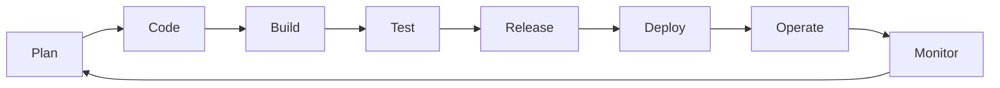

# Introduction to DevOps

## What is DevOps?

DevOps is a cultural and technical movement that brings together software development (Dev) and IT operations (Ops) to shorten the systems development life cycle and provide continuous delivery with high software quality. It's not just a set of tools or processes, but a fundamental shift in how organizations approach software delivery.

## Why DevOps Matters

In today's rapidly evolving digital landscape, organizations need to:
- **Deliver faster**: Release features and fixes at the speed of business
- **Increase quality**: Reduce bugs and improve user experience
- **Enhance collaboration**: Break down silos between teams
- **Improve reliability**: Minimize downtime and recover quickly from failures
- **Reduce costs**: Optimize resource utilization and automate repetitive tasks

## Core DevOps Principles

```yaml
devops_principles:
  cultural:
    collaboration: "Breaking down silos between Dev and Ops"
    shared_responsibility: "Everyone owns the product lifecycle"
    continuous_learning: "Learn from failures and successes"
    customer_focus: "Deliver value to end users"
    
  technical:
    automation: "Automate everything that can be automated"
    continuous_integration: "Merge code changes frequently"
    continuous_delivery: "Always be ready to deploy"
    infrastructure_as_code: "Manage infrastructure through code"
    monitoring_and_logging: "Measure everything"
    
  operational:
    fail_fast: "Detect and fix issues early"
    iterative_improvement: "Small, incremental changes"
    feedback_loops: "Rapid feedback at every stage"
    experimentation: "Safe environment for innovation"
```

## The DevOps Lifecycle



## How to Use This Playbook

This playbook is designed to be a comprehensive guide for implementing DevOps in your organization. Each section can be read independently, but they build upon each other to create a complete DevOps practice.

### For Beginners
Start with these sections:
1. **DevOps Culture and Transformation** - Understand the cultural shift
2. **Continuous Integration and Delivery** - Learn the basics of CI/CD
3. **Infrastructure as Code** - Begin automating your infrastructure
4. **Monitoring and Logging** - Start measuring your systems

### For Intermediate Practitioners
Focus on:
1. **Microservices and Containerization** - Modernize your architecture
2. **Security** - Implement DevSecOps practices
3. **Site Reliability Engineering** - Improve reliability
4. **DevOps Tools and Technologies** - Choose the right tools

### For Advanced Teams
Explore:
1. **Serverless Architectures** - Next-generation architectures
2. **FinOps** - Optimize cloud costs
3. **Scaling DevOps** - Enterprise-scale practices
4. **Incident Management** - Mature operational practices

## Key Metrics for Success

Throughout this playbook, we'll reference these key metrics:

| Metric | Description | Target |
|--------|-------------|--------|
| Deployment Frequency | How often code is deployed to production | Multiple times per day |
| Lead Time | Time from code commit to production | < 1 hour |
| MTTR | Mean Time to Recovery from failures | < 1 hour |
| Change Failure Rate | Percentage of deployments causing failures | < 15% |

## Prerequisites

To get the most from this playbook, you should have:
- Basic understanding of software development
- Familiarity with version control (Git)
- Access to cloud platforms or on-premises infrastructure
- Willingness to embrace cultural change

## Getting Started

Begin your DevOps journey by:
1. Assessing your current state
2. Identifying quick wins
3. Building a coalition of supporters
4. Starting with a pilot project
5. Measuring and iterating

Remember: DevOps is a journey, not a destination. Start small, learn continuously, and scale what works.

---

[Back to Main README](./README.md)
