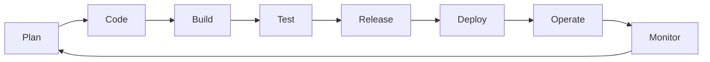

# DevOps Playbook

This repository contains a detailed guide on how to implement DevOps in your organization. The playbook covers various aspects of DevOps, including continuous integration and delivery, infrastructure as code, monitoring and logging, and more. It also includes best practices, recommendations, and examples for each topic.

## Table of Contents

- Introduction
- Continuous Integration and Delivery
- Infrastructure as Code
- Monitoring and Logging
- Security
- Collaboration and Communication
- [DevOps Performance Metrics](./DevOps%20Performance%20Metrics.md)
- [AI and Machine Learning in DevOps](./AI%20and%20Machine%20Learning%20in%20DevOps.md)
- Blockchain and Distributed Ledger Technologies in DevOps
- Serverless Architectures
- Microservices and Containerization
- Site Reliability Engineering (SRE)
- Incident Management and Postmortems
- DevOps Culture and Transformation
- Scaling DevOps for Large Organizations
- DevOps Tools and Technologies
- Conclusion

## Introduction

### What is DevOps?

DevOps is a cultural and technical movement that brings together software development (Dev) and IT operations (Ops) to shorten the systems development life cycle and provide continuous delivery with high software quality. It's not just a set of tools or processes, but a fundamental shift in how organizations approach software delivery.

### Why DevOps Matters

In today's rapidly evolving digital landscape, organizations need to:
- **Deliver faster**: Release features and fixes at the speed of business
- **Increase quality**: Reduce bugs and improve user experience
- **Enhance collaboration**: Break down silos between teams
- **Improve reliability**: Minimize downtime and recover quickly from failures
- **Reduce costs**: Optimize resource utilization and automate repetitive tasks

### Core DevOps Principles

```yaml
devops_principles:
  cultural:
    collaboration: "Breaking down silos between Dev and Ops"
    shared_responsibility: "Everyone owns the product lifecycle"
    continuous_learning: "Learn from failures and successes"
    customer_focus: "Deliver value to end users"
    
  technical:
    automation: "Automate everything that can be automated"
    continuous_integration: "Merge code changes frequently"
    continuous_delivery: "Always be ready to deploy"
    infrastructure_as_code: "Manage infrastructure through code"
    monitoring_and_logging: "Measure everything"
    
  operational:
    fail_fast: "Detect and fix issues early"
    iterative_improvement: "Small, incremental changes"
    feedback_loops: "Rapid feedback at every stage"
    experimentation: "Safe environment for innovation"
```

### The DevOps Lifecycle



### How to Use This Playbook

This playbook is designed to be a comprehensive guide for implementing DevOps in your organization. Each section can be read independently, but they build upon each other to create a complete DevOps practice.

#### For Beginners
Start with these sections:
1. **DevOps Culture and Transformation** - Understand the cultural shift
2. **Continuous Integration and Delivery** - Learn the basics of CI/CD
3. **Infrastructure as Code** - Begin automating your infrastructure
4. **Monitoring and Logging** - Start measuring your systems

#### For Intermediate Practitioners
Focus on:
1. **Microservices and Containerization** - Modernize your architecture
2. **Security** - Implement DevSecOps practices
3. **Site Reliability Engineering** - Improve reliability
4. **DevOps Tools and Technologies** - Choose the right tools

#### For Advanced Teams
Explore:
1. **Serverless Architectures** - Next-generation architectures
2. **FinOps** - Optimize cloud costs
3. **Scaling DevOps** - Enterprise-scale practices
4. **Incident Management** - Mature operational practices

### Key Metrics for Success

Throughout this playbook, we'll reference these key metrics:

| Metric | Description | Target |
|--------|-------------|--------|
| Deployment Frequency | How often code is deployed to production | Multiple times per day |
| Lead Time | Time from code commit to production | < 1 hour |
| MTTR | Mean Time to Recovery from failures | < 1 hour |
| Change Failure Rate | Percentage of deployments causing failures | < 15% |

### Prerequisites

To get the most from this playbook, you should have:
- Basic understanding of software development
- Familiarity with version control (Git)
- Access to cloud platforms or on-premises infrastructure
- Willingness to embrace cultural change

### Getting Started

Begin your DevOps journey by:
1. Assessing your current state
2. Identifying quick wins
3. Building a coalition of supporters
4. Starting with a pilot project
5. Measuring and iterating

Remember: DevOps is a journey, not a destination. Start small, learn continuously, and scale what works.

## Continuous Integration and Delivery

This section covers continuous integration and delivery (CI/CD) pipelines and how to implement them using tools such as Jenkins, Travis CI, and CircleCI. We also discuss best practices for testing and deployment, including blue-green and canary deployments.

### What is CI/CD?

Continuous Integration (CI) is the practice of automating the integration of code changes from multiple contributors into a single software project. It's a crucial DevOps practice that allows developers to frequently merge code changes into a central repository where builds and tests run automatically.

Continuous Delivery (CD) extends CI by automatically deploying all code changes to a testing or production environment after the build stage. This means that on top of automated testing, you have an automated release process and can deploy your application at any point in time by clicking a button.

### Key Benefits of CI/CD

- **Faster Time to Market**: Automated pipelines reduce manual work and speed up the release process
- **Improved Code Quality**: Automated testing catches bugs early in the development cycle
- **Reduced Risk**: Smaller, frequent deployments are easier to troubleshoot than large, infrequent ones
- **Better Collaboration**: Teams can integrate their work frequently, reducing integration conflicts
- **Increased Confidence**: Automated testing and deployment processes ensure consistency

### Core Components of a CI/CD Pipeline

1. **Source Control Management (SCM)**
   - Git repositories (GitHub, GitLab, Bitbucket)
   - Branching strategies (GitFlow, GitHub Flow, Trunk-Based Development)
   - Code review processes and pull requests

2. **Build Stage**
   - Compilation of source code
   - Dependency management
   - Artifact creation
   - Container image building

3. **Testing Stage**
   - Unit tests
   - Integration tests
   - End-to-end tests
   - Security scanning
   - Code quality analysis

4. **Deployment Stage**
   - Environment provisioning
   - Configuration management
   - Database migrations
   - Application deployment
   - Post-deployment verification

### Popular CI/CD Tools

#### Jenkins
Jenkins is an open-source automation server that enables developers to build, test, and deploy their software. It's highly extensible with a rich ecosystem of plugins.

**Key Features:**
- Distributed builds across multiple machines
- Easy installation and configuration
- Extensive plugin ecosystem (over 1,500 plugins)
- Support for various version control systems
- Pipeline as Code with Jenkinsfile

**Example Jenkinsfile:**
```groovy
pipeline {
    agent any
    
    stages {
        stage('Build') {
            steps {
                sh 'npm install'
                sh 'npm run build'
            }
        }
        
        stage('Test') {
            steps {
                sh 'npm test'
                sh 'npm run lint'
            }
        }
        
        stage('Deploy to Staging') {
            when {
                branch 'develop'
            }
            steps {
                sh './deploy.sh staging'
            }
        }
        
        stage('Deploy to Production') {
            when {
                branch 'main'
            }
            steps {
                input 'Deploy to production?'
                sh './deploy.sh production'
            }
        }
    }
    
    post {
        always {
            cleanWs()
        }
        success {
            echo 'Pipeline succeeded!'
        }
        failure {
            echo 'Pipeline failed!'
        }
    }
}
```

#### GitHub Actions
GitHub Actions is a CI/CD platform that allows you to automate your build, test, and deployment pipeline directly from GitHub.

**Key Features:**
- Native integration with GitHub
- YAML-based workflow configuration
- Large marketplace of pre-built actions
- Matrix builds for testing across multiple versions
- Built-in secret management

**Example GitHub Actions Workflow:**
```yaml
name: CI/CD Pipeline

on:
  push:
    branches: [ main, develop ]
  pull_request:
    branches: [ main ]

jobs:
  build-and-test:
    runs-on: ubuntu-latest
    
    strategy:
      matrix:
        node-version: [14.x, 16.x, 18.x]
    
    steps:
    - uses: actions/checkout@v3
    
    - name: Use Node.js ${{ matrix.node-version }}
      uses: actions/setup-node@v3
      with:
        node-version: ${{ matrix.node-version }}
    
    - name: Install dependencies
      run: npm ci
    
    - name: Run tests
      run: npm test
    
    - name: Run linter
      run: npm run lint
    
    - name: Build application
      run: npm run build
    
    - name: Upload artifacts
      uses: actions/upload-artifact@v3
      with:
        name: build-artifacts
        path: dist/
  
  deploy:
    needs: build-and-test
    runs-on: ubuntu-latest
    if: github.ref == 'refs/heads/main'
    
    steps:
    - uses: actions/checkout@v3
    
    - name: Download artifacts
      uses: actions/download-artifact@v3
      with:
        name: build-artifacts
        path: dist/
    
    - name: Deploy to production
      env:
        DEPLOY_KEY: ${{ secrets.DEPLOY_KEY }}
      run: |
        # Deploy script here
        echo "Deploying to production..."
```

#### GitLab CI/CD
GitLab provides a complete DevOps platform with built-in CI/CD capabilities.

**Key Features:**
- Integrated with GitLab repositories
- Auto DevOps for automatic pipeline configuration
- Built-in container registry
- Review apps for merge requests
- Advanced deployment strategies

**Example .gitlab-ci.yml:**
```yaml
stages:
  - build
  - test
  - deploy

variables:
  DOCKER_DRIVER: overlay2

build:
  stage: build
  image: node:16
  script:
    - npm ci
    - npm run build
  artifacts:
    paths:
      - dist/
    expire_in: 1 hour

test:
  stage: test
  image: node:16
  script:
    - npm ci
    - npm test
    - npm run lint
  coverage: '/Coverage: \d+\.\d+%/'

deploy-staging:
  stage: deploy
  script:
    - echo "Deploying to staging environment"
    - ./deploy.sh staging
  environment:
    name: staging
    url: https://staging.mycompany.com
  only:
    - develop

deploy-production:
  stage: deploy
  script:
    - echo "Deploying to production environment"
    - ./deploy.sh production
  environment:
    name: production
    url: https://www.mycompany.com
  when: manual
  only:
    - main
```

### Deployment Strategies

#### Blue-Green Deployment
Blue-green deployment is a technique that reduces downtime and risk by running two identical production environments called Blue and Green.

**How it works:**
1. Blue is the currently running production environment
2. Green is the new version of the application
3. Once Green is tested and ready, traffic is switched from Blue to Green
4. Blue becomes the staging environment for the next release

**Benefits:**
- Zero downtime deployments
- Easy rollback (just switch back to Blue)
- Testing in production-like environment before going live

**Implementation Example:**
```bash
#!/bin/bash
# Blue-Green Deployment Script

CURRENT_ENV=$(kubectl get service app-service -o jsonpath='{.spec.selector.deployment}')
if [ "$CURRENT_ENV" == "blue" ]; then
    NEW_ENV="green"
else
    NEW_ENV="blue"
fi

echo "Current environment: $CURRENT_ENV"
echo "Deploying to: $NEW_ENV"

# Deploy new version
kubectl set image deployment/app-$NEW_ENV app=myapp:$VERSION

# Wait for rollout to complete
kubectl rollout status deployment/app-$NEW_ENV

# Run smoke tests
./run-smoke-tests.sh $NEW_ENV

if [ $? -eq 0 ]; then
    # Switch traffic to new environment
    kubectl patch service app-service -p '{"spec":{"selector":{"deployment":"'$NEW_ENV'"}}}'
    echo "Successfully switched to $NEW_ENV environment"
else
    echo "Smoke tests failed, keeping traffic on $CURRENT_ENV"
    exit 1
fi
```

#### Canary Deployment
Canary deployment is a pattern that rolls out new features to a small subset of users before rolling it out to the entire infrastructure.

**How it works:**
1. Deploy the new version alongside the old version
2. Route a small percentage of traffic to the new version
3. Monitor metrics and error rates
4. Gradually increase traffic to the new version
5. Roll back if issues are detected

**Benefits:**
- Reduced risk of widespread issues
- Real-world testing with actual users
- Gradual rollout allows for monitoring and adjustment

**Implementation with Kubernetes:**
```yaml
apiVersion: v1
kind: Service
metadata:
  name: app-service
spec:
  selector:
    app: myapp
  ports:
    - port: 80
      targetPort: 8080
---
apiVersion: apps/v1
kind: Deployment
metadata:
  name: app-stable
spec:
  replicas: 9
  selector:
    matchLabels:
      app: myapp
      version: stable
  template:
    metadata:
      labels:
        app: myapp
        version: stable
    spec:
      containers:
      - name: app
        image: myapp:1.0.0
        ports:
        - containerPort: 8080
---
apiVersion: apps/v1
kind: Deployment
metadata:
  name: app-canary
spec:
  replicas: 1
  selector:
    matchLabels:
      app: myapp
      version: canary
  template:
    metadata:
      labels:
        app: myapp
        version: canary
    spec:
      containers:
      - name: app
        image: myapp:2.0.0
        ports:
        - containerPort: 8080
```

### Best Practices for CI/CD

1. **Keep Builds Fast**
   - Parallelize tests where possible
   - Use build caching
   - Run quick tests first, longer tests later
   - Optimize build tools and dependencies

2. **Fail Fast**
   - Run fastest tests first
   - Stop the pipeline on first failure
   - Provide clear error messages

3. **Version Everything**
   - Use semantic versioning for releases
   - Tag Docker images with git commit SHA
   - Version database schemas
   - Track infrastructure changes

4. **Secure Your Pipeline**
   - Never hardcode secrets
   - Use secret management tools
   - Scan for vulnerabilities
   - Implement least privilege access

5. **Monitor Your Pipeline**
   - Track build times and success rates
   - Alert on pipeline failures
   - Measure deployment frequency
   - Monitor application performance post-deployment

6. **Automate Everything**
   - Database migrations
   - Environment provisioning
   - Testing at all levels
   - Rollback procedures

### Getting Started with CI/CD

1. **Start Small**
   - Begin with a simple pipeline that builds and tests
   - Add deployment automation gradually
   - Focus on one application or service first

2. **Choose the Right Tools**
   - Consider your team's expertise
   - Evaluate integration with existing tools
   - Factor in cost and maintenance

3. **Define Your Pipeline Stages**
   - Build → Test → Security Scan → Deploy to Staging → Deploy to Production
   - Add stages based on your needs

4. **Implement Gradually**
   - Start with CI (automated builds and tests)
   - Add CD to staging environments
   - Finally, automate production deployments

5. **Measure Success**
   - Track deployment frequency
   - Monitor lead time for changes
   - Measure mean time to recovery (MTTR)
   - Calculate change failure rate

## Infrastructure as Code

In this section, we explain how to use tools like Pulumi and Terraform to create infrastructure as code. We also cover configuration management tools like Ansible and best practices for managing infrastructure code.

### What is Infrastructure as Code?

Infrastructure as Code (IaC) is the practice of managing and provisioning computing infrastructure through machine-readable definition files, rather than physical hardware configuration or interactive configuration tools. This approach brings many of the benefits of software development practices to infrastructure management.

### Key Benefits of IaC

- **Consistency**: Eliminate configuration drift and ensure environments are identical
- **Speed**: Provision infrastructure in minutes instead of days or weeks
- **Version Control**: Track changes, review history, and rollback when needed
- **Collaboration**: Teams can review and contribute to infrastructure changes
- **Cost Optimization**: Easily spin up and tear down environments as needed
- **Documentation**: The code itself serves as documentation of your infrastructure

### IaC Principles

1. **Declarative vs Imperative**
   - **Declarative**: Describe the desired end state (Terraform, Pulumi, CloudFormation)
   - **Imperative**: Specify the exact steps to achieve the desired state (Ansible, Chef)

2. **Idempotency**
   - Running the same configuration multiple times produces the same result
   - Prevents unintended changes and ensures predictability

3. **Immutability**
   - Infrastructure is replaced rather than changed
   - Reduces configuration drift and improves reliability

### Pulumi: Modern Infrastructure as Code

Pulumi is a modern infrastructure as code platform that allows you to use familiar programming languages to define, deploy, and manage cloud infrastructure. Unlike traditional IaC tools that use domain-specific languages, Pulumi lets you use languages like TypeScript, Python, Go, and C#.

#### Why Pulumi?

- **Real Programming Languages**: Use loops, conditionals, functions, and classes
- **Strong Typing**: Catch errors at compile time with IDE support
- **Reusable Components**: Create and share infrastructure components as packages
- **Multi-Cloud**: Support for AWS, Azure, GCP, Kubernetes, and 60+ providers
- **Secrets Management**: Built-in encryption for sensitive configuration
- **State Management**: Automatic state tracking and management

#### Getting Started with Pulumi

**Installation:**
```bash
# macOS
brew install pulumi

# Linux
curl -fsSL https://get.pulumi.com | sh

# Windows
choco install pulumi
```

**Basic Pulumi Project Structure:**
```
my-infrastructure/
├── Pulumi.yaml          # Project metadata
├── Pulumi.dev.yaml      # Stack-specific configuration
├── Pulumi.prod.yaml     # Production configuration
├── index.ts             # Main program file
├── package.json         # Node.js dependencies
└── tsconfig.json        # TypeScript configuration
```

#### Pulumi Examples

**Example 1: Creating an S3 Bucket with Website Hosting (TypeScript)**
```typescript
import * as pulumi from "@pulumi/pulumi";
import * as aws from "@pulumi/aws";

// Create an S3 bucket configured as a website
const siteBucket = new aws.s3.Bucket("my-website", {
    website: {
        indexDocument: "index.html",
        errorDocument: "404.html",
    },
});

// Configure public access block
const publicAccessBlock = new aws.s3.BucketPublicAccessBlock("public-access-block", {
    bucket: siteBucket.id,
    blockPublicAcls: false,
    blockPublicPolicy: false,
    ignorePublicAcls: false,
    restrictPublicBuckets: false,
});

// Create a bucket policy to allow public read access
const bucketPolicy = new aws.s3.BucketPolicy("bucket-policy", {
    bucket: siteBucket.id,
    policy: siteBucket.id.apply(bucketName => JSON.stringify({
        Version: "2012-10-17",
        Statement: [{
            Effect: "Allow",
            Principal: "*",
            Action: ["s3:GetObject"],
            Resource: [`arn:aws:s3:::${bucketName}/*`],
        }],
    })),
}, { dependsOn: [publicAccessBlock] });

// Upload website content
const indexHtml = new aws.s3.BucketObject("index.html", {
    bucket: siteBucket,
    source: new pulumi.asset.FileAsset("./website/index.html"),
    contentType: "text/html",
});

// Export the website URL
export const websiteUrl = siteBucket.websiteEndpoint;
```

**Example 2: Kubernetes Deployment with Pulumi (Python)**
```python
import pulumi
from pulumi_kubernetes import Provider, apps, core

# Create a Kubernetes provider
k8s_provider = Provider("k8s", kubeconfig=kubeconfig)

# Define the application
app_labels = {"app": "nginx"}

# Create a Namespace
namespace = core.v1.Namespace(
    "app-namespace",
    metadata={"name": "production"},
    opts=pulumi.ResourceOptions(provider=k8s_provider)
)

# Create a Deployment
deployment = apps.v1.Deployment(
    "nginx-deployment",
    metadata={
        "namespace": namespace.metadata["name"],
        "name": "nginx-deployment"
    },
    spec={
        "replicas": 3,
        "selector": {"matchLabels": app_labels},
        "template": {
            "metadata": {"labels": app_labels},
            "spec": {
                "containers": [{
                    "name": "nginx",
                    "image": "nginx:1.21",
                    "ports": [{"containerPort": 80}],
                    "resources": {
                        "requests": {
                            "cpu": "100m",
                            "memory": "128Mi"
                        },
                        "limits": {
                            "cpu": "200m",
                            "memory": "256Mi"
                        }
                    }
                }]
            }
        }
    },
    opts=pulumi.ResourceOptions(provider=k8s_provider)
)

# Create a Service
service = core.v1.Service(
    "nginx-service",
    metadata={
        "namespace": namespace.metadata["name"],
        "name": "nginx-service"
    },
    spec={
        "type": "LoadBalancer",
        "selector": app_labels,
        "ports": [{"port": 80, "targetPort": 80}]
    },
    opts=pulumi.ResourceOptions(provider=k8s_provider)
)

# Export the service endpoint
pulumi.export("service_endpoint", service.status["load_balancer"]["ingress"][0]["hostname"])
```

**Example 3: Multi-Cloud Infrastructure with Pulumi (Go)**
```go
package main

import (
    "github.com/pulumi/pulumi-aws/sdk/v5/go/aws/ec2"
    "github.com/pulumi/pulumi-azure-native/sdk/go/azure/compute"
    "github.com/pulumi/pulumi-azure-native/sdk/go/azure/network"
    "github.com/pulumi/pulumi-azure-native/sdk/go/azure/resources"
    "github.com/pulumi/pulumi/sdk/v3/go/pulumi"
)

func main() {
    pulumi.Run(func(ctx *pulumi.Context) error {
        // AWS Resources
        // Create VPC
        vpc, err := ec2.NewVpc(ctx, "main", &ec2.VpcArgs{
            CidrBlock: pulumi.String("10.0.0.0/16"),
            Tags: pulumi.StringMap{
                "Name": pulumi.String("main-vpc"),
            },
        })
        if err != nil {
            return err
        }

        // Create Subnet
        subnet, err := ec2.NewSubnet(ctx, "main", &ec2.SubnetArgs{
            VpcId:     vpc.ID(),
            CidrBlock: pulumi.String("10.0.1.0/24"),
            Tags: pulumi.StringMap{
                "Name": pulumi.String("main-subnet"),
            },
        })
        if err != nil {
            return err
        }

        // Azure Resources
        // Create Resource Group
        resourceGroup, err := resources.NewResourceGroup(ctx, "main", &resources.ResourceGroupArgs{
            Location: pulumi.String("East US"),
        })
        if err != nil {
            return err
        }

        // Create Virtual Network
        virtualNetwork, err := network.NewVirtualNetwork(ctx, "main", &network.VirtualNetworkArgs{
            ResourceGroupName: resourceGroup.Name,
            Location:          resourceGroup.Location,
            AddressSpace: &network.AddressSpaceArgs{
                AddressPrefixes: pulumi.StringArray{
                    pulumi.String("10.1.0.0/16"),
                },
            },
        })
        if err != nil {
            return err
        }

        // Export the IDs
        ctx.Export("awsVpcId", vpc.ID())
        ctx.Export("awsSubnetId", subnet.ID())
        ctx.Export("azureVnetId", virtualNetwork.ID())

        return nil
    })
}
```

**Example 4: Component Resources - Reusable Infrastructure Patterns**
```typescript
import * as pulumi from "@pulumi/pulumi";
import * as aws from "@pulumi/aws";

// Define a reusable web server component
class WebServerStack extends pulumi.ComponentResource {
    public readonly instanceId: pulumi.Output<string>;
    public readonly publicIp: pulumi.Output<string>;
    public readonly publicDns: pulumi.Output<string>;

    constructor(name: string, args: WebServerArgs, opts?: pulumi.ComponentResourceOptions) {
        super("custom:app:WebServerStack", name, {}, opts);

        // Create security group
        const securityGroup = new aws.ec2.SecurityGroup(`${name}-sg`, {
            description: "Enable HTTP and SSH access",
            ingress: [
                { protocol: "tcp", fromPort: 80, toPort: 80, cidrBlocks: ["0.0.0.0/0"] },
                { protocol: "tcp", fromPort: 22, toPort: 22, cidrBlocks: ["0.0.0.0/0"] },
            ],
            egress: [
                { protocol: "-1", fromPort: 0, toPort: 0, cidrBlocks: ["0.0.0.0/0"] },
            ],
        }, { parent: this });

        // Create EC2 instance
        const server = new aws.ec2.Instance(`${name}-instance`, {
            instanceType: args.instanceType || "t2.micro",
            ami: args.ami,
            keyName: args.keyName,
            vpcSecurityGroupIds: [securityGroup.id],
            userData: args.userData,
            tags: {
                Name: `${name}-webserver`,
                Environment: args.environment,
            },
        }, { parent: this });

        // Create Elastic IP
        const eip = new aws.ec2.Eip(`${name}-eip`, {
            instance: server.id,
        }, { parent: this });

        this.instanceId = server.id;
        this.publicIp = eip.publicIp;
        this.publicDns = server.publicDns;

        this.registerOutputs({
            instanceId: this.instanceId,
            publicIp: this.publicIp,
            publicDns: this.publicDns,
        });
    }
}

interface WebServerArgs {
    ami: pulumi.Input<string>;
    instanceType?: pulumi.Input<string>;
    keyName: pulumi.Input<string>;
    userData?: pulumi.Input<string>;
    environment: pulumi.Input<string>;
}

// Use the component
const devServer = new WebServerStack("dev", {
    ami: "ami-0c55b159cbfafe1f0",
    keyName: "my-key-pair",
    environment: "development",
    userData: `#!/bin/bash
        yum update -y
        yum install -y httpd
        systemctl start httpd
        systemctl enable httpd
        echo "<h1>Welcome to our Infrastructure!</h1>" > /var/www/html/index.html
    `,
});

export const devServerIp = devServer.publicIp;
export const devServerDns = devServer.publicDns;
```

### Terraform: HashiCorp's Infrastructure as Code

Terraform is one of the most popular IaC tools, using HashiCorp Configuration Language (HCL) to define infrastructure.

#### Key Features

- **Declarative Configuration**: Define what you want, not how to build it
- **Provider Ecosystem**: Support for hundreds of cloud and service providers
- **State Management**: Tracks the current state of your infrastructure
- **Plan and Apply**: Preview changes before applying them
- **Modules**: Reusable infrastructure components

#### Basic Terraform Example

```hcl
# Configure the AWS Provider
provider "aws" {
  region = "us-west-2"
}

# Create a VPC
resource "aws_vpc" "main" {
  cidr_block = "10.0.0.0/16"
  
  tags = {
    Name = "main-vpc"
  }
}

# Create a subnet
resource "aws_subnet" "main" {
  vpc_id     = aws_vpc.main.id
  cidr_block = "10.0.1.0/24"

  tags = {
    Name = "main-subnet"
  }
}

# Create an internet gateway
resource "aws_internet_gateway" "main" {
  vpc_id = aws_vpc.main.id

  tags = {
    Name = "main-igw"
  }
}

# Create an EC2 instance
resource "aws_instance" "web" {
  ami           = "ami-0c55b159cbfafe1f0"
  instance_type = "t2.micro"
  subnet_id     = aws_subnet.main.id

  tags = {
    Name = "web-server"
  }
}

# Output the public IP
output "instance_ip" {
  value = aws_instance.web.public_ip
}
```

### Configuration Management with Ansible

While Terraform and Pulumi excel at provisioning infrastructure, Ansible is perfect for configuring and managing that infrastructure once it's created.

#### Ansible Example: Configure Web Servers

```yaml
---
- name: Configure web servers
  hosts: webservers
  become: yes
  
  tasks:
    - name: Install nginx
      package:
        name: nginx
        state: present
    
    - name: Start nginx service
      service:
        name: nginx
        state: started
        enabled: yes
    
    - name: Deploy website content
      copy:
        src: ./website/
        dest: /var/www/html/
        owner: www-data
        group: www-data
        mode: '0644'
    
    - name: Configure nginx
      template:
        src: nginx.conf.j2
        dest: /etc/nginx/nginx.conf
      notify: restart nginx
  
  handlers:
    - name: restart nginx
      service:
        name: nginx
        state: restarted
```

### Best Practices for Infrastructure as Code

1. **Version Control Everything**
   - Store all IaC files in Git
   - Use meaningful commit messages
   - Tag releases and environments

2. **Use Remote State**
   - Store Terraform state in S3, Azure Storage, or Terraform Cloud
   - Enable state locking to prevent conflicts
   - Encrypt state files containing sensitive data

3. **Modularize Your Code**
   - Create reusable modules/components
   - Use consistent naming conventions
   - Document module inputs and outputs

4. **Implement Testing**
   - Use tools like Terratest or Pulumi's testing framework
   - Test infrastructure changes in isolated environments
   - Validate security and compliance requirements

5. **Security First**
   - Never hardcode secrets in IaC files
   - Use secret management services (AWS Secrets Manager, Azure Key Vault)
   - Implement least privilege access
   - Scan for security vulnerabilities

6. **Environment Separation**
   - Use separate state files for each environment
   - Implement environment-specific configurations
   - Use workspaces or separate projects

7. **Documentation**
   - Document architecture decisions
   - Include README files with setup instructions
   - Add inline comments for complex logic

### Advanced IaC Patterns

#### GitOps Workflow
```yaml
# Example GitOps workflow with Flux
apiVersion: source.toolkit.fluxcd.io/v1beta1
kind: GitRepository
metadata:
  name: infrastructure
  namespace: flux-system
spec:
  interval: 1m
  ref:
    branch: main
  url: https://github.com/company/infrastructure
---
apiVersion: kustomize.toolkit.fluxcd.io/v1beta1
kind: Kustomization
metadata:
  name: infrastructure
  namespace: flux-system
spec:
  interval: 10m
  path: "./clusters/production"
  prune: true
  sourceRef:
    kind: GitRepository
    name: infrastructure
```

#### Policy as Code with Open Policy Agent
```rego
package terraform.aws.s3

deny[msg] {
  resource := input.resource_changes[_]
  resource.type == "aws_s3_bucket"
  not resource.change.after.server_side_encryption_configuration
  msg := sprintf("S3 bucket %s does not have encryption enabled", [resource.address])
}

deny[msg] {
  resource := input.resource_changes[_]
  resource.type == "aws_s3_bucket"
  resource.change.after.acl == "public-read"
  msg := sprintf("S3 bucket %s has public read access", [resource.address])
}
```

### Getting Started with IaC

1. **Choose Your Tool**
   - **Pulumi**: Best for teams comfortable with programming languages
   - **Terraform**: Great for declarative infrastructure with wide provider support
   - **CloudFormation/ARM**: Native cloud provider tools for single-cloud deployments

2. **Start Small**
   - Begin with a simple project (e.g., a single VM or container)
   - Gradually add complexity
   - Learn from examples and community resources

3. **Establish Standards**
   - Define naming conventions
   - Create project templates
   - Document your practices

4. **Implement CI/CD for IaC**
   - Automate infrastructure validation
   - Run automated tests
   - Implement approval workflows for production changes

For more examples and detailed patterns, check out:
- Official Pulumi Examples: https://github.com/pulumi/examples
- Community Examples: https://github.com/jefrnc/pulumi-examples
- Terraform Registry: https://registry.terraform.io/

## Monitoring and Logging

This section covers how to implement monitoring and logging in your applications and infrastructure. We discuss tools like Prometheus and Grafana for monitoring and ELK stack for logging. We also cover best practices for alerting and incident management.

### The Importance of Observability

Observability is the ability to measure the internal states of a system by examining its outputs. In modern distributed systems, observability is crucial for understanding system behavior, troubleshooting issues, and ensuring reliability.

The three pillars of observability are:
- **Metrics**: Numeric measurements collected over time
- **Logs**: Discrete events that happened over time
- **Traces**: The path of a request through your distributed system

### Monitoring with Prometheus and Grafana

#### Prometheus Overview

Prometheus is an open-source monitoring and alerting toolkit that has become the de facto standard for Kubernetes monitoring.

**Key Features:**
- Pull-based metrics collection
- Time-series database
- Powerful query language (PromQL)
- Service discovery
- Built-in alerting

**Prometheus Architecture:**
```yaml
# prometheus.yml configuration
global:
  scrape_interval: 15s
  evaluation_interval: 15s

# Alertmanager configuration
alerting:
  alertmanagers:
    - static_configs:
        - targets:
            - alertmanager:9093

# Load rules once and periodically evaluate them
rule_files:
  - "alerts/*.yml"

# Scrape configurations
scrape_configs:
  # Prometheus itself
  - job_name: 'prometheus'
    static_configs:
      - targets: ['localhost:9090']

  # Node exporter for system metrics
  - job_name: 'node'
    static_configs:
      - targets: ['node-exporter:9100']

  # Application metrics
  - job_name: 'app'
    kubernetes_sd_configs:
      - role: pod
    relabel_configs:
      - source_labels: [__meta_kubernetes_pod_annotation_prometheus_io_scrape]
        action: keep
        regex: true
      - source_labels: [__meta_kubernetes_pod_annotation_prometheus_io_path]
        action: replace
        target_label: __metrics_path__
        regex: (.+)
      - source_labels: [__address__, __meta_kubernetes_pod_annotation_prometheus_io_port]
        action: replace
        regex: ([^:]+)(?::\d+)?;(\d+)
        replacement: $1:$2
        target_label: __address__
```

#### Setting Up Application Metrics

**Example: Node.js Application with Prometheus Metrics**
```javascript
const express = require('express');
const promClient = require('prom-client');

const app = express();
const register = new promClient.Registry();

// Default metrics (CPU, memory, etc.)
promClient.collectDefaultMetrics({ register });

// Custom metrics
const httpRequestDuration = new promClient.Histogram({
  name: 'http_request_duration_seconds',
  help: 'Duration of HTTP requests in seconds',
  labelNames: ['method', 'route', 'status_code'],
  buckets: [0.1, 0.5, 1, 2, 5]
});
register.registerMetric(httpRequestDuration);

const httpRequestTotal = new promClient.Counter({
  name: 'http_requests_total',
  help: 'Total number of HTTP requests',
  labelNames: ['method', 'route', 'status_code']
});
register.registerMetric(httpRequestTotal);

// Middleware to track metrics
app.use((req, res, next) => {
  const start = Date.now();
  
  res.on('finish', () => {
    const duration = (Date.now() - start) / 1000;
    httpRequestDuration
      .labels(req.method, req.route?.path || req.url, res.statusCode)
      .observe(duration);
    
    httpRequestTotal
      .labels(req.method, req.route?.path || req.url, res.statusCode)
      .inc();
  });
  
  next();
});

// Metrics endpoint
app.get('/metrics', async (req, res) => {
  res.set('Content-Type', register.contentType);
  res.end(await register.metrics());
});

// Application routes
app.get('/', (req, res) => {
  res.json({ message: 'Hello World' });
});

app.listen(3000, () => {
  console.log('Server running on port 3000');
});
```

**Example: Python Application with Prometheus Metrics**
```python
from prometheus_client import Counter, Histogram, generate_latest, CONTENT_TYPE_LATEST
from flask import Flask, Response
import time

app = Flask(__name__)

# Define metrics
REQUEST_COUNT = Counter(
    'app_requests_total', 
    'Total number of requests',
    ['method', 'endpoint', 'status']
)

REQUEST_DURATION = Histogram(
    'app_request_duration_seconds',
    'Request duration in seconds',
    ['method', 'endpoint']
)

# Decorator to track metrics
def track_metrics(f):
    def wrapper(*args, **kwargs):
        start_time = time.time()
        method = request.method
        endpoint = request.endpoint or 'unknown'
        
        try:
            response = f(*args, **kwargs)
            status = response.status_code
        except Exception as e:
            status = 500
            raise e
        finally:
            duration = time.time() - start_time
            REQUEST_COUNT.labels(method, endpoint, status).inc()
            REQUEST_DURATION.labels(method, endpoint).observe(duration)
        
        return response
    
    wrapper.__name__ = f.__name__
    return wrapper

@app.route('/')
@track_metrics
def home():
    return {'message': 'Hello World'}

@app.route('/metrics')
def metrics():
    return Response(generate_latest(), mimetype=CONTENT_TYPE_LATEST)

if __name__ == '__main__':
    app.run(host='0.0.0.0', port=5000)
```

#### Grafana: Visualization and Dashboards

Grafana is the leading open-source platform for monitoring and observability, allowing you to query, visualize, and alert on metrics.

**Docker Compose Setup for Prometheus + Grafana:**
```yaml
version: '3.8'

services:
  prometheus:
    image: prom/prometheus:latest
    container_name: prometheus
    volumes:
      - ./prometheus.yml:/etc/prometheus/prometheus.yml
      - ./alerts:/etc/prometheus/alerts
      - prometheus_data:/prometheus
    command:
      - '--config.file=/etc/prometheus/prometheus.yml'
      - '--storage.tsdb.path=/prometheus'
      - '--web.console.libraries=/usr/share/prometheus/console_libraries'
      - '--web.console.templates=/usr/share/prometheus/consoles'
    ports:
      - "9090:9090"
    networks:
      - monitoring

  grafana:
    image: grafana/grafana:latest
    container_name: grafana
    volumes:
      - grafana_data:/var/lib/grafana
      - ./grafana/provisioning:/etc/grafana/provisioning
    environment:
      - GF_SECURITY_ADMIN_USER=admin
      - GF_SECURITY_ADMIN_PASSWORD=admin123
      - GF_USERS_ALLOW_SIGN_UP=false
    ports:
      - "3000:3000"
    networks:
      - monitoring
    depends_on:
      - prometheus

  node-exporter:
    image: prom/node-exporter:latest
    container_name: node-exporter
    ports:
      - "9100:9100"
    networks:
      - monitoring

  alertmanager:
    image: prom/alertmanager:latest
    container_name: alertmanager
    volumes:
      - ./alertmanager.yml:/etc/alertmanager/alertmanager.yml
      - alertmanager_data:/alertmanager
    command:
      - '--config.file=/etc/alertmanager/alertmanager.yml'
      - '--storage.path=/alertmanager'
    ports:
      - "9093:9093"
    networks:
      - monitoring

volumes:
  prometheus_data:
  grafana_data:
  alertmanager_data:

networks:
  monitoring:
    driver: bridge
```

**Example Grafana Dashboard JSON:**
```json
{
  "dashboard": {
    "title": "Application Metrics",
    "panels": [
      {
        "title": "Request Rate",
        "targets": [
          {
            "expr": "rate(http_requests_total[5m])",
            "legendFormat": "{{method}} {{route}}"
          }
        ],
        "type": "graph"
      },
      {
        "title": "Response Time",
        "targets": [
          {
            "expr": "histogram_quantile(0.95, rate(http_request_duration_seconds_bucket[5m]))",
            "legendFormat": "95th percentile"
          }
        ],
        "type": "graph"
      },
      {
        "title": "Error Rate",
        "targets": [
          {
            "expr": "rate(http_requests_total{status_code=~\"5..\"}[5m])",
            "legendFormat": "5xx errors"
          }
        ],
        "type": "graph"
      }
    ]
  }
}
```

### Logging with the ELK Stack

The ELK Stack (Elasticsearch, Logstash, Kibana) is a popular solution for centralized logging.

#### ELK Stack Components

1. **Elasticsearch**: Search and analytics engine
2. **Logstash**: Server-side data processing pipeline
3. **Kibana**: Visualization and exploration tool
4. **Beats**: Lightweight data shippers

**Docker Compose Setup for ELK Stack:**
```yaml
version: '3.8'

services:
  elasticsearch:
    image: docker.elastic.co/elasticsearch/elasticsearch:8.11.0
    container_name: elasticsearch
    environment:
      - node.name=elasticsearch
      - cluster.name=docker-cluster
      - discovery.type=single-node
      - bootstrap.memory_lock=true
      - "ES_JAVA_OPTS=-Xms512m -Xmx512m"
      - xpack.security.enabled=false
    ulimits:
      memlock:
        soft: -1
        hard: -1
    volumes:
      - elasticsearch_data:/usr/share/elasticsearch/data
    ports:
      - "9200:9200"
    networks:
      - elk

  logstash:
    image: docker.elastic.co/logstash/logstash:8.11.0
    container_name: logstash
    volumes:
      - ./logstash/pipeline:/usr/share/logstash/pipeline
      - ./logstash/config/logstash.yml:/usr/share/logstash/config/logstash.yml
    ports:
      - "5044:5044"
      - "5000:5000/tcp"
      - "5000:5000/udp"
    environment:
      LS_JAVA_OPTS: "-Xmx256m -Xms256m"
    networks:
      - elk
    depends_on:
      - elasticsearch

  kibana:
    image: docker.elastic.co/kibana/kibana:8.11.0
    container_name: kibana
    ports:
      - "5601:5601"
    environment:
      ELASTICSEARCH_URL: http://elasticsearch:9200
      ELASTICSEARCH_HOSTS: '["http://elasticsearch:9200"]'
    networks:
      - elk
    depends_on:
      - elasticsearch

  filebeat:
    image: docker.elastic.co/beats/filebeat:8.11.0
    container_name: filebeat
    user: root
    volumes:
      - ./filebeat/filebeat.yml:/usr/share/filebeat/filebeat.yml:ro
      - /var/lib/docker/containers:/var/lib/docker/containers:ro
      - /var/run/docker.sock:/var/run/docker.sock:ro
    command: filebeat -e -strict.perms=false
    networks:
      - elk
    depends_on:
      - elasticsearch
      - logstash

volumes:
  elasticsearch_data:

networks:
  elk:
    driver: bridge
```

**Logstash Configuration (logstash/pipeline/logstash.conf):**
```ruby
input {
  beats {
    port => 5044
  }
  
  tcp {
    port => 5000
    codec => json
  }
}

filter {
  if [kubernetes] {
    mutate {
      add_field => {
        "pod_name" => "%{[kubernetes][pod][name]}"
        "namespace" => "%{[kubernetes][namespace]}"
        "container_name" => "%{[kubernetes][container][name]}"
      }
    }
  }
  
  if [message] =~ /^\{.*\}$/ {
    json {
      source => "message"
      target => "parsed"
    }
  }
  
  grok {
    match => {
      "message" => "%{TIMESTAMP_ISO8601:timestamp} %{LOGLEVEL:level} %{GREEDYDATA:message}"
    }
    overwrite => ["message"]
  }
  
  date {
    match => ["timestamp", "ISO8601"]
    target => "@timestamp"
  }
}

output {
  elasticsearch {
    hosts => ["elasticsearch:9200"]
    index => "logs-%{+YYYY.MM.dd}"
  }
  
  stdout {
    codec => rubydebug
  }
}
```

**Filebeat Configuration (filebeat/filebeat.yml):**
```yaml
filebeat.inputs:
- type: docker
  containers:
    path: "/var/lib/docker/containers"
    stream: "all"
    ids:
      - "*"
  processors:
    - add_docker_metadata:
        host: "unix:///var/run/docker.sock"
    - decode_json_fields:
        fields: ["message"]
        target: "json"
        overwrite_keys: true

- type: log
  enabled: true
  paths:
    - /var/log/*.log
  multiline.pattern: '^\['
  multiline.negate: true
  multiline.match: after

output.logstash:
  hosts: ["logstash:5044"]

processors:
  - add_host_metadata:
      when.not.contains.tags: forwarded
```

### Structured Logging Best Practices

**Example: Structured Logging in Node.js with Winston**
```javascript
const winston = require('winston');

const logger = winston.createLogger({
  level: 'info',
  format: winston.format.combine(
    winston.format.timestamp(),
    winston.format.errors({ stack: true }),
    winston.format.json()
  ),
  defaultMeta: { service: 'api-service' },
  transports: [
    new winston.transports.Console({
      format: winston.format.combine(
        winston.format.colorize(),
        winston.format.simple()
      )
    }),
    new winston.transports.File({ filename: 'error.log', level: 'error' }),
    new winston.transports.File({ filename: 'combined.log' })
  ]
});

// Logging examples
logger.info('Server started', {
  port: 3000,
  environment: process.env.NODE_ENV
});

logger.error('Database connection failed', {
  error: err.message,
  host: dbConfig.host,
  port: dbConfig.port
});

// Express middleware for request logging
app.use((req, res, next) => {
  const start = Date.now();
  
  res.on('finish', () => {
    logger.info('HTTP Request', {
      method: req.method,
      url: req.url,
      statusCode: res.statusCode,
      duration: Date.now() - start,
      userAgent: req.get('user-agent'),
      ip: req.ip
    });
  });
  
  next();
});
```

**Example: Structured Logging in Python**
```python
import logging
import json
from datetime import datetime
from pythonjsonlogger import jsonlogger

# Configure JSON logging
logHandler = logging.StreamHandler()
formatter = jsonlogger.JsonFormatter()
logHandler.setFormatter(formatter)
logger = logging.getLogger()
logger.addHandler(logHandler)
logger.setLevel(logging.INFO)

# Add custom fields
class CustomJsonFormatter(jsonlogger.JsonFormatter):
    def add_fields(self, log_record, record, message_dict):
        super(CustomJsonFormatter, self).add_fields(log_record, record, message_dict)
        log_record['timestamp'] = datetime.utcnow().isoformat()
        log_record['level'] = record.levelname
        log_record['service'] = 'api-service'

# Logging examples
logger.info('Application started', extra={
    'event': 'app_start',
    'version': '1.0.0',
    'environment': 'production'
})

try:
    result = process_data(data)
    logger.info('Data processed successfully', extra={
        'event': 'data_processed',
        'record_count': len(data),
        'duration': processing_time
    })
except Exception as e:
    logger.error('Data processing failed', extra={
        'event': 'data_processing_error',
        'error': str(e),
        'stack_trace': traceback.format_exc()
    })
```

### Alerting Best Practices

#### Prometheus Alerting Rules

**Example Alert Rules (alerts/app_alerts.yml):**
```yaml
groups:
  - name: application
    rules:
      - alert: HighErrorRate
        expr: rate(http_requests_total{status_code=~"5.."}[5m]) > 0.05
        for: 5m
        labels:
          severity: critical
          team: backend
        annotations:
          summary: "High error rate detected"
          description: "Error rate is {{ $value }} errors per second"
          
      - alert: HighResponseTime
        expr: histogram_quantile(0.95, rate(http_request_duration_seconds_bucket[5m])) > 2
        for: 10m
        labels:
          severity: warning
          team: backend
        annotations:
          summary: "High response time detected"
          description: "95th percentile response time is {{ $value }} seconds"
          
      - alert: PodCrashLooping
        expr: rate(kube_pod_container_status_restarts_total[5m]) > 0
        for: 5m
        labels:
          severity: critical
          team: platform
        annotations:
          summary: "Pod {{ $labels.pod }} is crash looping"
          description: "Pod {{ $labels.pod }} has restarted {{ $value }} times in the last 5 minutes"
          
      - alert: HighMemoryUsage
        expr: (node_memory_MemTotal_bytes - node_memory_MemAvailable_bytes) / node_memory_MemTotal_bytes > 0.9
        for: 5m
        labels:
          severity: warning
          team: platform
        annotations:
          summary: "High memory usage on {{ $labels.instance }}"
          description: "Memory usage is {{ $value | humanizePercentage }}"
```

#### Alertmanager Configuration

**alertmanager.yml:**
```yaml
global:
  resolve_timeout: 5m
  slack_api_url: 'YOUR_SLACK_WEBHOOK_URL'

route:
  group_by: ['alertname', 'cluster', 'service']
  group_wait: 10s
  group_interval: 10s
  repeat_interval: 12h
  receiver: 'default'
  routes:
    - match:
        severity: critical
      receiver: 'critical'
      continue: true
    - match:
        team: backend
      receiver: 'backend-team'
    - match:
        team: platform
      receiver: 'platform-team'

receivers:
  - name: 'default'
    slack_configs:
      - channel: '#alerts'
        title: 'Alert: {{ .GroupLabels.alertname }}'
        text: '{{ range .Alerts }}{{ .Annotations.description }}{{ end }}'

  - name: 'critical'
    pagerduty_configs:
      - service_key: 'YOUR_PAGERDUTY_SERVICE_KEY'
        description: '{{ .GroupLabels.alertname }}: {{ .CommonAnnotations.summary }}'
    slack_configs:
      - channel: '#critical-alerts'
        title: 'CRITICAL: {{ .GroupLabels.alertname }}'
        color: 'danger'

  - name: 'backend-team'
    email_configs:
      - to: 'backend-team@company.com'
        headers:
          Subject: 'Backend Alert: {{ .GroupLabels.alertname }}'

  - name: 'platform-team'
    email_configs:
      - to: 'platform-team@company.com'
        headers:
          Subject: 'Platform Alert: {{ .GroupLabels.alertname }}'

inhibit_rules:
  - source_match:
      severity: 'critical'
    target_match:
      severity: 'warning'
    equal: ['alertname', 'dev', 'instance']
```

### Distributed Tracing

For microservices architectures, distributed tracing is essential. Tools like Jaeger or Zipkin help track requests across multiple services.

**Example: OpenTelemetry Setup in Node.js**
```javascript
const { NodeSDK } = require('@opentelemetry/sdk-node');
const { getNodeAutoInstrumentations } = require('@opentelemetry/auto-instrumentations-node');
const { JaegerExporter } = require('@opentelemetry/exporter-jaeger');
const { Resource } = require('@opentelemetry/resources');
const { SemanticResourceAttributes } = require('@opentelemetry/semantic-conventions');

const jaegerExporter = new JaegerExporter({
  endpoint: 'http://localhost:14268/api/traces',
});

const sdk = new NodeSDK({
  resource: new Resource({
    [SemanticResourceAttributes.SERVICE_NAME]: 'api-service',
    [SemanticResourceAttributes.SERVICE_VERSION]: '1.0.0',
  }),
  traceExporter: jaegerExporter,
  instrumentations: [
    getNodeAutoInstrumentations({
      '@opentelemetry/instrumentation-fs': {
        enabled: false,
      },
    }),
  ],
});

sdk.start();
```

### Monitoring Strategy Best Practices

1. **Define SLIs and SLOs**
   - Service Level Indicators (SLIs): Metrics that matter to users
   - Service Level Objectives (SLOs): Target values for SLIs
   - Error budgets: Allowable downtime based on SLOs

2. **USE Method for Resources**
   - **Utilization**: How busy is the resource?
   - **Saturation**: How much work is queued?
   - **Errors**: Are errors occurring?

3. **RED Method for Services**
   - **Rate**: Requests per second
   - **Errors**: Failed requests
   - **Duration**: Response time

4. **Golden Signals (Google SRE)**
   - Latency
   - Traffic
   - Errors
   - Saturation

5. **Alert Fatigue Prevention**
   - Alert on symptoms, not causes
   - Set appropriate thresholds
   - Use alert grouping and suppression
   - Regular alert review and tuning

6. **Dashboard Design**
   - Overview dashboards for quick health checks
   - Detailed dashboards for troubleshooting
   - Business metrics alongside technical metrics
   - Mobile-friendly designs

### Cost Optimization

1. **Data Retention Policies**
   ```yaml
   # Prometheus retention
   --storage.tsdb.retention.time=30d
   --storage.tsdb.retention.size=50GB
   ```

2. **Metric Cardinality Management**
   - Avoid high-cardinality labels
   - Use recording rules for expensive queries
   - Regular cleanup of unused metrics

3. **Log Sampling**
   - Sample high-volume, low-value logs
   - Use different retention for different log levels
   - Compress and archive old logs

### Getting Started with Monitoring and Logging

1. **Start Simple**
   - Begin with basic metrics (CPU, memory, disk)
   - Add application-specific metrics gradually
   - Focus on what matters to your users

2. **Standardize**
   - Use consistent naming conventions
   - Create shared dashboards
   - Document your metrics and what they mean

3. **Automate**
   - Automated dashboard provisioning
   - Alert rule deployment via CI/CD
   - Regular testing of alerts

4. **Iterate**
   - Regular review of metrics and alerts
   - Gather feedback from on-call engineers
   - Continuously improve based on incidents

## Security

In this section, we cover best practices for securing your applications and infrastructure. We discuss network security, identity and access management, and encryption. We also cover security testing and compliance.

### DevSecOps: Integrating Security into DevOps

DevSecOps is the practice of integrating security into every phase of the software development lifecycle. Rather than treating security as a separate phase or an afterthought, DevSecOps makes it a shared responsibility across the entire team.

### Key Security Principles

1. **Shift Left Security**: Move security testing and validation earlier in the development process
2. **Defense in Depth**: Multiple layers of security controls throughout the stack
3. **Least Privilege**: Grant minimum necessary permissions
4. **Zero Trust**: Never trust, always verify
5. **Continuous Security**: Automated security testing and monitoring

### Security in the CI/CD Pipeline

#### Static Application Security Testing (SAST)

SAST analyzes source code for security vulnerabilities without executing the program.

**Example: Integrating SAST with GitHub Actions**
```yaml
name: Security Scan

on:
  push:
    branches: [ main, develop ]
  pull_request:
    branches: [ main ]

jobs:
  security:
    runs-on: ubuntu-latest
    
    steps:
    - uses: actions/checkout@v3
    
    # JavaScript/TypeScript Security Scan
    - name: Run ESLint Security Plugin
      run: |
        npm install --save-dev eslint-plugin-security
        npx eslint --ext .js,.ts --plugin security --rule 'security/detect-object-injection: error' .
    
    # Python Security Scan with Bandit
    - name: Run Bandit Security Scan
      uses: gaurav-nelson/bandit-action@v1
      with:
        path: "."
        level: "medium"
        confidence: "medium"
        exit_zero: false
    
    # General purpose security scanning with Semgrep
    - name: Semgrep Security Scan
      uses: returntocorp/semgrep-action@v1
      with:
        config: >-
          p/security-audit
          p/secrets
          p/owasp-top-ten
    
    # Dependency vulnerability scanning
    - name: Run Snyk to check for vulnerabilities
      uses: snyk/actions/node@master
      env:
        SNYK_TOKEN: ${{ secrets.SNYK_TOKEN }}
      with:
        args: --severity-threshold=high
```

#### Dynamic Application Security Testing (DAST)

DAST tests running applications for security vulnerabilities.

**Example: OWASP ZAP in CI/CD Pipeline**
```yaml
name: DAST Scan

on:
  schedule:
    - cron: '0 2 * * *'  # Run daily at 2 AM
  workflow_dispatch:

jobs:
  dast:
    runs-on: ubuntu-latest
    
    steps:
    - name: Deploy to Test Environment
      run: |
        # Deploy application to test environment
        echo "Deploying application..."
    
    - name: OWASP ZAP Baseline Scan
      uses: zaproxy/action-baseline@v0.7.0
      with:
        target: 'https://test.mycompany.com'
        rules_file_name: '.zap/rules.tsv'
        cmd_options: '-a -j -l WARN'
    
    - name: Upload ZAP Report
      uses: actions/upload-artifact@v3
      with:
        name: zap-report
        path: report_html.html
```

### Container Security

#### Dockerfile Security Best Practices

```dockerfile
# Use specific version tags, not latest
FROM node:18.17.0-alpine AS builder

# Create non-root user
RUN addgroup -g 1001 -S nodejs && \
    adduser -S nodejs -u 1001

# Set working directory
WORKDIR /app

# Copy only package files first (better caching)
COPY package*.json ./

# Install dependencies as root (needed for some packages)
RUN npm ci --only=production && \
    npm cache clean --force

# Copy application files
COPY --chown=nodejs:nodejs . .

# Switch to non-root user
USER nodejs

# Use specific port
EXPOSE 3000

# Security headers
ENV NODE_ENV=production

# Health check
HEALTHCHECK --interval=30s --timeout=3s --start-period=5s --retries=3 \
  CMD node healthcheck.js

# Run with limited privileges
CMD ["node", "--max-old-space-size=256", "server.js"]
```

#### Container Image Scanning

**Example: Trivy Integration**
```yaml
name: Container Security Scan

on:
  push:
    branches: [ main ]
    paths:
      - 'Dockerfile'
      - 'package*.json'

jobs:
  scan:
    runs-on: ubuntu-latest
    
    steps:
    - uses: actions/checkout@v3
    
    - name: Build Docker Image
      run: docker build -t myapp:${{ github.sha }} .
    
    - name: Run Trivy vulnerability scanner
      uses: aquasecurity/trivy-action@master
      with:
        image-ref: 'myapp:${{ github.sha }}'
        format: 'sarif'
        output: 'trivy-results.sarif'
        severity: 'CRITICAL,HIGH'
        exit-code: '1'
    
    - name: Upload Trivy scan results to GitHub Security tab
      uses: github/codeql-action/upload-sarif@v2
      if: always()
      with:
        sarif_file: 'trivy-results.sarif'
    
    - name: Scan with Grype
      uses: anchore/scan-action@v3
      with:
        image: 'myapp:${{ github.sha }}'
        fail-build: true
        severity-cutoff: high
```

### Kubernetes Security

#### Pod Security Standards

```yaml
apiVersion: v1
kind: Pod
metadata:
  name: secure-pod
  namespace: production
spec:
  securityContext:
    runAsNonRoot: true
    runAsUser: 1000
    fsGroup: 2000
    seccompProfile:
      type: RuntimeDefault
  
  containers:
  - name: app
    image: myapp:1.0.0
    imagePullPolicy: Always
    
    securityContext:
      allowPrivilegeEscalation: false
      readOnlyRootFilesystem: true
      runAsNonRoot: true
      runAsUser: 1000
      capabilities:
        drop:
          - ALL
        add:
          - NET_BIND_SERVICE
    
    resources:
      requests:
        memory: "128Mi"
        cpu: "100m"
      limits:
        memory: "256Mi"
        cpu: "200m"
    
    volumeMounts:
    - name: tmp
      mountPath: /tmp
    - name: cache
      mountPath: /app/cache
    
    livenessProbe:
      httpGet:
        path: /health
        port: 8080
      initialDelaySeconds: 30
      periodSeconds: 10
    
    readinessProbe:
      httpGet:
        path: /ready
        port: 8080
      initialDelaySeconds: 5
      periodSeconds: 5
  
  volumes:
  - name: tmp
    emptyDir: {}
  - name: cache
    emptyDir: {}
```

#### Network Policies

```yaml
apiVersion: networking.k8s.io/v1
kind: NetworkPolicy
metadata:
  name: api-network-policy
  namespace: production
spec:
  podSelector:
    matchLabels:
      app: api
  policyTypes:
  - Ingress
  - Egress
  
  ingress:
  - from:
    - namespaceSelector:
        matchLabels:
          name: production
    - podSelector:
        matchLabels:
          app: frontend
    ports:
    - protocol: TCP
      port: 8080
  
  egress:
  - to:
    - namespaceSelector:
        matchLabels:
          name: production
    - podSelector:
        matchLabels:
          app: database
    ports:
    - protocol: TCP
      port: 5432
  - to:
    - namespaceSelector:
        matchLabels:
          name: kube-system
    - podSelector:
        matchLabels:
          k8s-app: kube-dns
    ports:
    - protocol: UDP
      port: 53
```

#### RBAC Configuration

```yaml
# ServiceAccount
apiVersion: v1
kind: ServiceAccount
metadata:
  name: app-service-account
  namespace: production
---
# Role with minimal permissions
apiVersion: rbac.authorization.k8s.io/v1
kind: Role
metadata:
  name: app-role
  namespace: production
rules:
- apiGroups: [""]
  resources: ["configmaps"]
  resourceNames: ["app-config"]
  verbs: ["get", "watch"]
- apiGroups: [""]
  resources: ["secrets"]
  resourceNames: ["app-secrets"]
  verbs: ["get"]
---
# RoleBinding
apiVersion: rbac.authorization.k8s.io/v1
kind: RoleBinding
metadata:
  name: app-role-binding
  namespace: production
subjects:
- kind: ServiceAccount
  name: app-service-account
  namespace: production
roleRef:
  kind: Role
  name: app-role
  apiGroup: rbac.authorization.k8s.io
```

### Secrets Management

#### HashiCorp Vault Integration

**Vault Configuration:**
```hcl
# Enable KV v2 secrets engine
path "secret/data/myapp/*" {
  capabilities = ["read", "list"]
}

# Database secret engine
path "database/creds/myapp-db" {
  capabilities = ["read"]
}

# PKI secret engine for TLS certificates
path "pki/issue/myapp" {
  capabilities = ["create", "update"]
}
```

**Application Integration Example (Node.js):**
```javascript
const vault = require('node-vault')({
  endpoint: process.env.VAULT_ADDR,
  token: process.env.VAULT_TOKEN,
});

async function getSecrets() {
  try {
    // Get static secrets
    const staticSecrets = await vault.read('secret/data/myapp/config');
    
    // Get dynamic database credentials
    const dbCreds = await vault.read('database/creds/myapp-db');
    
    // Get TLS certificate
    const cert = await vault.write('pki/issue/myapp', {
      common_name: 'myapp.mycompany.com',
      ttl: '720h',
    });
    
    return {
      config: staticSecrets.data.data,
      database: {
        username: dbCreds.data.username,
        password: dbCreds.data.password,
      },
      tls: {
        certificate: cert.data.certificate,
        private_key: cert.data.private_key,
        ca_chain: cert.data.ca_chain,
      },
    };
  } catch (error) {
    console.error('Failed to retrieve secrets:', error);
    throw error;
  }
}

// Refresh credentials before they expire
setInterval(async () => {
  const secrets = await getSecrets();
  updateDatabaseConnection(secrets.database);
}, 3600000); // Every hour
```

#### AWS Secrets Manager

```javascript
const AWS = require('aws-sdk');
const secretsManager = new AWS.SecretsManager({ region: 'us-east-1' });

async function getSecret(secretName) {
  try {
    const data = await secretsManager.getSecretValue({ 
      SecretId: secretName 
    }).promise();
    
    if ('SecretString' in data) {
      return JSON.parse(data.SecretString);
    } else {
      const buff = Buffer.from(data.SecretBinary, 'base64');
      return JSON.parse(buff.toString('ascii'));
    }
  } catch (error) {
    console.error('Error retrieving secret:', error);
    throw error;
  }
}

// Usage with automatic rotation
async function initializeApp() {
  const dbCredentials = await getSecret('myapp/database/credentials');
  
  // Set up database connection
  const connection = await createDatabaseConnection({
    host: dbCredentials.host,
    username: dbCredentials.username,
    password: dbCredentials.password,
    database: dbCredentials.dbname,
  });
  
  // Listen for rotation events
  AWS.Lambda.on('SecretsManagerRotation', async (event) => {
    const newCredentials = await getSecret('myapp/database/credentials');
    await updateDatabaseConnection(newCredentials);
  });
}
```

### Infrastructure Security

#### Terraform Security Scanning with Checkov

```yaml
name: Terraform Security Scan

on:
  pull_request:
    paths:
      - '**.tf'

jobs:
  checkov:
    runs-on: ubuntu-latest
    
    steps:
    - uses: actions/checkout@v3
    
    - name: Run Checkov
      uses: bridgecrewio/checkov-action@master
      with:
        directory: terraform/
        framework: terraform
        output_format: sarif
        output_file_path: checkov.sarif
        soft_fail: false
        skip_check: CKV_AWS_8,CKV_AWS_79
    
    - name: Upload Checkov results
      uses: github/codeql-action/upload-sarif@v2
      if: always()
      with:
        sarif_file: checkov.sarif
```

#### Open Policy Agent (OPA) for Policy as Code

**Terraform Policy Example:**
```rego
package terraform.aws.security

import future.keywords.contains
import future.keywords.if

# Deny public S3 buckets
deny[msg] {
  resource := input.resource_changes[_]
  resource.type == "aws_s3_bucket"
  resource.change.after.acl == "public-read"
  msg := sprintf("S3 bucket %v has public-read access", [resource.address])
}

# Require encryption for RDS instances
deny[msg] {
  resource := input.resource_changes[_]
  resource.type == "aws_db_instance"
  not resource.change.after.storage_encrypted
  msg := sprintf("RDS instance %v is not encrypted", [resource.address])
}

# Enforce tagging standards
required_tags := ["Environment", "Owner", "CostCenter", "Project"]

deny[msg] {
  resource := input.resource_changes[_]
  tags := resource.change.after.tags
  missing := required_tags[_]
  not tags[missing]
  msg := sprintf("Resource %v is missing required tag: %v", [resource.address, missing])
}
```

### Application Security

#### Input Validation and Sanitization

**Node.js Example with Express:**
```javascript
const express = require('express');
const helmet = require('helmet');
const rateLimit = require('express-rate-limit');
const validator = require('validator');
const xss = require('xss');

const app = express();

// Security headers
app.use(helmet({
  contentSecurityPolicy: {
    directives: {
      defaultSrc: ["'self'"],
      styleSrc: ["'self'", "'unsafe-inline'"],
      scriptSrc: ["'self'"],
      imgSrc: ["'self'", "data:", "https:"],
    },
  },
  hsts: {
    maxAge: 31536000,
    includeSubDomains: true,
    preload: true,
  },
}));

// Rate limiting
const limiter = rateLimit({
  windowMs: 15 * 60 * 1000, // 15 minutes
  max: 100, // limit each IP to 100 requests per windowMs
  message: 'Too many requests from this IP',
});
app.use('/api/', limiter);

// Input validation middleware
const validateInput = (req, res, next) => {
  const { email, username, comment } = req.body;
  
  // Email validation
  if (email && !validator.isEmail(email)) {
    return res.status(400).json({ error: 'Invalid email format' });
  }
  
  // Username validation (alphanumeric, 3-20 chars)
  if (username && !validator.isAlphanumeric(username) || 
      username.length < 3 || username.length > 20) {
    return res.status(400).json({ error: 'Invalid username' });
  }
  
  // XSS prevention
  if (comment) {
    req.body.comment = xss(comment);
  }
  
  next();
};

// SQL injection prevention with parameterized queries
const { Pool } = require('pg');
const pool = new Pool();

app.get('/api/users/:id', async (req, res) => {
  const userId = parseInt(req.params.id);
  
  if (isNaN(userId)) {
    return res.status(400).json({ error: 'Invalid user ID' });
  }
  
  try {
    // Parameterized query prevents SQL injection
    const result = await pool.query(
      'SELECT id, username, email FROM users WHERE id = $1',
      [userId]
    );
    
    if (result.rows.length === 0) {
      return res.status(404).json({ error: 'User not found' });
    }
    
    res.json(result.rows[0]);
  } catch (error) {
    console.error('Database error:', error);
    res.status(500).json({ error: 'Internal server error' });
  }
});

// CORS configuration
const cors = require('cors');
app.use(cors({
  origin: process.env.ALLOWED_ORIGINS?.split(',') || ['https://mycompany.com'],
  credentials: true,
  optionsSuccessStatus: 200,
}));

app.listen(3000);
```

#### Authentication and Authorization

**JWT Implementation with Refresh Tokens:**
```javascript
const jwt = require('jsonwebtoken');
const bcrypt = require('bcrypt');
const redis = require('redis');

const redisClient = redis.createClient();
const SALT_ROUNDS = 12;

// Generate tokens
function generateTokens(userId) {
  const accessToken = jwt.sign(
    { userId, type: 'access' },
    process.env.ACCESS_TOKEN_SECRET,
    { expiresIn: '15m' }
  );
  
  const refreshToken = jwt.sign(
    { userId, type: 'refresh' },
    process.env.REFRESH_TOKEN_SECRET,
    { expiresIn: '7d' }
  );
  
  return { accessToken, refreshToken };
}

// Login endpoint
app.post('/auth/login', async (req, res) => {
  const { email, password } = req.body;
  
  try {
    // Get user from database
    const user = await getUserByEmail(email);
    if (!user) {
      return res.status(401).json({ error: 'Invalid credentials' });
    }
    
    // Verify password
    const validPassword = await bcrypt.compare(password, user.passwordHash);
    if (!validPassword) {
      return res.status(401).json({ error: 'Invalid credentials' });
    }
    
    // Generate tokens
    const { accessToken, refreshToken } = generateTokens(user.id);
    
    // Store refresh token in Redis
    await redisClient.setex(
      `refresh_token:${user.id}`,
      7 * 24 * 60 * 60, // 7 days
      refreshToken
    );
    
    // Set secure HTTP-only cookies
    res.cookie('accessToken', accessToken, {
      httpOnly: true,
      secure: process.env.NODE_ENV === 'production',
      sameSite: 'strict',
      maxAge: 15 * 60 * 1000, // 15 minutes
    });
    
    res.cookie('refreshToken', refreshToken, {
      httpOnly: true,
      secure: process.env.NODE_ENV === 'production',
      sameSite: 'strict',
      maxAge: 7 * 24 * 60 * 60 * 1000, // 7 days
    });
    
    res.json({ message: 'Login successful' });
  } catch (error) {
    console.error('Login error:', error);
    res.status(500).json({ error: 'Internal server error' });
  }
});

// Middleware to verify access token
const authenticateToken = async (req, res, next) => {
  const token = req.cookies.accessToken;
  
  if (!token) {
    return res.status(401).json({ error: 'Access token required' });
  }
  
  try {
    const payload = jwt.verify(token, process.env.ACCESS_TOKEN_SECRET);
    if (payload.type !== 'access') {
      return res.status(401).json({ error: 'Invalid token type' });
    }
    
    req.userId = payload.userId;
    next();
  } catch (error) {
    if (error.name === 'TokenExpiredError') {
      return res.status(401).json({ error: 'Access token expired' });
    }
    return res.status(401).json({ error: 'Invalid token' });
  }
};

// Token refresh endpoint
app.post('/auth/refresh', async (req, res) => {
  const { refreshToken } = req.cookies;
  
  if (!refreshToken) {
    return res.status(401).json({ error: 'Refresh token required' });
  }
  
  try {
    const payload = jwt.verify(refreshToken, process.env.REFRESH_TOKEN_SECRET);
    if (payload.type !== 'refresh') {
      return res.status(401).json({ error: 'Invalid token type' });
    }
    
    // Check if refresh token exists in Redis
    const storedToken = await redisClient.get(`refresh_token:${payload.userId}`);
    if (storedToken !== refreshToken) {
      return res.status(401).json({ error: 'Invalid refresh token' });
    }
    
    // Generate new tokens
    const tokens = generateTokens(payload.userId);
    
    // Update refresh token in Redis
    await redisClient.setex(
      `refresh_token:${payload.userId}`,
      7 * 24 * 60 * 60,
      tokens.refreshToken
    );
    
    // Set new cookies
    res.cookie('accessToken', tokens.accessToken, {
      httpOnly: true,
      secure: process.env.NODE_ENV === 'production',
      sameSite: 'strict',
      maxAge: 15 * 60 * 1000,
    });
    
    res.cookie('refreshToken', tokens.refreshToken, {
      httpOnly: true,
      secure: process.env.NODE_ENV === 'production',
      sameSite: 'strict',
      maxAge: 7 * 24 * 60 * 60 * 1000,
    });
    
    res.json({ message: 'Tokens refreshed' });
  } catch (error) {
    return res.status(401).json({ error: 'Invalid refresh token' });
  }
});
```

### Security Monitoring and Incident Response

#### Security Information and Event Management (SIEM)

**Falco Runtime Security:**
```yaml
apiVersion: v1
kind: ConfigMap
metadata:
  name: falco-rules
  namespace: falco
data:
  custom-rules.yaml: |
    - rule: Unauthorized Process in Container
      desc: Detect unauthorized process running in container
      condition: >
        container and
        not proc.name in (nginx, node, python, java) and
        not proc.pname in (nginx, node, python, java)
      output: >
        Unauthorized process started in container 
        (user=%user.name command=%proc.cmdline container=%container.name)
      priority: WARNING
      tags: [container, process]
    
    - rule: Sensitive File Access
      desc: Detect access to sensitive files
      condition: >
        open_read and 
        (fd.name contains "/etc/passwd" or
         fd.name contains "/etc/shadow" or
         fd.name contains ".ssh/id_rsa" or
         fd.name contains ".aws/credentials")
      output: >
        Sensitive file opened for reading
        (user=%user.name command=%proc.cmdline file=%fd.name)
      priority: WARNING
      tags: [filesystem, secrets]
    
    - rule: Container Escape Attempt
      desc: Detect potential container escape
      condition: >
        container and
        (proc.name = "nsenter" or
         proc.name = "docker" or
         proc.cmdline contains "mount.*proc")
      output: >
        Potential container escape detected
        (user=%user.name command=%proc.cmdline container=%container.name)
      priority: CRITICAL
      tags: [container, escape]
```

#### Audit Logging

**Kubernetes Audit Policy:**
```yaml
apiVersion: audit.k8s.io/v1
kind: Policy
rules:
  # Don't log requests to these paths
  - level: None
    omitStages:
    - RequestReceived
    namespaces: ["kube-system", "kube-public"]
    verbs: ["get", "watch", "list"]
  
  # Log pod creation at Metadata level
  - level: Metadata
    omitStages:
    - RequestReceived
    resources:
    - group: ""
      resources: ["pods"]
    verbs: ["create", "update", "patch"]
  
  # Log secret access at RequestResponse level
  - level: RequestResponse
    omitStages:
    - RequestReceived
    resources:
    - group: ""
      resources: ["secrets", "configmaps"]
  
  # Log everything else at Metadata level
  - level: Metadata
    omitStages:
    - RequestReceived
```

### Compliance and Governance

#### Automated Compliance Scanning

**InSpec Example for CIS Benchmarks:**
```ruby
# CIS Docker Benchmark
control 'docker-2.1' do
  impact 1.0
  title 'Ensure network traffic is restricted between containers on the default bridge'
  desc 'By default, all network traffic is allowed between containers on the default bridge'
  
  describe docker.containers do
    its('networks') { should_not include 'bridge' }
  end
end

control 'docker-4.1' do
  impact 1.0
  title 'Ensure that a user for the container has been created'
  desc 'Ensure that the container image is running as a non-root user'
  
  docker.containers.running.ids.each do |id|
    describe docker.object(id) do
      its(['Config', 'User']) { should_not eq '' }
      its(['Config', 'User']) { should_not eq 'root' }
    end
  end
end

# CIS Kubernetes Benchmark
control 'k8s-1.1.1' do
  impact 1.0
  title 'Ensure that the API server pod specification file permissions are set to 644 or more restrictive'
  
  describe file('/etc/kubernetes/manifests/kube-apiserver.yaml') do
    it { should exist }
    it { should be_file }
    its('mode') { should cmp '0644' }
  end
end
```

### Security Best Practices Summary

1. **Automate Security Testing**
   - Integrate SAST, DAST, and dependency scanning in CI/CD
   - Use Infrastructure as Code scanning
   - Implement runtime security monitoring

2. **Implement Zero Trust**
   - Authenticate and authorize every request
   - Use mutual TLS for service-to-service communication
   - Implement network segmentation

3. **Secure Secrets Management**
   - Never store secrets in code or images
   - Use dedicated secret management tools
   - Rotate secrets regularly

4. **Container Security**
   - Scan images for vulnerabilities
   - Use minimal base images
   - Run containers as non-root users

5. **Continuous Monitoring**
   - Implement comprehensive logging
   - Set up security alerts
   - Conduct regular security reviews

6. **Incident Response**
   - Have a documented incident response plan
   - Practice incident response procedures
   - Maintain audit trails

7. **Compliance**
   - Automate compliance checks
   - Document security controls
   - Regular security audits

## Collaboration and Communication

This section covers how to improve collaboration and communication between development and operations teams. We discuss agile methodologies, DevOps culture, and tools like Slack and Jira.

### The Foundation of DevOps Collaboration

Effective collaboration is the cornerstone of successful DevOps implementation. It's not just about tools; it's about breaking down silos, fostering shared ownership, and creating a culture where development and operations teams work together towards common goals.

### Key Principles of DevOps Collaboration

1. **Shared Responsibility**: Both dev and ops own the entire lifecycle
2. **Transparency**: Open communication about challenges and successes
3. **Continuous Feedback**: Regular loops between teams and stakeholders
4. **Blameless Culture**: Focus on learning, not finger-pointing
5. **Cross-functional Teams**: Mixed skills and perspectives

### Communication Tools and Platforms

#### Slack Integration for DevOps

**Setting Up DevOps-Focused Slack Workspace:**
```javascript
// slack-devops-bot.js
const { App } = require('@slack/bolt');

const app = new App({
  token: process.env.SLACK_BOT_TOKEN,
  signingSecret: process.env.SLACK_SIGNING_SECRET
});

// Deployment notifications
app.message(/deploy (.+) to (.+)/, async ({ message, say, context }) => {
  const [, service, environment] = context.matches;
  
  // Trigger deployment
  const deployment = await triggerDeployment(service, environment);
  
  await say({
    blocks: [
      {
        type: 'section',
        text: {
          type: 'mrkdwn',
          text: `🚀 Deployment initiated by <@${message.user}>`
        }
      },
      {
        type: 'section',
        fields: [
          {
            type: 'mrkdwn',
            text: `*Service:* ${service}`
          },
          {
            type: 'mrkdwn',
            text: `*Environment:* ${environment}`
          },
          {
            type: 'mrkdwn',
            text: `*Status:* ${deployment.status}`
          },
          {
            type: 'mrkdwn',
            text: `*Build:* <${deployment.buildUrl}|View Build>`
          }
        ]
      }
    ]
  });
});

// Incident management
app.command('/incident', async ({ command, ack, client }) => {
  await ack();
  
  // Create incident channel
  const channelName = `incident-${Date.now()}`;
  const result = await client.conversations.create({
    name: channelName,
    is_private: false
  });
  
  // Post incident template
  await client.chat.postMessage({
    channel: result.channel.id,
    blocks: [
      {
        type: 'header',
        text: {
          type: 'plain_text',
          text: '🚨 Incident Response'
        }
      },
      {
        type: 'section',
        text: {
          type: 'mrkdwn',
          text: '*Incident Commander:* <@' + command.user_id + '>\n*Started:* ' + new Date().toISOString()
        }
      },
      {
        type: 'section',
        text: {
          type: 'mrkdwn',
          text: '📋 *Incident Checklist:*\n' +
                '- [ ] Identify the problem\n' +
                '- [ ] Assess impact\n' +
                '- [ ] Communicate to stakeholders\n' +
                '- [ ] Implement fix\n' +
                '- [ ] Verify resolution\n' +
                '- [ ] Document postmortem'
        }
      }
    ]
  });
});

// Monitoring alerts
app.event('app_mention', async ({ event, client }) => {
  if (event.text.includes('status')) {
    const services = await getServicesStatus();
    
    await client.chat.postMessage({
      channel: event.channel,
      blocks: services.map(service => ({
        type: 'section',
        text: {
          type: 'mrkdwn',
          text: `${service.healthy ? '✅' : '❌'} *${service.name}*: ${service.status}`
        }
      }))
    });
  }
});

app.start(process.env.PORT || 3000);
```

**Slack Channel Structure for DevOps:**
```yaml
channels:
  - name: "#devops-general"
    purpose: "General DevOps discussions and announcements"
    
  - name: "#deployments"
    purpose: "Automated deployment notifications"
    integrations:
      - GitHub Actions
      - Jenkins
      - ArgoCD
    
  - name: "#monitoring-alerts"
    purpose: "Production monitoring and alerts"
    integrations:
      - Prometheus AlertManager
      - PagerDuty
      - Datadog
    
  - name: "#incidents"
    purpose: "Active incident coordination"
    
  - name: "#devops-learning"
    purpose: "Share articles, tutorials, and learnings"
    
  - name: "#infrastructure"
    purpose: "Infrastructure changes and discussions"
```

#### Microsoft Teams Integration

```javascript
// teams-devops-webhook.js
const axios = require('axios');

class TeamsNotifier {
  constructor(webhookUrl) {
    this.webhookUrl = webhookUrl;
  }
  
  async sendDeploymentCard(deployment) {
    const card = {
      "@type": "MessageCard",
      "@context": "http://schema.org/extensions",
      "themeColor": deployment.success ? "00FF00" : "FF0000",
      "summary": `Deployment ${deployment.status}`,
      "sections": [{
        "activityTitle": `Deployment to ${deployment.environment}`,
        "activitySubtitle": `By ${deployment.user}`,
        "facts": [
          {
            "name": "Service",
            "value": deployment.service
          },
          {
            "name": "Version",
            "value": deployment.version
          },
          {
            "name": "Duration",
            "value": `${deployment.duration}s`
          }
        ],
        "markdown": true
      }],
      "potentialAction": [
        {
          "@type": "OpenUri",
          "name": "View in CI/CD",
          "targets": [
            {
              "os": "default",
              "uri": deployment.buildUrl
            }
          ]
        },
        {
          "@type": "OpenUri",
          "name": "View Metrics",
          "targets": [
            {
              "os": "default",
              "uri": deployment.metricsUrl
            }
          ]
        }
      ]
    };
    
    await axios.post(this.webhookUrl, card);
  }
}
```

### Agile and DevOps Integration

#### Jira Integration for DevOps Workflows

```python
# jira_devops_automation.py
from jira import JIRA
import json

class DevOpsJiraAutomation:
    def __init__(self, server, username, token):
        self.jira = JIRA(
            server=server,
            basic_auth=(username, token)
        )
    
    def create_deployment_ticket(self, deployment_info):
        """Create a Jira ticket for deployment tracking"""
        issue_dict = {
            'project': {'key': 'DEVOPS'},
            'summary': f"Deployment: {deployment_info['service']} to {deployment_info['environment']}",
            'description': self._format_deployment_description(deployment_info),
            'issuetype': {'name': 'Deployment'},
            'customfield_10001': deployment_info['version'],  # Version field
            'customfield_10002': deployment_info['environment'],  # Environment field
        }
        
        return self.jira.create_issue(fields=issue_dict)
    
    def link_commits_to_issue(self, issue_key, commits):
        """Link git commits to Jira issue"""
        for commit in commits:
            self.jira.add_comment(
                issue_key,
                f"Commit: [{commit['sha'][:8]}|{commit['url']}]\n"
                f"Author: {commit['author']}\n"
                f"Message: {commit['message']}"
            )
    
    def update_deployment_status(self, issue_key, status, details=None):
        """Update deployment ticket status"""
        transitions = self.jira.transitions(issue_key)
        
        # Find the right transition
        transition_id = None
        for t in transitions:
            if t['name'].lower() == status.lower():
                transition_id = t['id']
                break
        
        if transition_id:
            self.jira.transition_issue(issue_key, transition_id)
            
        if details:
            self.jira.add_comment(issue_key, details)
    
    def create_incident_ticket(self, incident_data):
        """Create incident ticket with proper fields"""
        issue_dict = {
            'project': {'key': 'INC'},
            'summary': incident_data['title'],
            'description': incident_data['description'],
            'issuetype': {'name': 'Incident'},
            'priority': {'name': incident_data['severity']},
            'customfield_10003': incident_data['impact'],  # Impact field
            'customfield_10004': incident_data['affected_services'],  # Services field
        }
        
        incident = self.jira.create_issue(fields=issue_dict)
        
        # Add incident commander
        self.jira.assign_issue(incident, incident_data['commander'])
        
        return incident
```

**Jira Automation Rules for DevOps:**
```yaml
automation_rules:
  - name: "Auto-transition on deployment"
    trigger: "Webhook from CI/CD"
    conditions:
      - "Issue type = Story"
      - "Fix Version = {{webhook.version}}"
    actions:
      - "Transition to 'In Production'"
      - "Add comment: Deployed to {{webhook.environment}}"
  
  - name: "Create incident from alert"
    trigger: "Webhook from monitoring"
    actions:
      - "Create issue type = Incident"
      - "Set priority based on severity"
      - "Assign to on-call engineer"
      - "Send Slack notification"
  
  - name: "Link PR to issue"
    trigger: "Pull request created"
    conditions:
      - "PR title contains issue key"
    actions:
      - "Link PR to issue"
      - "Add PR details as comment"
      - "Transition to 'In Review'"
```

### Documentation and Knowledge Sharing

#### Confluence Integration

```python
# confluence_devops_docs.py
from atlassian import Confluence
import markdown
from datetime import datetime

class DevOpsDocumentation:
    def __init__(self, url, username, password):
        self.confluence = Confluence(
            url=url,
            username=username,
            password=password
        )
        self.space_key = 'DEVOPS'
    
    def create_runbook(self, service_name, runbook_data):
        """Create standardized runbook"""
        content = f"""
        <h2>Service Overview</h2>
        <p>{runbook_data['description']}</p>
        
        <h2>Architecture</h2>
        <ac:structured-macro ac:name="drawio">
            <ac:parameter ac:name="diagramName">{service_name}-architecture</ac:parameter>
        </ac:structured-macro>
        
        <h2>Key Metrics</h2>
        <table>
            <tr>
                <th>Metric</th>
                <th>Target</th>
                <th>Dashboard Link</th>
            </tr>
            {''.join([f"<tr><td>{m['name']}</td><td>{m['target']}</td><td><a href='{m['dashboard']}'>View</a></td></tr>" for m in runbook_data['metrics']])}
        </table>
        
        <h2>Common Issues and Solutions</h2>
        {self._format_issues(runbook_data['common_issues'])}
        
        <h2>Emergency Contacts</h2>
        <ul>
            {''.join([f"<li>{c['role']}: {c['name']} - {c['contact']}</li>" for c in runbook_data['contacts']])}
        </ul>
        """
        
        return self.confluence.create_page(
            space=self.space_key,
            title=f"Runbook: {service_name}",
            body=content,
            parent_id=self.get_runbooks_parent_id()
        )
    
    def create_postmortem(self, incident_data):
        """Create postmortem document"""
        template = """
        <h2>Incident Summary</h2>
        <table>
            <tr><td>Date</td><td>{date}</td></tr>
            <tr><td>Duration</td><td>{duration}</td></tr>
            <tr><td>Impact</td><td>{impact}</td></tr>
            <tr><td>Severity</td><td>{severity}</td></tr>
        </table>
        
        <h2>Timeline</h2>
        {timeline}
        
        <h2>Root Cause</h2>
        <p>{root_cause}</p>
        
        <h2>Resolution</h2>
        <p>{resolution}</p>
        
        <h2>Action Items</h2>
        <ac:task-list>
            {action_items}
        </ac:task-list>
        
        <h2>Lessons Learned</h2>
        <ul>
            {lessons_learned}
        </ul>
        """
        
        return self.confluence.create_page(
            space=self.space_key,
            title=f"Postmortem: {incident_data['title']} - {incident_data['date']}",
            body=template.format(**incident_data),
            parent_id=self.get_postmortems_parent_id()
        )
```

### Video Conferencing and Screen Sharing

#### Automated Meeting Setup

```javascript
// zoom-devops-integration.js
const axios = require('axios');
const jwt = require('jsonwebtoken');

class ZoomDevOpsIntegration {
  constructor(apiKey, apiSecret) {
    this.apiKey = apiKey;
    this.apiSecret = apiSecret;
  }
  
  generateToken() {
    const payload = {
      iss: this.apiKey,
      exp: ((new Date()).getTime() + 5000)
    };
    return jwt.sign(payload, this.apiSecret);
  }
  
  async createIncidentWarRoom(incidentId, participants) {
    const token = this.generateToken();
    
    const meeting = await axios.post(
      'https://api.zoom.us/v2/users/me/meetings',
      {
        topic: `Incident War Room: ${incidentId}`,
        type: 1, // Instant meeting
        settings: {
          host_video: true,
          participant_video: true,
          join_before_host: true,
          mute_upon_entry: false,
          watermark: false,
          audio: "both",
          auto_recording: "cloud"
        }
      },
      {
        headers: {
          'Authorization': `Bearer ${token}`,
          'Content-Type': 'application/json'
        }
      }
    );
    
    // Send invites
    await this.sendMeetingInvites(meeting.data, participants);
    
    return meeting.data;
  }
  
  async scheduleDevOpsStandup(teamId, schedule) {
    const token = this.generateToken();
    
    return await axios.post(
      'https://api.zoom.us/v2/users/me/meetings',
      {
        topic: `DevOps Team ${teamId} - Daily Standup`,
        type: 8, // Recurring meeting
        recurrence: {
          type: 2, // Weekly
          weekly_days: "2,3,4,5,6", // Mon-Fri
          end_times: 52 // For a year
        },
        duration: 15,
        timezone: "UTC",
        settings: {
          approval_type: 0,
          audio: "both",
          auto_recording: "none"
        }
      },
      {
        headers: {
          'Authorization': `Bearer ${token}`,
          'Content-Type': 'application/json'
        }
      }
    );
  }
}
```

### ChatOps Implementation

```python
# chatops_framework.py
import asyncio
from typing import Dict, List, Callable
import re

class ChatOpsFramework:
    def __init__(self):
        self.commands = {}
        self.middleware = []
        
    def command(self, pattern: str, description: str = ""):
        """Decorator for registering commands"""
        def decorator(func: Callable):
            self.commands[pattern] = {
                'function': func,
                'description': description,
                'pattern': re.compile(pattern)
            }
            return func
        return decorator
    
    def middleware(self, func: Callable):
        """Register middleware for all commands"""
        self.middleware.append(func)
        return func
    
    async def process_message(self, message: str, context: Dict):
        """Process incoming chat message"""
        # Run middleware
        for mw in self.middleware:
            context = await mw(message, context)
            if context.get('stop'):
                return context.get('response')
        
        # Find matching command
        for pattern, cmd_info in self.commands.items():
            match = cmd_info['pattern'].match(message)
            if match:
                context['match'] = match
                return await cmd_info['function'](context)
        
        return None

# DevOps ChatOps commands
chatops = ChatOpsFramework()

@chatops.middleware
async def auth_middleware(message: str, context: Dict):
    """Verify user has permission for DevOps commands"""
    user = context.get('user')
    if not user or not user.get('is_devops'):
        context['stop'] = True
        context['response'] = "Sorry, you don't have permission for DevOps commands."
    return context

@chatops.command(r'deploy (\w+) to (\w+)', 'Deploy service to environment')
async def deploy_command(context: Dict):
    service = context['match'].group(1)
    environment = context['match'].group(2)
    user = context['user']['name']
    
    # Validation
    if environment == 'production' and not context['user'].get('can_deploy_prod'):
        return f"❌ {user}, you need production deployment permissions."
    
    # Create deployment
    deployment = await create_deployment(service, environment, user)
    
    return f"""🚀 Deployment initiated!
    Service: {service}
    Environment: {environment}
    Version: {deployment['version']}
    Pipeline: {deployment['pipeline_url']}
    """

@chatops.command(r'rollback (\w+) in (\w+)', 'Rollback service in environment')
async def rollback_command(context: Dict):
    service = context['match'].group(1)
    environment = context['match'].group(2)
    
    # Get last stable version
    last_stable = await get_last_stable_version(service, environment)
    
    if not last_stable:
        return f"❌ No previous stable version found for {service} in {environment}"
    
    # Initiate rollback
    rollback = await create_rollback(service, environment, last_stable)
    
    return f"""⏪ Rollback initiated!
    Service: {service}
    Environment: {environment}
    Rolling back to: {last_stable}
    Status: {rollback['status']}
    """

@chatops.command(r'status (\w+)', 'Get service status')
async def status_command(context: Dict):
    service = context['match'].group(1)
    
    status = await get_service_status(service)
    
    return f"""📊 Status for {service}:
    Health: {status['health_icon']} {status['health']}
    Uptime: {status['uptime']}
    Version: {status['version']}
    Last Deploy: {status['last_deploy']}
    Alerts: {status['active_alerts']}
    """

@chatops.command(r'oncall( \w+)?', 'Get on-call information')
async def oncall_command(context: Dict):
    team = context['match'].group(1)
    team = team.strip() if team else 'devops'
    
    oncall = await get_oncall_info(team)
    
    return f"""📱 On-call for {team}:
    Primary: {oncall['primary']['name']} ({oncall['primary']['phone']})
    Secondary: {oncall['secondary']['name']} ({oncall['secondary']['phone']})
    Escalation: {oncall['escalation']['name']}
    Next rotation: {oncall['next_rotation']}
    """
```

### Collaboration Best Practices

1. **Establish Clear Communication Channels**
   - Define which channel for what purpose
   - Set response time expectations
   - Create escalation paths

2. **Implement ChatOps**
   - Automate common tasks through chat
   - Make operations visible to all
   - Reduce context switching

3. **Regular Sync Meetings**
   - Daily standups for active projects
   - Weekly DevOps team syncs
   - Monthly retrospectives

4. **Documentation Culture**
   - Document decisions and rationale
   - Keep runbooks updated
   - Share learnings openly

5. **Blameless Postmortems**
   - Focus on systems, not people
   - Share findings widely
   - Track action items

6. **Cross-functional Pairing**
   - Dev-Ops pairing sessions
   - Knowledge transfer
   - Shared ownership

### Measuring Collaboration Effectiveness

```python
# collaboration_metrics.py
from datetime import datetime, timedelta
import pandas as pd

class CollaborationMetrics:
    def __init__(self, data_sources):
        self.slack = data_sources['slack']
        self.jira = data_sources['jira']
        self.github = data_sources['github']
    
    def calculate_response_time(self, period_days=30):
        """Calculate average response time in communication channels"""
        messages = self.slack.get_messages(days=period_days)
        
        response_times = []
        for thread in messages['threads']:
            if len(thread['messages']) > 1:
                first_msg = thread['messages'][0]
                first_response = thread['messages'][1]
                
                time_diff = first_response['timestamp'] - first_msg['timestamp']
                response_times.append(time_diff.total_seconds() / 60)  # minutes
        
        return {
            'average_response_time': np.mean(response_times),
            'median_response_time': np.median(response_times),
            'response_rate': len(response_times) / len(messages['threads'])
        }
    
    def measure_cross_team_collaboration(self):
        """Measure collaboration between dev and ops teams"""
        # Get PRs with cross-team reviews
        prs = self.github.get_pull_requests(days=30)
        
        cross_team_reviews = 0
        total_reviews = 0
        
        for pr in prs:
            author_team = self.get_user_team(pr['author'])
            for review in pr['reviews']:
                reviewer_team = self.get_user_team(review['reviewer'])
                if author_team != reviewer_team:
                    cross_team_reviews += 1
                total_reviews += 1
        
        return {
            'cross_team_review_rate': cross_team_reviews / total_reviews,
            'total_cross_team_reviews': cross_team_reviews
        }
    
    def track_knowledge_sharing(self):
        """Track knowledge sharing activities"""
        docs_created = self.confluence.get_pages_created(days=30)
        
        return {
            'documentation_created': len(docs_created),
            'runbooks_updated': len([d for d in docs_created if 'runbook' in d['title'].lower()]),
            'postmortems_completed': len([d for d in docs_created if 'postmortem' in d['title'].lower()]),
            'knowledge_sharing_sessions': self.calendar.get_knowledge_sharing_events(days=30)
        }
```

## Serverless Architectures

This section explores serverless computing, its benefits for DevOps, and best practices for building and operating serverless applications.

### Understanding Serverless Computing

Serverless computing allows you to build and run applications without managing infrastructure. The cloud provider handles server provisioning, scaling, and management.

#### Serverless Benefits for DevOps

```yaml
serverless_advantages:
  operational:
    - No infrastructure management
    - Automatic scaling
    - Built-in high availability
    - Reduced operational overhead
    
  development:
    - Faster time to market
    - Focus on business logic
    - Event-driven architecture
    - Microservices-friendly
    
  financial:
    - Pay-per-use pricing
    - No idle capacity costs
    - Reduced infrastructure costs
    - Predictable pricing models
    
  scalability:
    - Automatic scaling to zero
    - Handle traffic spikes
    - Global distribution
    - Edge computing capabilities
```

### Serverless Platforms Comparison

```python
# serverless_platform_evaluator.py
from dataclasses import dataclass
from typing import List, Dict
from enum import Enum

class RuntimeSupport(Enum):
    NODEJS = "nodejs"
    PYTHON = "python"
    JAVA = "java"
    GO = "go"
    DOTNET = "dotnet"
    RUST = "rust"
    CUSTOM = "custom"

@dataclass
class ServerlessPlatform:
    name: str
    provider: str
    runtimes: List[RuntimeSupport]
    max_execution_time: int  # seconds
    max_memory: int  # MB
    pricing_model: str
    cold_start_impact: str
    ecosystem_maturity: str

class ServerlessPlatformEvaluator:
    """Evaluate and compare serverless platforms"""
    
    def __init__(self):
        self.platforms = [
            ServerlessPlatform(
                name="AWS Lambda",
                provider="AWS",
                runtimes=[RuntimeSupport.NODEJS, RuntimeSupport.PYTHON, 
                         RuntimeSupport.JAVA, RuntimeSupport.GO, RuntimeSupport.DOTNET],
                max_execution_time=900,  # 15 minutes
                max_memory=10240,  # 10GB
                pricing_model="per-request + compute-time",
                cold_start_impact="medium",
                ecosystem_maturity="mature"
            ),
            ServerlessPlatform(
                name="Azure Functions",
                provider="Microsoft",
                runtimes=[RuntimeSupport.NODEJS, RuntimeSupport.PYTHON, 
                         RuntimeSupport.JAVA, RuntimeSupport.DOTNET],
                max_execution_time=600,  # 10 minutes (Consumption plan)
                max_memory=1536,  # 1.5GB (Consumption plan)
                pricing_model="per-execution + compute-time",
                cold_start_impact="medium-high",
                ecosystem_maturity="mature"
            ),
            ServerlessPlatform(
                name="Google Cloud Functions",
                provider="Google",
                runtimes=[RuntimeSupport.NODEJS, RuntimeSupport.PYTHON, 
                         RuntimeSupport.JAVA, RuntimeSupport.GO],
                max_execution_time=540,  # 9 minutes
                max_memory=8192,  # 8GB
                pricing_model="per-invocation + compute-time",
                cold_start_impact="low-medium",
                ecosystem_maturity="growing"
            ),
            ServerlessPlatform(
                name="Cloudflare Workers",
                provider="Cloudflare",
                runtimes=[RuntimeSupport.NODEJS, RuntimeSupport.RUST],
                max_execution_time=30,  # 30 seconds
                max_memory=128,  # 128MB
                pricing_model="per-request",
                cold_start_impact="very-low",
                ecosystem_maturity="growing"
            )
        ]
    
    def recommend_platform(self, requirements: Dict) -> ServerlessPlatform:
        """Recommend platform based on requirements"""
        scores = {}
        
        for platform in self.platforms:
            score = 0
            
            # Runtime support
            if requirements["runtime"] in platform.runtimes:
                score += 2
            
            # Execution time requirements
            if requirements.get("max_execution_time", 0) <= platform.max_execution_time:
                score += 1
            
            # Memory requirements
            if requirements.get("max_memory", 0) <= platform.max_memory:
                score += 1
            
            # Cold start sensitivity
            if requirements.get("cold_start_sensitive", False):
                if platform.cold_start_impact == "very-low":
                    score += 2
                elif platform.cold_start_impact == "low-medium":
                    score += 1
            
            scores[platform.name] = score
        
        best_platform = max(scores, key=scores.get)
        return next(p for p in self.platforms if p.name == best_platform)
```

### Serverless Application Architecture

```python
# serverless_architecture_builder.py
import json
from typing import Dict, List, Optional

class ServerlessArchitectureBuilder:
    """Build serverless application architectures"""
    
    def __init__(self, provider: str = "aws"):
        self.provider = provider
        self.components = []
        
    def add_api_gateway(self, name: str, config: Dict) -> 'ServerlessArchitectureBuilder':
        """Add API Gateway component"""
        api_config = {
            "type": "api_gateway",
            "name": name,
            "provider": self.provider,
            "config": {
                "routes": config.get("routes", []),
                "auth": config.get("auth", "none"),
                "rate_limiting": config.get("rate_limiting", {}),
                "cors": config.get("cors", True)
            }
        }
        self.components.append(api_config)
        return self
    
    def add_function(self, name: str, config: Dict) -> 'ServerlessArchitectureBuilder':
        """Add serverless function"""
        function_config = {
            "type": "function",
            "name": name,
            "runtime": config["runtime"],
            "handler": config["handler"],
            "memory": config.get("memory", 256),
            "timeout": config.get("timeout", 30),
            "environment": config.get("environment", {}),
            "triggers": config.get("triggers", [])
        }
        self.components.append(function_config)
        return self
    
    def add_database(self, name: str, db_type: str) -> 'ServerlessArchitectureBuilder':
        """Add serverless database"""
        db_config = {
            "type": "database",
            "name": name,
            "db_type": db_type,
            "config": self.get_db_config(db_type)
        }
        self.components.append(db_config)
        return self
    
    def add_event_bus(self, name: str) -> 'ServerlessArchitectureBuilder':
        """Add event bus for event-driven architecture"""
        event_bus = {
            "type": "event_bus",
            "name": name,
            "rules": []
        }
        self.components.append(event_bus)
        return self
    
    def generate_iac_template(self) -> Dict:
        """Generate Infrastructure as Code template"""
        if self.provider == "aws":
            return self.generate_sam_template()
        elif self.provider == "azure":
            return self.generate_arm_template()
        elif self.provider == "gcp":
            return self.generate_terraform_template()
    
    def generate_sam_template(self) -> Dict:
        """Generate AWS SAM template"""
        template = {
            "AWSTemplateFormatVersion": "2010-09-09",
            "Transform": "AWS::Serverless-2016-10-31",
            "Description": "Serverless application",
            "Resources": {}
        }
        
        for component in self.components:
            if component["type"] == "function":
                template["Resources"][component["name"]] = {
                    "Type": "AWS::Serverless::Function",
                    "Properties": {
                        "Runtime": component["runtime"],
                        "Handler": component["handler"],
                        "MemorySize": component["memory"],
                        "Timeout": component["timeout"],
                        "Environment": {
                            "Variables": component["environment"]
                        }
                    }
                }
        
        return template
```

### Serverless CI/CD Pipeline

```yaml
# serverless-cicd-pipeline.yml
name: Serverless CI/CD Pipeline

on:
  push:
    branches: [main, develop]
  pull_request:
    branches: [main]

jobs:
  test:
    runs-on: ubuntu-latest
    steps:
      - uses: actions/checkout@v3
      
      - name: Setup Node.js
        uses: actions/setup-node@v3
        with:
          node-version: '18'
          
      - name: Install dependencies
        run: npm ci
        
      - name: Run unit tests
        run: npm test
        
      - name: Run integration tests
        run: npm run test:integration
        
      - name: Code coverage
        run: npm run coverage
        
  security-scan:
    runs-on: ubuntu-latest
    steps:
      - uses: actions/checkout@v3
      
      - name: Run security audit
        run: npm audit
        
      - name: SAST scan
        uses: securego/gosec@master
        with:
          args: './...'
          
      - name: Dependency check
        run: |
          npm install -g snyk
          snyk test
  
  build-and-deploy:
    needs: [test, security-scan]
    runs-on: ubuntu-latest
    if: github.ref == 'refs/heads/main'
    
    steps:
      - uses: actions/checkout@v3
      
      - name: Configure AWS credentials
        uses: aws-actions/configure-aws-credentials@v2
        with:
          aws-access-key-id: ${{ secrets.AWS_ACCESS_KEY_ID }}
          aws-secret-access-key: ${{ secrets.AWS_SECRET_ACCESS_KEY }}
          aws-region: us-east-1
          
      - name: Install SAM CLI
        run: |
          pip install aws-sam-cli
          
      - name: Build application
        run: sam build
        
      - name: Deploy to staging
        run: |
          sam deploy \
            --stack-name my-app-staging \
            --s3-bucket ${{ secrets.DEPLOYMENT_BUCKET }} \
            --capabilities CAPABILITY_IAM \
            --parameter-overrides Environment=staging
            
      - name: Run smoke tests
        run: |
          npm run test:smoke -- --env staging
          
      - name: Deploy to production
        if: success()
        run: |
          sam deploy \
            --stack-name my-app-prod \
            --s3-bucket ${{ secrets.DEPLOYMENT_BUCKET }} \
            --capabilities CAPABILITY_IAM \
            --parameter-overrides Environment=production
```

### Serverless Monitoring and Observability

```python
# serverless_monitoring.py
from datetime import datetime, timedelta
from typing import Dict, List
import boto3
import json

class ServerlessMonitoring:
    """Monitoring and observability for serverless applications"""
    
    def __init__(self, provider: str = "aws"):
        self.provider = provider
        if provider == "aws":
            self.cloudwatch = boto3.client('cloudwatch')
            self.xray = boto3.client('xray')
            self.logs = boto3.client('logs')
    
    def setup_function_monitoring(self, function_name: str) -> Dict:
        """Set up comprehensive monitoring for a function"""
        monitoring_config = {
            "metrics": self.create_custom_metrics(function_name),
            "alarms": self.create_alarms(function_name),
            "dashboards": self.create_dashboard(function_name),
            "tracing": self.enable_tracing(function_name)
        }
        
        return monitoring_config
    
    def create_custom_metrics(self, function_name: str) -> List[Dict]:
        """Create custom CloudWatch metrics"""
        metrics = [
            {
                "name": "BusinessTransactionSuccess",
                "namespace": f"ServerlessApp/{function_name}",
                "dimensions": [{"Name": "FunctionName", "Value": function_name}]
            },
            {
                "name": "BusinessTransactionFailure", 
                "namespace": f"ServerlessApp/{function_name}",
                "dimensions": [{"Name": "FunctionName", "Value": function_name}]
            },
            {
                "name": "ColdStartDuration",
                "namespace": f"ServerlessApp/{function_name}",
                "dimensions": [{"Name": "FunctionName", "Value": function_name}]
            }
        ]
        
        return metrics
    
    def create_alarms(self, function_name: str) -> List[Dict]:
        """Create CloudWatch alarms"""
        alarms = []
        
        # Error rate alarm
        alarms.append({
            "AlarmName": f"{function_name}-HighErrorRate",
            "MetricName": "Errors",
            "Namespace": "AWS/Lambda",
            "Statistic": "Sum",
            "Period": 300,
            "EvaluationPeriods": 2,
            "Threshold": 10,
            "ComparisonOperator": "GreaterThanThreshold",
            "Dimensions": [{"Name": "FunctionName", "Value": function_name}]
        })
        
        # Duration alarm
        alarms.append({
            "AlarmName": f"{function_name}-HighDuration",
            "MetricName": "Duration",
            "Namespace": "AWS/Lambda",
            "Statistic": "Average",
            "Period": 300,
            "EvaluationPeriods": 2,
            "Threshold": 3000,  # 3 seconds
            "ComparisonOperator": "GreaterThanThreshold",
            "Dimensions": [{"Name": "FunctionName", "Value": function_name}]
        })
        
        # Throttles alarm
        alarms.append({
            "AlarmName": f"{function_name}-Throttles",
            "MetricName": "Throttles",
            "Namespace": "AWS/Lambda",
            "Statistic": "Sum",
            "Period": 300,
            "EvaluationPeriods": 1,
            "Threshold": 5,
            "ComparisonOperator": "GreaterThanThreshold",
            "Dimensions": [{"Name": "FunctionName", "Value": function_name}]
        })
        
        return alarms
    
    def create_dashboard(self, function_name: str) -> Dict:
        """Create CloudWatch dashboard"""
        dashboard_body = {
            "widgets": [
                {
                    "type": "metric",
                    "properties": {
                        "metrics": [
                            ["AWS/Lambda", "Invocations", {"stat": "Sum"}],
                            [".", "Errors", {"stat": "Sum"}],
                            [".", "Duration", {"stat": "Average"}],
                            [".", "ConcurrentExecutions", {"stat": "Maximum"}]
                        ],
                        "period": 300,
                        "stat": "Average",
                        "region": "us-east-1",
                        "title": f"{function_name} Overview"
                    }
                },
                {
                    "type": "log",
                    "properties": {
                        "query": f"""
                        fields @timestamp, @message
                        | filter @message like /ERROR/
                        | sort @timestamp desc
                        | limit 20
                        """,
                        "region": "us-east-1",
                        "title": "Recent Errors"
                    }
                }
            ]
        }
        
        return dashboard_body
```

### Serverless Security Best Practices

```python
# serverless_security.py
from typing import Dict, List
import json

class ServerlessSecurity:
    """Security best practices for serverless applications"""
    
    def __init__(self):
        self.security_checks = []
    
    def generate_least_privilege_policy(self, function_config: Dict) -> Dict:
        """Generate least privilege IAM policy"""
        policy = {
            "Version": "2012-10-17",
            "Statement": []
        }
        
        # Analyze function code to determine required permissions
        required_services = self.analyze_required_services(function_config)
        
        for service in required_services:
            if service == "dynamodb":
                policy["Statement"].append({
                    "Effect": "Allow",
                    "Action": [
                        "dynamodb:GetItem",
                        "dynamodb:PutItem",
                        "dynamodb:Query",
                        "dynamodb:UpdateItem"
                    ],
                    "Resource": f"arn:aws:dynamodb:*:*:table/{function_config['table_name']}"
                })
            elif service == "s3":
                policy["Statement"].append({
                    "Effect": "Allow",
                    "Action": [
                        "s3:GetObject",
                        "s3:PutObject"
                    ],
                    "Resource": f"arn:aws:s3:::{function_config['bucket_name']}/*"
                })
        
        return policy
    
    def implement_api_security(self, api_config: Dict) -> Dict:
        """Implement API Gateway security"""
        security_config = {
            "authentication": {
                "type": api_config.get("auth_type", "JWT"),
                "authorizer": self.create_authorizer(api_config)
            },
            "rate_limiting": {
                "burst_limit": api_config.get("burst_limit", 5000),
                "rate_limit": api_config.get("rate_limit", 10000)
            },
            "waf_rules": self.create_waf_rules(),
            "api_keys": api_config.get("require_api_key", True)
        }
        
        return security_config
    
    def create_authorizer(self, api_config: Dict) -> Dict:
        """Create API Gateway authorizer"""
        if api_config.get("auth_type") == "JWT":
            return {
                "type": "JWT",
                "identitySource": "$request.header.Authorization",
                "jwtConfiguration": {
                    "audience": [api_config.get("audience", "api")],
                    "issuer": api_config.get("issuer", "https://auth.mycompany.com")
                }
            }
        elif api_config.get("auth_type") == "Lambda":
            return {
                "type": "REQUEST",
                "authorizerUri": api_config.get("authorizer_function_arn"),
                "authorizerResultTtlInSeconds": 300
            }
    
    def create_waf_rules(self) -> List[Dict]:
        """Create WAF rules for API protection"""
        return [
            {
                "name": "RateLimitRule",
                "priority": 1,
                "statement": {
                    "rateBasedStatement": {
                        "limit": 2000,
                        "aggregateKeyType": "IP"
                    }
                },
                "action": {"block": {}}
            },
            {
                "name": "SqlInjectionRule",
                "priority": 2,
                "statement": {
                    "sqliMatchStatement": {
                        "fieldToMatch": {"body": {}},
                        "textTransformations": [{"priority": 0, "type": "URL_DECODE"}]
                    }
                },
                "action": {"block": {}}
            },
            {
                "name": "XSSRule",
                "priority": 3,
                "statement": {
                    "xssMatchStatement": {
                        "fieldToMatch": {"body": {}},
                        "textTransformations": [{"priority": 0, "type": "URL_DECODE"}]
                    }
                },
                "action": {"block": {}}
            }
        ]
    
    def encrypt_environment_variables(self, variables: Dict) -> Dict:
        """Encrypt environment variables using KMS"""
        encrypted_vars = {}
        
        for key, value in variables.items():
            if self.is_sensitive(key):
                encrypted_vars[key] = self.kms_encrypt(value)
            else:
                encrypted_vars[key] = value
        
        return encrypted_vars
    
    def is_sensitive(self, key: str) -> bool:
        """Check if variable name indicates sensitive data"""
        sensitive_patterns = [
            "password", "secret", "key", "token", 
            "api_key", "private", "credential"
        ]
        return any(pattern in key.lower() for pattern in sensitive_patterns)
```

### Serverless Cost Optimization

```python
# serverless_cost_optimizer.py
import pandas as pd
from datetime import datetime, timedelta
from typing import Dict, List, Tuple

class ServerlessCostOptimizer:
    """Optimize costs for serverless applications"""
    
    def __init__(self, provider: str = "aws"):
        self.provider = provider
        self.pricing = self.load_pricing_model()
    
    def load_pricing_model(self) -> Dict:
        """Load serverless pricing model"""
        if self.provider == "aws":
            return {
                "lambda": {
                    "request_price": 0.0000002,  # per request
                    "gb_second_price": 0.0000166667,  # per GB-second
                    "free_tier_requests": 1000000,
                    "free_tier_gb_seconds": 400000
                },
                "api_gateway": {
                    "request_price": 0.0000035,  # per request
                    "free_tier_requests": 1000000
                },
                "dynamodb": {
                    "read_unit_price": 0.00013,  # per RCU per hour
                    "write_unit_price": 0.00065  # per WCU per hour
                }
            }
    
    def analyze_function_costs(self, function_metrics: Dict) -> Dict:
        """Analyze function costs and provide optimization recommendations"""
        monthly_requests = function_metrics["invocations"]
        avg_duration_ms = function_metrics["avg_duration"]
        memory_mb = function_metrics["memory_size"]
        
        # Calculate GB-seconds
        gb_seconds = (memory_mb / 1024) * (avg_duration_ms / 1000) * monthly_requests
        
        # Calculate costs
        request_cost = max(0, monthly_requests - self.pricing["lambda"]["free_tier_requests"]) * self.pricing["lambda"]["request_price"]
        compute_cost = max(0, gb_seconds - self.pricing["lambda"]["free_tier_gb_seconds"]) * self.pricing["lambda"]["gb_second_price"]
        
        total_cost = request_cost + compute_cost
        
        # Generate optimization recommendations
        recommendations = []
        
        # Memory optimization
        if function_metrics.get("avg_memory_used", 0) < memory_mb * 0.5:
            recommendations.append({
                "type": "memory_reduction",
                "current": memory_mb,
                "recommended": int(function_metrics["avg_memory_used"] * 1.2),
                "potential_savings": self.calculate_memory_savings(function_metrics)
            })
        
        # Cold start optimization
        if function_metrics.get("cold_start_ratio", 0) > 0.1:
            recommendations.append({
                "type": "provisioned_concurrency",
                "reason": "High cold start ratio",
                "cold_start_ratio": function_metrics["cold_start_ratio"],
                "recommendation": "Consider provisioned concurrency for predictable traffic"
            })
        
        return {
            "current_monthly_cost": total_cost,
            "breakdown": {
                "request_cost": request_cost,
                "compute_cost": compute_cost
            },
            "recommendations": recommendations
        }
    
    def optimize_architecture(self, architecture: Dict) -> List[Dict]:
        """Optimize serverless architecture for cost"""
        optimizations = []
        
        # Check for synchronous patterns that could be async
        for function in architecture.get("functions", []):
            if function.get("type") == "api" and function.get("avg_duration") > 1000:
                optimizations.append({
                    "function": function["name"],
                    "optimization": "async_pattern",
                    "description": "Convert to async processing with SQS/SNS",
                    "potential_savings": "50-70% for long-running operations"
                })
        
        # Check for better service alternatives
        if architecture.get("uses_rds", False):
            optimizations.append({
                "service": "database",
                "optimization": "serverless_database",
                "description": "Consider Aurora Serverless or DynamoDB",
                "potential_savings": "60-80% for variable workloads"
            })
        
        return optimizations
```

### Serverless Testing Strategies

```python
# serverless_testing.py
import json
from typing import Dict, List, Any
import pytest

class ServerlessTestFramework:
    """Testing framework for serverless applications"""
    
    def __init__(self):
        self.test_events = {}
        self.mock_services = {}
    
    def create_test_event(self, event_type: str, **kwargs) -> Dict:
        """Create test events for different triggers"""
        if event_type == "api_gateway":
            return {
                "httpMethod": kwargs.get("method", "GET"),
                "path": kwargs.get("path", "/"),
                "headers": kwargs.get("headers", {}),
                "body": json.dumps(kwargs.get("body", {})),
                "pathParameters": kwargs.get("path_params", {}),
                "queryStringParameters": kwargs.get("query_params", {})
            }
        elif event_type == "sqs":
            return {
                "Records": [{
                    "messageId": "test-message-id",
                    "body": json.dumps(kwargs.get("message", {})),
                    "attributes": kwargs.get("attributes", {}),
                    "eventSource": "aws:sqs"
                }]
            }
        elif event_type == "dynamodb":
            return {
                "Records": [{
                    "eventName": kwargs.get("event_name", "INSERT"),
                    "dynamodb": {
                        "NewImage": kwargs.get("new_image", {}),
                        "OldImage": kwargs.get("old_image", {})
                    }
                }]
            }
    
    def create_integration_test(self, function_name: str) -> str:
        """Generate integration test template"""
        return f"""
import pytest
import boto3
import json
from unittest.mock import patch, MagicMock

class Test{function_name}Integration:
    @pytest.fixture
    def lambda_client(self):
        return boto3.client('lambda', region_name='us-east-1')
    
    @pytest.fixture
    def test_event(self):
        return {{
            "httpMethod": "POST",
            "path": "/test",
            "body": json.dumps({{"test": "data"}})
        }}
    
    def test_successful_invocation(self, lambda_client, test_event):
        response = lambda_client.invoke(
            FunctionName='{function_name}',
            InvocationType='RequestResponse',
            Payload=json.dumps(test_event)
        )
        
        assert response['StatusCode'] == 200
        result = json.loads(response['Payload'].read())
        assert result['statusCode'] == 200
    
    @patch('boto3.client')
    def test_with_mocked_services(self, mock_boto_client, test_event):
        # Mock DynamoDB
        mock_dynamodb = MagicMock()
        mock_boto_client.return_value = mock_dynamodb
        
        # Test with mocked services
        from index import handler
        response = handler(test_event, {{}})
        
        assert response['statusCode'] == 200
        mock_dynamodb.put_item.assert_called_once()
"""
    
    def create_load_test(self, api_endpoint: str) -> str:
        """Generate load test script using k6"""
        return f"""
import http from 'k6/http';
import {{ check, sleep }} from 'k6';
import {{ Rate }} from 'k6/metrics';

export let errorRate = new Rate('errors');

export let options = {{
    stages: [
        {{ duration: '2m', target: 100 }},  // Ramp up
        {{ duration: '5m', target: 100 }},  // Stay at 100 users
        {{ duration: '2m', target: 200 }},  // Ramp up more
        {{ duration: '5m', target: 200 }},  // Stay at 200 users
        {{ duration: '2m', target: 0 }},    // Ramp down
    ],
    thresholds: {{
        errors: ['rate<0.1'],  // Error rate must be less than 10%
        http_req_duration: ['p(95)<500'],  // 95% of requests must complete below 500ms
    }},
}};

export default function () {{
    let payload = JSON.stringify({{
        test: 'data',
        timestamp: new Date().toISOString()
    }});
    
    let params = {{
        headers: {{
            'Content-Type': 'application/json',
            'Authorization': 'Bearer ${{__ENV.API_TOKEN}}'
        }},
    }};
    
    let response = http.post('{api_endpoint}', payload, params);
    
    let success = check(response, {{
        'status is 200': (r) => r.status === 200,
        'response time < 500ms': (r) => r.timings.duration < 500,
    }});
    
    errorRate.add(!success);
    
    sleep(1);
}}
"""
```

### Serverless Event-Driven Patterns

```yaml
# serverless-event-patterns.yml
event_driven_patterns:
  async_api_pattern:
    description: "API Gateway + SQS + Lambda for async processing"
    components:
      - api_gateway:
          integration: SQS
          response: "202 Accepted with correlation ID"
      - sqs_queue:
          visibility_timeout: 360
          message_retention: 14_days
      - processor_lambda:
          reserved_concurrency: 100
          dead_letter_queue: true
      - status_api:
          type: "GET /status/{correlationId}"
          backend: DynamoDB
    
  fan_out_pattern:
    description: "SNS + Multiple Lambda subscribers"
    components:
      - sns_topic:
          name: "EventTopic"
      - lambda_subscribers:
          - email_processor
          - sms_processor
          - push_notification_processor
          - analytics_processor
    
  saga_pattern:
    description: "Step Functions for distributed transactions"
    components:
      - step_function:
          states:
            - validate_order
            - process_payment
            - update_inventory
            - send_notification
          error_handling:
            - compensate_payment
            - restore_inventory
    
  event_sourcing_pattern:
    description: "DynamoDB Streams + Lambda for event sourcing"
    components:
      - dynamodb_table:
          stream_enabled: true
          stream_view_type: "NEW_AND_OLD_IMAGES"
      - stream_processor:
          function: "EventProjector"
          starting_position: "TRIM_HORIZON"
      - read_models:
          - user_projection
          - order_projection
```

### Serverless DevOps Maturity Model

```python
# serverless_maturity_model.py
from enum import Enum
from typing import Dict, List

class MaturityLevel(Enum):
    INITIAL = 1
    MANAGED = 2
    DEFINED = 3
    MEASURED = 4
    OPTIMIZED = 5

class ServerlessMaturityModel:
    """Assess and improve serverless DevOps maturity"""
    
    def __init__(self):
        self.dimensions = {
            "deployment": {
                MaturityLevel.INITIAL: "Manual deployments",
                MaturityLevel.MANAGED: "Basic CI/CD pipeline",
                MaturityLevel.DEFINED: "Automated testing and deployment",
                MaturityLevel.MEASURED: "Deployment metrics and rollback",
                MaturityLevel.OPTIMIZED: "Progressive deployment and experimentation"
            },
            "monitoring": {
                MaturityLevel.INITIAL: "Basic CloudWatch logs",
                MaturityLevel.MANAGED: "Custom metrics and alarms",
                MaturityLevel.DEFINED: "Distributed tracing",
                MaturityLevel.MEASURED: "Business metrics and SLOs",
                MaturityLevel.OPTIMIZED: "Predictive monitoring and auto-remediation"
            },
            "security": {
                MaturityLevel.INITIAL: "Basic IAM policies",
                MaturityLevel.MANAGED: "Least privilege and encryption",
                MaturityLevel.DEFINED: "Security scanning in CI/CD",
                MaturityLevel.MEASURED: "Runtime protection and compliance",
                MaturityLevel.OPTIMIZED: "Zero-trust and automated remediation"
            },
            "cost": {
                MaturityLevel.INITIAL: "No cost tracking",
                MaturityLevel.MANAGED: "Basic cost monitoring",
                MaturityLevel.DEFINED: "Cost allocation and budgets",
                MaturityLevel.MEASURED: "Cost optimization recommendations",
                MaturityLevel.OPTIMIZED: "Automated cost optimization"
            }
        }
    
    def assess_maturity(self, current_practices: Dict[str, List[str]]) -> Dict[str, MaturityLevel]:
        """Assess current serverless maturity level"""
        maturity_scores = {}
        
        for dimension, practices in self.dimensions.items():
            score = self.calculate_dimension_score(
                dimension, 
                current_practices.get(dimension, [])
            )
            maturity_scores[dimension] = score
        
        return maturity_scores
    
    def create_improvement_roadmap(self, current_maturity: Dict[str, MaturityLevel]) -> List[Dict]:
        """Create roadmap to improve maturity"""
        roadmap = []
        
        for dimension, current_level in current_maturity.items():
            if current_level.value < MaturityLevel.OPTIMIZED.value:
                next_level = MaturityLevel(current_level.value + 1)
                
                roadmap.append({
                    "dimension": dimension,
                    "current": current_level.name,
                    "target": next_level.name,
                    "actions": self.get_improvement_actions(dimension, current_level, next_level),
                    "timeline": f"{(next_level.value - current_level.value) * 2} months",
                    "success_criteria": self.get_success_criteria(dimension, next_level)
                })
        
        return roadmap
    
    def get_improvement_actions(self, dimension: str, current: MaturityLevel, target: MaturityLevel) -> List[str]:
        """Get specific actions to improve maturity"""
        actions = {
            "deployment": {
                MaturityLevel.MANAGED: [
                    "Implement basic CI/CD with GitHub Actions or AWS CodePipeline",
                    "Automate SAM/Serverless Framework deployments",
                    "Add basic smoke tests"
                ],
                MaturityLevel.DEFINED: [
                    "Add comprehensive unit and integration tests",
                    "Implement blue-green deployments",
                    "Add security scanning to pipeline"
                ]
            },
            "monitoring": {
                MaturityLevel.MANAGED: [
                    "Define custom CloudWatch metrics",
                    "Set up alerting for errors and performance",
                    "Create operational dashboards"
                ],
                MaturityLevel.DEFINED: [
                    "Implement AWS X-Ray or similar",
                    "Add structured logging",
                    "Create service maps"
                ]
            }
        }
        
        return actions.get(dimension, {}).get(target, [])
```

## Microservices and Containerization

This section covers microservices architecture, containerization with Docker, and orchestration with Kubernetes.

### Understanding Microservices Architecture

Microservices architecture is an approach to building applications as a collection of loosely coupled, independently deployable services. Each service is focused on a specific business capability and can be developed, deployed, and scaled independently.

### Key Principles of Microservices

1. **Single Responsibility**: Each service handles one business capability
2. **Autonomous Teams**: Teams own services end-to-end
3. **Decentralized Data Management**: Each service manages its own data
4. **Smart Endpoints, Dumb Pipes**: Services communicate via simple protocols
5. **Design for Failure**: Assume services will fail and build resilience

### Microservices Design Patterns

#### API Gateway Pattern

```javascript
// api-gateway.js using Express Gateway
const gateway = require('express-gateway');

gateway()
  .load('./config')
  .run();

// config/gateway.config.yml
http:
  port: 8080

apiEndpoints:
  users:
    host: localhost
    paths: '/users/*'
  orders:
    host: localhost
    paths: '/orders/*'
  products:
    host: localhost
    paths: '/products/*'

serviceEndpoints:
  users-service:
    url: 'http://users-service:3001'
  orders-service:
    url: 'http://orders-service:3002'
  products-service:
    url: 'http://products-service:3003'

policies:
  - express-gateway-plugin-headers
  - cors
  - rate-limit
  - jwt
  - proxy

pipelines:
  users-pipeline:
    apiEndpoints:
      - users
    policies:
      - cors:
          - action:
              origin: '*'
      - jwt:
          - action:
              secretOrPublicKey: ${JWT_SECRET}
              audience: ${JWT_AUDIENCE}
      - rate-limit:
          - action:
              max: 100
              windowMs: 60000
      - proxy:
          - action:
              serviceEndpoint: users-service
```

#### Service Discovery Pattern

```python
# service_registry.py using Consul
import consul
import socket
from flask import Flask, jsonify

class ServiceRegistry:
    def __init__(self, consul_host='consul', consul_port=8500):
        self.consul = consul.Consul(host=consul_host, port=consul_port)
        self.service_id = None
    
    def register_service(self, name, port, health_check_path='/health'):
        """Register service with Consul"""
        service_id = f"{name}-{socket.gethostname()}-{port}"
        
        # Register service
        self.consul.agent.service.register(
            name=name,
            service_id=service_id,
            address=socket.gethostname(),
            port=port,
            check=consul.Check.http(
                f"http://{socket.gethostname()}:{port}{health_check_path}",
                interval="10s",
                timeout="5s",
                deregister="30s"
            )
        )
        
        self.service_id = service_id
        return service_id
    
    def deregister_service(self):
        """Deregister service from Consul"""
        if self.service_id:
            self.consul.agent.service.deregister(self.service_id)
    
    def discover_service(self, service_name):
        """Discover healthy instances of a service"""
        _, services = self.consul.health.service(service_name, passing=True)
        
        instances = []
        for service in services:
            instances.append({
                'id': service['Service']['ID'],
                'address': service['Service']['Address'],
                'port': service['Service']['Port']
            })
        
        return instances

# Example microservice with service discovery
app = Flask(__name__)
registry = ServiceRegistry()

@app.route('/health')
def health():
    return jsonify({'status': 'healthy'})

@app.route('/api/data')
def get_data():
    # Discover and call another service
    user_services = registry.discover_service('users-service')
    if user_services:
        # Load balance across instances
        instance = random.choice(user_services)
        response = requests.get(f"http://{instance['address']}:{instance['port']}/api/users")
        return jsonify({
            'data': response.json(),
            'served_by': instance['id']
        })
    
    return jsonify({'error': 'Users service not available'}), 503

if __name__ == '__main__':
    # Register service on startup
    registry.register_service('data-service', 5000)
    
    try:
        app.run(host='0.0.0.0', port=5000)
    finally:
        # Deregister on shutdown
        registry.deregister_service()
```

#### Circuit Breaker Pattern

```javascript
// circuit-breaker.js
class CircuitBreaker {
  constructor(request, options = {}) {
    this.request = request;
    this.state = 'CLOSED';
    this.failureCount = 0;
    this.successCount = 0;
    this.nextAttempt = Date.now();
    
    // Configuration
    this.timeout = options.timeout || 3000;
    this.failureThreshold = options.failureThreshold || 5;
    this.successThreshold = options.successThreshold || 2;
    this.resetTimeout = options.resetTimeout || 60000;
  }
  
  async fire(...args) {
    if (this.state === 'OPEN') {
      if (this.nextAttempt <= Date.now()) {
        this.state = 'HALF_OPEN';
      } else {
        throw new Error('Circuit breaker is OPEN');
      }
    }
    
    try {
      const response = await this.request(...args);
      return this.success(response);
    } catch (err) {
      return this.fail(err);
    }
  }
  
  success(response) {
    this.failureCount = 0;
    
    if (this.state === 'HALF_OPEN') {
      this.successCount++;
      
      if (this.successCount >= this.successThreshold) {
        this.state = 'CLOSED';
        this.successCount = 0;
      }
    }
    
    return response;
  }
  
  fail(err) {
    this.failureCount++;
    
    if (this.failureCount >= this.failureThreshold) {
      this.state = 'OPEN';
      this.nextAttempt = Date.now() + this.resetTimeout;
    }
    
    throw err;
  }
}

// Usage example
const axios = require('axios');

const protectedRequest = new CircuitBreaker(
  async (url) => {
    return await axios.get(url, { timeout: 3000 });
  },
  {
    failureThreshold: 3,
    resetTimeout: 30000
  }
);

// Making requests with circuit breaker protection
async function fetchUserData(userId) {
  try {
    const response = await protectedRequest.fire(`http://users-service/api/users/${userId}`);
    return response.data;
  } catch (error) {
    if (error.message === 'Circuit breaker is OPEN') {
      // Return cached data or default response
      return getCachedUserData(userId);
    }
    throw error;
  }
}
```

### Containerization with Docker

#### Docker Best Practices for Microservices

**Multi-stage Dockerfile for Node.js Microservice:**
```dockerfile
# Build stage
FROM node:18-alpine AS builder

WORKDIR /app

# Copy package files
COPY package*.json ./

# Install dependencies
RUN npm ci --only=production && \
    npm cache clean --force

# Copy source code
COPY . .

# Build TypeScript (if applicable)
RUN npm run build

# Runtime stage
FROM node:18-alpine

# Install dumb-init for proper signal handling
RUN apk add --no-cache dumb-init

# Create non-root user
RUN addgroup -g 1001 -S nodejs && \
    adduser -S nodejs -u 1001

WORKDIR /app

# Copy only necessary files from builder
COPY --from=builder --chown=nodejs:nodejs /app/node_modules ./node_modules
COPY --from=builder --chown=nodejs:nodejs /app/dist ./dist
COPY --from=builder --chown=nodejs:nodejs /app/package*.json ./

# Set environment
ENV NODE_ENV=production

# Switch to non-root user
USER nodejs

# Expose port
EXPOSE 3000

# Health check
HEALTHCHECK --interval=30s --timeout=3s --start-period=5s --retries=3 \
  CMD node healthcheck.js || exit 1

# Use dumb-init to handle signals properly
ENTRYPOINT ["dumb-init", "--"]

# Start application
CMD ["node", "dist/server.js"]
```

**Docker Compose for Microservices Development:**
```yaml
version: '3.8'

services:
  # API Gateway
  api-gateway:
    build: ./api-gateway
    ports:
      - "8080:8080"
    environment:
      - NODE_ENV=development
      - CONSUL_HOST=consul
    depends_on:
      - consul
      - users-service
      - orders-service
      - products-service
    networks:
      - microservices

  # Microservices
  users-service:
    build: ./services/users
    environment:
      - NODE_ENV=development
      - DB_HOST=users-db
      - CONSUL_HOST=consul
      - JAEGER_AGENT_HOST=jaeger
    depends_on:
      - users-db
      - consul
      - jaeger
    networks:
      - microservices
    deploy:
      replicas: 2

  orders-service:
    build: ./services/orders
    environment:
      - NODE_ENV=development
      - DB_HOST=orders-db
      - CONSUL_HOST=consul
      - KAFKA_BROKERS=kafka:9092
      - JAEGER_AGENT_HOST=jaeger
    depends_on:
      - orders-db
      - consul
      - kafka
      - jaeger
    networks:
      - microservices

  products-service:
    build: ./services/products
    environment:
      - NODE_ENV=development
      - DB_HOST=products-db
      - CONSUL_HOST=consul
      - REDIS_HOST=redis
      - JAEGER_AGENT_HOST=jaeger
    depends_on:
      - products-db
      - consul
      - redis
      - jaeger
    networks:
      - microservices

  # Databases
  users-db:
    image: postgres:15-alpine
    environment:
      POSTGRES_DB: users
      POSTGRES_USER: users
      POSTGRES_PASSWORD: users123
    volumes:
      - users-data:/var/lib/postgresql/data
    networks:
      - microservices

  orders-db:
    image: postgres:15-alpine
    environment:
      POSTGRES_DB: orders
      POSTGRES_USER: orders
      POSTGRES_PASSWORD: orders123
    volumes:
      - orders-data:/var/lib/postgresql/data
    networks:
      - microservices

  products-db:
    image: mongo:6
    environment:
      MONGO_INITDB_ROOT_USERNAME: products
      MONGO_INITDB_ROOT_PASSWORD: products123
      MONGO_INITDB_DATABASE: products
    volumes:
      - products-data:/data/db
    networks:
      - microservices

  # Infrastructure services
  consul:
    image: consul:latest
    ports:
      - "8500:8500"
    command: agent -dev -ui -client=0.0.0.0
    networks:
      - microservices

  redis:
    image: redis:7-alpine
    command: redis-server --appendonly yes
    volumes:
      - redis-data:/data
    networks:
      - microservices

  kafka:
    image: confluentinc/cp-kafka:latest
    environment:
      KAFKA_BROKER_ID: 1
      KAFKA_ZOOKEEPER_CONNECT: zookeeper:2181
      KAFKA_ADVERTISED_LISTENERS: PLAINTEXT://kafka:9092
      KAFKA_OFFSETS_TOPIC_REPLICATION_FACTOR: 1
    depends_on:
      - zookeeper
    networks:
      - microservices

  zookeeper:
    image: confluentinc/cp-zookeeper:latest
    environment:
      ZOOKEEPER_CLIENT_PORT: 2181
      ZOOKEEPER_TICK_TIME: 2000
    networks:
      - microservices

  # Observability
  jaeger:
    image: jaegertracing/all-in-one:latest
    ports:
      - "16686:16686"
      - "14268:14268"
    environment:
      - COLLECTOR_ZIPKIN_HOST_PORT=:9411
    networks:
      - microservices

  prometheus:
    image: prom/prometheus:latest
    ports:
      - "9090:9090"
    volumes:
      - ./prometheus.yml:/etc/prometheus/prometheus.yml
      - prometheus-data:/prometheus
    command:
      - '--config.file=/etc/prometheus/prometheus.yml'
      - '--storage.tsdb.path=/prometheus'
    networks:
      - microservices

  grafana:
    image: grafana/grafana:latest
    ports:
      - "3000:3000"
    environment:
      - GF_SECURITY_ADMIN_PASSWORD=admin
    volumes:
      - grafana-data:/var/lib/grafana
    depends_on:
      - prometheus
    networks:
      - microservices

volumes:
  users-data:
  orders-data:
  products-data:
  redis-data:
  prometheus-data:
  grafana-data:

networks:
  microservices:
    driver: bridge
```

### Kubernetes for Microservices

#### Kubernetes Deployment for Microservices

```yaml
# namespace.yaml
apiVersion: v1
kind: Namespace
metadata:
  name: microservices
---
# users-service-deployment.yaml
apiVersion: apps/v1
kind: Deployment
metadata:
  name: users-service
  namespace: microservices
  labels:
    app: users-service
    version: v1
spec:
  replicas: 3
  selector:
    matchLabels:
      app: users-service
      version: v1
  template:
    metadata:
      labels:
        app: users-service
        version: v1
      annotations:
        prometheus.io/scrape: "true"
        prometheus.io/port: "3000"
        prometheus.io/path: "/metrics"
    spec:
      serviceAccountName: users-service
      containers:
      - name: users-service
        image: myregistry/users-service:1.0.0
        imagePullPolicy: Always
        ports:
        - containerPort: 3000
          name: http
        env:
        - name: NODE_ENV
          value: "production"
        - name: DB_HOST
          valueFrom:
            secretKeyRef:
              name: users-db-secret
              key: host
        - name: DB_PASSWORD
          valueFrom:
            secretKeyRef:
              name: users-db-secret
              key: password
        resources:
          requests:
            memory: "128Mi"
            cpu: "100m"
          limits:
            memory: "256Mi"
            cpu: "200m"
        livenessProbe:
          httpGet:
            path: /health
            port: 3000
          initialDelaySeconds: 30
          periodSeconds: 10
          timeoutSeconds: 5
          failureThreshold: 3
        readinessProbe:
          httpGet:
            path: /ready
            port: 3000
          initialDelaySeconds: 5
          periodSeconds: 5
          timeoutSeconds: 3
          successThreshold: 1
---
apiVersion: v1
kind: Service
metadata:
  name: users-service
  namespace: microservices
  labels:
    app: users-service
spec:
  type: ClusterIP
  ports:
  - port: 80
    targetPort: 3000
    protocol: TCP
    name: http
  selector:
    app: users-service
---
apiVersion: autoscaling/v2
kind: HorizontalPodAutoscaler
metadata:
  name: users-service-hpa
  namespace: microservices
spec:
  scaleTargetRef:
    apiVersion: apps/v1
    kind: Deployment
    name: users-service
  minReplicas: 3
  maxReplicas: 10
  metrics:
  - type: Resource
    resource:
      name: cpu
      target:
        type: Utilization
        averageUtilization: 70
  - type: Resource
    resource:
      name: memory
      target:
        type: Utilization
        averageUtilization: 80
  behavior:
    scaleDown:
      stabilizationWindowSeconds: 300
      policies:
      - type: Percent
        value: 10
        periodSeconds: 60
    scaleUp:
      stabilizationWindowSeconds: 0
      policies:
      - type: Percent
        value: 100
        periodSeconds: 15
      - type: Pods
        value: 4
        periodSeconds: 15
      selectPolicy: Max
```

#### Service Mesh with Istio

```yaml
# istio-gateway.yaml
apiVersion: networking.istio.io/v1alpha3
kind: Gateway
metadata:
  name: microservices-gateway
  namespace: microservices
spec:
  selector:
    istio: ingressgateway
  servers:
  - port:
      number: 80
      name: http
      protocol: HTTP
    hosts:
    - "*"
---
# virtual-service.yaml
apiVersion: networking.istio.io/v1alpha3
kind: VirtualService
metadata:
  name: users-service
  namespace: microservices
spec:
  hosts:
  - users-service
  - users.mycompany.com
  gateways:
  - microservices-gateway
  - mesh
  http:
  - match:
    - uri:
        prefix: /api/users
    route:
    - destination:
        host: users-service
        port:
          number: 80
      weight: 100
    timeout: 30s
    retries:
      attempts: 3
      perTryTimeout: 10s
      retryOn: gateway-error,connect-failure,refused-stream
---
# destination-rule.yaml
apiVersion: networking.istio.io/v1alpha3
kind: DestinationRule
metadata:
  name: users-service
  namespace: microservices
spec:
  host: users-service
  trafficPolicy:
    connectionPool:
      tcp:
        maxConnections: 100
      http:
        http1MaxPendingRequests: 10
        http2MaxRequests: 100
    loadBalancer:
      consistentHash:
        httpCookie:
          name: "session-affinity"
          ttl: 3600s
    outlierDetection:
      consecutiveErrors: 5
      interval: 30s
      baseEjectionTime: 30s
      maxEjectionPercent: 50
      minHealthPercent: 30
---
# circuit-breaker.yaml
apiVersion: networking.istio.io/v1alpha3
kind: DestinationRule
metadata:
  name: orders-service
  namespace: microservices
spec:
  host: orders-service
  trafficPolicy:
    connectionPool:
      tcp:
        maxConnections: 1
      http:
        http1MaxPendingRequests: 1
        http2MaxRequests: 2
    loadBalancer:
      simple: LEAST_REQUEST
    outlierDetection:
      consecutive5xxErrors: 5
      interval: 30s
      baseEjectionTime: 30s
      maxEjectionPercent: 100
      minHealthPercent: 0
      splitExternalLocalOriginErrors: false
```

### Container Orchestration Best Practices

#### Resource Management

```yaml
# resource-quotas.yaml
apiVersion: v1
kind: ResourceQuota
metadata:
  name: microservices-quota
  namespace: microservices
spec:
  hard:
    requests.cpu: "100"
    requests.memory: 200Gi
    limits.cpu: "200"
    limits.memory: 400Gi
    persistentvolumeclaims: "10"
    services.loadbalancers: "2"
---
# limit-ranges.yaml
apiVersion: v1
kind: LimitRange
metadata:
  name: microservices-limits
  namespace: microservices
spec:
  limits:
  - default:
      cpu: 200m
      memory: 256Mi
    defaultRequest:
      cpu: 100m
      memory: 128Mi
    min:
      cpu: 50m
      memory: 64Mi
    max:
      cpu: 2
      memory: 2Gi
    type: Container
  - min:
      storage: 1Gi
    max:
      storage: 100Gi
    type: PersistentVolumeClaim
```

#### Pod Disruption Budgets

```yaml
apiVersion: policy/v1
kind: PodDisruptionBudget
metadata:
  name: users-service-pdb
  namespace: microservices
spec:
  minAvailable: 2
  selector:
    matchLabels:
      app: users-service
---
apiVersion: policy/v1
kind: PodDisruptionBudget
metadata:
  name: orders-service-pdb
  namespace: microservices
spec:
  maxUnavailable: 1
  selector:
    matchLabels:
      app: orders-service
```

### Microservices Communication Patterns

#### Event-Driven Architecture with Kafka

```python
# event_publisher.py
from kafka import KafkaProducer
import json
from datetime import datetime
import uuid

class EventPublisher:
    def __init__(self, bootstrap_servers=['kafka:9092']):
        self.producer = KafkaProducer(
            bootstrap_servers=bootstrap_servers,
            value_serializer=lambda v: json.dumps(v).encode('utf-8'),
            key_serializer=lambda k: k.encode('utf-8') if k else None
        )
    
    def publish_event(self, topic, event_type, payload, key=None):
        """Publish event to Kafka topic"""
        event = {
            'event_id': str(uuid.uuid4()),
            'event_type': event_type,
            'timestamp': datetime.utcnow().isoformat(),
            'payload': payload
        }
        
        future = self.producer.send(
            topic,
            key=key,
            value=event
        )
        
        # Wait for confirmation
        try:
            record_metadata = future.get(timeout=10)
            return {
                'success': True,
                'topic': record_metadata.topic,
                'partition': record_metadata.partition,
                'offset': record_metadata.offset
            }
        except Exception as e:
            return {
                'success': False,
                'error': str(e)
            }
    
    def close(self):
        self.producer.close()

# event_consumer.py
from kafka import KafkaConsumer
import json
import signal
import sys

class EventConsumer:
    def __init__(self, topics, bootstrap_servers=['kafka:9092'], group_id='default-group'):
        self.consumer = KafkaConsumer(
            *topics,
            bootstrap_servers=bootstrap_servers,
            group_id=group_id,
            value_deserializer=lambda m: json.loads(m.decode('utf-8')),
            enable_auto_commit=False,
            auto_offset_reset='earliest'
        )
        self.running = True
        
        # Handle graceful shutdown
        signal.signal(signal.SIGINT, self._shutdown)
        signal.signal(signal.SIGTERM, self._shutdown)
    
    def _shutdown(self, signum, frame):
        print("Shutting down consumer...")
        self.running = False
    
    def process_events(self, event_handler):
        """Process events with the provided handler"""
        while self.running:
            try:
                # Poll for messages
                messages = self.consumer.poll(timeout_ms=1000)
                
                for topic_partition, records in messages.items():
                    for record in records:
                        try:
                            # Process event
                            result = event_handler(record.value)
                            
                            if result:
                                # Commit offset if processing successful
                                self.consumer.commit_async()
                        except Exception as e:
                            print(f"Error processing event: {e}")
                            # Implement retry logic or dead letter queue
                            
            except Exception as e:
                print(f"Consumer error: {e}")
        
        self.consumer.close()

# Usage example
def handle_order_event(event):
    if event['event_type'] == 'order_created':
        # Process order creation
        order_data = event['payload']
        print(f"Processing new order: {order_data['order_id']}")
        # Update inventory, send notifications, etc.
        return True
    
    elif event['event_type'] == 'order_cancelled':
        # Process order cancellation
        order_id = event['payload']['order_id']
        print(f"Processing order cancellation: {order_id}")
        # Restore inventory, refund payment, etc.
        return True
    
    return False

if __name__ == '__main__':
    consumer = EventConsumer(['orders-events'], group_id='inventory-service')
    consumer.process_events(handle_order_event)
```

### Microservices Testing Strategies

#### Contract Testing with Pact

```javascript
// consumer-test.js
const { Pact } = require('@pact-foundation/pact');
const axios = require('axios');
const path = require('path');

describe('Users Service Consumer', () => {
  const provider = new Pact({
    consumer: 'Orders Service',
    provider: 'Users Service',
    port: 1234,
    log: path.resolve(process.cwd(), 'logs', 'pact.log'),
    dir: path.resolve(process.cwd(), 'pacts'),
    logLevel: 'INFO'
  });

  beforeAll(() => provider.setup());
  afterEach(() => provider.verify());
  afterAll(() => provider.finalize());

  describe('get user by ID', () => {
    beforeEach(() => {
      const interaction = {
        state: 'user 123 exists',
        uponReceiving: 'a request for user 123',
        withRequest: {
          method: 'GET',
          path: '/api/users/123',
          headers: {
            Accept: 'application/json'
          }
        },
        willRespondWith: {
          status: 200,
          headers: {
            'Content-Type': 'application/json'
          },
          body: {
            id: '123',
            name: 'John Doe',
            email: 'john@mycompany.com'
          }
        }
      };

      return provider.addInteraction(interaction);
    });

    test('returns user data', async () => {
      const response = await axios.get('http://localhost:1234/api/users/123', {
        headers: { Accept: 'application/json' }
      });

      expect(response.status).toBe(200);
      expect(response.data).toEqual({
        id: '123',
        name: 'John Doe',
        email: 'john@example.com'
      });
    });
  });
});
```

### Monitoring Microservices

```python
# microservices_monitoring.py
from prometheus_client import Counter, Histogram, Gauge, generate_latest
from functools import wraps
import time

# Metrics
request_count = Counter(
    'microservice_requests_total',
    'Total requests',
    ['service', 'method', 'endpoint', 'status']
)

request_duration = Histogram(
    'microservice_request_duration_seconds',
    'Request duration',
    ['service', 'method', 'endpoint']
)

active_requests = Gauge(
    'microservice_active_requests',
    'Active requests',
    ['service']
)

# Decorator for tracking metrics
def track_request(service_name):
    def decorator(f):
        @wraps(f)
        def wrapper(*args, **kwargs):
            start_time = time.time()
            endpoint = kwargs.get('endpoint', 'unknown')
            method = kwargs.get('method', 'GET')
            
            # Increment active requests
            active_requests.labels(service=service_name).inc()
            
            try:
                result = f(*args, **kwargs)
                status = 'success'
                return result
            except Exception as e:
                status = 'error'
                raise e
            finally:
                # Record metrics
                duration = time.time() - start_time
                request_count.labels(
                    service=service_name,
                    method=method,
                    endpoint=endpoint,
                    status=status
                ).inc()
                
                request_duration.labels(
                    service=service_name,
                    method=method,
                    endpoint=endpoint
                ).observe(duration)
                
                # Decrement active requests
                active_requests.labels(service=service_name).dec()
        
        return wrapper
    return decorator

# Distributed tracing
from opentelemetry import trace
from opentelemetry.exporter.jaeger import JaegerExporter
from opentelemetry.sdk.trace import TracerProvider
from opentelemetry.sdk.trace.export import BatchSpanProcessor

def setup_tracing(service_name):
    """Setup distributed tracing with Jaeger"""
    trace.set_tracer_provider(TracerProvider())
    tracer = trace.get_tracer(service_name)
    
    # Create Jaeger exporter
    jaeger_exporter = JaegerExporter(
        agent_host_name="jaeger",
        agent_port=6831,
    )
    
    # Create a BatchSpanProcessor and add the exporter to it
    span_processor = BatchSpanProcessor(jaeger_exporter)
    
    # Add to the tracer
    trace.get_tracer_provider().add_span_processor(span_processor)
    
    return tracer
```

### Best Practices for Microservices

1. **Design for Failure**
   - Implement circuit breakers
   - Use retries with exponential backoff
   - Have fallback mechanisms

2. **Service Independence**
   - Each service has its own database
   - Avoid synchronous dependencies
   - Use event-driven communication

3. **Observability**
   - Distributed tracing
   - Centralized logging
   - Service mesh for traffic management

4. **Security**
   - Service-to-service authentication
   - Encrypt data in transit
   - Use API gateways for external access

5. **Testing**
   - Unit tests for business logic
   - Integration tests for APIs
   - Contract tests between services
   - End-to-end tests for critical paths

6. **Deployment**
   - Automated CI/CD pipelines
   - Blue-green deployments
   - Feature flags
   - Progressive rollouts

## Site Reliability Engineering (SRE)

This section covers SRE principles, practices, and how to implement reliability engineering in your organization.

### Understanding SRE

Site Reliability Engineering (SRE) is a discipline that incorporates aspects of software engineering and applies them to infrastructure and operations problems. Created at Google, SRE is designed to create scalable and highly reliable software systems.

### Key SRE Principles

1. **Embracing Risk**: Understanding that 100% reliability is neither possible nor desirable
2. **Service Level Objectives (SLOs)**: Defining and measuring what good looks like
3. **Eliminating Toil**: Automating repetitive operational work
4. **Monitoring and Alerting**: Observability that drives action
5. **Release Engineering**: Making releases boring and reliable
6. **Simplicity**: The virtue of simple, maintainable systems

### Service Level Indicators, Objectives, and Agreements

#### Defining SLIs

```python
# sli_calculator.py
from datetime import datetime, timedelta
from typing import Dict, List
import prometheus_client

class SLICalculator:
    def __init__(self, prometheus_url: str):
        self.prom = prometheus_client.PrometheusConnect(url=prometheus_url)
    
    def calculate_availability_sli(self, service: str, window: timedelta) -> float:
        """Calculate availability SLI"""
        query = f'''
        (1 - (
            sum(rate(http_requests_total{{service="{service}",status=~"5.."}}[{window}]))
            /
            sum(rate(http_requests_total{{service="{service}"}}[{window}]))
        )) * 100
        '''
        
        result = self.prom.custom_query(query)
        return float(result[0]['value'][1]) if result else 0.0
    
    def calculate_latency_sli(self, service: str, threshold: float, percentile: float, window: timedelta) -> float:
        """Calculate latency SLI (percentage of requests under threshold)"""
        query = f'''
        (
            sum(rate(http_request_duration_seconds_bucket{{service="{service}",le="{threshold}"}}[{window}]))
            /
            sum(rate(http_request_duration_seconds_count{{service="{service}"}}[{window}]))
        ) * 100
        '''
        
        result = self.prom.custom_query(query)
        return float(result[0]['value'][1]) if result else 0.0
    
    def calculate_error_rate_sli(self, service: str, window: timedelta) -> float:
        """Calculate error rate SLI"""
        query = f'''
        (
            sum(rate(http_requests_total{{service="{service}",status!~"5.."}}[{window}]))
            /
            sum(rate(http_requests_total{{service="{service}"}}[{window}]))
        ) * 100
        '''
        
        result = self.prom.custom_query(query)
        return float(result[0]['value'][1]) if result else 0.0

# slo_config.yaml
slos:
  - name: "API Availability"
    service: "api-gateway"
    sli_type: "availability"
    target: 99.9
    window: "30d"
    
  - name: "API Latency"
    service: "api-gateway"
    sli_type: "latency"
    target: 95  # 95% of requests under threshold
    threshold: 0.3  # 300ms
    window: "30d"
    
  - name: "Database Availability"
    service: "postgresql"
    sli_type: "availability"
    target: 99.95
    window: "30d"
```

#### Error Budget Calculation

```python
# error_budget.py
from dataclasses import dataclass
from datetime import datetime, timedelta
from typing import Optional

@dataclass
class ErrorBudget:
    slo_target: float  # e.g., 99.9
    time_window: timedelta  # e.g., 30 days
    current_sli: float
    
    @property
    def budget_total_minutes(self) -> float:
        """Total error budget in minutes"""
        total_minutes = self.time_window.total_seconds() / 60
        return total_minutes * (1 - self.slo_target / 100)
    
    @property
    def budget_consumed_minutes(self) -> float:
        """Error budget consumed in minutes"""
        total_minutes = self.time_window.total_seconds() / 60
        actual_downtime_percentage = (100 - self.current_sli) / 100
        return total_minutes * actual_downtime_percentage
    
    @property
    def budget_remaining_minutes(self) -> float:
        """Error budget remaining in minutes"""
        return self.budget_total_minutes - self.budget_consumed_minutes
    
    @property
    def budget_consumed_percentage(self) -> float:
        """Percentage of error budget consumed"""
        if self.budget_total_minutes == 0:
            return 0
        return (self.budget_consumed_minutes / self.budget_total_minutes) * 100
    
    @property
    def is_budget_exhausted(self) -> bool:
        """Check if error budget is exhausted"""
        return self.budget_remaining_minutes <= 0
    
    def burn_rate(self, time_elapsed: timedelta) -> float:
        """Calculate current burn rate"""
        if time_elapsed.total_seconds() == 0:
            return 0
        
        expected_consumption = (time_elapsed / self.time_window) * 100
        actual_consumption = self.budget_consumed_percentage
        
        return actual_consumption / expected_consumption if expected_consumption > 0 else 0

# Error Budget Policy
class ErrorBudgetPolicy:
    def __init__(self):
        self.policies = {
            'budget_exhausted': self.handle_budget_exhausted,
            'high_burn_rate': self.handle_high_burn_rate,
            'budget_healthy': self.handle_budget_healthy
        }
    
    def evaluate(self, error_budget: ErrorBudget, time_elapsed: timedelta) -> Dict[str, any]:
        """Evaluate error budget and return actions"""
        if error_budget.is_budget_exhausted:
            return self.policies['budget_exhausted'](error_budget)
        elif error_budget.burn_rate(time_elapsed) > 2:  # Burning 2x faster than expected
            return self.policies['high_burn_rate'](error_budget)
        else:
            return self.policies['budget_healthy'](error_budget)
    
    def handle_budget_exhausted(self, error_budget: ErrorBudget) -> Dict[str, any]:
        return {
            'action': 'FREEZE_DEPLOYMENTS',
            'message': 'Error budget exhausted. Freezing all non-critical deployments.',
            'severity': 'CRITICAL',
            'notifications': ['engineering-leads', 'on-call'],
            'required_actions': [
                'Conduct immediate postmortem',
                'Implement reliability improvements',
                'Get VP approval for any deployments'
            ]
        }
    
    def handle_high_burn_rate(self, error_budget: ErrorBudget) -> Dict[str, any]:
        return {
            'action': 'SLOW_DEPLOYMENTS',
            'message': f'High error budget burn rate detected: {error_budget.burn_rate:.1f}x',
            'severity': 'WARNING',
            'notifications': ['team-leads', 'sre-team'],
            'required_actions': [
                'Review recent changes',
                'Increase deployment scrutiny',
                'Consider rolling back recent changes'
            ]
        }
    
    def handle_budget_healthy(self, error_budget: ErrorBudget) -> Dict[str, any]:
        return {
            'action': 'NORMAL_OPERATIONS',
            'message': f'Error budget healthy: {error_budget.budget_consumed_percentage:.1f}% consumed',
            'severity': 'INFO',
            'notifications': [],
            'required_actions': []
        }
```

### Eliminating Toil

```python
# toil_automation.py
import asyncio
from typing import List, Dict, Callable
import logging

class ToilAutomation:
    def __init__(self):
        self.automations = {}
        self.metrics = {
            'tasks_automated': 0,
            'time_saved_hours': 0,
            'errors_prevented': 0
        }
    
    def register_automation(self, name: str, 
                          manual_time_minutes: float,
                          automation_func: Callable):
        """Register an automation task"""
        self.automations[name] = {
            'func': automation_func,
            'manual_time': manual_time_minutes,
            'executions': 0,
            'failures': 0
        }
    
    async def run_automation(self, name: str, **kwargs):
        """Run a registered automation"""
        if name not in self.automations:
            raise ValueError(f"Automation '{name}' not found")
        
        automation = self.automations[name]
        
        try:
            result = await automation['func'](**kwargs)
            automation['executions'] += 1
            self.metrics['tasks_automated'] += 1
            self.metrics['time_saved_hours'] += automation['manual_time'] / 60
            
            logging.info(f"Automation '{name}' completed successfully")
            return result
            
        except Exception as e:
            automation['failures'] += 1
            logging.error(f"Automation '{name}' failed: {str(e)}")
            raise
    
    def get_roi_report(self) -> Dict:
        """Calculate ROI of automation efforts"""
        report = {
            'total_automations': len(self.automations),
            'total_executions': sum(a['executions'] for a in self.automations.values()),
            'total_time_saved_hours': self.metrics['time_saved_hours'],
            'automation_success_rate': self._calculate_success_rate(),
            'top_automations': self._get_top_automations()
        }
        
        return report
    
    def _calculate_success_rate(self) -> float:
        total_executions = sum(a['executions'] for a in self.automations.values())
        total_failures = sum(a['failures'] for a in self.automations.values())
        
        if total_executions == 0:
            return 0
        
        return ((total_executions - total_failures) / total_executions) * 100
    
    def _get_top_automations(self, limit: int = 5) -> List[Dict]:
        automations_list = []
        
        for name, data in self.automations.items():
            time_saved = (data['executions'] * data['manual_time']) / 60
            automations_list.append({
                'name': name,
                'executions': data['executions'],
                'time_saved_hours': time_saved,
                'success_rate': (data['executions'] - data['failures']) / data['executions'] * 100 if data['executions'] > 0 else 0
            })
        
        return sorted(automations_list, key=lambda x: x['time_saved_hours'], reverse=True)[:limit]

# Example automations
async def auto_scale_service(service_name: str, min_replicas: int, max_replicas: int):
    """Automatically scale service based on load"""
    # Implementation here
    pass

async def rotate_certificates(service_name: str):
    """Automatically rotate TLS certificates"""
    # Implementation here
    pass

async def cleanup_old_logs(retention_days: int = 30):
    """Clean up logs older than retention period"""
    # Implementation here
    pass

# Usage
toil_automation = ToilAutomation()

# Register automations
toil_automation.register_automation(
    'auto_scaling',
    manual_time_minutes=30,
    automation_func=auto_scale_service
)

toil_automation.register_automation(
    'cert_rotation',
    manual_time_minutes=60,
    automation_func=rotate_certificates
)

toil_automation.register_automation(
    'log_cleanup',
    manual_time_minutes=45,
    automation_func=cleanup_old_logs
)
```

### Capacity Planning

```python
# capacity_planning.py
import numpy as np
from sklearn.linear_model import LinearRegression
from datetime import datetime, timedelta
import pandas as pd

class CapacityPlanner:
    def __init__(self, metrics_client):
        self.metrics = metrics_client
        
    def predict_resource_needs(self, service: str, resource_type: str, days_ahead: int = 30) -> Dict:
        """Predict future resource needs based on historical data"""
        # Get historical data
        historical_data = self._get_historical_metrics(service, resource_type, days=90)
        
        if len(historical_data) < 30:
            return {'error': 'Insufficient historical data'}
        
        # Prepare data for regression
        df = pd.DataFrame(historical_data)
        df['timestamp'] = pd.to_datetime(df['timestamp'])
        df['day_number'] = (df['timestamp'] - df['timestamp'].min()).dt.days
        
        X = df['day_number'].values.reshape(-1, 1)
        y = df['value'].values
        
        # Train model
        model = LinearRegression()
        model.fit(X, y)
        
        # Make predictions
        future_days = np.array(range(len(df), len(df) + days_ahead)).reshape(-1, 1)
        predictions = model.predict(future_days)
        
        # Calculate growth rate
        current_usage = y[-1]
        predicted_usage = predictions[-1]
        growth_rate = ((predicted_usage - current_usage) / current_usage) * 100
        
        # Determine if scaling is needed
        resource_limits = self._get_resource_limits(service, resource_type)
        current_utilization = (current_usage / resource_limits['max']) * 100
        future_utilization = (predicted_usage / resource_limits['max']) * 100
        
        return {
            'current_usage': current_usage,
            'predicted_usage': predicted_usage,
            'growth_rate_percentage': growth_rate,
            'current_utilization': current_utilization,
            'future_utilization': future_utilization,
            'scaling_needed': future_utilization > 80,
            'recommended_action': self._get_scaling_recommendation(
                resource_type, current_utilization, future_utilization, growth_rate
            )
        }
    
    def _get_scaling_recommendation(self, resource_type: str, 
                                  current_util: float, 
                                  future_util: float, 
                                  growth_rate: float) -> Dict:
        """Generate scaling recommendations"""
        if future_util > 90:
            urgency = 'CRITICAL'
            action = 'Immediate scaling required'
        elif future_util > 80:
            urgency = 'HIGH'
            action = 'Plan scaling within 1 week'
        elif future_util > 70:
            urgency = 'MEDIUM'
            action = 'Monitor closely, plan scaling within 2 weeks'
        else:
            urgency = 'LOW'
            action = 'No immediate action required'
        
        if resource_type == 'cpu':
            scaling_options = [
                'Vertical scaling: Increase CPU cores',
                'Horizontal scaling: Add more replicas',
                'Optimize code for CPU efficiency'
            ]
        elif resource_type == 'memory':
            scaling_options = [
                'Vertical scaling: Increase memory allocation',
                'Implement caching to reduce memory usage',
                'Review and fix memory leaks'
            ]
        elif resource_type == 'storage':
            scaling_options = [
                'Increase storage volume size',
                'Implement data archival strategy',
                'Compress old data'
            ]
        else:
            scaling_options = ['Review resource usage patterns']
        
        return {
            'urgency': urgency,
            'action': action,
            'scaling_options': scaling_options,
            'estimated_cost_increase': self._estimate_cost_increase(resource_type, growth_rate)
        }
```

### On-Call and Incident Response

```yaml
# on-call-policy.yaml
on_call_policy:
  rotation:
    schedule: weekly
    handoff_time: "09:00 UTC Monday"
    team_members:
      - name: "Alice"
        email: "alice@mycompany.com"
        phone: "+1234567890"
      - name: "Bob"
        email: "bob@mycompany.com"
        phone: "+1234567891"
      - name: "Charlie"
        email: "charlie@mycompany.com"
        phone: "+1234567892"
    
  escalation:
    levels:
      - level: 1
        timeout: 5m
        contacts: ["primary_oncall"]
      - level: 2
        timeout: 10m
        contacts: ["secondary_oncall", "team_lead"]
      - level: 3
        timeout: 15m
        contacts: ["engineering_manager", "director"]
    
  responsibilities:
    primary:
      - "Acknowledge alerts within 5 minutes"
      - "Triage and assess incident severity"
      - "Initiate incident response process"
      - "Coordinate with relevant teams"
      - "Communicate status updates"
    
    secondary:
      - "Be available as backup"
      - "Assist primary during major incidents"
      - "Take over if primary is unavailable"
  
  incident_severity:
    SEV1:
      description: "Complete service outage or data loss"
      response_time: "5 minutes"
      stakeholders: ["CTO", "VP Engineering", "Customer Success"]
      
    SEV2:
      description: "Significant degradation affecting multiple users"
      response_time: "15 minutes"
      stakeholders: ["Engineering Manager", "Product Manager"]
      
    SEV3:
      description: "Minor issue affecting small number of users"
      response_time: "30 minutes"
      stakeholders: ["Team Lead"]
      
    SEV4:
      description: "Minor issue with workaround available"
      response_time: "Next business day"
      stakeholders: ["Team"]
```

### SRE Tools and Automation

```python
# sre_toolkit.py
class SREToolkit:
    def __init__(self):
        self.tools = {}
    
    def chaos_engineering_scenario(self, service: str, scenario: str):
        """Run chaos engineering experiments"""
        scenarios = {
            'network_latency': self._inject_network_latency,
            'cpu_stress': self._inject_cpu_stress,
            'pod_failure': self._inject_pod_failure,
            'disk_fill': self._inject_disk_fill
        }
        
        if scenario in scenarios:
            return scenarios[scenario](service)
        else:
            raise ValueError(f"Unknown scenario: {scenario}")
    
    def _inject_network_latency(self, service: str, latency_ms: int = 100):
        """Inject network latency using tc (traffic control)"""
        command = f"""
        kubectl exec -it deployment/{service} -- \
            tc qdisc add dev eth0 root netem delay {latency_ms}ms
        """
        # Execute command
        return {'status': 'Network latency injected', 'latency_ms': latency_ms}
    
    def runbook_automation(self, runbook_id: str, parameters: Dict):
        """Execute automated runbook"""
        runbook = self._load_runbook(runbook_id)
        
        results = []
        for step in runbook['steps']:
            if step['type'] == 'command':
                result = self._execute_command(step['command'], parameters)
            elif step['type'] == 'script':
                result = self._execute_script(step['script'], parameters)
            elif step['type'] == 'api_call':
                result = self._make_api_call(step['endpoint'], step['method'], parameters)
            
            results.append({
                'step': step['name'],
                'result': result,
                'timestamp': datetime.utcnow().isoformat()
            })
            
            if not result['success'] and step.get('stop_on_failure', True):
                break
        
        return {
            'runbook_id': runbook_id,
            'execution_results': results,
            'overall_success': all(r['result']['success'] for r in results)
        }
```

## FinOps: Cloud Financial Management

This section covers FinOps principles and practices for optimizing cloud costs while maintaining performance and reliability.

### Understanding FinOps

FinOps (Financial Operations) is an evolving cloud financial management discipline that enables organizations to get maximum business value by helping engineering, finance, and business teams collaborate on data-driven spending decisions.

### Key FinOps Principles

1. **Teams need to collaborate**: Breaking down silos between teams
2. **Everyone takes ownership**: Decentralized responsibility for cloud usage
3. **A centralized team drives FinOps**: Dedicated team for best practices
4. **Reports should be accessible and timely**: Real-time decision making
5. **Decisions are driven by business value**: Not just cost reduction
6. **Take advantage of the variable cost model**: Optimize for cloud economics

### Cloud Cost Monitoring and Analysis

```python
# cloud_cost_analyzer.py
import boto3
from datetime import datetime, timedelta
from typing import Dict, List
import pandas as pd

class CloudCostAnalyzer:
    def __init__(self, aws_access_key_id: str, aws_secret_access_key: str):
        self.ce_client = boto3.client(
            'ce',
            aws_access_key_id=aws_access_key_id,
            aws_secret_access_key=aws_secret_access_key
        )
        
        self.cw_client = boto3.client(
            'cloudwatch',
            aws_access_key_id=aws_access_key_id,
            aws_secret_access_key=aws_secret_access_key
        )
    
    def get_cost_breakdown(self, start_date: str, end_date: str, granularity: str = 'DAILY') -> Dict:
        """Get cost breakdown by service"""
        response = self.ce_client.get_cost_and_usage(
            TimePeriod={
                'Start': start_date,
                'End': end_date
            },
            Granularity=granularity,
            Metrics=['UnblendedCost', 'UsageQuantity'],
            GroupBy=[
                {'Type': 'DIMENSION', 'Key': 'SERVICE'},
                {'Type': 'TAG', 'Key': 'Environment'}
            ]
        )
        
        return self._process_cost_data(response['ResultsByTime'])
    
    def identify_cost_anomalies(self, threshold_percentage: float = 20) -> List[Dict]:
        """Identify unusual spikes in spending"""
        # Get last 30 days of data
        end_date = datetime.now().date()
        start_date = end_date - timedelta(days=30)
        
        response = self.ce_client.get_cost_anomalies(
            DateInterval={
                'StartDate': str(start_date),
                'EndDate': str(end_date)
            },
            TotalImpact={
                'NumericOperator': 'GREATER_THAN',
                'Value': 100  # Minimum $100 impact
            }
        )
        
        anomalies = []
        for anomaly in response['Anomalies']:
            anomalies.append({
                'service': anomaly['RootCauses'][0]['Service'] if anomaly['RootCauses'] else 'Unknown',
                'impact': float(anomaly['Impact']['TotalImpact']),
                'percentage_increase': float(anomaly['Impact']['TotalImpactPercentage']),
                'start_date': anomaly['AnomalyStartDate'],
                'end_date': anomaly['AnomalyEndDate'],
                'feedback': anomaly.get('Feedback', 'NOT_PROVIDED')
            })
        
        return anomalies
    
    def get_savings_recommendations(self) -> Dict:
        """Get cost optimization recommendations"""
        recommendations = {
            'reserved_instances': self._get_ri_recommendations(),
            'savings_plans': self._get_savings_plans_recommendations(),
            'rightsizing': self._get_rightsizing_recommendations(),
            'idle_resources': self._identify_idle_resources()
        }
        
        total_monthly_savings = sum(
            rec['estimated_monthly_savings'] 
            for category in recommendations.values() 
            for rec in category
        )
        
        return {
            'recommendations': recommendations,
            'total_monthly_savings_estimate': total_monthly_savings,
            'total_annual_savings_estimate': total_monthly_savings * 12
        }
    
    def _get_ri_recommendations(self) -> List[Dict]:
        """Get Reserved Instance recommendations"""
        response = self.ce_client.get_reservation_purchase_recommendation(
            Service='EC2',
            PaymentOption='ALL_UPFRONT',
            LookbackPeriodInDays='SIXTY_DAYS'
        )
        
        recommendations = []
        for rec in response.get('Recommendations', []):
            for detail in rec['RecommendationDetails']:
                recommendations.append({
                    'instance_type': detail['InstanceDetails']['EC2InstanceDetails']['InstanceType'],
                    'recommended_count': int(detail['RecommendedNumberOfInstancesToPurchase']),
                    'estimated_monthly_savings': float(detail['EstimatedMonthlySavingsAmount']),
                    'upfront_cost': float(detail['UpfrontCost']),
                    'roi_percentage': float(detail['EstimatedSavingsPercentage'])
                })
        
        return recommendations
    
    def _identify_idle_resources(self) -> List[Dict]:
        """Identify idle or underutilized resources"""
        idle_resources = []
        
        # Check EC2 instances
        ec2_client = boto3.client('ec2')
        instances = ec2_client.describe_instances()
        
        for reservation in instances['Reservations']:
            for instance in reservation['Instances']:
                if instance['State']['Name'] == 'running':
                    # Check CPU utilization
                    cpu_stats = self._get_instance_metrics(
                        instance['InstanceId'], 
                        'CPUUtilization',
                        period_days=7
                    )
                    
                    if cpu_stats['average'] < 10:  # Less than 10% average CPU
                        idle_resources.append({
                            'resource_type': 'EC2',
                            'resource_id': instance['InstanceId'],
                            'instance_type': instance['InstanceType'],
                            'average_cpu': cpu_stats['average'],
                            'estimated_monthly_cost': self._estimate_instance_cost(instance['InstanceType']),
                            'recommendation': 'Consider downsizing or terminating'
                        })
        
        # Check RDS instances
        rds_client = boto3.client('rds')
        db_instances = rds_client.describe_db_instances()
        
        for db in db_instances['DBInstances']:
            connections = self._get_rds_metrics(
                db['DBInstanceIdentifier'],
                'DatabaseConnections',
                period_days=7
            )
            
            if connections['average'] < 1:  # Less than 1 connection on average
                idle_resources.append({
                    'resource_type': 'RDS',
                    'resource_id': db['DBInstanceIdentifier'],
                    'instance_class': db['DBInstanceClass'],
                    'average_connections': connections['average'],
                    'estimated_monthly_cost': self._estimate_rds_cost(db['DBInstanceClass']),
                    'recommendation': 'Consider stopping or downsizing'
                })
        
        return idle_resources

# cost_allocation.py
class CostAllocation:
    def __init__(self, tagging_strategy: Dict):
        self.tagging_strategy = tagging_strategy
        self.required_tags = ['Environment', 'Team', 'Project', 'CostCenter']
    
    def validate_resource_tags(self, resource_arn: str) -> Dict[str, bool]:
        """Validate if resource has required tags"""
        # Get resource tags
        tags = self._get_resource_tags(resource_arn)
        
        validation_results = {}
        for required_tag in self.required_tags:
            validation_results[required_tag] = required_tag in tags
        
        return {
            'resource_arn': resource_arn,
            'compliant': all(validation_results.values()),
            'missing_tags': [tag for tag, present in validation_results.items() if not present],
            'existing_tags': tags
        }
    
    def generate_chargeback_report(self, start_date: str, end_date: str) -> pd.DataFrame:
        """Generate chargeback report by team/project"""
        # Get cost data grouped by tags
        costs_by_tag = self._get_costs_by_tag(start_date, end_date)
        
        # Create chargeback dataframe
        chargeback_data = []
        
        for tag_combo, cost_data in costs_by_tag.items():
            chargeback_data.append({
                'team': tag_combo.get('Team', 'Untagged'),
                'project': tag_combo.get('Project', 'Untagged'),
                'environment': tag_combo.get('Environment', 'Unknown'),
                'cost_center': tag_combo.get('CostCenter', 'Unknown'),
                'total_cost': cost_data['total'],
                'compute_cost': cost_data.get('EC2', 0),
                'storage_cost': cost_data.get('S3', 0) + cost_data.get('EBS', 0),
                'database_cost': cost_data.get('RDS', 0),
                'network_cost': cost_data.get('DataTransfer', 0)
            })
        
        df = pd.DataFrame(chargeback_data)
        
        # Add percentage of total
        total_cost = df['total_cost'].sum()
        df['percentage_of_total'] = (df['total_cost'] / total_cost * 100).round(2)
        
        return df.sort_values('total_cost', ascending=False)
```

### Cost Optimization Automation

```python
# cost_optimization_automation.py
import schedule
import time
from typing import List, Dict

class CostOptimizationAutomation:
    def __init__(self, cloud_provider_clients: Dict):
        self.aws = cloud_provider_clients.get('aws')
        self.azure = cloud_provider_clients.get('azure')
        self.gcp = cloud_provider_clients.get('gcp')
        self.optimization_rules = []
    
    def add_optimization_rule(self, rule: Dict):
        """Add cost optimization rule"""
        self.optimization_rules.append(rule)
    
    def run_optimization_cycle(self):
        """Run all optimization rules"""
        results = []
        
        for rule in self.optimization_rules:
            try:
                result = self._execute_rule(rule)
                results.append(result)
            except Exception as e:
                results.append({
                    'rule': rule['name'],
                    'status': 'failed',
                    'error': str(e)
                })
        
        return self._generate_optimization_report(results)
    
    def _execute_rule(self, rule: Dict) -> Dict:
        """Execute a single optimization rule"""
        if rule['type'] == 'schedule_based':
            return self._handle_schedule_based_rule(rule)
        elif rule['type'] == 'usage_based':
            return self._handle_usage_based_rule(rule)
        elif rule['type'] == 'tag_based':
            return self._handle_tag_based_rule(rule)
        else:
            raise ValueError(f"Unknown rule type: {rule['type']}")
    
    def _handle_schedule_based_rule(self, rule: Dict) -> Dict:
        """Handle time-based resource scheduling"""
        resources_modified = 0
        cost_saved = 0
        
        # Example: Stop development instances outside business hours
        if rule['name'] == 'stop_dev_instances_after_hours':
            current_hour = datetime.now().hour
            
            if current_hour < 8 or current_hour > 18:  # Outside 8 AM - 6 PM
                instances = self._get_instances_by_tag({'Environment': 'Development'})
                
                for instance in instances:
                    if instance['State'] == 'running':
                        self._stop_instance(instance['InstanceId'])
                        resources_modified += 1
                        cost_saved += instance['HourlyCost']
        
        return {
            'rule': rule['name'],
            'status': 'success',
            'resources_modified': resources_modified,
            'estimated_hourly_savings': cost_saved
        }
    
    def _handle_usage_based_rule(self, rule: Dict) -> Dict:
        """Handle usage-based optimization"""
        optimizations = []
        
        # Example: Rightsize underutilized instances
        if rule['name'] == 'rightsize_underutilized_instances':
            instances = self._get_all_instances()
            
            for instance in instances:
                utilization = self._get_instance_utilization(instance['InstanceId'])
                
                if utilization['cpu_average'] < 20 and utilization['memory_average'] < 30:
                    recommended_type = self._get_smaller_instance_type(instance['InstanceType'])
                    
                    if recommended_type:
                        optimizations.append({
                            'instance_id': instance['InstanceId'],
                            'current_type': instance['InstanceType'],
                            'recommended_type': recommended_type,
                            'monthly_savings': self._calculate_rightsizing_savings(
                                instance['InstanceType'], 
                                recommended_type
                            )
                        })
        
        return {
            'rule': rule['name'],
            'status': 'success',
            'recommendations': optimizations,
            'total_monthly_savings': sum(opt['monthly_savings'] for opt in optimizations)
        }

# finops_dashboard.py
class FinOpsDashboard:
    def __init__(self):
        self.metrics = {}
    
    def generate_executive_summary(self, period: str = 'monthly') -> Dict:
        """Generate executive summary of cloud costs"""
        return {
            'total_spend': self._get_total_spend(period),
            'spend_by_service': self._get_spend_by_service(period),
            'spend_by_team': self._get_spend_by_team(period),
            'cost_trends': self._get_cost_trends(period),
            'optimization_opportunities': self._get_optimization_opportunities(),
            'budget_status': self._get_budget_status(),
            'key_metrics': {
                'cost_per_customer': self._calculate_unit_economics('customer'),
                'cost_per_transaction': self._calculate_unit_economics('transaction'),
                'infrastructure_efficiency': self._calculate_efficiency_score()
            }
        }
    
    def create_budget_alerts(self, budgets: List[Dict]):
        """Create budget alerts"""
        alerts = []
        
        for budget in budgets:
            alert = {
                'name': f"{budget['name']}_budget_alert",
                'threshold_percentage': [50, 80, 90, 100],
                'notification_channels': budget['notification_channels'],
                'actions': {
                    50: 'notify',
                    80: 'notify_and_review',
                    90: 'notify_and_restrict',
                    100: 'notify_and_stop_non_critical'
                }
            }
            
            alerts.append(self._create_cloudwatch_alarm(alert))
        
        return alerts
```

### FinOps Best Practices Implementation

```yaml
# finops_policies.yaml
finops_policies:
  tagging_policy:
    required_tags:
      - key: Environment
        values: [Development, Staging, Production]
      - key: Team
        values: [Frontend, Backend, DataEngineering, DevOps]
      - key: Project
        format: "^PROJ-[0-9]{4}$"
      - key: CostCenter
        format: "^CC-[0-9]{6}$"
      - key: Owner
        format: "^[a-z]+\\.[a-z]+@company\\.com$"
    
    enforcement:
      - block_untagged_resources: true
      - auto_tag_with_defaults: false
      - remediation_grace_period: "24h"
  
  resource_lifecycle:
    development:
      auto_stop_after_hours: true
      business_hours: "08:00-18:00 UTC"
      max_instance_age_days: 30
      
    staging:
      auto_stop_weekends: true
      max_instance_age_days: 90
      
    production:
      require_approval_for_expensive_resources: true
      expensive_threshold_hourly: 10.00
      
  optimization_rules:
    - name: "Enforce Reserved Instance coverage"
      target_coverage: 70
      services: [EC2, RDS, ElastiCache]
      
    - name: "S3 lifecycle policies"
      rules:
        - transition_to_ia_after_days: 30
        - transition_to_glacier_after_days: 90
        - delete_after_days: 365
        
    - name: "Unused resource cleanup"
      resources:
        - type: "EBS Volumes"
          condition: "unattached for 7 days"
          action: "snapshot and delete"
        - type: "Elastic IPs"
          condition: "unassociated"
          action: "release"
        - type: "ALB/NLB"
          condition: "no targets for 7 days"
          action: "delete"
```

### Multi-Cloud Cost Management

```python
# multi_cloud_cost_manager.py
class MultiCloudCostManager:
    def __init__(self):
        self.providers = {
            'aws': AWSCostManager(),
            'azure': AzureCostManager(),
            'gcp': GCPCostManager()
        }
    
    def get_unified_cost_view(self, start_date: str, end_date: str) -> Dict:
        """Get costs across all cloud providers"""
        unified_costs = {
            'total': 0,
            'by_provider': {},
            'by_service_category': {},
            'by_region': {},
            'currency': 'USD'
        }
        
        for provider_name, provider_client in self.providers.items():
            provider_costs = provider_client.get_costs(start_date, end_date)
            
            # Normalize costs to common categories
            normalized_costs = self._normalize_costs(provider_name, provider_costs)
            
            unified_costs['by_provider'][provider_name] = normalized_costs['total']
            unified_costs['total'] += normalized_costs['total']
            
            # Aggregate by service category
            for category, cost in normalized_costs['by_category'].items():
                if category not in unified_costs['by_service_category']:
                    unified_costs['by_service_category'][category] = 0
                unified_costs['by_service_category'][category] += cost
        
        return unified_costs
    
    def _normalize_costs(self, provider: str, costs: Dict) -> Dict:
        """Normalize costs to common categories"""
        category_mapping = {
            'aws': {
                'EC2': 'Compute',
                'RDS': 'Database',
                'S3': 'Storage',
                'CloudFront': 'CDN',
                'Lambda': 'Serverless'
            },
            'azure': {
                'Virtual Machines': 'Compute',
                'SQL Database': 'Database',
                'Storage': 'Storage',
                'CDN': 'CDN',
                'Functions': 'Serverless'
            },
            'gcp': {
                'Compute Engine': 'Compute',
                'Cloud SQL': 'Database',
                'Cloud Storage': 'Storage',
                'Cloud CDN': 'CDN',
                'Cloud Functions': 'Serverless'
            }
        }
        
        normalized = {
            'total': costs['total'],
            'by_category': {}
        }
        
        for service, cost in costs['by_service'].items():
            category = category_mapping[provider].get(service, 'Other')
            if category not in normalized['by_category']:
                normalized['by_category'][category] = 0
            normalized['by_category'][category] += cost
        
        return normalized
```

## Incident Management and Postmortems

This section covers incident management practices, response procedures, and the postmortem process for continuous improvement.

### Understanding Incident Management

Incident management is a critical process in DevOps that ensures rapid detection, response, and resolution of service disruptions while minimizing impact on users and learning from failures.

### Incident Severity Levels

```yaml
severity_levels:
  SEV1:
    description: "Critical business impact"
    response_time: "< 15 minutes"
    examples:
      - "Complete service outage"
      - "Data loss or corruption"
      - "Security breach"
    escalation: "Immediate page to on-call and management"
    
  SEV2:
    description: "Major functionality degraded"
    response_time: "< 30 minutes"
    examples:
      - "Partial service outage"
      - "Performance severely degraded"
      - "Key feature unavailable"
    escalation: "Page to on-call team"
    
  SEV3:
    description: "Minor functionality issue"
    response_time: "< 2 hours"
    examples:
      - "Non-critical feature broken"
      - "Workaround available"
      - "Minor performance impact"
    escalation: "Notify team via Slack"
    
  SEV4:
    description: "Low priority issue"
    response_time: "< 24 hours"
    examples:
      - "Cosmetic issues"
      - "Documentation errors"
      - "Feature requests"
    escalation: "Create ticket for backlog"
```

### Incident Response Framework

```python
# incident_response_automation.py
import asyncio
from datetime import datetime
from typing import Dict, List, Optional
from dataclasses import dataclass
from enum import Enum

class IncidentSeverity(Enum):
    SEV1 = "SEV1"
    SEV2 = "SEV2"
    SEV3 = "SEV3"
    SEV4 = "SEV4"

class IncidentStatus(Enum):
    DETECTED = "detected"
    ACKNOWLEDGED = "acknowledged"
    INVESTIGATING = "investigating"
    IDENTIFIED = "identified"
    MONITORING = "monitoring"
    RESOLVED = "resolved"

@dataclass
class Incident:
    id: str
    title: str
    severity: IncidentSeverity
    status: IncidentStatus
    detected_at: datetime
    commander: Optional[str] = None
    team_members: List[str] = None
    timeline: List[Dict] = None
    root_cause: Optional[str] = None
    
    def __post_init__(self):
        if self.team_members is None:
            self.team_members = []
        if self.timeline is None:
            self.timeline = []

class IncidentResponseOrchestrator:
    def __init__(self, config):
        self.pagerduty = config['pagerduty_client']
        self.slack = config['slack_client']
        self.jira = config['jira_client']
        self.statuspage = config['statuspage_client']
        self.monitoring = config['monitoring_client']
        
    async def handle_alert(self, alert_data: Dict) -> Incident:
        """Main entry point for incident handling"""
        # Create incident
        incident = self.create_incident(alert_data)
        
        # Execute response workflow
        await asyncio.gather(
            self.page_oncall(incident),
            self.create_communication_channels(incident),
            self.update_statuspage(incident),
            self.start_monitoring_dashboard(incident)
        )
        
        return incident
    
    def create_incident(self, alert_data: Dict) -> Incident:
        """Create incident from alert data"""
        severity = self.determine_severity(alert_data)
        
        incident = Incident(
            id=f"INC-{datetime.now().strftime('%Y%m%d%H%M%S')}",
            title=alert_data['title'],
            severity=severity,
            status=IncidentStatus.DETECTED,
            detected_at=datetime.now()
        )
        
        incident.timeline.append({
            'timestamp': datetime.now(),
            'action': 'Incident detected',
            'details': alert_data
        })
        
        return incident
    
    def determine_severity(self, alert_data: Dict) -> IncidentSeverity:
        """Determine incident severity based on alert data"""
        # Check for critical indicators
        if any(indicator in alert_data.get('labels', {}).values() 
               for indicator in ['database_down', 'complete_outage', 'security_breach']):
            return IncidentSeverity.SEV1
            
        # Check error rate
        error_rate = alert_data.get('error_rate', 0)
        if error_rate > 50:
            return IncidentSeverity.SEV1
        elif error_rate > 10:
            return IncidentSeverity.SEV2
        elif error_rate > 1:
            return IncidentSeverity.SEV3
        
        return IncidentSeverity.SEV4
    
    async def page_oncall(self, incident: Incident):
        """Page on-call engineer based on severity"""
        if incident.severity in [IncidentSeverity.SEV1, IncidentSeverity.SEV2]:
            await self.pagerduty.trigger_incident(
                title=incident.title,
                severity=incident.severity.value,
                details={
                    'incident_id': incident.id,
                    'detected_at': incident.detected_at.isoformat()
                }
            )
    
    async def create_communication_channels(self, incident: Incident):
        """Set up incident communication channels"""
        # Create Slack channel
        channel_name = f"incident-{incident.id.lower()}"
        channel = await self.slack.create_channel(channel_name)
        
        # Post initial message
        await self.slack.post_message(
            channel=channel['id'],
            text=f"""
🚨 *Incident Declared* 🚨
*ID:* {incident.id}
*Title:* {incident.title}
*Severity:* {incident.severity.value}
*Status:* {incident.status.value}
*Detected:* {incident.detected_at.strftime('%Y-%m-%d %H:%M:%S UTC')}

*Incident Commander:* TBD
*Team Members:* Join this channel if you're helping

*Runbook:* https://wiki.company.com/runbooks/{incident.title.replace(' ', '-').lower()}
*Dashboard:* https://grafana.company.com/d/incident-{incident.id}
            """
        )
        
        # Create Jira ticket
        jira_issue = await self.jira.create_issue(
            project="INC",
            issue_type="Incident",
            summary=f"{incident.severity.value}: {incident.title}",
            description=self.format_jira_description(incident)
        )
        
        incident.timeline.append({
            'timestamp': datetime.now(),
            'action': 'Communication channels created',
            'details': {
                'slack_channel': channel_name,
                'jira_ticket': jira_issue['key']
            }
        })
```

### Incident Commander Role

```python
# incident_commander.py
class IncidentCommander:
    """Manages incident commander responsibilities"""
    
    def __init__(self, incident: Incident):
        self.incident = incident
        self.tasks = []
        
    def assume_command(self, commander_name: str):
        """Take command of the incident"""
        self.incident.commander = commander_name
        self.incident.timeline.append({
            'timestamp': datetime.now(),
            'action': 'Incident commander assigned',
            'details': {'commander': commander_name}
        })
        
        # Initialize commander checklist
        self.tasks = [
            {'task': 'Assess severity and impact', 'completed': False},
            {'task': 'Assemble response team', 'completed': False},
            {'task': 'Establish communication cadence', 'completed': False},
            {'task': 'Coordinate investigation', 'completed': False},
            {'task': 'Manage stakeholder updates', 'completed': False},
            {'task': 'Document timeline and decisions', 'completed': False},
            {'task': 'Coordinate resolution efforts', 'completed': False},
            {'task': 'Verify resolution', 'completed': False},
            {'task': 'Schedule postmortem', 'completed': False}
        ]
    
    def delegate_role(self, role: str, assignee: str):
        """Delegate specific roles during incident"""
        roles = {
            'communications': 'Handle internal/external updates',
            'technical_lead': 'Lead technical investigation',
            'scribe': 'Document timeline and actions',
            'subject_expert': 'Provide domain expertise'
        }
        
        if role in roles:
            self.incident.team_members.append({
                'name': assignee,
                'role': role,
                'responsibility': roles[role]
            })
    
    def update_status(self, new_status: IncidentStatus, details: str):
        """Update incident status"""
        old_status = self.incident.status
        self.incident.status = new_status
        
        self.incident.timeline.append({
            'timestamp': datetime.now(),
            'action': f'Status changed: {old_status.value} → {new_status.value}',
            'details': details
        })
```

### Automated Incident Timeline

```python
# incident_timeline_tracker.py
import json
from datetime import datetime
from typing import Dict, Any

class IncidentTimelineTracker:
    """Automatically track incident timeline events"""
    
    def __init__(self):
        self.events = []
        self.metrics = {}
        
    def track_event(self, event_type: str, details: Dict[str, Any]):
        """Add event to timeline"""
        event = {
            'timestamp': datetime.now().isoformat(),
            'type': event_type,
            'details': details
        }
        self.events.append(event)
        
        # Update metrics
        self.update_metrics(event_type)
    
    def update_metrics(self, event_type: str):
        """Calculate key incident metrics"""
        if event_type == 'incident_detected':
            self.metrics['detection_time'] = datetime.now()
            
        elif event_type == 'incident_acknowledged':
            if 'detection_time' in self.metrics:
                self.metrics['time_to_acknowledge'] = (
                    datetime.now() - self.metrics['detection_time']
                ).total_seconds()
                
        elif event_type == 'root_cause_identified':
            if 'detection_time' in self.metrics:
                self.metrics['time_to_identify'] = (
                    datetime.now() - self.metrics['detection_time']
                ).total_seconds()
                
        elif event_type == 'incident_resolved':
            if 'detection_time' in self.metrics:
                self.metrics['time_to_resolve'] = (
                    datetime.now() - self.metrics['detection_time']
                ).total_seconds()
    
    def generate_timeline_report(self) -> str:
        """Generate formatted timeline report"""
        report = "# Incident Timeline\n\n"
        
        for event in self.events:
            timestamp = datetime.fromisoformat(event['timestamp'])
            report += f"**{timestamp.strftime('%H:%M:%S')}** - {event['type']}\n"
            
            if event['details']:
                for key, value in event['details'].items():
                    report += f"  - {key}: {value}\n"
            report += "\n"
        
        # Add metrics summary
        report += "\n## Key Metrics\n\n"
        if 'time_to_acknowledge' in self.metrics:
            report += f"- Time to Acknowledge: {self.metrics['time_to_acknowledge']:.0f}s\n"
        if 'time_to_identify' in self.metrics:
            report += f"- Time to Identify: {self.metrics['time_to_identify']:.0f}s\n"
        if 'time_to_resolve' in self.metrics:
            report += f"- Time to Resolve: {self.metrics['time_to_resolve']:.0f}s\n"
        
        return report
```

### Status Page Integration

```python
# statuspage_integration.py
import requests
from typing import Dict, Optional

class StatusPageIntegration:
    """Manage public status page during incidents"""
    
    def __init__(self, api_key: str, page_id: str):
        self.api_key = api_key
        self.page_id = page_id
        self.base_url = "https://api.statuspage.io/v1"
        self.headers = {
            "Authorization": f"OAuth {api_key}",
            "Content-Type": "application/json"
        }
    
    def create_incident(self, incident: Incident) -> Dict:
        """Create status page incident"""
        # Map internal severity to status page impact
        impact_mapping = {
            IncidentSeverity.SEV1: "critical",
            IncidentSeverity.SEV2: "major",
            IncidentSeverity.SEV3: "minor",
            IncidentSeverity.SEV4: "none"
        }
        
        # Determine affected components
        affected_components = self.identify_affected_components(incident)
        
        data = {
            "incident": {
                "name": incident.title,
                "status": "investigating",
                "impact_override": impact_mapping[incident.severity],
                "component_ids": affected_components,
                "body": f"We are investigating an issue affecting our services. More updates to follow."
            }
        }
        
        response = requests.post(
            f"{self.base_url}/pages/{self.page_id}/incidents",
            headers=self.headers,
            json=data
        )
        
        return response.json()
    
    def update_incident(self, incident_id: str, status: str, message: str):
        """Update status page incident"""
        data = {
            "incident": {
                "status": status,
                "body": message
            }
        }
        
        response = requests.patch(
            f"{self.base_url}/pages/{self.page_id}/incidents/{incident_id}",
            headers=self.headers,
            json=data
        )
        
        return response.json()
    
    def post_update(self, incident_id: str, message: str, status: str = "investigating"):
        """Post incident update"""
        data = {
            "incident_update": {
                "status": status,
                "body": message
            }
        }
        
        response = requests.post(
            f"{self.base_url}/pages/{self.page_id}/incidents/{incident_id}/incident_updates",
            headers=self.headers,
            json=data
        )
        
        return response.json()
```

### Postmortem Process

```python
# postmortem_automation.py
from datetime import datetime, timedelta
import jinja2

class PostmortemAutomation:
    """Automate postmortem creation and tracking"""
    
    def __init__(self, config):
        self.confluence = config['confluence_client']
        self.jira = config['jira_client']
        self.slack = config['slack_client']
        self.template_loader = jinja2.FileSystemLoader('templates/')
        self.jinja_env = jinja2.Environment(loader=self.template_loader)
    
    def schedule_postmortem(self, incident: Incident):
        """Schedule postmortem meeting and create artifacts"""
        # Calculate postmortem date (3-5 days after resolution)
        postmortem_date = datetime.now() + timedelta(days=4)
        
        # Create calendar invite
        meeting_details = {
            'title': f"Postmortem: {incident.id} - {incident.title}",
            'date': postmortem_date,
            'duration': 60,  # minutes
            'attendees': self.get_postmortem_attendees(incident),
            'description': f"""
            Postmortem for incident {incident.id}
            
            Agenda:
            1. Timeline review (10 min)
            2. Root cause analysis (20 min)
            3. Impact assessment (10 min)
            4. Action items (15 min)
            5. Process improvements (5 min)
            
            Pre-read: [Incident Timeline](link-to-timeline)
            """
        }
        
        # Create postmortem document
        self.create_postmortem_document(incident)
        
        # Create tracking ticket
        self.create_postmortem_ticket(incident, postmortem_date)
        
        return meeting_details
    
    def create_postmortem_document(self, incident: Incident):
        """Create postmortem document from template"""
        template = self.jinja_env.get_template('postmortem_template.md')
        
        # Gather incident data
        timeline_data = self.format_timeline(incident.timeline)
        impact_data = self.calculate_impact(incident)
        
        # Render template
        content = template.render(
            incident=incident,
            timeline=timeline_data,
            impact=impact_data,
            detection_time=self.calculate_detection_time(incident),
            resolution_time=self.calculate_resolution_time(incident)
        )
        
        # Create Confluence page
        page = self.confluence.create_page(
            space="POSTMORTEMS",
            title=f"Postmortem: {incident.id} - {incident.title}",
            body=content,
            parent_id=self.get_postmortem_parent_page()
        )
        
        return page['url']
    
    def generate_postmortem_template(self) -> str:
        """Generate standardized postmortem template"""
        return """
# Postmortem: {{ incident.id }} - {{ incident.title }}

**Date:** {{ incident.detected_at.strftime('%Y-%m-%d') }}  
**Authors:** {{ incident.commander }}  
**Status:** {{ "Complete" if incident.status == "resolved" else "In Progress" }}  
**Severity:** {{ incident.severity.value }}

## Executive Summary

*[1-2 sentence summary of the incident and its impact]*

## Impact

- **Duration:** {{ resolution_time }}
- **Users Affected:** {{ impact.users_affected }}
- **Services Affected:** {{ impact.services }}
- **Data Loss:** {{ impact.data_loss }}
- **Revenue Impact:** {{ impact.revenue_impact }}

## Timeline

All times in UTC

{{ timeline }}

## Root Cause

*[Detailed explanation of what caused the incident]*

### Contributing Factors

*[List of factors that contributed to the incident]*

## Detection

- **Method:** {{ detection.method }}
- **Time to Detect:** {{ detection.time_to_detect }}
- **Could it have been detected sooner?** {{ detection.improvement_possible }}

## Response

### What Went Well

*[List things that went well during the incident response]*

### What Didn't Go Well

*[List things that could have gone better]*

## Action Items

| Action | Owner | Due Date | Ticket |
|--------|-------|----------|--------|
| [Action description] | @owner | YYYY-MM-DD | JIRA-123 |

## Lessons Learned

*[Key takeaways and learnings from this incident]*

## Supporting Information

- [Link to monitoring dashboard]
- [Link to logs]
- [Link to architecture diagram]
        """
```

### Blameless Postmortem Culture

```yaml
# postmortem_guidelines.yaml
postmortem_principles:
  blameless:
    description: "Focus on improving systems, not blaming individuals"
    practices:
      - "Assume everyone acted with best intentions"
      - "Focus on system failures, not human errors"
      - "Encourage open and honest discussion"
      - "Celebrate learning opportunities"
  
  thorough:
    description: "Comprehensive analysis of all contributing factors"
    practices:
      - "Deep dive into technical root causes"
      - "Examine process and communication gaps"
      - "Review decision-making context"
      - "Analyze systemic issues"
  
  actionable:
    description: "Generate concrete improvements"
    practices:
      - "Create specific, measurable action items"
      - "Assign clear ownership and deadlines"
      - "Track completion of action items"
      - "Measure impact of improvements"
  
  shared:
    description: "Share learnings across organization"
    practices:
      - "Publish postmortems internally"
      - "Present findings in team meetings"
      - "Update runbooks and documentation"
      - "Create training from incidents"

postmortem_antipatterns:
  - pattern: "Blame Game"
    description: "Focusing on who caused the problem"
    alternative: "Focus on what systems allowed the problem"
    
  - pattern: "Quick Fix"
    description: "Only addressing immediate symptoms"
    alternative: "Identify and fix root causes"
    
  - pattern: "No Follow-through"
    description: "Creating action items but not completing them"
    alternative: "Track and report on action item completion"
    
  - pattern: "Limited Attendance"
    description: "Only including senior engineers"
    alternative: "Include all stakeholders and learners"
```

### Action Item Tracking

```python
# action_item_tracker.py
class ActionItemTracker:
    """Track and manage postmortem action items"""
    
    def __init__(self, jira_client):
        self.jira = jira_client
        self.action_items = []
    
    def create_action_item(self, postmortem_id: str, action: Dict) -> str:
        """Create JIRA ticket for action item"""
        issue = self.jira.create_issue(
            project="INCIDENT",
            summary=f"[{postmortem_id}] {action['title']}",
            description=f"""
            Action item from postmortem {postmortem_id}
            
            **Description:** {action['description']}
            **Priority:** {action['priority']}
            **Due Date:** {action['due_date']}
            
            **Success Criteria:**
            {action['success_criteria']}
            
            **Related Incident:** {action['incident_link']}
            """,
            issuetype="Task",
            assignee=action['owner'],
            duedate=action['due_date'],
            labels=["postmortem", "action-item", postmortem_id]
        )
        
        return issue.key
    
    def track_action_items(self, postmortem_id: str) -> Dict:
        """Get status of all action items for a postmortem"""
        # Query JIRA for action items
        jql = f'labels = "{postmortem_id}" AND labels = "action-item"'
        issues = self.jira.search_issues(jql)
        
        status_summary = {
            'total': len(issues),
            'completed': 0,
            'in_progress': 0,
            'not_started': 0,
            'overdue': 0,
            'items': []
        }
        
        for issue in issues:
            item_status = {
                'key': issue.key,
                'summary': issue.fields.summary,
                'assignee': issue.fields.assignee.displayName if issue.fields.assignee else 'Unassigned',
                'status': issue.fields.status.name,
                'due_date': issue.fields.duedate,
                'created': issue.fields.created
            }
            
            # Categorize status
            if issue.fields.status.name == 'Done':
                status_summary['completed'] += 1
            elif issue.fields.status.name in ['In Progress', 'In Review']:
                status_summary['in_progress'] += 1
            else:
                status_summary['not_started'] += 1
            
            # Check if overdue
            if issue.fields.duedate and datetime.strptime(issue.fields.duedate, '%Y-%m-%d') < datetime.now():
                if issue.fields.status.name != 'Done':
                    status_summary['overdue'] += 1
            
            status_summary['items'].append(item_status)
        
        return status_summary
    
    def generate_action_item_report(self) -> str:
        """Generate report on all action items"""
        # Get all postmortems from last 90 days
        recent_postmortems = self.get_recent_postmortems(days=90)
        
        report = "# Postmortem Action Items Report\n\n"
        report += f"Generated: {datetime.now().strftime('%Y-%m-%d')}\n\n"
        
        total_stats = {
            'total': 0,
            'completed': 0,
            'in_progress': 0,
            'not_started': 0,
            'overdue': 0
        }
        
        for postmortem in recent_postmortems:
            status = self.track_action_items(postmortem['id'])
            
            report += f"## {postmortem['title']}\n"
            report += f"Date: {postmortem['date']}\n\n"
            report += f"- Total Action Items: {status['total']}\n"
            report += f"- Completed: {status['completed']} ({status['completed']/status['total']*100:.0f}%)\n"
            report += f"- In Progress: {status['in_progress']}\n"
            report += f"- Not Started: {status['not_started']}\n"
            report += f"- Overdue: {status['overdue']}\n\n"
            
            # Update totals
            for key in total_stats:
                total_stats[key] += status[key]
        
        # Add summary
        report += "## Summary\n\n"
        report += f"- Total Action Items: {total_stats['total']}\n"
        report += f"- Completion Rate: {total_stats['completed']/total_stats['total']*100:.0f}%\n"
        report += f"- Overdue Items: {total_stats['overdue']}\n"
        
        return report
```

### Incident Metrics and Reporting

```python
# incident_metrics.py
class IncidentMetrics:
    """Calculate and track incident metrics"""
    
    def __init__(self, database_connection):
        self.db = database_connection
    
    def calculate_mttr(self, start_date: datetime, end_date: datetime) -> float:
        """Calculate Mean Time To Resolve"""
        incidents = self.db.query(
            """
            SELECT detection_time, resolution_time
            FROM incidents
            WHERE detection_time BETWEEN %s AND %s
            AND status = 'resolved'
            """,
            (start_date, end_date)
        )
        
        if not incidents:
            return 0
        
        total_time = sum(
            (inc['resolution_time'] - inc['detection_time']).total_seconds()
            for inc in incidents
        )
        
        return total_time / len(incidents) / 60  # Return in minutes
    
    def calculate_incident_frequency(self, start_date: datetime, end_date: datetime) -> Dict:
        """Calculate incident frequency by severity"""
        incidents = self.db.query(
            """
            SELECT severity, COUNT(*) as count
            FROM incidents
            WHERE detection_time BETWEEN %s AND %s
            GROUP BY severity
            """,
            (start_date, end_date)
        )
        
        return {inc['severity']: inc['count'] for inc in incidents}
    
    def generate_monthly_report(self, month: int, year: int) -> str:
        """Generate monthly incident report"""
        start_date = datetime(year, month, 1)
        if month == 12:
            end_date = datetime(year + 1, 1, 1)
        else:
            end_date = datetime(year, month + 1, 1)
        
        # Calculate metrics
        mttr = self.calculate_mttr(start_date, end_date)
        frequency = self.calculate_incident_frequency(start_date, end_date)
        
        report = f"""
# Incident Report - {calendar.month_name[month]} {year}

## Executive Summary

- Total Incidents: {sum(frequency.values())}
- Mean Time to Resolve: {mttr:.1f} minutes
- SEV1 Incidents: {frequency.get('SEV1', 0)}
- SEV2 Incidents: {frequency.get('SEV2', 0)}

## Trends

{self.generate_trend_analysis(month, year)}

## Top Incident Causes

{self.get_top_causes(start_date, end_date)}

## Action Items Status

{self.get_action_items_status(start_date, end_date)}

## Recommendations

{self.generate_recommendations(frequency, mttr)}
        """
        
        return report
```

## DevOps Tools and Technologies

This section provides a comprehensive overview of essential DevOps tools and technologies, categorized by their primary function in the DevOps lifecycle.

### Tool Selection Criteria

When selecting DevOps tools, consider the following factors:

```yaml
tool_evaluation_criteria:
  technical_requirements:
    - Scalability and performance
    - Integration capabilities
    - Platform compatibility
    - Security features
    - Automation support
  
  organizational_factors:
    - Team expertise and learning curve
    - Cost and licensing model
    - Vendor support and community
    - Documentation quality
    - Compliance requirements
  
  operational_considerations:
    - Maintenance overhead
    - Deployment complexity
    - Monitoring and troubleshooting
    - Backup and recovery
    - Migration path
```

### Version Control Systems

#### Git Ecosystem

```python
# git_workflow_automation.py
import git
from typing import List, Dict
import subprocess

class GitWorkflowAutomation:
    """Automate common Git workflows"""
    
    def __init__(self, repo_path: str):
        self.repo = git.Repo(repo_path)
        
    def automated_branch_strategy(self, feature_name: str):
        """Implement GitFlow branching strategy"""
        # Create feature branch
        feature_branch = f"feature/{feature_name}"
        self.repo.create_head(feature_branch)
        self.repo.heads[feature_branch].checkout()
        
        return {
            'branch': feature_branch,
            'base': 'develop',
            'merge_target': 'develop'
        }
    
    def pre_commit_checks(self) -> Dict[str, bool]:
        """Run automated pre-commit checks"""
        checks = {
            'linting': self.run_linting(),
            'tests': self.run_tests(),
            'security': self.run_security_scan(),
            'formatting': self.check_formatting()
        }
        
        return checks
    
    def run_linting(self) -> bool:
        """Run linting checks"""
        try:
            # Python example with flake8
            result = subprocess.run(
                ['flake8', '--max-line-length=100', '.'],
                capture_output=True,
                text=True
            )
            return result.returncode == 0
        except Exception:
            return False
```

#### Advanced Git Configurations

```bash
# .gitconfig for DevOps teams
[alias]
    # Useful aliases for DevOps workflows
    deploy = "!f() { git tag -a deploy-$(date +%Y%m%d-%H%M%S) -m \"Deploy to $1\"; git push origin --tags; }; f"
    hotfix = "!f() { git checkout -b hotfix/$1 master; }; f"
    release = "!f() { git checkout -b release/$1 develop; }; f"
    
    # Advanced log views
    graph = log --graph --pretty=format:'%Cred%h%Creset -%C(yellow)%d%Creset %s %Cgreen(%cr) %C(bold blue)<%an>%Creset' --abbrev-commit
    contributors = shortlog -sn --no-merges
    
    # Cleanup commands
    cleanup = "!git branch --merged | grep -v '\\*\\|master\\|develop' | xargs -n 1 git branch -d"
    prune-all = "!git remote prune origin && git gc --aggressive"

[core]
    # Performance optimizations
    preloadindex = true
    fscache = true
    
[pull]
    rebase = true
    
[push]
    default = current
    followTags = true
```

### CI/CD Tools Comparison

```python
# cicd_tool_selector.py
from dataclasses import dataclass
from typing import List, Dict
from enum import Enum

class CICDFeature(Enum):
    DOCKER_SUPPORT = "docker_support"
    KUBERNETES_INTEGRATION = "k8s_integration"
    PARALLEL_EXECUTION = "parallel_execution"
    MATRIX_BUILDS = "matrix_builds"
    CACHING = "caching"
    SELF_HOSTED = "self_hosted"
    CLOUD_NATIVE = "cloud_native"

@dataclass
class CICDTool:
    name: str
    features: List[CICDFeature]
    pros: List[str]
    cons: List[str]
    best_for: str
    pricing_model: str

class CICDToolSelector:
    """Help select the right CI/CD tool"""
    
    def __init__(self):
        self.tools = [
            CICDTool(
                name="Jenkins",
                features=[
                    CICDFeature.DOCKER_SUPPORT,
                    CICDFeature.SELF_HOSTED,
                    CICDFeature.PARALLEL_EXECUTION
                ],
                pros=[
                    "Highly customizable",
                    "Large plugin ecosystem",
                    "Self-hosted option",
                    "Free and open source"
                ],
                cons=[
                    "Steep learning curve",
                    "Maintenance overhead",
                    "UI can be outdated"
                ],
                best_for="Large enterprises with complex requirements",
                pricing_model="Free (self-hosted)"
            ),
            CICDTool(
                name="GitHub Actions",
                features=[
                    CICDFeature.DOCKER_SUPPORT,
                    CICDFeature.KUBERNETES_INTEGRATION,
                    CICDFeature.MATRIX_BUILDS,
                    CICDFeature.CLOUD_NATIVE
                ],
                pros=[
                    "Native GitHub integration",
                    "Easy to set up",
                    "Good marketplace",
                    "Free for public repos"
                ],
                cons=[
                    "Vendor lock-in",
                    "Limited self-hosted runners",
                    "Minute-based pricing"
                ],
                best_for="GitHub-based projects",
                pricing_model="Free tier + pay-per-minute"
            ),
            CICDTool(
                name="GitLab CI",
                features=[
                    CICDFeature.DOCKER_SUPPORT,
                    CICDFeature.KUBERNETES_INTEGRATION,
                    CICDFeature.PARALLEL_EXECUTION,
                    CICDFeature.CACHING
                ],
                pros=[
                    "Integrated with GitLab",
                    "Good Docker support",
                    "Auto DevOps features",
                    "Self-hosted option"
                ],
                cons=[
                    "Can be resource intensive",
                    "Complex pricing",
                    "Learning curve"
                ],
                best_for="Teams using GitLab",
                pricing_model="Free tier + per-user pricing"
            ),
            CICDTool(
                name="CircleCI",
                features=[
                    CICDFeature.DOCKER_SUPPORT,
                    CICDFeature.PARALLEL_EXECUTION,
                    CICDFeature.CACHING,
                    CICDFeature.CLOUD_NATIVE
                ],
                pros=[
                    "Fast builds",
                    "Good caching",
                    "Docker layer caching",
                    "Orbs ecosystem"
                ],
                cons=[
                    "Expensive at scale",
                    "Limited free tier",
                    "Config can be complex"
                ],
                best_for="Teams needing fast cloud builds",
                pricing_model="Free tier + credit-based"
            )
        ]
    
    def recommend_tool(self, requirements: List[CICDFeature], 
                      budget: str = "moderate") -> CICDTool:
        """Recommend CI/CD tool based on requirements"""
        scores = {}
        
        for tool in self.tools:
            score = 0
            for req in requirements:
                if req in tool.features:
                    score += 1
            
            # Adjust score based on budget
            if budget == "low" and "Free" in tool.pricing_model:
                score += 0.5
            elif budget == "high" and tool.name in ["CircleCI", "GitLab CI"]:
                score += 0.5
                
            scores[tool.name] = score
        
        best_tool_name = max(scores, key=scores.get)
        return next(t for t in self.tools if t.name == best_tool_name)
```

### Container Technologies

#### Container Runtime Comparison

```yaml
container_runtimes:
  docker:
    description: "Most popular container runtime"
    pros:
      - Largest ecosystem
      - Extensive documentation
      - Wide tool support
    cons:
      - Daemon architecture
      - Root privileges required
    use_cases:
      - Development environments
      - Traditional deployments
      
  containerd:
    description: "Industry-standard container runtime"
    pros:
      - Lightweight
      - CRI compliant
      - Used by Kubernetes
    cons:
      - Less user-friendly CLI
      - Fewer built-in features
    use_cases:
      - Kubernetes nodes
      - Production environments
      
  cri-o:
    description: "Lightweight container runtime for Kubernetes"
    pros:
      - Optimized for Kubernetes
      - Minimal footprint
      - OCI compliant
    cons:
      - Kubernetes-specific
      - Limited standalone use
    use_cases:
      - Kubernetes-only environments
      - Security-focused deployments
      
  podman:
    description: "Daemonless container engine"
    pros:
      - No daemon required
      - Rootless containers
      - Docker-compatible CLI
    cons:
      - Smaller ecosystem
      - Some compatibility issues
    use_cases:
      - Security-conscious environments
      - Development without root
```

#### Container Security Scanning

```python
# container_security_scanner.py
import json
import subprocess
from typing import Dict, List
from dataclasses import dataclass

@dataclass
class Vulnerability:
    severity: str
    cve_id: str
    package: str
    version: str
    fixed_version: str
    description: str

class ContainerSecurityScanner:
    """Scan containers for security vulnerabilities"""
    
    def __init__(self):
        self.scanners = {
            'trivy': self.scan_with_trivy,
            'grype': self.scan_with_grype,
            'clair': self.scan_with_clair
        }
    
    def scan_image(self, image: str, scanner: str = 'trivy') -> List[Vulnerability]:
        """Scan container image for vulnerabilities"""
        if scanner in self.scanners:
            return self.scanners[scanner](image)
        else:
            raise ValueError(f"Unknown scanner: {scanner}")
    
    def scan_with_trivy(self, image: str) -> List[Vulnerability]:
        """Scan using Trivy"""
        cmd = ['trivy', 'image', '--format', 'json', image]
        result = subprocess.run(cmd, capture_output=True, text=True)
        
        vulnerabilities = []
        if result.returncode == 0:
            data = json.loads(result.stdout)
            for result in data.get('Results', []):
                for vuln in result.get('Vulnerabilities', []):
                    vulnerabilities.append(Vulnerability(
                        severity=vuln['Severity'],
                        cve_id=vuln['VulnerabilityID'],
                        package=vuln['PkgName'],
                        version=vuln['InstalledVersion'],
                        fixed_version=vuln.get('FixedVersion', 'Not fixed'),
                        description=vuln.get('Description', '')
                    ))
        
        return vulnerabilities
    
    def generate_security_report(self, image: str) -> Dict:
        """Generate comprehensive security report"""
        vulns = self.scan_image(image)
        
        report = {
            'image': image,
            'scan_date': datetime.now().isoformat(),
            'total_vulnerabilities': len(vulns),
            'summary': {
                'critical': len([v for v in vulns if v.severity == 'CRITICAL']),
                'high': len([v for v in vulns if v.severity == 'HIGH']),
                'medium': len([v for v in vulns if v.severity == 'MEDIUM']),
                'low': len([v for v in vulns if v.severity == 'LOW'])
            },
            'vulnerabilities': vulns
        }
        
        return report
```

### Infrastructure as Code Tools

#### Multi-Tool IaC Management

```python
# iac_multi_tool_manager.py
from abc import ABC, abstractmethod
from typing import Dict, Any
import subprocess
import json

class IaCProvider(ABC):
    """Abstract base class for IaC providers"""
    
    @abstractmethod
    def validate(self, config_path: str) -> bool:
        pass
    
    @abstractmethod
    def plan(self, config_path: str) -> Dict[str, Any]:
        pass
    
    @abstractmethod
    def apply(self, config_path: str) -> Dict[str, Any]:
        pass
    
    @abstractmethod
    def destroy(self, config_path: str) -> bool:
        pass

class TerraformProvider(IaCProvider):
    """Terraform provider implementation"""
    
    def validate(self, config_path: str) -> bool:
        result = subprocess.run(
            ['terraform', 'validate'],
            cwd=config_path,
            capture_output=True
        )
        return result.returncode == 0
    
    def plan(self, config_path: str) -> Dict[str, Any]:
        result = subprocess.run(
            ['terraform', 'plan', '-out=tfplan', '-json'],
            cwd=config_path,
            capture_output=True,
            text=True
        )
        
        if result.returncode == 0:
            # Parse the JSON output
            plan_output = json.loads(result.stdout)
            return {
                'changes': plan_output.get('resource_changes', []),
                'cost_estimate': self.estimate_cost(plan_output)
            }
        return {'error': result.stderr}
    
    def apply(self, config_path: str) -> Dict[str, Any]:
        result = subprocess.run(
            ['terraform', 'apply', '-auto-approve', 'tfplan'],
            cwd=config_path,
            capture_output=True,
            text=True
        )
        
        return {
            'success': result.returncode == 0,
            'output': result.stdout,
            'error': result.stderr if result.returncode != 0 else None
        }
    
    def destroy(self, config_path: str) -> bool:
        result = subprocess.run(
            ['terraform', 'destroy', '-auto-approve'],
            cwd=config_path,
            capture_output=True
        )
        return result.returncode == 0

class PulumiProvider(IaCProvider):
    """Pulumi provider implementation"""
    
    def validate(self, config_path: str) -> bool:
        # Pulumi doesn't have a separate validate command
        # We'll do a preview with --json
        result = subprocess.run(
            ['pulumi', 'preview', '--json'],
            cwd=config_path,
            capture_output=True
        )
        return result.returncode == 0
    
    def plan(self, config_path: str) -> Dict[str, Any]:
        result = subprocess.run(
            ['pulumi', 'preview', '--json'],
            cwd=config_path,
            capture_output=True,
            text=True
        )
        
        if result.returncode == 0:
            preview_output = json.loads(result.stdout)
            return {
                'changes': preview_output.get('changeSummary', {}),
                'resources': preview_output.get('resources', [])
            }
        return {'error': result.stderr}
    
    def apply(self, config_path: str) -> Dict[str, Any]:
        result = subprocess.run(
            ['pulumi', 'up', '--yes', '--json'],
            cwd=config_path,
            capture_output=True,
            text=True
        )
        
        return {
            'success': result.returncode == 0,
            'output': json.loads(result.stdout) if result.returncode == 0 else None,
            'error': result.stderr if result.returncode != 0 else None
        }
    
    def destroy(self, config_path: str) -> bool:
        result = subprocess.run(
            ['pulumi', 'destroy', '--yes'],
            cwd=config_path,
            capture_output=True
        )
        return result.returncode == 0

class IaCMultiToolManager:
    """Manage multiple IaC tools"""
    
    def __init__(self):
        self.providers = {
            'terraform': TerraformProvider(),
            'pulumi': PulumiProvider()
        }
    
    def execute_across_tools(self, action: str, configs: Dict[str, str]):
        """Execute action across multiple IaC tools"""
        results = {}
        
        for tool, config_path in configs.items():
            if tool in self.providers:
                provider = self.providers[tool]
                if action == 'validate':
                    results[tool] = provider.validate(config_path)
                elif action == 'plan':
                    results[tool] = provider.plan(config_path)
                elif action == 'apply':
                    results[tool] = provider.apply(config_path)
                elif action == 'destroy':
                    results[tool] = provider.destroy(config_path)
        
        return results
```

### Monitoring and Observability Stack

```yaml
monitoring_stack:
  metrics:
    prometheus:
      description: "Time-series metrics database"
      use_cases:
        - System metrics
        - Application metrics
        - Custom business metrics
      integrations:
        - Kubernetes
        - Cloud providers
        - Custom exporters
    
    victoria_metrics:
      description: "High-performance Prometheus alternative"
      advantages:
        - Better compression
        - Lower resource usage
        - Prometheus compatible
    
  visualization:
    grafana:
      description: "Metrics visualization platform"
      features:
        - Multiple data sources
        - Alerting
        - Dashboards as code
        - Plugins ecosystem
    
    kibana:
      description: "Elasticsearch visualization"
      use_cases:
        - Log analysis
        - APM visualization
        - Security analytics
    
  logging:
    elasticsearch:
      description: "Distributed search and analytics"
      considerations:
        - Resource intensive
        - Complex clustering
        - Powerful search
    
    loki:
      description: "Lightweight log aggregation"
      advantages:
        - Low resource usage
        - Prometheus-like
        - Label-based
    
  tracing:
    jaeger:
      description: "Distributed tracing system"
      features:
        - OpenTracing compatible
        - Multiple storage backends
        - Service dependency analysis
    
    zipkin:
      description: "Distributed tracing system"
      advantages:
        - Simple architecture
        - Wide language support
        - Lower overhead
```

### Testing Tools Integration

```python
# testing_tools_orchestrator.py
from typing import Dict, List, Any
import asyncio
import subprocess

class TestingToolsOrchestrator:
    """Orchestrate multiple testing tools in DevOps pipeline"""
    
    def __init__(self):
        self.test_types = {
            'unit': self.run_unit_tests,
            'integration': self.run_integration_tests,
            'performance': self.run_performance_tests,
            'security': self.run_security_tests,
            'chaos': self.run_chaos_tests
        }
    
    async def run_test_suite(self, test_config: Dict[str, Any]) -> Dict[str, Any]:
        """Run complete test suite"""
        tasks = []
        
        for test_type, config in test_config.items():
            if test_type in self.test_types:
                task = self.test_types[test_type](config)
                tasks.append(task)
        
        results = await asyncio.gather(*tasks, return_exceptions=True)
        
        return self.aggregate_results(results)
    
    async def run_unit_tests(self, config: Dict) -> Dict:
        """Run unit tests with coverage"""
        language = config.get('language', 'python')
        
        if language == 'python':
            cmd = ['pytest', '--cov=src', '--cov-report=xml']
        elif language == 'javascript':
            cmd = ['npm', 'test', '--', '--coverage']
        elif language == 'go':
            cmd = ['go', 'test', '-cover', './...']
        
        result = await self.execute_command(cmd)
        return {
            'type': 'unit',
            'passed': result['success'],
            'coverage': self.parse_coverage(result['output'])
        }
    
    async def run_performance_tests(self, config: Dict) -> Dict:
        """Run performance tests"""
        tool = config.get('tool', 'k6')
        
        if tool == 'k6':
            cmd = ['k6', 'run', '--out', 'json=results.json', config['script']]
        elif tool == 'jmeter':
            cmd = ['jmeter', '-n', '-t', config['script'], '-l', 'results.jtl']
        elif tool == 'gatling':
            cmd = ['gatling.sh', '-s', config['simulation']]
        
        result = await self.execute_command(cmd)
        return {
            'type': 'performance',
            'passed': result['success'],
            'metrics': self.parse_performance_results(tool, result['output'])
        }
    
    async def run_security_tests(self, config: Dict) -> Dict:
        """Run security tests"""
        tests = []
        
        # SAST
        if config.get('sast', True):
            sast_cmd = ['semgrep', '--json', '--config=auto']
            tests.append(self.execute_command(sast_cmd))
        
        # DAST
        if config.get('dast', True):
            dast_cmd = ['zap-cli', 'quick-scan', '--self-contained', config['target_url']]
            tests.append(self.execute_command(dast_cmd))
        
        # Dependency scanning
        if config.get('dependencies', True):
            dep_cmd = ['safety', 'check', '--json']
            tests.append(self.execute_command(dep_cmd))
        
        results = await asyncio.gather(*tests)
        
        return {
            'type': 'security',
            'passed': all(r['success'] for r in results),
            'vulnerabilities': self.aggregate_vulnerabilities(results)
        }
    
    async def run_chaos_tests(self, config: Dict) -> Dict:
        """Run chaos engineering tests"""
        tool = config.get('tool', 'chaos-mesh')
        
        if tool == 'chaos-mesh':
            experiments = config.get('experiments', [])
            results = []
            
            for experiment in experiments:
                cmd = ['kubectl', 'apply', '-f', experiment]
                result = await self.execute_command(cmd)
                results.append(result)
                
                # Wait for experiment to complete
                await asyncio.sleep(config.get('duration', 60))
                
                # Check system stability
                stability = await self.check_system_stability(config['targets'])
                results.append(stability)
        
        return {
            'type': 'chaos',
            'passed': all(r['success'] for r in results),
            'experiments': len(experiments),
            'failures_detected': sum(1 for r in results if not r['success'])
        }
    
    async def execute_command(self, cmd: List[str]) -> Dict:
        """Execute command asynchronously"""
        process = await asyncio.create_subprocess_exec(
            *cmd,
            stdout=asyncio.subprocess.PIPE,
            stderr=asyncio.subprocess.PIPE
        )
        
        stdout, stderr = await process.communicate()
        
        return {
            'success': process.returncode == 0,
            'output': stdout.decode(),
            'error': stderr.decode()
        }
```

### DevOps Tool Chain Integration

```python
# devops_toolchain.py
class DevOpsToolChain:
    """Integrate various DevOps tools into a cohesive pipeline"""
    
    def __init__(self, config_path: str):
        self.config = self.load_config(config_path)
        self.tools = self.initialize_tools()
    
    def initialize_tools(self) -> Dict:
        """Initialize all configured tools"""
        return {
            'vcs': GitWorkflowAutomation(self.config['git']['repo_path']),
            'ci': self.setup_ci_tool(self.config['ci']),
            'container': ContainerSecurityScanner(),
            'iac': IaCMultiToolManager(),
            'monitoring': self.setup_monitoring(self.config['monitoring']),
            'testing': TestingToolsOrchestrator()
        }
    
    def create_pipeline(self) -> Dict[str, Any]:
        """Create integrated DevOps pipeline"""
        pipeline = {
            'stages': [
                {
                    'name': 'source',
                    'steps': [
                        {'tool': 'vcs', 'action': 'checkout'},
                        {'tool': 'vcs', 'action': 'validate_branch'}
                    ]
                },
                {
                    'name': 'build',
                    'steps': [
                        {'tool': 'ci', 'action': 'compile'},
                        {'tool': 'testing', 'action': 'unit_tests'},
                        {'tool': 'container', 'action': 'build_image'}
                    ]
                },
                {
                    'name': 'security',
                    'steps': [
                        {'tool': 'container', 'action': 'scan_image'},
                        {'tool': 'testing', 'action': 'security_tests'}
                    ]
                },
                {
                    'name': 'deploy',
                    'steps': [
                        {'tool': 'iac', 'action': 'validate'},
                        {'tool': 'iac', 'action': 'plan'},
                        {'tool': 'iac', 'action': 'apply'}
                    ]
                },
                {
                    'name': 'verify',
                    'steps': [
                        {'tool': 'testing', 'action': 'integration_tests'},
                        {'tool': 'testing', 'action': 'performance_tests'},
                        {'tool': 'monitoring', 'action': 'verify_metrics'}
                    ]
                }
            ],
            'notifications': self.config.get('notifications', {}),
            'rollback': self.config.get('rollback', {})
        }
        
        return pipeline
    
    def execute_pipeline(self, pipeline: Dict) -> Dict[str, Any]:
        """Execute the complete pipeline"""
        results = {
            'start_time': datetime.now(),
            'stages': {}
        }
        
        for stage in pipeline['stages']:
            stage_results = []
            
            for step in stage['steps']:
                tool = self.tools[step['tool']]
                action = step['action']
                
                try:
                    result = getattr(tool, action)()
                    stage_results.append({
                        'step': f"{step['tool']}.{action}",
                        'success': True,
                        'result': result
                    })
                except Exception as e:
                    stage_results.append({
                        'step': f"{step['tool']}.{action}",
                        'success': False,
                        'error': str(e)
                    })
                    
                    # Stop pipeline on failure
                    if not self.config.get('continue_on_failure', False):
                        break
            
            results['stages'][stage['name']] = stage_results
            
            # Check if stage failed
            if any(not r['success'] for r in stage_results):
                if not self.config.get('continue_on_failure', False):
                    break
        
        results['end_time'] = datetime.now()
        results['duration'] = (results['end_time'] - results['start_time']).total_seconds()
        
        return results
```

### Tool Selection Matrix

```yaml
tool_selection_matrix:
  small_team:
    vcs: GitHub
    ci_cd: GitHub Actions
    containers: Docker
    orchestration: Docker Compose
    iac: Terraform
    monitoring: Prometheus + Grafana
    logging: Loki
    
  medium_team:
    vcs: GitLab
    ci_cd: GitLab CI
    containers: Docker
    orchestration: Kubernetes
    iac: Terraform or Pulumi
    monitoring: Prometheus + Grafana
    logging: ELK Stack
    tracing: Jaeger
    
  enterprise:
    vcs: GitLab or Bitbucket
    ci_cd: Jenkins or GitLab CI
    containers: Docker or Podman
    orchestration: Kubernetes or OpenShift
    iac: Terraform + Ansible
    monitoring: Prometheus + Grafana + Datadog
    logging: ELK Stack or Splunk
    tracing: Jaeger or AppDynamics
    
  cloud_native:
    vcs: GitHub
    ci_cd: Cloud Build or CodePipeline
    containers: Cloud Run or ECS
    orchestration: GKE/EKS/AKS
    iac: Pulumi or CDK
    monitoring: Cloud Monitoring
    logging: Cloud Logging
    tracing: Cloud Trace
```

## DevOps Culture and Transformation

This section explores the cultural aspects of DevOps adoption and provides strategies for organizational transformation.

### Understanding DevOps Culture

DevOps is not just about tools and processes; it's fundamentally about cultural change that breaks down silos between development and operations teams.

#### Core Cultural Values

```yaml
devops_cultural_pillars:
  collaboration:
    description: "Breaking down silos between teams"
    practices:
      - Cross-functional teams
      - Shared responsibilities
      - Joint planning sessions
      - Unified goals and metrics
    
  automation:
    description: "Automating repetitive tasks"
    benefits:
      - Reduced human error
      - Increased efficiency
      - More time for innovation
      - Consistent processes
    
  measurement:
    description: "Data-driven decision making"
    key_metrics:
      - Deployment frequency
      - Lead time
      - MTTR
      - Customer satisfaction
    
  sharing:
    description: "Knowledge and responsibility sharing"
    methods:
      - Documentation
      - Pair programming
      - Lunch and learns
      - Postmortems
    
  continuous_improvement:
    description: "Always looking to improve"
    approaches:
      - Regular retrospectives
      - Experimentation
      - Learning from failures
      - Feedback loops
```

### Building a DevOps Mindset

```python
# devops_culture_assessment.py
from dataclasses import dataclass
from typing import List, Dict
from enum import Enum

class CultureDimension(Enum):
    COLLABORATION = "collaboration"
    AUTOMATION = "automation"
    LEARNING = "learning"
    MEASUREMENT = "measurement"
    CUSTOMER_FOCUS = "customer_focus"

@dataclass
class CultureAssessment:
    dimension: CultureDimension
    current_score: float  # 1-5
    target_score: float   # 1-5
    gaps: List[str]
    action_items: List[str]

class DevOpsCultureTransformation:
    """Guide DevOps cultural transformation"""
    
    def __init__(self):
        self.assessment_questions = {
            CultureDimension.COLLABORATION: [
                "Do Dev and Ops teams work together on projects?",
                "Are there shared on-call responsibilities?",
                "Do teams have joint planning sessions?",
                "Is there blame-free problem solving?"
            ],
            CultureDimension.AUTOMATION: [
                "Are deployments automated?",
                "Is testing automated?",
                "Are repetitive tasks scripted?",
                "Is infrastructure provisioned automatically?"
            ],
            CultureDimension.LEARNING: [
                "Are failures treated as learning opportunities?",
                "Is there time allocated for learning?",
                "Are postmortems conducted regularly?",
                "Is experimentation encouraged?"
            ],
            CultureDimension.MEASUREMENT: [
                "Are key metrics tracked and visible?",
                "Do teams make data-driven decisions?",
                "Is there a culture of continuous improvement?",
                "Are customer metrics prioritized?"
            ],
            CultureDimension.CUSTOMER_FOCUS: [
                "Do teams understand customer impact?",
                "Is customer feedback incorporated quickly?",
                "Are features prioritized by customer value?",
                "Do teams have direct customer contact?"
            ]
        }
    
    def assess_culture(self, responses: Dict[CultureDimension, List[bool]]) -> List[CultureAssessment]:
        """Assess current DevOps culture"""
        assessments = []
        
        for dimension, answers in responses.items():
            score = sum(answers) / len(answers) * 5
            
            assessment = CultureAssessment(
                dimension=dimension,
                current_score=score,
                target_score=4.5,  # Aim high
                gaps=self.identify_gaps(dimension, answers),
                action_items=self.generate_action_items(dimension, score)
            )
            assessments.append(assessment)
        
        return assessments
    
    def identify_gaps(self, dimension: CultureDimension, answers: List[bool]) -> List[str]:
        """Identify specific gaps in culture"""
        gaps = []
        questions = self.assessment_questions[dimension]
        
        for i, answer in enumerate(answers):
            if not answer:
                gaps.append(questions[i])
        
        return gaps
    
    def generate_action_items(self, dimension: CultureDimension, score: float) -> List[str]:
        """Generate specific action items for improvement"""
        action_items = {
            CultureDimension.COLLABORATION: {
                "low": [
                    "Start weekly Dev-Ops sync meetings",
                    "Create shared Slack channels",
                    "Implement pair programming sessions",
                    "Define shared team goals"
                ],
                "medium": [
                    "Implement shared on-call rotations",
                    "Create cross-functional project teams",
                    "Establish joint KPIs"
                ],
                "high": [
                    "Optimize team structures",
                    "Mentor other teams"
                ]
            },
            CultureDimension.AUTOMATION: {
                "low": [
                    "Identify top 5 manual processes to automate",
                    "Implement basic CI/CD pipeline",
                    "Start with simple deployment scripts",
                    "Create automation roadmap"
                ],
                "medium": [
                    "Expand test automation coverage",
                    "Implement infrastructure as code",
                    "Automate security scanning"
                ],
                "high": [
                    "Implement self-healing systems",
                    "AI-driven automation"
                ]
            }
        }
        
        level = "low" if score < 2 else "medium" if score < 4 else "high"
        return action_items.get(dimension, {}).get(level, [])
    
    def create_transformation_roadmap(self, assessments: List[CultureAssessment]) -> Dict:
        """Create a transformation roadmap"""
        roadmap = {
            "phase1_foundation": {
                "duration": "3 months",
                "focus": "Building awareness and basic practices",
                "activities": []
            },
            "phase2_expansion": {
                "duration": "6 months", 
                "focus": "Expanding practices and tooling",
                "activities": []
            },
            "phase3_optimization": {
                "duration": "ongoing",
                "focus": "Continuous improvement and innovation",
                "activities": []
            }
        }
        
        for assessment in assessments:
            if assessment.current_score < 2:
                roadmap["phase1_foundation"]["activities"].extend(assessment.action_items[:2])
            elif assessment.current_score < 4:
                roadmap["phase2_expansion"]["activities"].extend(assessment.action_items[:2])
            else:
                roadmap["phase3_optimization"]["activities"].extend(assessment.action_items)
        
        return roadmap
```

### Organizational Change Management

#### ADKAR Model for DevOps

```python
# adkar_devops_implementation.py
from datetime import datetime, timedelta
from typing import List, Dict

class ADKARDevOpsImplementation:
    """Implement DevOps transformation using ADKAR model"""
    
    def __init__(self):
        self.phases = {
            "Awareness": {
                "objective": "Create awareness of need for DevOps",
                "duration_weeks": 2,
                "activities": [
                    "Executive briefings on DevOps benefits",
                    "Current state assessment presentation",
                    "Competitor analysis sharing",
                    "Pain point documentation"
                ],
                "success_metrics": [
                    "% of staff attending awareness sessions",
                    "Survey results on understanding need for change"
                ]
            },
            "Desire": {
                "objective": "Build desire to support DevOps transformation",
                "duration_weeks": 4,
                "activities": [
                    "Success story presentations",
                    "Individual impact assessments",
                    "Champion identification",
                    "Incentive program design"
                ],
                "success_metrics": [
                    "Number of volunteers for pilot programs",
                    "Engagement survey scores"
                ]
            },
            "Knowledge": {
                "objective": "Provide knowledge on how to implement DevOps",
                "duration_weeks": 8,
                "activities": [
                    "DevOps training programs",
                    "Tool-specific workshops",
                    "Mentoring programs",
                    "Documentation creation"
                ],
                "success_metrics": [
                    "Training completion rates",
                    "Certification achievements",
                    "Knowledge assessment scores"
                ]
            },
            "Ability": {
                "objective": "Develop ability to implement DevOps practices",
                "duration_weeks": 12,
                "activities": [
                    "Pilot project implementation",
                    "Hands-on tool usage",
                    "Pair programming sessions",
                    "Gradual responsibility transfer"
                ],
                "success_metrics": [
                    "Successful pilot completions",
                    "Automation implementation rate",
                    "Error rate reduction"
                ]
            },
            "Reinforcement": {
                "objective": "Reinforce DevOps practices for sustainability",
                "duration_weeks": 0,  # Ongoing
                "activities": [
                    "Regular retrospectives",
                    "Success celebrations",
                    "Continuous improvement programs",
                    "Performance reviews alignment"
                ],
                "success_metrics": [
                    "Practice adoption rates",
                    "Regression incidents",
                    "Team satisfaction scores"
                ]
            }
        }
    
    def create_implementation_plan(self, start_date: datetime) -> Dict:
        """Create detailed implementation plan"""
        plan = {}
        current_date = start_date
        
        for phase_name, phase_details in self.phases.items():
            phase_plan = {
                "start_date": current_date,
                "end_date": current_date + timedelta(weeks=phase_details["duration_weeks"]) if phase_details["duration_weeks"] > 0 else None,
                "milestones": self.generate_milestones(phase_name, phase_details),
                "resources_needed": self.identify_resources(phase_name),
                "risks": self.identify_risks(phase_name)
            }
            
            plan[phase_name] = phase_plan
            
            if phase_details["duration_weeks"] > 0:
                current_date += timedelta(weeks=phase_details["duration_weeks"])
        
        return plan
    
    def generate_milestones(self, phase: str, details: Dict) -> List[Dict]:
        """Generate phase milestones"""
        milestones = []
        
        for i, activity in enumerate(details["activities"]):
            milestone = {
                "name": activity,
                "week": i + 1,
                "deliverables": self.get_deliverables(phase, activity),
                "responsible": self.assign_responsible(phase, activity)
            }
            milestones.append(milestone)
        
        return milestones
```

### Team Structure Evolution

```yaml
team_structure_evolution:
  traditional_silos:
    characteristics:
      - Separate Dev and Ops teams
      - Handoffs between teams
      - Different goals and metrics
      - Limited communication
    problems:
      - Slow delivery
      - Blame culture
      - Poor quality
      - Low innovation
  
  devops_integrated:
    characteristics:
      - Cross-functional teams
      - Shared responsibilities
      - Common goals
      - Continuous collaboration
    benefits:
      - Faster delivery
      - Higher quality
      - Better innovation
      - Improved morale
  
  transformation_stages:
    stage1_cooperation:
      description: "Teams start working together"
      practices:
        - Joint meetings
        - Shared chat channels
        - Visibility into each other's work
      duration: "1-3 months"
    
    stage2_collaboration:
      description: "Teams actively collaborate"
      practices:
        - Shared on-call
        - Joint planning
        - Cross-training
      duration: "3-6 months"
    
    stage3_integration:
      description: "Teams fully integrated"
      practices:
        - Single team identity
        - Shared metrics
        - Full stack ownership
      duration: "6-12 months"
```

### Building DevOps Champions

```python
# devops_champion_program.py
class DevOpsChampionProgram:
    """Build and manage DevOps champions in the organization"""
    
    def __init__(self):
        self.champion_criteria = [
            "Technical proficiency",
            "Leadership skills",
            "Communication ability",
            "Change advocacy",
            "Continuous learning mindset"
        ]
        
        self.champion_responsibilities = [
            "Mentor team members",
            "Lead by example",
            "Share best practices",
            "Provide feedback to leadership",
            "Drive tool adoption"
        ]
    
    def identify_champions(self, employees: List[Dict]) -> List[Dict]:
        """Identify potential DevOps champions"""
        champions = []
        
        for employee in employees:
            score = self.calculate_champion_score(employee)
            if score > 0.7:  # 70% threshold
                champions.append({
                    "employee": employee,
                    "score": score,
                    "strengths": self.identify_strengths(employee),
                    "development_areas": self.identify_development_areas(employee)
                })
        
        return sorted(champions, key=lambda x: x["score"], reverse=True)
    
    def create_development_plan(self, champion: Dict) -> Dict:
        """Create personalized development plan"""
        plan = {
            "technical_skills": [],
            "soft_skills": [],
            "certifications": [],
            "projects": [],
            "mentoring": []
        }
        
        # Technical skills development
        if champion["development_areas"].get("technical"):
            plan["technical_skills"] = [
                "Advanced CI/CD techniques",
                "Infrastructure as Code mastery",
                "Container orchestration",
                "Security best practices"
            ]
            plan["certifications"] = [
                "AWS DevOps Professional",
                "Kubernetes Administrator",
                "HashiCorp Terraform"
            ]
        
        # Soft skills development
        plan["soft_skills"] = [
            "Change management",
            "Presentation skills",
            "Conflict resolution",
            "Team facilitation"
        ]
        
        # Practical experience
        plan["projects"] = [
            "Lead pilot DevOps project",
            "Implement new tool rollout",
            "Create training materials",
            "Facilitate team retrospectives"
        ]
        
        return plan
    
    def track_champion_impact(self, champion_id: str) -> Dict:
        """Track the impact of DevOps champions"""
        metrics = {
            "team_adoption_rate": self.measure_team_adoption(champion_id),
            "mentees_count": self.count_mentees(champion_id),
            "practices_implemented": self.count_practices_implemented(champion_id),
            "knowledge_shared": self.measure_knowledge_sharing(champion_id),
            "team_satisfaction": self.measure_team_satisfaction(champion_id)
        }
        
        return metrics
```

### Overcoming Resistance to Change

```python
# resistance_management.py
class ResistanceManagement:
    """Strategies for overcoming resistance to DevOps adoption"""
    
    def __init__(self):
        self.resistance_types = {
            "fear_of_job_loss": {
                "description": "Fear that automation will eliminate jobs",
                "strategies": [
                    "Emphasize role evolution, not elimination",
                    "Provide reskilling opportunities",
                    "Show how automation creates new opportunities",
                    "Share success stories of career growth"
                ]
            },
            "comfort_with_status_quo": {
                "description": "Preference for current ways of working",
                "strategies": [
                    "Start with small, low-risk changes",
                    "Demonstrate quick wins",
                    "Make new processes easier than old ones",
                    "Provide strong support during transition"
                ]
            },
            "lack_of_skills": {
                "description": "Fear of not having necessary skills",
                "strategies": [
                    "Provide comprehensive training",
                    "Pair experienced with learning staff",
                    "Create safe learning environments",
                    "Celebrate learning achievements"
                ]
            },
            "past_failed_changes": {
                "description": "Skepticism due to past failures",
                "strategies": [
                    "Acknowledge past failures",
                    "Show what's different this time",
                    "Involve skeptics in planning",
                    "Focus on incremental improvements"
                ]
            }
        }
    
    def assess_resistance(self, team: str) -> Dict:
        """Assess resistance levels and types in a team"""
        assessment = {
            "overall_resistance_level": 0,  # 0-100
            "primary_resistance_types": [],
            "key_influencers": [],
            "recommended_approach": ""
        }
        
        # Survey and interview analysis would go here
        # This is a simplified example
        
        return assessment
    
    def create_intervention_plan(self, resistance_assessment: Dict) -> List[Dict]:
        """Create targeted intervention plan"""
        interventions = []
        
        for resistance_type in resistance_assessment["primary_resistance_types"]:
            if resistance_type in self.resistance_types:
                intervention = {
                    "type": resistance_type,
                    "actions": self.resistance_types[resistance_type]["strategies"],
                    "timeline": self.estimate_timeline(resistance_type),
                    "success_metrics": self.define_success_metrics(resistance_type),
                    "owner": self.assign_owner(resistance_type)
                }
                interventions.append(intervention)
        
        return interventions
```

### Measuring Cultural Transformation

```python
# culture_metrics_tracker.py
import pandas as pd
from datetime import datetime

class CultureMetricsTracker:
    """Track and measure DevOps cultural transformation progress"""
    
    def __init__(self):
        self.metrics = {
            "collaboration_index": {
                "components": [
                    "cross_team_projects",
                    "shared_responsibilities", 
                    "joint_decisions",
                    "communication_frequency"
                ],
                "weight": 0.25
            },
            "automation_adoption": {
                "components": [
                    "automated_deployments",
                    "automated_tests",
                    "infrastructure_as_code",
                    "self_service_capabilities"
                ],
                "weight": 0.25
            },
            "learning_culture": {
                "components": [
                    "training_hours",
                    "experimentation_rate",
                    "knowledge_sharing_sessions",
                    "failure_celebration"
                ],
                "weight": 0.25
            },
            "customer_centricity": {
                "components": [
                    "customer_feedback_loop",
                    "feature_delivery_speed",
                    "customer_satisfaction",
                    "business_value_focus"
                ],
                "weight": 0.25
            }
        }
    
    def calculate_culture_score(self, measurements: Dict) -> float:
        """Calculate overall DevOps culture score"""
        total_score = 0
        
        for metric, config in self.metrics.items():
            metric_score = 0
            for component in config["components"]:
                if component in measurements:
                    metric_score += measurements[component]
            
            metric_score = metric_score / len(config["components"])
            total_score += metric_score * config["weight"]
        
        return total_score
    
    def generate_culture_dashboard(self, historical_data: pd.DataFrame) -> Dict:
        """Generate culture transformation dashboard"""
        dashboard = {
            "current_score": self.calculate_culture_score(historical_data.iloc[-1].to_dict()),
            "trend": self.calculate_trend(historical_data),
            "strengths": self.identify_strengths(historical_data),
            "improvement_areas": self.identify_improvement_areas(historical_data),
            "predictions": self.predict_future_state(historical_data)
        }
        
        return dashboard
    
    def create_culture_report(self, team: str, period: str) -> str:
        """Create detailed culture transformation report"""
        report = f"""
# DevOps Culture Transformation Report
**Team:** {team}  
**Period:** {period}  
**Generated:** {datetime.now().strftime('%Y-%m-%d')}

## Executive Summary
The {team} team has shown significant progress in DevOps cultural transformation...

## Key Metrics

### Collaboration Index
- Cross-team projects: +45%
- Shared responsibilities: +60%
- Communication improvement: +80%

### Automation Adoption
- Deployment automation: 95%
- Test automation: 80%
- Infrastructure as Code: 70%

### Learning Culture
- Training hours per person: 40hrs/quarter
- Experimentation rate: 3 experiments/month
- Knowledge sharing sessions: 2/week

### Customer Centricity
- Feedback loop time: -70%
- Feature delivery: +120%
- Customer satisfaction: +25%

## Recommendations
1. Continue focus on test automation
2. Increase experimentation budget
3. Implement customer shadowing program

## Next Steps
- Q2: Expand automation to remaining manual processes
- Q3: Launch innovation time program
- Q4: Full DevOps maturity assessment
        """
        
        return report
```

### Success Stories and Case Studies

```yaml
devops_transformation_examples:
  financial_services_company:
    initial_state:
      - 6 month release cycles
      - 20% deployment success rate
      - Siloed teams
      - High stress culture
    
    transformation_approach:
      - Started with pilot team
      - Implemented CI/CD gradually
      - Focused on culture first
      - Measured everything
    
    results:
      - Daily deployments
      - 95% deployment success
      - Unified teams
      - 40% improvement in employee satisfaction
    
    key_learnings:
      - Executive support crucial
      - Start small, scale gradually
      - Invest heavily in training
      - Celebrate failures as learning
  
  e_commerce_startup:
    initial_state:
      - Manual deployments
      - No standardization
      - Hero culture
      - Frequent outages
    
    transformation_approach:
      - Hired DevOps coach
      - Implemented Infrastructure as Code
      - Created blameless postmortems
      - Built internal platform
    
    results:
      - Fully automated deployments
      - 99.95% uptime
      - Self-service platform
      - 10x growth supported
    
    key_learnings:
      - Platform thinking accelerates adoption
      - Blameless culture essential
      - Documentation is crucial
      - Metrics drive behavior
```

### Building a Learning Organization

```python
# learning_organization_builder.py
class LearningOrganizationBuilder:
    """Build continuous learning culture for DevOps"""
    
    def __init__(self):
        self.learning_programs = {
            "technical_tuesdays": {
                "frequency": "weekly",
                "format": "lunch and learn",
                "topics": ["New tools", "Best practices", "Case studies"],
                "ownership": "rotating"
            },
            "failure_fridays": {
                "frequency": "monthly",
                "format": "open discussion",
                "topics": ["Recent failures", "Lessons learned", "Prevention"],
                "ownership": "SRE team"
            },
            "innovation_time": {
                "frequency": "20% time",
                "format": "self-directed",
                "topics": ["Experimentation", "Tool development", "Research"],
                "ownership": "individual"
            },
            "external_training": {
                "frequency": "quarterly",
                "format": "conferences/courses",
                "budget": "$2000/person/year",
                "ownership": "manager approved"
            }
        }
    
    def design_learning_path(self, role: str, current_skills: List[str]) -> Dict:
        """Design personalized learning path"""
        paths = {
            "developer": {
                "foundations": [
                    "CI/CD fundamentals",
                    "Container basics",
                    "Cloud concepts"
                ],
                "intermediate": [
                    "Kubernetes operations",
                    "Monitoring and observability",
                    "Security practices"
                ],
                "advanced": [
                    "Site reliability engineering",
                    "Platform engineering",
                    "Chaos engineering"
                ]
            },
            "operations": {
                "foundations": [
                    "Version control with Git",
                    "Basic programming",
                    "Automation concepts"
                ],
                "intermediate": [
                    "Infrastructure as Code",
                    "CI/CD implementation",
                    "Container orchestration"
                ],
                "advanced": [
                    "Platform architecture",
                    "Distributed systems",
                    "Performance engineering"
                ]
            }
        }
        
        return self.customize_path(paths.get(role, {}), current_skills)
    
    def measure_learning_impact(self) -> Dict:
        """Measure the impact of learning programs"""
        metrics = {
            "skill_improvements": self.assess_skill_growth(),
            "innovation_metrics": {
                "new_tools_adopted": 5,
                "process_improvements": 12,
                "automation_created": 20
            },
            "business_impact": {
                "deployment_frequency_increase": "400%",
                "incident_reduction": "60%",
                "time_to_market_improvement": "50%"
            },
            "engagement_scores": {
                "program_participation": "85%",
                "satisfaction_rating": 4.5,
                "knowledge_retention": "75%"
            }
        }
        
        return metrics
```

## Scaling DevOps for Large Organizations

This section addresses the unique challenges and strategies for implementing DevOps at enterprise scale.

### Understanding Enterprise DevOps Challenges

Large organizations face unique challenges when adopting DevOps:

```yaml
enterprise_challenges:
  organizational:
    - Legacy systems and technical debt
    - Complex organizational structures
    - Regulatory and compliance requirements
    - Risk-averse culture
    - Multiple technology stacks
    
  technical:
    - Monolithic architectures
    - Heterogeneous environments
    - Data sovereignty requirements
    - Integration complexity
    - Scale and performance demands
    
  cultural:
    - Resistance to change
    - Siloed departments
    - Traditional governance models
    - Skill gaps
    - Communication barriers
```

### Enterprise DevOps Maturity Model

```python
# enterprise_devops_maturity.py
from enum import Enum
from typing import Dict, List
from dataclasses import dataclass

class MaturityStage(Enum):
    INITIAL = "Initial"
    DEVELOPING = "Developing"
    ESTABLISHED = "Established"
    ADVANCED = "Advanced"
    OPTIMIZING = "Optimizing"

@dataclass
class MaturityAssessment:
    dimension: str
    current_stage: MaturityStage
    target_stage: MaturityStage
    gaps: List[str]
    recommendations: List[str]

class EnterpriseDevOpsMaturity:
    """Assess and guide enterprise DevOps maturity"""
    
    def __init__(self):
        self.dimensions = {
            "organizational_structure": {
                MaturityStage.INITIAL: "Traditional silos, no DevOps teams",
                MaturityStage.DEVELOPING: "DevOps CoE established",
                MaturityStage.ESTABLISHED: "Cross-functional teams",
                MaturityStage.ADVANCED: "Product-oriented teams",
                MaturityStage.OPTIMIZING: "Self-organizing teams"
            },
            "process_standardization": {
                MaturityStage.INITIAL: "Ad-hoc processes",
                MaturityStage.DEVELOPING: "Basic standards defined",
                MaturityStage.ESTABLISHED: "Standardized pipelines",
                MaturityStage.ADVANCED: "Self-service platforms",
                MaturityStage.OPTIMIZING: "AI-driven optimization"
            },
            "toolchain_integration": {
                MaturityStage.INITIAL: "Disparate tools",
                MaturityStage.DEVELOPING: "Basic tool integration",
                MaturityStage.ESTABLISHED: "Integrated toolchain",
                MaturityStage.ADVANCED: "Platform engineering",
                MaturityStage.OPTIMIZING: "Intelligent automation"
            },
            "governance_model": {
                MaturityStage.INITIAL: "Traditional gated",
                MaturityStage.DEVELOPING: "Automated gates",
                MaturityStage.ESTABLISHED: "Risk-based automation",
                MaturityStage.ADVANCED: "Policy as code",
                MaturityStage.OPTIMIZING: "Adaptive governance"
            }
        }
    
    def assess_enterprise(self, organization_data: Dict) -> List[MaturityAssessment]:
        """Comprehensive enterprise assessment"""
        assessments = []
        
        for dimension, stages in self.dimensions.items():
            current = self.determine_current_stage(dimension, organization_data)
            target = self.recommend_target_stage(dimension, organization_data)
            
            assessment = MaturityAssessment(
                dimension=dimension,
                current_stage=current,
                target_stage=target,
                gaps=self.identify_gaps(dimension, current, target),
                recommendations=self.create_recommendations(dimension, current, target)
            )
            assessments.append(assessment)
        
        return assessments
    
    def create_transformation_roadmap(self, assessments: List[MaturityAssessment]) -> Dict:
        """Create enterprise transformation roadmap"""
        roadmap = {
            "phase1_foundation": {
                "duration": "6-12 months",
                "focus": "Build foundation and quick wins",
                "initiatives": []
            },
            "phase2_scaling": {
                "duration": "12-18 months",
                "focus": "Scale practices across organization",
                "initiatives": []
            },
            "phase3_optimization": {
                "duration": "ongoing",
                "focus": "Continuous improvement and innovation",
                "initiatives": []
            }
        }
        
        for assessment in assessments:
            gap_size = assessment.target_stage.value - assessment.current_stage.value
            
            if gap_size > 2:
                roadmap["phase1_foundation"]["initiatives"].extend(
                    assessment.recommendations[:2]
                )
                roadmap["phase2_scaling"]["initiatives"].extend(
                    assessment.recommendations[2:4]
                )
            else:
                roadmap["phase2_scaling"]["initiatives"].extend(
                    assessment.recommendations[:2]
                )
            
            roadmap["phase3_optimization"]["initiatives"].extend(
                assessment.recommendations[-1:]
            )
        
        return roadmap
```

### Building a DevOps Center of Excellence (CoE)

```python
# devops_coe_builder.py
class DevOpsCenterOfExcellence:
    """Build and manage DevOps CoE for enterprise scale"""
    
    def __init__(self):
        self.coe_structure = {
            "leadership": {
                "roles": ["CoE Director", "Technical Lead", "Transformation Lead"],
                "responsibilities": [
                    "Strategy and vision",
                    "Executive alignment",
                    "Budget management",
                    "Success metrics"
                ]
            },
            "core_team": {
                "roles": [
                    "Platform Engineers",
                    "DevOps Architects", 
                    "Automation Engineers",
                    "Security Engineers"
                ],
                "responsibilities": [
                    "Tool selection and integration",
                    "Platform development",
                    "Standards and best practices",
                    "Technical enablement"
                ]
            },
            "enablement_team": {
                "roles": [
                    "DevOps Coaches",
                    "Training Specialists",
                    "Technical Writers"
                ],
                "responsibilities": [
                    "Team coaching",
                    "Training programs",
                    "Documentation",
                    "Community building"
                ]
            }
        }
    
    def establish_coe(self, organization_size: int) -> Dict:
        """Establish CoE based on organization size"""
        if organization_size < 1000:
            return self.create_lightweight_coe()
        elif organization_size < 5000:
            return self.create_standard_coe()
        else:
            return self.create_enterprise_coe()
    
    def create_charter(self) -> Dict:
        """Create CoE charter document"""
        return {
            "mission": "Enable and accelerate DevOps adoption across the enterprise",
            "vision": "World-class software delivery capabilities",
            "objectives": [
                "Reduce time to market by 50%",
                "Improve deployment frequency by 10x",
                "Reduce MTTR by 80%",
                "Increase developer productivity by 40%"
            ],
            "services": [
                "Platform and tooling",
                "Training and coaching",
                "Standards and governance",
                "Metrics and reporting"
            ],
            "success_metrics": [
                "Teams onboarded",
                "Platform adoption rate",
                "Training completion",
                "DORA metrics improvement"
            ]
        }
    
    def create_operating_model(self) -> Dict:
        """Define CoE operating model"""
        return {
            "engagement_model": {
                "discovery": "Assess team maturity and needs",
                "planning": "Create transformation roadmap",
                "enablement": "Provide tools and training",
                "adoption": "Support implementation",
                "optimization": "Continuous improvement"
            },
            "service_catalog": {
                "platform_services": [
                    "CI/CD pipelines",
                    "Container platforms",
                    "Monitoring solutions",
                    "Security scanning"
                ],
                "consulting_services": [
                    "Architecture reviews",
                    "Pipeline optimization",
                    "Tool selection",
                    "Process improvement"
                ],
                "training_services": [
                    "DevOps fundamentals",
                    "Tool-specific training",
                    "Best practices workshops",
                    "Certification programs"
                ]
            }
        }
```

### Enterprise Platform Engineering

```yaml
# enterprise-platform-architecture.yaml
platform_architecture:
  layers:
    infrastructure:
      description: "Foundation layer"
      components:
        - Multi-cloud management
        - Network automation
        - Security controls
        - Compliance automation
    
    runtime:
      description: "Container and compute layer"
      components:
        - Kubernetes clusters
        - Service mesh
        - Serverless platforms
        - VM management
    
    application_services:
      description: "Common services layer"
      components:
        - Service discovery
        - API gateway
        - Message queuing
        - Caching layers
    
    developer_platform:
      description: "Self-service layer"
      components:
        - Service catalog
        - Pipeline templates
        - Environment provisioning
        - Cost management
    
  capabilities:
    self_service:
      - Environment creation
      - Application deployment
      - Database provisioning
      - Monitoring setup
    
    governance:
      - Policy enforcement
      - Compliance checking
      - Cost controls
      - Security scanning
    
    observability:
      - Centralized logging
      - Distributed tracing
      - Metrics aggregation
      - Alerting
```

### Multi-Team Coordination at Scale

```python
# multi_team_orchestration.py
import asyncio
from typing import Dict, List, Set
from dataclasses import dataclass
from datetime import datetime

@dataclass
class Team:
    name: str
    size: int
    services: List[str]
    dependencies: Set[str]
    maturity_level: int

class MultiTeamOrchestrator:
    """Coordinate DevOps practices across multiple teams"""
    
    def __init__(self):
        self.teams: Dict[str, Team] = {}
        self.release_train = None
        
    def add_team(self, team: Team):
        """Add team to orchestration"""
        self.teams[team.name] = team
        
    def create_release_train(self, cadence_weeks: int = 2) -> Dict:
        """Create synchronized release train"""
        return {
            "cadence": f"{cadence_weeks} weeks",
            "ceremonies": {
                "planning": {
                    "frequency": f"Every {cadence_weeks} weeks",
                    "duration": "2 days",
                    "participants": "All teams",
                    "outputs": ["PI objectives", "Dependencies mapped"]
                },
                "sync": {
                    "frequency": "Weekly",
                    "duration": "1 hour",
                    "participants": "Team representatives",
                    "outputs": ["Progress update", "Blocker resolution"]
                },
                "demo": {
                    "frequency": f"Every {cadence_weeks} weeks",
                    "duration": "4 hours",
                    "participants": "All stakeholders",
                    "outputs": ["Feature demos", "Feedback"]
                },
                "retrospective": {
                    "frequency": f"Every {cadence_weeks} weeks",
                    "duration": "2 hours",
                    "participants": "All teams",
                    "outputs": ["Improvements", "Action items"]
                }
            }
        }
    
    def manage_dependencies(self) -> Dict[str, List[str]]:
        """Identify and manage inter-team dependencies"""
        dependency_map = {}
        
        for team_name, team in self.teams.items():
            dependencies = []
            for dep in team.dependencies:
                # Find which team owns the dependency
                for other_team_name, other_team in self.teams.items():
                    if dep in other_team.services:
                        dependencies.append({
                            "service": dep,
                            "team": other_team_name,
                            "criticality": self.assess_criticality(dep)
                        })
            
            dependency_map[team_name] = dependencies
        
        return dependency_map
    
    def coordinate_deployment(self, release_version: str) -> Dict:
        """Coordinate multi-team deployment"""
        deployment_plan = {
            "version": release_version,
            "phases": [],
            "rollback_plan": []
        }
        
        # Group teams by dependency levels
        deployment_groups = self.calculate_deployment_order()
        
        for phase_num, teams in enumerate(deployment_groups):
            phase = {
                "phase": phase_num + 1,
                "teams": teams,
                "parallel": True,
                "verification": {
                    "health_checks": True,
                    "integration_tests": True,
                    "smoke_tests": True
                }
            }
            deployment_plan["phases"].append(phase)
        
        return deployment_plan
    
    async def execute_deployment(self, deployment_plan: Dict):
        """Execute coordinated deployment"""
        for phase in deployment_plan["phases"]:
            print(f"Executing Phase {phase['phase']}")
            
            if phase["parallel"]:
                # Deploy all teams in parallel
                tasks = []
                for team in phase["teams"]:
                    task = self.deploy_team(team)
                    tasks.append(task)
                
                results = await asyncio.gather(*tasks)
                
                # Verify phase success
                if not all(results):
                    print(f"Phase {phase['phase']} failed, initiating rollback")
                    await self.rollback(deployment_plan, phase['phase'])
                    return False
            
            print(f"Phase {phase['phase']} completed successfully")
        
        return True
```

### Enterprise Governance and Compliance

```python
# enterprise_governance.py
class EnterpriseGovernance:
    """Implement governance at enterprise scale"""
    
    def __init__(self):
        self.policies = {}
        self.compliance_frameworks = ["SOC2", "ISO27001", "HIPAA", "PCI-DSS"]
        
    def implement_policy_as_code(self) -> Dict:
        """Implement governance policies as code"""
        policies = {
            "security_policies": {
                "container_scanning": {
                    "enabled": True,
                    "severity_threshold": "HIGH",
                    "block_on_failure": True,
                    "exceptions": []
                },
                "secrets_management": {
                    "vault_required": True,
                    "rotation_days": 90,
                    "encryption": "AES-256"
                },
                "network_policies": {
                    "default_deny": True,
                    "egress_whitelist": True,
                    "ingress_rules": "explicit"
                }
            },
            "compliance_policies": {
                "data_residency": {
                    "regions": ["us-east-1", "eu-west-1"],
                    "encryption_at_rest": True,
                    "encryption_in_transit": True
                },
                "audit_logging": {
                    "enabled": True,
                    "retention_days": 2555,  # 7 years
                    "immutable": True
                },
                "access_control": {
                    "mfa_required": True,
                    "rbac_enabled": True,
                    "least_privilege": True
                }
            },
            "operational_policies": {
                "change_management": {
                    "approval_required": ["production"],
                    "automated_testing": True,
                    "rollback_plan": True
                },
                "resource_limits": {
                    "cpu_limit": "4 cores",
                    "memory_limit": "8Gi",
                    "storage_limit": "100Gi"
                },
                "cost_controls": {
                    "budget_alerts": True,
                    "auto_shutdown": ["dev", "test"],
                    "resource_tagging": "required"
                }
            }
        }
        
        return policies
    
    def create_compliance_pipeline(self) -> Dict:
        """Create automated compliance pipeline"""
        return {
            "stages": [
                {
                    "name": "code_analysis",
                    "checks": [
                        "SAST scanning",
                        "License compliance",
                        "Dependency vulnerabilities"
                    ]
                },
                {
                    "name": "build_compliance",
                    "checks": [
                        "Base image validation",
                        "Binary signing",
                        "SBOM generation"
                    ]
                },
                {
                    "name": "deployment_compliance",
                    "checks": [
                        "Environment validation",
                        "Configuration compliance",
                        "Network policy verification"
                    ]
                },
                {
                    "name": "runtime_compliance",
                    "checks": [
                        "Runtime protection",
                        "Audit logging",
                        "Compliance monitoring"
                    ]
                }
            ]
        }
```

### Scaling Metrics and Observability

```python
# enterprise_observability.py
from typing import Dict, List
import time

class EnterpriseObservability:
    """Scale observability for large organizations"""
    
    def __init__(self):
        self.metric_namespaces = {}
        self.data_retention_policies = {}
        
    def design_metrics_hierarchy(self) -> Dict:
        """Design hierarchical metrics structure"""
        return {
            "organization": {
                "level": "executive",
                "metrics": [
                    "Overall DORA metrics",
                    "Business KPIs",
                    "Cost metrics",
                    "Risk metrics"
                ],
                "dashboards": ["Executive Dashboard", "Board Reports"]
            },
            "business_unit": {
                "level": "director",
                "metrics": [
                    "BU-specific DORA metrics",
                    "Team productivity",
                    "Service reliability",
                    "Budget utilization"
                ],
                "dashboards": ["BU Operations", "Team Performance"]
            },
            "product": {
                "level": "product_owner",
                "metrics": [
                    "Feature velocity",
                    "Quality metrics",
                    "User satisfaction",
                    "Performance SLIs"
                ],
                "dashboards": ["Product Health", "Feature Analytics"]
            },
            "team": {
                "level": "team_lead",
                "metrics": [
                    "Sprint velocity",
                    "Code quality",
                    "Pipeline metrics",
                    "Incident metrics"
                ],
                "dashboards": ["Team Dashboard", "Sprint Reports"]
            },
            "service": {
                "level": "engineer",
                "metrics": [
                    "Service SLIs",
                    "Resource utilization",
                    "Error rates",
                    "Latency percentiles"
                ],
                "dashboards": ["Service Details", "Debugging Views"]
            }
        }
    
    def implement_data_pipeline(self) -> Dict:
        """Implement scalable metrics pipeline"""
        return {
            "collection": {
                "agents": ["Prometheus", "Telegraf", "OpenTelemetry"],
                "methods": ["Push", "Pull", "Streaming"],
                "sampling": {
                    "high_volume": "1:100",
                    "normal": "1:10",
                    "critical": "1:1"
                }
            },
            "processing": {
                "stream_processing": "Apache Kafka",
                "batch_processing": "Apache Spark",
                "real_time_analytics": "Apache Flink",
                "aggregation": {
                    "1m": "raw data",
                    "5m": "first aggregation",
                    "1h": "hourly rollup",
                    "1d": "daily summary"
                }
            },
            "storage": {
                "hot_storage": {
                    "duration": "7 days",
                    "technology": "InfluxDB/VictoriaMetrics",
                    "replication": 3
                },
                "warm_storage": {
                    "duration": "90 days",
                    "technology": "Elasticsearch",
                    "replication": 2
                },
                "cold_storage": {
                    "duration": "7 years",
                    "technology": "S3/Glacier",
                    "compression": "enabled"
                }
            },
            "visualization": {
                "real_time": "Grafana",
                "analytics": "Kibana",
                "business_intelligence": "Tableau/PowerBI",
                "mobile": "Custom mobile dashboards"
            }
        }
    
    def calculate_infrastructure_requirements(self, 
                                           services: int, 
                                           metrics_per_service: int,
                                           retention_days: int) -> Dict:
        """Calculate infrastructure needs for observability"""
        # Assumptions
        metric_size_bytes = 100
        samples_per_minute = 1
        compression_ratio = 0.1
        
        # Calculate raw data volume
        raw_data_per_day_gb = (
            services * 
            metrics_per_service * 
            samples_per_minute * 
            60 * 24 * 
            metric_size_bytes / 
            (1024**3)
        )
        
        # Calculate storage requirements
        total_storage_tb = (
            raw_data_per_day_gb * 
            retention_days * 
            compression_ratio / 
            1024
        )
        
        # Calculate compute requirements
        cpu_cores_needed = services // 100  # 1 core per 100 services
        memory_gb_needed = services // 10   # 100MB per service
        
        return {
            "daily_data_volume_gb": round(raw_data_per_day_gb, 2),
            "total_storage_tb": round(total_storage_tb, 2),
            "compute_requirements": {
                "cpu_cores": cpu_cores_needed,
                "memory_gb": memory_gb_needed,
                "nodes": max(3, cpu_cores_needed // 16)  # 16 cores per node
            },
            "network_requirements": {
                "ingestion_bandwidth_mbps": round(raw_data_per_day_gb * 8 / 86.4, 2),
                "query_bandwidth_mbps": round(raw_data_per_day_gb * 8 / 86.4 * 0.1, 2)
            }
        }
```

### Cultural Transformation at Scale

```yaml
# enterprise-culture-transformation.yaml
cultural_transformation:
  approach:
    top_down:
      - Executive sponsorship
      - Clear vision and strategy
      - Resource allocation
      - Success metrics
    
    bottom_up:
      - Grassroots champions
      - Pilot teams
      - Success stories
      - Peer influence
    
    middle_out:
      - Middle management buy-in
      - Process optimization
      - Cross-team collaboration
      - Barrier removal
  
  phases:
    phase1_awareness:
      duration: "3-6 months"
      activities:
        - Executive briefings
        - Awareness campaigns
        - Success story sharing
        - Initial training
      
    phase2_adoption:
      duration: "6-12 months"
      activities:
        - Pilot projects
        - Tool rollout
        - Process changes
        - Skill development
    
    phase3_acceleration:
      duration: "12-18 months"
      activities:
        - Scale successful patterns
        - Platform development
        - Community building
        - Continuous improvement
    
    phase4_optimization:
      duration: "Ongoing"
      activities:
        - Innovation programs
        - Advanced practices
        - External sharing
        - Industry leadership
  
  success_factors:
    - Strong executive sponsorship
    - Dedicated transformation team
    - Clear communication
    - Measurable outcomes
    - Celebration of successes
    - Learning from failures
    - Continuous investment
```

### Enterprise DevOps Roadmap Template

```python
# enterprise_roadmap_generator.py
class EnterpriseRoadmapGenerator:
    """Generate customized enterprise DevOps roadmap"""
    
    def generate_roadmap(self, assessment_data: Dict) -> Dict:
        """Generate comprehensive transformation roadmap"""
        organization_size = assessment_data['size']
        current_maturity = assessment_data['maturity']
        industry = assessment_data['industry']
        
        roadmap = {
            "executive_summary": self.create_executive_summary(assessment_data),
            "current_state": self.analyze_current_state(assessment_data),
            "future_state": self.define_future_state(assessment_data),
            "transformation_phases": self.create_phases(organization_size, current_maturity),
            "investment_requirements": self.calculate_investment(organization_size),
            "risk_mitigation": self.identify_risks(industry),
            "success_metrics": self.define_success_metrics(),
            "governance_model": self.create_governance_model(organization_size)
        }
        
        return roadmap
    
    def create_phases(self, size: int, maturity: str) -> List[Dict]:
        """Create transformation phases based on size and maturity"""
        phases = []
        
        # Phase 1: Foundation
        phases.append({
            "phase": 1,
            "name": "Foundation",
            "duration": "6-9 months",
            "objectives": [
                "Establish DevOps CoE",
                "Define standards and practices",
                "Build initial platform",
                "Train pilot teams"
            ],
            "deliverables": [
                "CoE charter and team",
                "DevOps standards documentation",
                "Basic CI/CD platform",
                "Trained pilot teams"
            ],
            "success_criteria": [
                "CoE operational",
                "5-10 teams onboarded",
                "50% reduction in deployment time for pilots"
            ]
        })
        
        # Phase 2: Expansion
        phases.append({
            "phase": 2,
            "name": "Expansion",
            "duration": "9-12 months",
            "objectives": [
                "Scale platform capabilities",
                "Onboard 50% of teams",
                "Implement governance",
                "Establish metrics"
            ],
            "deliverables": [
                "Enterprise platform",
                "Automated governance",
                "Metrics dashboards",
                "Training program"
            ],
            "success_criteria": [
                "50% teams using platform",
                "DORA metrics improving",
                "Governance automated"
            ]
        })
        
        # Phase 3: Maturity
        phases.append({
            "phase": 3,
            "name": "Maturity",
            "duration": "12+ months",
            "objectives": [
                "Full organizational adoption",
                "Advanced practices",
                "Continuous optimization",
                "Innovation culture"
            ],
            "deliverables": [
                "Self-service everything",
                "AI/ML integration",
                "Innovation framework",
                "Industry leadership"
            ],
            "success_criteria": [
                "90%+ adoption",
                "Top-quartile DORA metrics",
                "Recognized industry leader"
            ]
        })
        
        return phases
```

## Blockchain and Distributed Ledger Technologies

This section explores how blockchain and distributed ledger technologies can enhance DevOps practices, particularly in areas of security, auditability, and decentralized operations.

### Understanding Blockchain in DevOps Context

Blockchain technology can add value to DevOps in several key areas:

```yaml
blockchain_devops_applications:
  supply_chain_security:
    description: "Immutable record of software supply chain"
    use_cases:
      - Source code integrity
      - Dependency verification
      - Build provenance
      - Deployment history
    
  configuration_management:
    description: "Distributed configuration with audit trail"
    use_cases:
      - Configuration changes tracking
      - Multi-party approval workflows
      - Rollback verification
      - Compliance documentation
    
  identity_and_access:
    description: "Decentralized identity management"
    use_cases:
      - Developer identity verification
      - Access control logs
      - Permission changes audit
      - Zero-trust implementation
    
  smart_contracts_for_automation:
    description: "Self-executing operational contracts"
    use_cases:
      - Automated deployments
      - SLA enforcement
      - Resource allocation
      - Incident response triggers
```

### Implementing Blockchain for Software Supply Chain

```python
# blockchain_supply_chain.py
import hashlib
import json
from datetime import datetime
from typing import Dict, List, Optional

class Block:
    def __init__(self, index: int, timestamp: str, data: Dict, previous_hash: str):
        self.index = index
        self.timestamp = timestamp
        self.data = data
        self.previous_hash = previous_hash
        self.hash = self.calculate_hash()
    
    def calculate_hash(self) -> str:
        """Calculate block hash"""
        block_string = json.dumps({
            'index': self.index,
            'timestamp': self.timestamp,
            'data': self.data,
            'previous_hash': self.previous_hash
        }, sort_keys=True)
        
        return hashlib.sha256(block_string.encode()).hexdigest()

class DevOpsBlockchain:
    """Blockchain for DevOps supply chain tracking"""
    
    def __init__(self):
        self.chain = []
        self.create_genesis_block()
    
    def create_genesis_block(self):
        """Create the first block in the chain"""
        genesis_block = Block(0, datetime.now().isoformat(), {
            'type': 'genesis',
            'message': 'DevOps Supply Chain Blockchain Initialized'
        }, '0')
        self.chain.append(genesis_block)
    
    def add_code_commit(self, commit_data: Dict) -> Block:
        """Add code commit to blockchain"""
        block_data = {
            'type': 'code_commit',
            'repository': commit_data['repository'],
            'commit_hash': commit_data['commit_hash'],
            'author': commit_data['author'],
            'signature': commit_data.get('gpg_signature', ''),
            'files_changed': commit_data['files_changed'],
            'timestamp': datetime.now().isoformat()
        }
        
        return self.add_block(block_data)
    
    def add_build_record(self, build_data: Dict) -> Block:
        """Add build record to blockchain"""
        block_data = {
            'type': 'build',
            'build_id': build_data['build_id'],
            'source_commit': build_data['source_commit'],
            'build_environment': build_data['environment'],
            'artifacts': build_data['artifacts'],
            'checksums': build_data['checksums'],
            'builder_identity': build_data['builder'],
            'timestamp': datetime.now().isoformat()
        }
        
        return self.add_block(block_data)
    
    def add_deployment_record(self, deployment_data: Dict) -> Block:
        """Add deployment record to blockchain"""
        block_data = {
            'type': 'deployment',
            'deployment_id': deployment_data['deployment_id'],
            'environment': deployment_data['environment'],
            'artifact_hash': deployment_data['artifact_hash'],
            'configuration_hash': deployment_data['config_hash'],
            'approvers': deployment_data['approvers'],
            'deployment_script_hash': deployment_data['script_hash'],
            'timestamp': datetime.now().isoformat()
        }
        
        return self.add_block(block_data)
    
    def add_block(self, data: Dict) -> Block:
        """Add new block to the chain"""
        previous_block = self.chain[-1]
        new_block = Block(
            index=len(self.chain),
            timestamp=datetime.now().isoformat(),
            data=data,
            previous_hash=previous_block.hash
        )
        
        self.chain.append(new_block)
        return new_block
    
    def verify_chain_integrity(self) -> bool:
        """Verify the integrity of the blockchain"""
        for i in range(1, len(self.chain)):
            current_block = self.chain[i]
            previous_block = self.chain[i-1]
            
            # Verify current block's hash
            if current_block.hash != current_block.calculate_hash():
                return False
            
            # Verify link to previous block
            if current_block.previous_hash != previous_block.hash:
                return False
        
        return True
    
    def get_supply_chain_provenance(self, artifact_hash: str) -> List[Dict]:
        """Get complete provenance for an artifact"""
        provenance = []
        
        # Find deployment
        deployment = None
        for block in reversed(self.chain):
            if (block.data.get('type') == 'deployment' and 
                block.data.get('artifact_hash') == artifact_hash):
                deployment = block.data
                provenance.append({'stage': 'deployment', 'data': deployment})
                break
        
        if not deployment:
            return []
        
        # Find build
        for block in reversed(self.chain):
            if (block.data.get('type') == 'build' and 
                artifact_hash in block.data.get('checksums', {}).values()):
                provenance.append({'stage': 'build', 'data': block.data})
                
                # Find source commit
                source_commit = block.data.get('source_commit')
                for commit_block in reversed(self.chain):
                    if (commit_block.data.get('type') == 'code_commit' and 
                        commit_block.data.get('commit_hash') == source_commit):
                        provenance.append({'stage': 'commit', 'data': commit_block.data})
                        break
                break
        
        return list(reversed(provenance))
```

### Smart Contracts for DevOps Automation

```solidity
// DevOpsAutomation.sol
pragma solidity ^0.8.0;

contract DevOpsAutomation {
    // Structs
    struct Deployment {
        string environment;
        string artifactHash;
        address deployer;
        uint256 timestamp;
        bool approved;
        uint256 approvalCount;
        mapping(address => bool) approvals;
    }
    
    struct SLA {
        uint256 uptimeTarget; // in basis points (9999 = 99.99%)
        uint256 responseTimeTarget; // in milliseconds
        uint256 penaltyRate; // penalty per violation
        bool active;
    }
    
    // State variables
    mapping(uint256 => Deployment) public deployments;
    mapping(string => SLA) public slas;
    mapping(address => bool) public authorizedDeployers;
    mapping(address => bool) public approvers;
    
    uint256 public deploymentCounter;
    uint256 public requiredApprovals;
    address public owner;
    
    // Events
    event DeploymentProposed(uint256 indexed deploymentId, string environment, address deployer);
    event DeploymentApproved(uint256 indexed deploymentId, address approver);
    event DeploymentExecuted(uint256 indexed deploymentId);
    event SLAViolation(string service, string violationType, uint256 penalty);
    
    // Modifiers
    modifier onlyOwner() {
        require(msg.sender == owner, "Only owner can perform this action");
        _;
    }
    
    modifier onlyAuthorized() {
        require(authorizedDeployers[msg.sender], "Not authorized to deploy");
        _;
    }
    
    modifier onlyApprover() {
        require(approvers[msg.sender], "Not authorized to approve");
        _;
    }
    
    constructor(uint256 _requiredApprovals) {
        owner = msg.sender;
        requiredApprovals = _requiredApprovals;
    }
    
    // Functions
    function proposeDeployment(
        string memory environment,
        string memory artifactHash
    ) public onlyAuthorized returns (uint256) {
        deploymentCounter++;
        
        Deployment storage newDeployment = deployments[deploymentCounter];
        newDeployment.environment = environment;
        newDeployment.artifactHash = artifactHash;
        newDeployment.deployer = msg.sender;
        newDeployment.timestamp = block.timestamp;
        newDeployment.approved = false;
        newDeployment.approvalCount = 0;
        
        emit DeploymentProposed(deploymentCounter, environment, msg.sender);
        
        return deploymentCounter;
    }
    
    function approveDeployment(uint256 deploymentId) public onlyApprover {
        Deployment storage deployment = deployments[deploymentId];
        require(!deployment.approved, "Deployment already approved");
        require(!deployment.approvals[msg.sender], "Already approved by this approver");
        
        deployment.approvals[msg.sender] = true;
        deployment.approvalCount++;
        
        emit DeploymentApproved(deploymentId, msg.sender);
        
        if (deployment.approvalCount >= requiredApprovals) {
            deployment.approved = true;
            executeDeployment(deploymentId);
        }
    }
    
    function executeDeployment(uint256 deploymentId) private {
        Deployment storage deployment = deployments[deploymentId];
        require(deployment.approved, "Deployment not approved");
        
        // In a real implementation, this would trigger off-chain deployment
        emit DeploymentExecuted(deploymentId);
    }
    
    function recordSLAViolation(
        string memory service,
        string memory violationType,
        uint256 severity
    ) public onlyAuthorized {
        SLA storage sla = slas[service];
        require(sla.active, "No active SLA for service");
        
        uint256 penalty = sla.penaltyRate * severity;
        emit SLAViolation(service, violationType, penalty);
    }
    
    // Admin functions
    function addAuthorizedDeployer(address deployer) public onlyOwner {
        authorizedDeployers[deployer] = true;
    }
    
    function addApprover(address approver) public onlyOwner {
        approvers[approver] = true;
    }
    
    function setSLA(
        string memory service,
        uint256 uptimeTarget,
        uint256 responseTimeTarget,
        uint256 penaltyRate
    ) public onlyOwner {
        slas[service] = SLA(uptimeTarget, responseTimeTarget, penaltyRate, true);
    }
}
```

### Distributed Configuration Management

```python
# distributed_config_blockchain.py
import json
from typing import Dict, List, Optional
from cryptography.hazmat.primitives import hashes
from cryptography.hazmat.primitives.asymmetric import rsa, padding

class DistributedConfigManager:
    """Blockchain-based configuration management"""
    
    def __init__(self):
        self.config_chain = DevOpsBlockchain()
        self.current_configs = {}
        self.approval_policies = {}
        
    def propose_config_change(self, 
                            service: str, 
                            environment: str,
                            changes: Dict,
                            proposer: str) -> str:
        """Propose configuration change"""
        proposal = {
            'type': 'config_proposal',
            'service': service,
            'environment': environment,
            'changes': changes,
            'proposer': proposer,
            'previous_config_hash': self.get_current_config_hash(service, environment),
            'approval_status': 'pending',
            'approvals': []
        }
        
        block = self.config_chain.add_block(proposal)
        return block.hash
    
    def approve_config_change(self, 
                            proposal_hash: str, 
                            approver: str,
                            signature: str) -> bool:
        """Approve configuration change"""
        # Find proposal block
        proposal_block = self.find_block_by_hash(proposal_hash)
        if not proposal_block:
            return False
        
        # Verify approver is authorized
        service = proposal_block.data['service']
        if not self.is_authorized_approver(approver, service):
            return False
        
        # Add approval
        approval = {
            'type': 'config_approval',
            'proposal_hash': proposal_hash,
            'approver': approver,
            'signature': signature,
            'timestamp': datetime.now().isoformat()
        }
        
        self.config_chain.add_block(approval)
        
        # Check if enough approvals
        if self.has_sufficient_approvals(proposal_hash):
            self.apply_config_change(proposal_block)
        
        return True
    
    def apply_config_change(self, proposal_block: Block):
        """Apply approved configuration change"""
        service = proposal_block.data['service']
        environment = proposal_block.data['environment']
        changes = proposal_block.data['changes']
        
        # Apply changes
        config_key = f"{service}:{environment}"
        if config_key not in self.current_configs:
            self.current_configs[config_key] = {}
        
        self.current_configs[config_key].update(changes)
        
        # Record application
        application_record = {
            'type': 'config_applied',
            'proposal_hash': proposal_block.hash,
            'service': service,
            'environment': environment,
            'new_config_hash': self.calculate_config_hash(self.current_configs[config_key]),
            'timestamp': datetime.now().isoformat()
        }
        
        self.config_chain.add_block(application_record)
    
    def get_config_history(self, service: str, environment: str) -> List[Dict]:
        """Get configuration change history"""
        history = []
        config_key = f"{service}:{environment}"
        
        for block in self.config_chain.chain:
            if block.data.get('type') in ['config_proposal', 'config_applied']:
                if (block.data.get('service') == service and 
                    block.data.get('environment') == environment):
                    history.append({
                        'timestamp': block.timestamp,
                        'type': block.data['type'],
                        'data': block.data,
                        'hash': block.hash
                    })
        
        return history
    
    def rollback_config(self, 
                       service: str, 
                       environment: str,
                       target_hash: str) -> bool:
        """Rollback to previous configuration"""
        # Find target configuration
        target_config = None
        for block in self.config_chain.chain:
            if (block.data.get('type') == 'config_applied' and
                block.data.get('new_config_hash') == target_hash):
                # Reconstruct configuration at that point
                target_config = self.reconstruct_config_at_block(
                    service, environment, block
                )
                break
        
        if not target_config:
            return False
        
        # Create rollback proposal
        rollback_proposal = {
            'type': 'config_rollback',
            'service': service,
            'environment': environment,
            'target_config_hash': target_hash,
            'current_config_hash': self.get_current_config_hash(service, environment),
            'reason': 'Rollback requested',
            'config': target_config
        }
        
        block = self.config_chain.add_block(rollback_proposal)
        
        # Apply rollback immediately (in production, might require approval)
        config_key = f"{service}:{environment}"
        self.current_configs[config_key] = target_config
        
        return True
```

### Decentralized CI/CD Pipeline

```python
# decentralized_cicd.py
from typing import Dict, List, Optional
import asyncio
from web3 import Web3

class DecentralizedCICD:
    """Blockchain-based CI/CD orchestration"""
    
    def __init__(self, blockchain_url: str, contract_address: str):
        self.w3 = Web3(Web3.HTTPProvider(blockchain_url))
        self.contract_address = contract_address
        self.pipeline_chain = DevOpsBlockchain()
        
    async def execute_pipeline(self, pipeline_config: Dict) -> str:
        """Execute decentralized pipeline"""
        # Record pipeline start
        pipeline_record = {
            'type': 'pipeline_start',
            'pipeline_id': self.generate_pipeline_id(),
            'config': pipeline_config,
            'triggered_by': pipeline_config['triggered_by'],
            'source': pipeline_config['source']
        }
        
        start_block = self.pipeline_chain.add_block(pipeline_record)
        pipeline_id = pipeline_record['pipeline_id']
        
        # Execute stages
        for stage in pipeline_config['stages']:
            await self.execute_stage(pipeline_id, stage)
        
        # Record pipeline completion
        completion_record = {
            'type': 'pipeline_complete',
            'pipeline_id': pipeline_id,
            'start_block': start_block.hash,
            'status': 'success',
            'duration': self.calculate_duration(start_block)
        }
        
        self.pipeline_chain.add_block(completion_record)
        
        return pipeline_id
    
    async def execute_stage(self, pipeline_id: str, stage: Dict):
        """Execute pipeline stage with blockchain recording"""
        # Record stage start
        stage_start = {
            'type': 'stage_start',
            'pipeline_id': pipeline_id,
            'stage_name': stage['name'],
            'stage_type': stage['type']
        }
        
        stage_block = self.pipeline_chain.add_block(stage_start)
        
        # Execute based on stage type
        if stage['type'] == 'build':
            result = await self.execute_build(stage)
        elif stage['type'] == 'test':
            result = await self.execute_test(stage)
        elif stage['type'] == 'security_scan':
            result = await self.execute_security_scan(stage)
        elif stage['type'] == 'deploy':
            result = await self.execute_deployment(stage)
        
        # Record stage completion
        stage_complete = {
            'type': 'stage_complete',
            'pipeline_id': pipeline_id,
            'stage_name': stage['name'],
            'stage_start_block': stage_block.hash,
            'result': result,
            'artifacts': result.get('artifacts', [])
        }
        
        self.pipeline_chain.add_block(stage_complete)
    
    async def execute_build(self, stage: Dict) -> Dict:
        """Execute build stage"""
        # In a real implementation, this would trigger build on nodes
        build_result = {
            'status': 'success',
            'artifacts': [
                {
                    'name': 'app.jar',
                    'hash': self.calculate_artifact_hash('app.jar'),
                    'size': 1024000,
                    'builder_node': 'node-1'
                }
            ],
            'logs_hash': self.store_logs_ipfs('build_logs'),
            'duration': 120
        }
        
        # Record artifact in blockchain
        for artifact in build_result['artifacts']:
            artifact_record = {
                'type': 'artifact_created',
                'artifact': artifact,
                'signature': self.sign_artifact(artifact)
            }
            self.pipeline_chain.add_block(artifact_record)
        
        return build_result
    
    def verify_artifact_provenance(self, artifact_hash: str) -> Dict:
        """Verify artifact provenance through blockchain"""
        provenance = {
            'artifact_hash': artifact_hash,
            'verified': False,
            'chain_of_custody': []
        }
        
        # Trace artifact through blockchain
        for block in self.pipeline_chain.chain:
            if block.data.get('type') == 'artifact_created':
                artifact = block.data.get('artifact', {})
                if artifact.get('hash') == artifact_hash:
                    provenance['verified'] = True
                    provenance['creation_block'] = block.hash
                    provenance['chain_of_custody'].append({
                        'event': 'created',
                        'timestamp': block.timestamp,
                        'data': artifact
                    })
            
            elif block.data.get('type') == 'deployment':
                if artifact_hash in block.data.get('artifacts', []):
                    provenance['chain_of_custody'].append({
                        'event': 'deployed',
                        'timestamp': block.timestamp,
                        'environment': block.data.get('environment')
                    })
        
        return provenance
```

### Blockchain-Based Audit and Compliance

```python
# blockchain_audit_compliance.py
class BlockchainAuditCompliance:
    """Immutable audit trail for compliance"""
    
    def __init__(self):
        self.audit_chain = DevOpsBlockchain()
        self.compliance_rules = {}
        
    def log_access_event(self, event_data: Dict):
        """Log access control event"""
        audit_record = {
            'type': 'access_event',
            'user': event_data['user'],
            'resource': event_data['resource'],
            'action': event_data['action'],
            'result': event_data['result'],
            'ip_address': event_data.get('ip_address'),
            'user_agent': event_data.get('user_agent'),
            'timestamp': datetime.now().isoformat()
        }
        
        self.audit_chain.add_block(audit_record)
    
    def log_change_event(self, change_data: Dict):
        """Log configuration or code change"""
        change_record = {
            'type': 'change_event',
            'change_type': change_data['type'],
            'resource': change_data['resource'],
            'old_value_hash': self.hash_value(change_data.get('old_value')),
            'new_value_hash': self.hash_value(change_data.get('new_value')),
            'changed_by': change_data['user'],
            'approval_refs': change_data.get('approvals', []),
            'timestamp': datetime.now().isoformat()
        }
        
        self.audit_chain.add_block(change_record)
    
    def log_security_event(self, security_data: Dict):
        """Log security-related event"""
        security_record = {
            'type': 'security_event',
            'event_type': security_data['type'],
            'severity': security_data['severity'],
            'source': security_data['source'],
            'target': security_data.get('target'),
            'details': security_data['details'],
            'response_actions': security_data.get('actions', []),
            'timestamp': datetime.now().isoformat()
        }
        
        self.audit_chain.add_block(security_record)
    
    def generate_compliance_report(self, 
                                 framework: str,
                                 start_date: datetime,
                                 end_date: datetime) -> Dict:
        """Generate compliance report from blockchain"""
        report = {
            'framework': framework,
            'period': {
                'start': start_date.isoformat(),
                'end': end_date.isoformat()
            },
            'compliance_status': 'COMPLIANT',
            'findings': [],
            'evidence': []
        }
        
        # Check compliance rules
        rules = self.compliance_rules.get(framework, [])
        
        for rule in rules:
            rule_result = self.check_compliance_rule(rule, start_date, end_date)
            if not rule_result['compliant']:
                report['compliance_status'] = 'NON_COMPLIANT'
                report['findings'].append(rule_result)
            
            report['evidence'].extend(rule_result['evidence'])
        
        # Add blockchain verification
        report['blockchain_verification'] = {
            'chain_valid': self.audit_chain.verify_chain_integrity(),
            'total_blocks': len(self.audit_chain.chain),
            'period_blocks': self.count_blocks_in_period(start_date, end_date)
        }
        
        return report
    
    def check_compliance_rule(self, 
                            rule: Dict,
                            start_date: datetime,
                            end_date: datetime) -> Dict:
        """Check specific compliance rule"""
        result = {
            'rule': rule['name'],
            'compliant': True,
            'violations': [],
            'evidence': []
        }
        
        # Example: Check for unauthorized access
        if rule['type'] == 'access_control':
            for block in self.audit_chain.chain:
                if (block.data.get('type') == 'access_event' and
                    self.is_in_period(block.timestamp, start_date, end_date)):
                    
                    if block.data.get('result') == 'denied':
                        result['evidence'].append({
                            'block_hash': block.hash,
                            'event': 'access_denied',
                            'details': block.data
                        })
                    
                    # Check for violations
                    if self.is_violation(block.data, rule):
                        result['compliant'] = False
                        result['violations'].append({
                            'block_hash': block.hash,
                            'violation': rule['violation_type'],
                            'details': block.data
                        })
        
        return result
```

### Integration with Existing DevOps Tools

```python
# blockchain_devops_integration.py
class BlockchainDevOpsIntegration:
    """Integrate blockchain with existing DevOps tools"""
    
    def __init__(self):
        self.integrations = {}
        self.blockchain = DevOpsBlockchain()
        
    def integrate_with_jenkins(self, jenkins_url: str, api_token: str):
        """Integrate with Jenkins CI/CD"""
        from jenkinsapi.jenkins import Jenkins
        
        class JenkinsBlockchainPlugin:
            def __init__(self, blockchain, jenkins):
                self.blockchain = blockchain
                self.jenkins = jenkins
            
            def on_build_start(self, job_name: str, build_number: int):
                """Record build start in blockchain"""
                build_info = self.jenkins[job_name].get_build(build_number)
                
                record = {
                    'type': 'jenkins_build_start',
                    'job': job_name,
                    'build_number': build_number,
                    'triggered_by': build_info.get_causes()[0]['userId'],
                    'parameters': build_info.get_params()
                }
                
                return self.blockchain.add_block(record)
            
            def on_build_complete(self, job_name: str, build_number: int):
                """Record build completion in blockchain"""
                build_info = self.jenkins[job_name].get_build(build_number)
                
                record = {
                    'type': 'jenkins_build_complete',
                    'job': job_name,
                    'build_number': build_number,
                    'result': build_info.get_status(),
                    'duration': build_info.get_duration(),
                    'artifacts': [a.filename for a in build_info.get_artifacts()]
                }
                
                return self.blockchain.add_block(record)
        
        jenkins = Jenkins(jenkins_url, username='api', password=api_token)
        self.integrations['jenkins'] = JenkinsBlockchainPlugin(self.blockchain, jenkins)
    
    def integrate_with_kubernetes(self, kube_config: Dict):
        """Integrate with Kubernetes deployments"""
        from kubernetes import client, config
        
        class KubernetesBlockchainWatcher:
            def __init__(self, blockchain):
                self.blockchain = blockchain
                config.load_kube_config()
                self.v1 = client.CoreV1Api()
                self.apps_v1 = client.AppsV1Api()
            
            def watch_deployments(self, namespace: str = 'default'):
                """Watch and record deployment events"""
                from kubernetes import watch
                
                w = watch.Watch()
                for event in w.stream(self.apps_v1.list_namespaced_deployment, namespace):
                    deployment = event['object']
                    
                    record = {
                        'type': f'k8s_deployment_{event["type"].lower()}',
                        'deployment': deployment.metadata.name,
                        'namespace': namespace,
                        'replicas': deployment.spec.replicas,
                        'image': deployment.spec.template.spec.containers[0].image,
                        'event_type': event['type']
                    }
                    
                    self.blockchain.add_block(record)
        
        self.integrations['kubernetes'] = KubernetesBlockchainWatcher(self.blockchain)
    
    def integrate_with_github(self, github_token: str):
        """Integrate with GitHub for code tracking"""
        from github import Github
        
        class GitHubBlockchainIntegration:
            def __init__(self, blockchain, github_token):
                self.blockchain = blockchain
                self.github = Github(github_token)
            
            def setup_webhook(self, repo_name: str, webhook_url: str):
                """Set up GitHub webhook for blockchain recording"""
                repo = self.github.get_repo(repo_name)
                
                webhook_config = {
                    'url': webhook_url,
                    'content_type': 'json',
                    'events': ['push', 'pull_request', 'release']
                }
                
                repo.create_hook('web', webhook_config)
            
            def handle_webhook_event(self, event_type: str, payload: Dict):
                """Handle GitHub webhook and record in blockchain"""
                if event_type == 'push':
                    record = {
                        'type': 'github_push',
                        'repository': payload['repository']['full_name'],
                        'ref': payload['ref'],
                        'commits': [{
                            'id': c['id'],
                            'message': c['message'],
                            'author': c['author']['name']
                        } for c in payload['commits']],
                        'pusher': payload['pusher']['name']
                    }
                elif event_type == 'pull_request':
                    record = {
                        'type': 'github_pr',
                        'repository': payload['repository']['full_name'],
                        'pr_number': payload['pull_request']['number'],
                        'action': payload['action'],
                        'title': payload['pull_request']['title'],
                        'author': payload['pull_request']['user']['login']
                    }
                elif event_type == 'release':
                    record = {
                        'type': 'github_release',
                        'repository': payload['repository']['full_name'],
                        'tag': payload['release']['tag_name'],
                        'name': payload['release']['name'],
                        'author': payload['release']['author']['login']
                    }
                
                return self.blockchain.add_block(record)
        
        self.integrations['github'] = GitHubBlockchainIntegration(self.blockchain, github_token)
```

## Conclusion

### Your DevOps Journey Starts Here

Congratulations on completing this comprehensive DevOps playbook! You've explored the full spectrum of DevOps practices, from foundational CI/CD concepts to advanced topics like serverless architectures, blockchain integration, and enterprise-scale transformations.

### Key Takeaways

#### 1. DevOps is a Journey, Not a Destination
- Start small with pilot projects
- Learn from failures and celebrate successes
- Continuously iterate and improve
- Remember that cultural change takes time

#### 2. People Over Process Over Tools
- **People**: Invest in training, build champions, foster collaboration
- **Process**: Standardize workflows, automate repetitive tasks, measure everything
- **Tools**: Choose tools that fit your needs, not because they're popular

#### 3. The Four Pillars of Success
1. **Automation**: Automate everything that can be automated
2. **Measurement**: You can't improve what you don't measure
3. **Sharing**: Break down silos, share knowledge and responsibility
4. **Culture**: Create a blame-free environment focused on learning

### Implementation Roadmap

#### Phase 1: Foundation (Months 1-3)
```yaml
foundation_phase:
  focus_areas:
    - Version control adoption
    - Basic CI/CD pipeline
    - Automated testing introduction
    - Team collaboration tools
  
  quick_wins:
    - Automate build process
    - Implement code reviews
    - Set up basic monitoring
    - Create shared documentation
  
  success_metrics:
    - All code in version control
    - Automated builds running
    - Team collaboration improving
    - Basic metrics being tracked
```

#### Phase 2: Expansion (Months 4-9)
```yaml
expansion_phase:
  focus_areas:
    - Infrastructure as Code
    - Comprehensive testing
    - Security integration
    - Advanced monitoring
  
  achievements:
    - Full CI/CD pipeline
    - Automated deployments
    - Security scanning
    - Proactive monitoring
  
  success_metrics:
    - Deployment frequency increased
    - Lead time reduced
    - Quality metrics improved
    - Security vulnerabilities caught early
```

#### Phase 3: Maturity (Months 10-12+)
```yaml
maturity_phase:
  focus_areas:
    - Microservices adoption
    - Cloud-native practices
    - Cost optimization
    - Innovation culture
  
  advanced_practices:
    - Chaos engineering
    - A/B testing
    - Feature flags
    - Self-service platforms
  
  success_metrics:
    - DORA metrics in top quartile
    - High team satisfaction
    - Business value delivered faster
    - Innovation becoming routine
```

### Common Pitfalls to Avoid

1. **Tool Obsession**: Don't focus on tools at the expense of culture
2. **Big Bang Approach**: Avoid trying to change everything at once
3. **Ignoring Security**: Security must be built-in, not bolted-on
4. **Metrics Theater**: Measure what matters, not what's easy
5. **Copy-Paste Culture**: Adapt practices to your context, don't blindly copy

### Measuring Success

Track these key indicators:

| Metric | Initial Target | Mature Target |
|--------|---------------|---------------|
| Deployment Frequency | Weekly | Multiple per day |
| Lead Time | < 1 week | < 1 hour |
| MTTR | < 24 hours | < 1 hour |
| Change Failure Rate | < 30% | < 15% |
| Team Satisfaction | Baseline + 20% | > 80% |

### Next Steps

1. **Assess Your Current State**
   - Use the maturity models in this playbook
   - Identify gaps and opportunities
   - Prioritize based on impact and effort

2. **Build Your Coalition**
   - Find executive sponsors
   - Identify team champions
   - Create a transformation team
   - Engage skeptics early

3. **Start Small, Think Big**
   - Pick a pilot project
   - Demonstrate value quickly
   - Share success stories
   - Scale what works

4. **Invest in Learning**
   - Regular training sessions
   - Conference attendance
   - Internal knowledge sharing
   - Experimentation time

5. **Join the Community**
   - Participate in DevOps forums
   - Attend local meetups
   - Share your experiences
   - Learn from others

### Resources for Continued Learning

#### Books
- "The Phoenix Project" by Gene Kim
- "Accelerate" by Nicole Forsgren
- "The DevOps Handbook" by Gene Kim et al.
- "Site Reliability Engineering" by Google

#### Online Resources
- DORA State of DevOps Reports
- CNCF Cloud Native Landscape
- DevOps Institute
- Platform Engineering Community

#### Certifications
- AWS DevOps Engineer Professional
- Google Cloud Professional DevOps Engineer
- Azure DevOps Engineer Expert
- Kubernetes Administrator (CKA)

### Final Thoughts

DevOps is not just about technology—it's about creating a culture of continuous improvement, collaboration, and innovation. The practices and tools in this playbook are means to an end: delivering value to your customers faster, more reliably, and more securely.

Remember:
- Every organization's DevOps journey is unique
- Perfect is the enemy of good—start where you are
- Focus on outcomes, not outputs
- Celebrate progress, not perfection
- Keep learning, keep improving

The future of software delivery is bright, and you're now equipped with the knowledge and tools to be part of it. Whether you're just starting or looking to optimize existing practices, use this playbook as your guide, adapt it to your needs, and contribute back to the community.

**Your DevOps transformation starts now. Good luck on your journey!**

---

*"The best time to plant a tree was 20 years ago. The second best time is now."* - Chinese Proverb

This applies perfectly to DevOps adoption. Don't wait for the perfect moment—start today, learn as you go, and transform how your organization delivers software.

## Contributing

Feel free to contribute to this playbook through pull requests or by reporting issues in the issues section. If you wish to add a new section or topic, make sure to follow DevOps best practices and include detailed documentation.

## License

This playbook is licensed under the MIT License.
