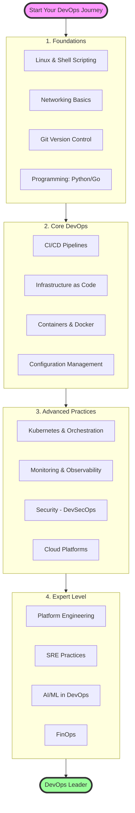

# DevOps Learning Roadmap 2025

## 🗺️ Interactive DevOps Journey

## 📚 Detailed Learning Path

### 🎯 Level 1: Foundations (3-6 months)

#### Linux & Shell Scripting
- [ ] Linux file system and permissions
- [ ] Process management
- [ ] Shell scripting (Bash)
- [ ] System administration basics
- **Project**: Automate server setup with bash scripts

#### Networking
- [ ] OSI Model
- [ ] TCP/IP, DNS, HTTP/HTTPS
- [ ] Load balancing concepts
- [ ] Firewalls and security groups
- **Project**: Set up a multi-tier network architecture

#### Version Control
- [ ] Git fundamentals
- [ ] Branching strategies
- [ ] Pull requests and code reviews
- [ ] Git workflows (GitFlow, GitHub Flow)
- **Project**: Contribute to open source

#### Programming
- [ ] Python or Go basics
- [ ] API development
- [ ] Script automation
- [ ] Error handling and logging
- **Project**: Build a CLI tool for deployment

### 🚀 Level 2: Core DevOps (6-9 months)

#### CI/CD Implementation
- [ ] Jenkins, GitHub Actions, or GitLab CI
- [ ] Pipeline as Code
- [ ] Automated testing integration
- [ ] Artifact management
- **Project**: Build end-to-end CI/CD pipeline
- **Use our tools**: [Deployment Frequency Calculator](./scripts/DeploymentFrequency/)

#### Infrastructure as Code
- [ ] Terraform fundamentals
- [ ] Cloud provider resources
- [ ] Module development
- [ ] State management
- **Project**: Provision complete environment with Terraform
- **Templates**: [Monitoring Stack](./templates/terraform/monitoring-stack/)

#### Containers
- [ ] Docker fundamentals
- [ ] Dockerfile best practices
- [ ] Container registries
- [ ] Docker Compose
- **Project**: Containerize a microservices application

#### Configuration Management
- [ ] Ansible playbooks
- [ ] Chef/Puppet basics
- [ ] Secrets management
- [ ] Environment configuration
- **Project**: Automate application deployment
- **Templates**: [DORA Metrics Setup](./templates/ansible/dora-metrics-setup/)

### 🏆 Level 3: Advanced Practices (9-12 months)

#### Kubernetes
- [ ] Core concepts and architecture
- [ ] Deployments and services
- [ ] Ingress and networking
- [ ] Helm charts
- [ ] Operators
- **Project**: Deploy microservices on K8s
- **Practice**: [GitOps with ArgoCD](./gitops/)

#### Monitoring & Observability
- [ ] Prometheus & Grafana
- [ ] ELK Stack
- [ ] Distributed tracing (Jaeger)
- [ ] APM tools
- **Project**: Implement full observability stack
- **Dashboard**: [DORA Metrics Dashboard](./templates/grafana/)

#### Security (DevSecOps)
- [ ] Container security scanning
- [ ] SAST/DAST integration
- [ ] Secrets management (Vault)
- [ ] Policy as Code
- **Project**: Implement security pipeline

#### Cloud Platforms
- [ ] AWS/Azure/GCP services
- [ ] Multi-cloud strategies
- [ ] Cost optimization
- [ ] Well-architected framework
- **Project**: Multi-region deployment

### 🌟 Level 4: Expert Level (12+ months)

#### Platform Engineering
- [ ] Internal Developer Platforms
- [ ] Service catalogs (Backstage)
- [ ] Developer experience metrics
- [ ] Self-service infrastructure
- **Guide**: [Platform Engineering](./platform-engineering/)

#### Site Reliability Engineering
- [ ] SLIs, SLOs, and SLAs
- [ ] Error budgets
- [ ] Chaos engineering
- [ ] Incident management
- **Metrics**: [MTTR Calculator](./scripts/MTTR/)

#### AI/ML in DevOps
- [ ] AIOps platforms
- [ ] Predictive analytics
- [ ] Automated remediation
- [ ] ML-driven optimization
- **Guide**: [AI and Machine Learning in DevOps](./AI%20and%20Machine%20Learning%20in%20DevOps.md)

#### FinOps
- [ ] Cloud cost analysis
- [ ] Resource optimization
- [ ] Showback/chargeback
- [ ] Cost allocation strategies
- **Project**: Implement cost optimization

## 📊 Progress Tracking

### Skill Assessment Matrix

| Skill Area | Beginner | Intermediate | Advanced | Expert |
|------------|----------|--------------|----------|--------|
| Linux/Shell | ⬜ | ⬜ | ⬜ | ⬜ |
| CI/CD | ⬜ | ⬜ | ⬜ | ⬜ |
| IaC | ⬜ | ⬜ | ⬜ | ⬜ |
| Containers | ⬜ | ⬜ | ⬜ | ⬜ |
| Kubernetes | ⬜ | ⬜ | ⬜ | ⬜ |
| Monitoring | ⬜ | ⬜ | ⬜ | ⬜ |
| Security | ⬜ | ⬜ | ⬜ | ⬜ |
| Cloud | ⬜ | ⬜ | ⬜ | ⬜ |

### DORA Metrics Goals

Track your team's progress:

| Metric | Current | Target | Elite |
|--------|---------|--------|-------|
| Deployment Frequency | ⬜ Weekly | ⬜ Daily | ⬜ On-demand |
| Lead Time | ⬜ 1 month | ⬜ 1 week | ⬜ < 1 hour |
| MTTR | ⬜ 1 week | ⬜ 1 day | ⬜ < 1 hour |
| Change Failure Rate | ⬜ 45% | ⬜ 15% | ⬜ < 5% |

## 🎓 Certifications Path

### Recommended Order:
1. **Linux**: LPIC-1 or Linux+
2. **Cloud**: AWS Solutions Architect → DevOps Engineer
3. **Kubernetes**: CKA → CKS
4. **Security**: Security+
5. **Advanced**: Google Cloud Professional DevOps Engineer

## 📖 Essential Resources

### Books
- "The Phoenix Project" - Gene Kim
- "Accelerate" - Forsgren, Humble, Kim
- "Site Reliability Engineering" - Google
- "Kubernetes Patterns" - Ibryam & Hub

### Online Courses
- Linux Academy / A Cloud Guru
- Coursera: Google SRE Course
- Udemy: Docker & Kubernetes
- Pluralsight: DevOps Path

### Communities
- DevOps Subreddit
- CNCF Slack
- DevOps Institute
- Local Meetups

## 🚦 Getting Started

1. **Assess Current Level**: Use the skill matrix above
2. **Set Goals**: Choose 2-3 skills to focus on
3. **Practice Daily**: Dedicate 1-2 hours/day
4. **Build Projects**: Apply learning immediately
5. **Measure Progress**: Use DORA metrics
6. **Share Knowledge**: Blog, speak, contribute

## 🎯 Quick Wins

Start with these to see immediate impact:

1. **Automate One Task**: Pick any manual process
2. **Set Up Basic CI**: Even just linting
3. **Monitor Something**: Start with uptime
4. **Document Process**: Create your first runbook
5. **Measure Baseline**: Use our [DORA scripts](./scripts/)

---

Remember: DevOps is a journey, not a destination. Focus on continuous improvement and learning from failures. 🚀