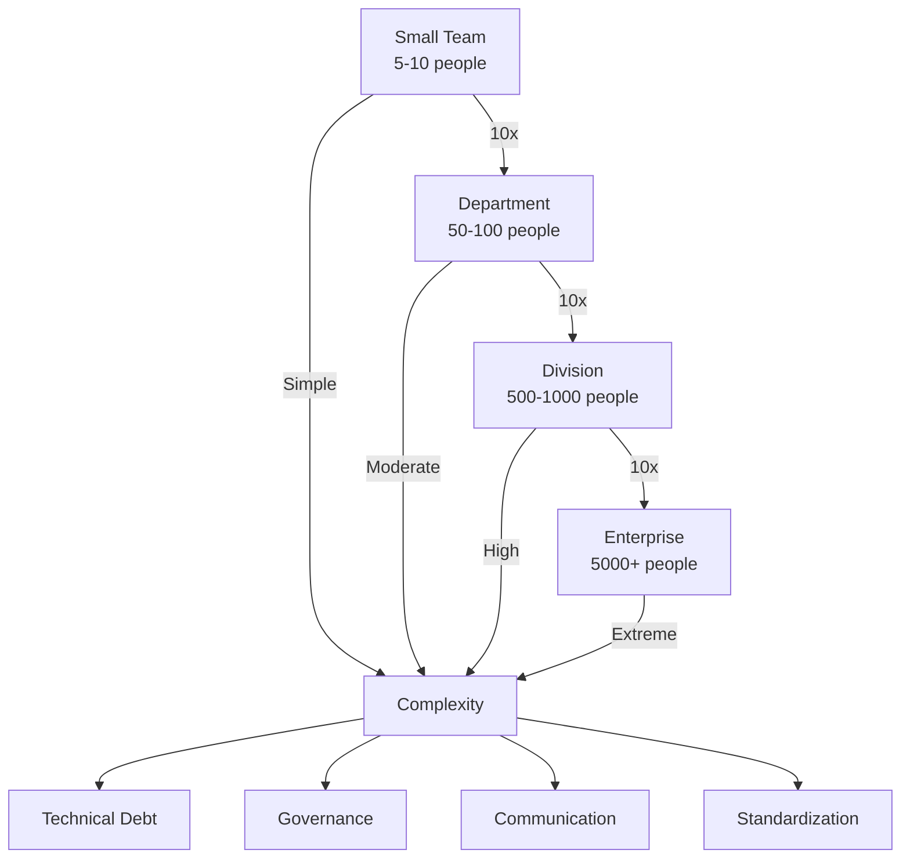

# Scaling DevOps for Large Organizations

## Introduction

Scaling DevOps in large enterprises presents unique challenges that go beyond technical implementation. It requires balancing standardization with team autonomy, managing complex governance requirements, and transforming established organizational structures while maintaining business continuity.

## The Enterprise DevOps Challenge

### Scale Complexity Matrix



### Common Scaling Challenges

| Challenge | Small Organization | Large Enterprise | Complexity Factor |
|-----------|-------------------|------------------|-------------------|
| **Tool Proliferation** | 5-10 tools | 100+ tools | 20x |
| **Team Coordination** | Direct communication | Multiple layers | 10x |
| **Compliance Requirements** | Basic | SOX, HIPAA, GDPR, etc. | 50x |
| **Legacy Systems** | Few or none | Hundreds | 100x |
| **Change Management** | Days | Months | 30x |
| **Budget Complexity** | Single budget | Multiple cost centers | 25x |

## Enterprise DevOps Strategies

### 1. The Spotify Model Adaptation

```python
class SpotifyModel:
    """Spotify model implementation for large organizations"""
    
    def __init__(self, organization_size: int):
        self.organization_size = organization_size
        self.structure = self._build_structure()
    
    def _build_structure(self) -> dict:
        """Build organizational structure based on Spotify model"""
        return {
            'squads': self._create_squads(),
            'tribes': self._create_tribes(),
            'chapters': self._create_chapters(),
            'guilds': self._create_guilds(),
            'governance': self._create_governance_model()
        }
    
    def _create_squads(self) -> list:
        """Create autonomous squads (teams)"""
        num_squads = self.organization_size // 8  # 8 people per squad
        squads = []
        
        for i in range(num_squads):
            squads.append({
                'id': f'squad-{i+1}',
                'size': 6-9,
                'composition': {
                    'product_owner': 1,
                    'developers': 4-6,
                    'qa': 1,
                    'ops': 1
                },
                'autonomy_level': 'high',
                'responsibilities': [
                    'Feature delivery',
                    'Production support',
                    'Technical decisions',
                    'Tool selection (from approved list)'
                ]
            })
        
        return squads
    
    def _create_tribes(self) -> list:
        """Create tribes (collections of squads)"""
        num_tribes = self.organization_size // 100  # ~100 people per tribe
        tribes = []
        
        for i in range(num_tribes):
            tribes.append({
                'id': f'tribe-{i+1}',
                'size': 40-150,
                'squads': 5-15,
                'leadership': {
                    'tribe_lead': 1,
                    'agile_coaches': 2-3
                },
                'focus': 'Business domain or product area',
                'meetings': {
                    'tribe_gathering': 'Quarterly',
                    'demo_day': 'Bi-weekly',
                    'retrospective': 'Monthly'
                }
            })
        
        return tribes
    
    def _create_chapters(self) -> list:
        """Create chapters (functional groups)"""
        return [
            {
                'name': 'Backend Development',
                'purpose': 'Share backend expertise',
                'meeting_frequency': 'Bi-weekly',
                'responsibilities': [
                    'Standards definition',
                    'Tool evaluation',
                    'Knowledge sharing',
                    'Career development'
                ]
            },
            {
                'name': 'Frontend Development',
                'purpose': 'Frontend standards and practices',
                'meeting_frequency': 'Bi-weekly'
            },
            {
                'name': 'Data Engineering',
                'purpose': 'Data practices and governance',
                'meeting_frequency': 'Weekly'
            },
            {
                'name': 'Quality Engineering',
                'purpose': 'Testing strategies and automation',
                'meeting_frequency': 'Weekly'
            },
            {
                'name': 'Site Reliability',
                'purpose': 'Reliability and operations',
                'meeting_frequency': 'Weekly'
            }
        ]
    
    def _create_guilds(self) -> list:
        """Create guilds (communities of interest)"""
        return [
            {
                'name': 'Security Guild',
                'type': 'cross-functional',
                'membership': 'voluntary',
                'purpose': 'Security best practices',
                'activities': [
                    'Security reviews',
                    'Threat modeling',
                    'Training sessions',
                    'Tool evaluation'
                ]
            },
            {
                'name': 'Architecture Guild',
                'type': 'cross-functional',
                'membership': 'voluntary + appointed',
                'purpose': 'Architectural standards'
            },
            {
                'name': 'Automation Guild',
                'type': 'cross-functional',
                'membership': 'voluntary',
                'purpose': 'Automation practices'
            },
            {
                'name': 'Cloud Native Guild',
                'type': 'technical',
                'membership': 'voluntary',
                'purpose': 'Cloud native practices'
            }
        ]
    
    def _create_governance_model(self) -> dict:
        """Create governance model for large scale"""
        return {
            'levels': {
                'strategic': {
                    'body': 'Technology Board',
                    'frequency': 'Monthly',
                    'decisions': [
                        'Technology strategy',
                        'Major investments',
                        'Standards approval',
                        'Risk management'
                    ]
                },
                'tactical': {
                    'body': 'Architecture Review Board',
                    'frequency': 'Bi-weekly',
                    'decisions': [
                        'Architecture patterns',
                        'Technology selection',
                        'Integration standards'
                    ]
                },
                'operational': {
                    'body': 'Squad/Tribe autonomy',
                    'frequency': 'Daily',
                    'decisions': [
                        'Implementation details',
                        'Tool usage',
                        'Deployment timing'
                    ]
                }
            }
        }
```

### 2. Platform Engineering at Scale

```python
class PlatformEngineering:
    """Platform engineering implementation for enterprises"""
    
    def __init__(self):
        self.platform_capabilities = {}
        self.golden_paths = {}
        self.service_catalog = {}
    
    def build_platform_architecture(self) -> dict:
        """Build enterprise platform architecture"""
        return {
            'layers': {
                'infrastructure': self._infrastructure_layer(),
                'runtime': self._runtime_layer(),
                'orchestration': self._orchestration_layer(),
                'developer_experience': self._developer_experience_layer(),
                'governance': self._governance_layer()
            },
            'principles': [
                'Self-service everything',
                'Secure by default',
                'Observable by design',
                'Cost-aware',
                'Compliant from the start'
            ]
        }
    
    def _infrastructure_layer(self) -> dict:
        """Define infrastructure layer"""
        return {
            'compute': {
                'kubernetes': {
                    'clusters': ['production', 'staging', 'development'],
                    'node_pools': ['general', 'compute-optimized', 'memory-optimized'],
                    'autoscaling': True,
                    'multi-region': True
                },
                'serverless': {
                    'functions': ['AWS Lambda', 'Azure Functions', 'GCP Cloud Functions'],
                    'containers': ['AWS Fargate', 'Azure Container Instances', 'Cloud Run']
                },
                'vms': {
                    'legacy_support': True,
                    'managed_images': ['linux', 'windows'],
                    'patch_management': 'automated'
                }
            },
            'networking': {
                'service_mesh': 'Istio',
                'api_gateway': 'Kong',
                'cdn': 'CloudFlare',
                'load_balancing': 'multi-layer',
                'zero_trust': True
            },
            'storage': {
                'object': ['S3', 'Azure Blob', 'GCS'],
                'block': ['EBS', 'Azure Disk', 'Persistent Disk'],
                'database': ['RDS', 'CosmosDB', 'Cloud SQL'],
                'cache': ['Redis', 'Memcached']
            }
        }
    
    def _runtime_layer(self) -> dict:
        """Define runtime layer"""
        return {
            'languages': {
                'supported': ['Java', 'Python', 'Go', 'JavaScript', 'C#'],
                'base_images': {
                    'java': 'company/java:11-alpine',
                    'python': 'company/python:3.9-slim',
                    'go': 'company/go:1.19-alpine',
                    'node': 'company/node:16-alpine',
                    'dotnet': 'company/dotnet:6.0'
                }
            },
            'frameworks': {
                'web': ['Spring Boot', 'FastAPI', 'Express', 'ASP.NET'],
                'data': ['Spark', 'Flink', 'Beam'],
                'ml': ['TensorFlow', 'PyTorch', 'MLflow']
            },
            'middleware': {
                'message_queue': ['Kafka', 'RabbitMQ', 'SQS'],
                'service_discovery': ['Consul', 'Eureka'],
                'configuration': ['Consul', 'AWS Parameter Store', 'Azure Key Vault']
            }
        }
    
    def _orchestration_layer(self) -> dict:
        """Define orchestration layer"""
        return {
            'container_orchestration': {
                'kubernetes': {
                    'version': '1.25+',
                    'addons': ['cert-manager', 'external-dns', 'nginx-ingress'],
                    'operators': ['prometheus', 'elasticsearch', 'kafka'],
                    'policies': ['pod-security', 'network-policies', 'resource-quotas']
                }
            },
            'workflow_orchestration': {
                'data_pipelines': 'Apache Airflow',
                'ci_cd': 'Tekton',
                'gitops': 'ArgoCD'
            },
            'service_orchestration': {
                'api_composition': 'GraphQL Federation',
                'saga_orchestration': 'Temporal',
                'event_orchestration': 'Apache Kafka'
            }
        }
    
    def _developer_experience_layer(self) -> dict:
        """Define developer experience layer"""
        return {
            'portal': {
                'type': 'Backstage',
                'features': [
                    'Service catalog',
                    'Software templates',
                    'Documentation',
                    'API explorer',
                    'Cost insights',
                    'Security scorecard'
                ]
            },
            'cli': {
                'name': 'platform-cli',
                'commands': [
                    'scaffold new-service',
                    'deploy',
                    'logs',
                    'metrics',
                    'cost estimate'
                ]
            },
            'ide_extensions': {
                'vscode': ['company-devtools', 'policy-checker'],
                'intellij': ['company-plugin', 'security-scanner']
            },
            'templates': {
                'microservice': ['rest-api', 'grpc-service', 'event-processor'],
                'data': ['batch-job', 'stream-processor', 'ml-pipeline'],
                'frontend': ['react-app', 'angular-app', 'mobile-app']
            }
        }
    
    def _governance_layer(self) -> dict:
        """Define governance layer"""
        return {
            'policies': {
                'security': [
                    'No root containers',
                    'Secrets in vault only',
                    'TLS everywhere',
                    'Vulnerability scanning required'
                ],
                'compliance': [
                    'Data residency',
                    'Audit logging',
                    'Retention policies',
                    'GDPR compliance'
                ],
                'cost': [
                    'Tagging required',
                    'Budget alerts',
                    'Resource limits',
                    'Idle resource cleanup'
                ]
            },
            'enforcement': {
                'admission_control': 'OPA/Gatekeeper',
                'policy_as_code': 'Sentinel/Rego',
                'scanning': 'Continuous',
                'reporting': 'Real-time dashboards'
            }
        }
    
    def create_golden_path(self, service_type: str) -> dict:
        """Create golden path for service type"""
        paths = {
            'microservice': {
                'steps': [
                    {
                        'step': 1,
                        'action': 'Generate from template',
                        'tool': 'Backstage',
                        'time': '5 minutes'
                    },
                    {
                        'step': 2,
                        'action': 'Local development',
                        'tool': 'Docker Compose',
                        'time': '1 hour'
                    },
                    {
                        'step': 3,
                        'action': 'Write tests',
                        'tool': 'Testing framework',
                        'time': '2 hours'
                    },
                    {
                        'step': 4,
                        'action': 'CI/CD setup',
                        'tool': 'Auto-configured',
                        'time': '0 minutes'
                    },
                    {
                        'step': 5,
                        'action': 'Deploy to dev',
                        'tool': 'Platform CLI',
                        'time': '10 minutes'
                    },
                    {
                        'step': 6,
                        'action': 'Security scan',
                        'tool': 'Automated',
                        'time': '5 minutes'
                    },
                    {
                        'step': 7,
                        'action': 'Deploy to production',
                        'tool': 'GitOps',
                        'time': '15 minutes'
                    }
                ],
                'total_time': '< 4 hours',
                'automation_level': '90%'
            }
        }
        
        return paths.get(service_type, {})
```

## Governance and Compliance

### Compliance Automation Framework

```python
class ComplianceAutomation:
    """Automated compliance for enterprise DevOps"""
    
    def __init__(self):
        self.regulations = ['SOX', 'HIPAA', 'GDPR', 'PCI-DSS', 'ISO-27001']
        self.controls = {}
        self.evidence = {}
    
    def implement_compliance_framework(self) -> dict:
        """Implement comprehensive compliance framework"""
        return {
            'sox_compliance': self._sox_controls(),
            'hipaa_compliance': self._hipaa_controls(),
            'gdpr_compliance': self._gdpr_controls(),
            'pci_compliance': self._pci_controls(),
            'automation': self._automation_controls()
        }
    
    def _sox_controls(self) -> dict:
        """SOX compliance controls"""
        return {
            'change_management': {
                'approval_workflow': {
                    'dev': 'Peer review',
                    'staging': 'Tech lead approval',
                    'production': 'Change board approval'
                },
                'segregation_of_duties': {
                    'developer': 'Cannot approve own changes',
                    'approver': 'Cannot deploy to production',
                    'deployer': 'Cannot modify code'
                },
                'audit_trail': {
                    'git_commits': 'Signed and tracked',
                    'deployments': 'Logged with approvals',
                    'access': 'All access logged',
                    'retention': '7 years'
                }
            },
            'access_control': {
                'principle': 'Least privilege',
                'review_frequency': 'Quarterly',
                'mfa_required': True,
                'session_timeout': '30 minutes'
            }
        }
    
    def _hipaa_controls(self) -> dict:
        """HIPAA compliance controls"""
        return {
            'data_protection': {
                'encryption_at_rest': 'AES-256',
                'encryption_in_transit': 'TLS 1.3',
                'key_management': 'HSM-backed'
            },
            'access_controls': {
                'authentication': 'Multi-factor',
                'authorization': 'Role-based',
                'audit_logging': 'All PHI access logged'
            },
            'breach_notification': {
                'detection': 'Real-time monitoring',
                'notification': 'Within 60 days',
                'documentation': 'Automated reporting'
            }
        }
    
    def _gdpr_controls(self) -> dict:
        """GDPR compliance controls"""
        return {
            'data_privacy': {
                'consent_management': 'Automated tracking',
                'right_to_erasure': 'API-driven deletion',
                'data_portability': 'Export APIs',
                'privacy_by_design': 'Default settings'
            },
            'data_protection': {
                'pseudonymization': 'Automated PII masking',
                'encryption': 'Field-level encryption',
                'access_control': 'Need-to-know basis'
            },
            'breach_notification': {
                'supervisory_authority': 'Within 72 hours',
                'data_subjects': 'Without undue delay'
            }
        }
    
    def _pci_controls(self) -> dict:
        """PCI-DSS compliance controls"""
        return {
            'network_security': {
                'segmentation': 'CDE isolation',
                'firewall': 'WAF + network firewall',
                'intrusion_detection': 'IDS/IPS active'
            },
            'data_protection': {
                'card_data': 'Tokenization',
                'transmission': 'TLS only',
                'storage': 'Encrypted + masked'
            },
            'access_control': {
                'unique_ids': 'Individual accounts',
                'password_policy': 'Complex + rotation',
                'physical_access': 'Badge + biometric'
            }
        }
    
    def _automation_controls(self) -> dict:
        """Automated compliance controls"""
        return {
            'continuous_compliance': {
                'scanning': {
                    'frequency': 'Every commit',
                    'tools': ['Prisma Cloud', 'Qualys', 'Veracode'],
                    'gates': 'Block non-compliant deployments'
                },
                'policy_as_code': {
                    'engine': 'Open Policy Agent',
                    'policies': 'Version controlled',
                    'enforcement': 'Admission control'
                },
                'remediation': {
                    'auto_patch': 'Critical vulnerabilities',
                    'configuration_drift': 'Auto-correct',
                    'access_review': 'Automated revocation'
                }
            },
            'evidence_collection': {
                'automated_screenshots': 'UI testing captures',
                'log_aggregation': 'Centralized SIEM',
                'report_generation': 'Monthly compliance reports',
                'audit_preparation': 'Evidence package automation'
            }
        }
```

## Standardization vs Flexibility

### Balanced Governance Model

```python
class GovernanceModel:
    """Balanced governance for enterprise scale"""
    
    def __init__(self):
        self.standards = {}
        self.flexibility_zones = {}
        
    def define_governance_zones(self) -> dict:
        """Define governance zones with varying flexibility"""
        return {
            'strict_standardization': {
                'scope': [
                    'Security policies',
                    'Compliance requirements',
                    'Data governance',
                    'Financial systems'
                ],
                'flexibility': 'None',
                'approval': 'Central governance board',
                'exceptions': 'Rare, requires C-level approval'
            },
            'guided_standardization': {
                'scope': [
                    'Infrastructure patterns',
                    'CI/CD pipelines',
                    'Monitoring standards',
                    'API guidelines'
                ],
                'flexibility': 'Limited options',
                'approval': 'Platform team',
                'exceptions': 'Allowed with justification'
            },
            'flexible_standardization': {
                'scope': [
                    'Programming languages',
                    'Development tools',
                    'Testing frameworks',
                    'Documentation formats'
                ],
                'flexibility': 'Choose from approved list',
                'approval': 'Team lead',
                'exceptions': 'Common'
            },
            'team_autonomy': {
                'scope': [
                    'Code style',
                    'Sprint ceremonies',
                    'Team tools',
                    'Local development'
                ],
                'flexibility': 'Full',
                'approval': 'Team decision',
                'exceptions': 'Not applicable'
            }
        }
    
    def create_decision_framework(self) -> dict:
        """Create decision framework for standards vs flexibility"""
        return {
            'decision_matrix': {
                'criteria': [
                    {
                        'factor': 'Security impact',
                        'weight': 0.3,
                        'favors': 'standardization'
                    },
                    {
                        'factor': 'Compliance requirement',
                        'weight': 0.25,
                        'favors': 'standardization'
                    },
                    {
                        'factor': 'Innovation potential',
                        'weight': 0.15,
                        'favors': 'flexibility'
                    },
                    {
                        'factor': 'Team productivity',
                        'weight': 0.15,
                        'favors': 'flexibility'
                    },
                    {
                        'factor': 'Maintenance cost',
                        'weight': 0.1,
                        'favors': 'standardization'
                    },
                    {
                        'factor': 'Skill availability',
                        'weight': 0.05,
                        'favors': 'standardization'
                    }
                ]
            },
            'evaluation_process': [
                'Identify decision type',
                'Apply decision matrix',
                'Calculate weighted score',
                'Determine governance zone',
                'Document decision rationale'
            ]
        }
```

## Inner Source Development

### Inner Source Implementation

```python
class InnerSource:
    """Inner source implementation for enterprises"""
    
    def __init__(self):
        self.repositories = {}
        self.contribution_model = {}
        
    def setup_inner_source(self) -> dict:
        """Setup inner source program"""
        return {
            'program_structure': {
                'governance': {
                    'steering_committee': [
                        'Engineering leadership',
                        'Architecture team',
                        'Security team',
                        'Legal team'
                    ],
                    'trusted_committers': 'Per project maintainers',
                    'contributors': 'All developers'
                },
                'project_lifecycle': {
                    'proposal': 'RFC process',
                    'incubation': '3-6 months',
                    'graduation': 'Production use by 3+ teams',
                    'deprecation': 'Planned migration path'
                }
            },
            'contribution_process': {
                'discovery': {
                    'portal': 'Internal GitHub/GitLab',
                    'search': 'Tagged and categorized',
                    'documentation': 'README standards'
                },
                'contribution': {
                    'issues': 'Good first issues tagged',
                    'pull_requests': 'Template required',
                    'code_review': 'Trusted committer approval',
                    'ci_cd': 'Automated testing required'
                },
                'recognition': {
                    'metrics': 'Contribution tracking',
                    'gamification': 'Badges and leaderboards',
                    'rewards': 'Quarterly recognition',
                    'career': 'Performance review credit'
                }
            },
            'success_metrics': {
                'adoption': 'Number of teams using',
                'contributions': 'PRs from outside team',
                'reuse': 'Dependency count',
                'quality': 'Bug reports and fixes',
                'velocity': 'Time to resolve issues'
            }
        }
    
    def create_inner_source_project(self, 
                                   name: str,
                                   type: str) -> dict:
        """Create inner source project structure"""
        return {
            'repository_structure': {
                'README.md': 'Project overview and quickstart',
                'CONTRIBUTING.md': 'How to contribute',
                'CODE_OF_CONDUCT.md': 'Community standards',
                'LICENSE': 'Internal use license',
                'MAINTAINERS.md': 'Trusted committers list',
                'ROADMAP.md': 'Future plans',
                'CHANGELOG.md': 'Version history',
                '.github/': {
                    'ISSUE_TEMPLATE/': 'Issue templates',
                    'PULL_REQUEST_TEMPLATE.md': 'PR template',
                    'workflows/': 'CI/CD pipelines'
                }
            },
            'governance_model': {
                'trusted_committers': 2-3,
                'decision_making': 'Consensus with fallback to vote',
                'meeting_cadence': 'Bi-weekly',
                'communication': 'Dedicated Slack channel',
                'sla': {
                    'pr_review': '48 hours',
                    'issue_response': '72 hours',
                    'security_fix': '24 hours'
                }
            }
        }
```

## Metrics at Scale

### Enterprise Metrics Framework

```python
import pandas as pd
from typing import Dict, List
from datetime import datetime, timedelta

class EnterpriseMetrics:
    """Metrics framework for large-scale DevOps"""
    
    def __init__(self):
        self.metrics_catalog = {}
        self.aggregation_rules = {}
        
    def define_metrics_hierarchy(self) -> dict:
        """Define multi-level metrics hierarchy"""
        return {
            'levels': {
                'executive': {
                    'metrics': [
                        'Overall DORA metrics',
                        'Cost per deployment',
                        'Revenue impact of incidents',
                        'Developer productivity index',
                        'Time to market'
                    ],
                    'frequency': 'Monthly',
                    'format': 'Executive dashboard'
                },
                'portfolio': {
                    'metrics': [
                        'Product line DORA metrics',
                        'Cross-team dependencies',
                        'Resource utilization',
                        'Technical debt ratio',
                        'Innovation velocity'
                    ],
                    'frequency': 'Bi-weekly',
                    'format': 'Portfolio scorecards'
                },
                'team': {
                    'metrics': [
                        'Team DORA metrics',
                        'Sprint velocity',
                        'Code quality metrics',
                        'On-call burden',
                        'Knowledge sharing'
                    ],
                    'frequency': 'Weekly',
                    'format': 'Team dashboards'
                },
                'individual': {
                    'metrics': [
                        'Commit frequency',
                        'Code review participation',
                        'Documentation contributions',
                        'Learning goals progress'
                    ],
                    'frequency': 'Continuous',
                    'format': 'Personal dashboard'
                }
            }
        }
    
    def calculate_enterprise_dora(self, 
                                 team_metrics: List[dict]) -> dict:
        """Calculate enterprise-wide DORA metrics"""
        df = pd.DataFrame(team_metrics)
        
        return {
            'deployment_frequency': {
                'enterprise_average': df['deployment_frequency'].mean(),
                'top_performers': df.nlargest(10, 'deployment_frequency')['team'].tolist(),
                'improvement_needed': df.nsmallest(10, 'deployment_frequency')['team'].tolist(),
                'trend': self._calculate_trend(df, 'deployment_frequency')
            },
            'lead_time': {
                'enterprise_median': df['lead_time_hours'].median(),
                'distribution': {
                    'p50': df['lead_time_hours'].quantile(0.5),
                    'p75': df['lead_time_hours'].quantile(0.75),
                    'p90': df['lead_time_hours'].quantile(0.9),
                    'p95': df['lead_time_hours'].quantile(0.95)
                }
            },
            'mttr': {
                'enterprise_average': df['mttr_minutes'].mean(),
                'by_severity': df.groupby('severity')['mttr_minutes'].mean().to_dict()
            },
            'change_failure_rate': {
                'enterprise_rate': (df['failed_deployments'].sum() / 
                                   df['total_deployments'].sum() * 100),
                'by_environment': df.groupby('environment')['change_failure_rate'].mean().to_dict()
            }
        }
    
    def _calculate_trend(self, df: pd.DataFrame, metric: str) -> str:
        """Calculate trend for metric"""
        # Simplified trend calculation
        if len(df) < 2:
            return 'insufficient_data'
        
        recent = df[metric].tail(30).mean()
        previous = df[metric].head(len(df)-30).mean()
        
        if recent > previous * 1.1:
            return 'improving'
        elif recent < previous * 0.9:
            return 'declining'
        else:
            return 'stable'
    
    def create_cost_metrics(self) -> dict:
        """Create cost optimization metrics"""
        return {
            'infrastructure_costs': {
                'compute': {
                    'metric': 'Cost per compute hour',
                    'target': '< $0.10',
                    'optimization': 'Spot instances, rightsizing'
                },
                'storage': {
                    'metric': 'Cost per GB stored',
                    'target': '< $0.023',
                    'optimization': 'Lifecycle policies, compression'
                },
                'network': {
                    'metric': 'Data transfer costs',
                    'target': '< 5% of total',
                    'optimization': 'CDN, caching'
                }
            },
            'operational_costs': {
                'incident_cost': {
                    'metric': 'Average cost per incident',
                    'calculation': 'MTTR * hourly_rate * people_involved',
                    'target': '< $5000'
                },
                'deployment_cost': {
                    'metric': 'Cost per deployment',
                    'calculation': 'CI/CD time * resource_cost',
                    'target': '< $50'
                }
            },
            'efficiency_metrics': {
                'resource_utilization': {
                    'cpu': 'Target 60-80%',
                    'memory': 'Target 70-85%',
                    'storage': 'Target 70-80%'
                },
                'idle_resources': {
                    'detection': 'Resources unused for 7+ days',
                    'action': 'Automated shutdown/deletion'
                }
            }
        }
```

## Toolchain Management

### Enterprise Toolchain Strategy

```python
class ToolchainManagement:
    """Toolchain management for large enterprises"""
    
    def __init__(self):
        self.tool_inventory = {}
        self.evaluation_criteria = {}
        
    def create_tool_governance(self) -> dict:
        """Create tool governance framework"""
        return {
            'tool_categories': {
                'mandatory': {
                    'description': 'Required for all teams',
                    'examples': ['Git', 'Jira', 'Slack', 'SSO'],
                    'approval': 'Not required',
                    'support': 'Full enterprise support'
                },
                'recommended': {
                    'description': 'Preferred tools with support',
                    'examples': ['Jenkins', 'Kubernetes', 'Terraform'],
                    'approval': 'Not required',
                    'support': 'Platform team support'
                },
                'approved': {
                    'description': 'Approved for use',
                    'examples': ['Various testing tools', 'IDEs'],
                    'approval': 'Not required',
                    'support': 'Community support'
                },
                'experimental': {
                    'description': 'Under evaluation',
                    'examples': ['New frameworks', 'Beta tools'],
                    'approval': 'Team lead',
                    'support': 'No formal support'
                },
                'prohibited': {
                    'description': 'Not allowed',
                    'examples': ['Unlicensed tools', 'Security risks'],
                    'approval': 'Not available',
                    'support': 'None'
                }
            },
            'evaluation_process': {
                'request': 'Jira ticket with business case',
                'evaluation': {
                    'security_review': 'Security team assessment',
                    'architecture_review': 'Fit with tech stack',
                    'cost_analysis': 'TCO calculation',
                    'poc': 'Proof of concept if needed'
                },
                'decision': 'Tool committee monthly meeting',
                'onboarding': 'Documentation and training'
            },
            'lifecycle_management': {
                'adoption': 'Pilot -> Limited -> General availability',
                'review': 'Annual tool portfolio review',
                'deprecation': '6-month deprecation notice',
                'migration': 'Funded migration projects'
            }
        }
    
    def calculate_tool_tco(self, tool_name: str) -> dict:
        """Calculate total cost of ownership for a tool"""
        return {
            'direct_costs': {
                'licensing': {
                    'model': 'Per user/Per resource',
                    'annual_cost': 50000,
                    'growth_projection': '20% yearly'
                },
                'infrastructure': {
                    'hosting': 10000,
                    'storage': 2000,
                    'network': 1000
                },
                'support': {
                    'vendor_support': 10000,
                    'premium_support': 5000
                }
            },
            'indirect_costs': {
                'training': {
                    'initial_training': 20000,
                    'ongoing_training': 5000
                },
                'integration': {
                    'initial_setup': 30000,
                    'maintenance': 10000
                },
                'operations': {
                    'administration': '0.5 FTE',
                    'troubleshooting': '0.25 FTE'
                }
            },
            'opportunity_costs': {
                'migration_from_existing': 50000,
                'productivity_loss': 20000,
                'risk_mitigation': 10000
            },
            'total_3_year_tco': 350000,
            'per_user_cost': 350
        }
```

## Center of Excellence (CoE)

### DevOps CoE Structure

```yaml
# devops-coe-structure.yaml
center_of_excellence:
  mission: "Accelerate DevOps adoption and maturity across the enterprise"
  
  structure:
    leadership:
      director: "Reports to CTO/CIO"
      steering_committee:
        - "VP Engineering"
        - "VP Operations"
        - "VP Security"
        - "VP Product"
    
    teams:
      platform_engineering:
        size: 15-20
        responsibilities:
          - "Build and maintain platform"
          - "Golden path development"
          - "Tool integration"
          - "Self-service capabilities"
      
      enablement:
        size: 10-15
        responsibilities:
          - "Training and certification"
          - "Best practices documentation"
          - "Team coaching"
          - "Dojo sessions"
      
      toolchain:
        size: 5-10
        responsibilities:
          - "Tool evaluation"
          - "License management"
          - "Integration development"
          - "Tool support"
      
      governance:
        size: 5-8
        responsibilities:
          - "Standards definition"
          - "Compliance automation"
          - "Metrics and reporting"
          - "Security integration"
  
  services:
    consulting:
      - "DevOps assessments"
      - "Transformation planning"
      - "Architecture reviews"
      - "Tool selection"
    
    training:
      - "DevOps fundamentals"
      - "Tool-specific training"
      - "Certification programs"
      - "Hands-on workshops"
    
    support:
      - "Platform support"
      - "Tool troubleshooting"
      - "Best practices Q&A"
      - "Office hours"
    
    innovation:
      - "Proof of concepts"
      - "Tool evaluation"
      - "Process improvement"
      - "Automation development"
  
  success_metrics:
    adoption:
      - "Teams using platform: 80%"
      - "Self-service adoption: 70%"
      - "Training completion: 90%"
    
    efficiency:
      - "Deployment frequency: 10x improvement"
      - "Lead time: 50% reduction"
      - "MTTR: 60% reduction"
      - "Toil reduction: 40%"
    
    satisfaction:
      - "Developer NPS: > 50"
      - "Platform satisfaction: > 4.0/5"
      - "Training effectiveness: > 4.5/5"
  
  operating_model:
    funding: "Central funding with chargeback"
    engagement: "Project-based and ongoing support"
    prioritization: "Business value and strategic alignment"
    communication:
      - "Monthly newsletter"
      - "Quarterly roadshow"
      - "Annual DevOps conference"
      - "Slack community"
```

## Case Studies

### Case Study 1: Global Bank Transformation

```python
class BankTransformation:
    """Global bank DevOps transformation case study"""
    
    def transformation_timeline(self) -> dict:
        return {
            'initial_state': {
                'organization_size': 50000,
                'it_staff': 8000,
                'applications': 3000,
                'deployment_frequency': 'Quarterly',
                'lead_time': '6 months',
                'change_failure_rate': '25%',
                'mttr': '48 hours'
            },
            'year_1': {
                'focus': 'Foundation',
                'initiatives': [
                    'Established DevOps CoE',
                    'Pilot with 10 teams',
                    'Basic CI/CD implementation',
                    'Cloud migration started'
                ],
                'results': {
                    'pilot_deployment_frequency': 'Weekly',
                    'pilot_lead_time': '2 weeks',
                    'executive_buy_in': 'Secured'
                }
            },
            'year_2': {
                'focus': 'Expansion',
                'initiatives': [
                    'Platform MVP launched',
                    'Expanded to 100 teams',
                    'Automated compliance checks',
                    'Container adoption'
                ],
                'results': {
                    'deployment_frequency': 'Bi-weekly',
                    'lead_time': '1 month',
                    'platform_adoption': '30%'
                }
            },
            'year_3': {
                'focus': 'Acceleration',
                'initiatives': [
                    'Full platform capabilities',
                    'Inner source program',
                    'SRE practices adopted',
                    'Multi-cloud strategy'
                ],
                'results': {
                    'deployment_frequency': 'Daily',
                    'lead_time': '1 week',
                    'change_failure_rate': '10%',
                    'mttr': '2 hours'
                }
            },
            'year_5': {
                'focus': 'Optimization',
                'current_state': {
                    'deployment_frequency': 'On-demand',
                    'lead_time': '< 1 day',
                    'change_failure_rate': '5%',
                    'mttr': '< 1 hour',
                    'platform_adoption': '85%',
                    'cost_savings': '$50M annually'
                }
            },
            'key_success_factors': [
                'Executive sponsorship',
                'Incremental approach',
                'Platform investment',
                'Culture focus',
                'Continuous learning'
            ]
        }
```

### Case Study 2: Retail Giant Migration

```python
class RetailTransformation:
    """Large retailer DevOps transformation"""
    
    def transformation_approach(self) -> dict:
        return {
            'challenge': {
                'legacy_systems': '60% of portfolio',
                'peak_season': 'Black Friday 10x traffic',
                'stores': '5000 physical locations',
                'competition': 'Amazon and digital natives'
            },
            'strategy': {
                'strangler_fig': 'Gradual legacy modernization',
                'api_first': 'API layer over legacy',
                'mobile_first': 'Customer experience focus',
                'edge_computing': 'Store-level processing'
            },
            'implementation': {
                'phase_1': {
                    'name': 'Digital foundation',
                    'duration': '18 months',
                    'achievements': [
                        'E-commerce platform modernized',
                        'Mobile app redesigned',
                        'API gateway implemented',
                        'Cloud migration 30% complete'
                    ]
                },
                'phase_2': {
                    'name': 'Omnichannel integration',
                    'duration': '24 months',
                    'achievements': [
                        'Inventory real-time sync',
                        'Order management system',
                        'Store systems integration',
                        'Cloud migration 70% complete'
                    ]
                },
                'phase_3': {
                    'name': 'Innovation platform',
                    'duration': '12 months',
                    'achievements': [
                        'ML/AI capabilities',
                        'Personalization engine',
                        'IoT integration',
                        'Edge computing deployed'
                    ]
                }
            },
            'results': {
                'technical': {
                    'deployment_frequency': '500x improvement',
                    'lead_time': '95% reduction',
                    'availability': '99.99% achieved',
                    'peak_capacity': '15x handled smoothly'
                },
                'business': {
                    'online_revenue': '200% growth',
                    'customer_satisfaction': '35% improvement',
                    'time_to_market': '75% faster',
                    'operational_cost': '30% reduction'
                }
            }
        }
```

## Scaling Challenges and Solutions

### Common Pitfalls and Mitigations

```python
class ScalingChallenges:
    """Common scaling challenges and solutions"""
    
    def identify_challenges(self) -> dict:
        return {
            'organizational_resistance': {
                'symptoms': [
                    'Shadow IT proliferation',
                    'Teams bypassing processes',
                    'Low platform adoption',
                    'Compliance violations'
                ],
                'root_causes': [
                    'Loss of autonomy fear',
                    'Additional overhead perception',
                    'Unclear value proposition',
                    'Poor change management'
                ],
                'solutions': [
                    'Involve teams in platform design',
                    'Show clear value and ROI',
                    'Gradual rollout with volunteers',
                    'Continuous feedback loops',
                    'Success story sharing'
                ]
            },
            'technical_debt': {
                'symptoms': [
                    'Slow feature delivery',
                    'High maintenance cost',
                    'Frequent production issues',
                    'Developer frustration'
                ],
                'root_causes': [
                    'Legacy system dependencies',
                    'Accumulated shortcuts',
                    'Lack of refactoring time',
                    'Missing documentation'
                ],
                'solutions': [
                    '20% time for tech debt',
                    'Strangler fig pattern',
                    'Technical debt budget',
                    'Automated documentation',
                    'Refactoring sprints'
                ]
            },
            'skill_gaps': {
                'symptoms': [
                    'Slow adoption of new tools',
                    'High dependency on experts',
                    'Quality issues',
                    'Resistance to change'
                ],
                'root_causes': [
                    'Rapid technology change',
                    'Limited training budget',
                    'No learning time',
                    'Hire-for-skill approach'
                ],
                'solutions': [
                    'Comprehensive training program',
                    'Mentorship and pairing',
                    'Learning time allocation',
                    'Hire-for-potential approach',
                    'Internal certification program'
                ]
            },
            'tool_sprawl': {
                'symptoms': [
                    'Integration nightmares',
                    'High licensing costs',
                    'Inconsistent practices',
                    'Security vulnerabilities'
                ],
                'root_causes': [
                    'Team autonomy without guidance',
                    'No evaluation process',
                    'FOMO on new tools',
                    'Vendor lock-in'
                ],
                'solutions': [
                    'Tool governance framework',
                    'Approved tool catalog',
                    'Regular portfolio review',
                    'Platform approach',
                    'Exit strategy requirement'
                ]
            }
        }
```

## Future-Proofing Enterprise DevOps

### Emerging Trends and Preparation

```python
class FutureProofing:
    """Future-proofing enterprise DevOps"""
    
    def emerging_trends(self) -> dict:
        return {
            'ai_ops': {
                'current_state': 'Early adoption',
                'potential_impact': 'High',
                'preparation': [
                    'Invest in data quality',
                    'Build ML expertise',
                    'Start with anomaly detection',
                    'Gradual automation increase'
                ]
            },
            'platform_engineering': {
                'current_state': 'Growing rapidly',
                'potential_impact': 'Very High',
                'preparation': [
                    'Build platform team',
                    'Developer experience focus',
                    'Self-service everything',
                    'Golden path development'
                ]
            },
            'edge_computing': {
                'current_state': 'Emerging',
                'potential_impact': 'Medium-High',
                'preparation': [
                    'Edge architecture patterns',
                    'Distributed systems expertise',
                    'IoT integration capabilities',
                    '5G readiness'
                ]
            },
            'quantum_computing': {
                'current_state': 'Experimental',
                'potential_impact': 'Long-term High',
                'preparation': [
                    'Monitor developments',
                    'Identify use cases',
                    'Build partnerships',
                    'Quantum-safe cryptography'
                ]
            },
            'sustainability': {
                'current_state': 'Increasing focus',
                'potential_impact': 'High',
                'preparation': [
                    'Carbon footprint tracking',
                    'Green computing practices',
                    'Efficient resource usage',
                    'Sustainability metrics'
                ]
            }
        }
```

## Best Practices for Scale

1. **Start with Why**: Clear vision and business value
2. **Executive Sponsorship**: Active C-level support
3. **Incremental Approach**: Pilot, prove, scale
4. **Platform Thinking**: Self-service and automation
5. **Culture First**: Change management priority
6. **Measure Everything**: Data-driven decisions
7. **Inner Source**: Leverage internal expertise
8. **Continuous Learning**: Invest in people
9. **Standards with Flexibility**: Balance governance
10. **Future-Ready Architecture**: Modularity and APIs

## Conclusion

Scaling DevOps in large organizations requires a balanced approach that combines:
- **Strong governance** with **team autonomy**
- **Standardization** with **innovation flexibility**
- **Platform capabilities** with **self-service**
- **Central expertise** with **distributed execution**
- **Compliance requirements** with **delivery speed**

Success comes from treating the transformation as a multi-year journey, investing in platform engineering, focusing on culture change, and continuously measuring and improving.

Remember: Scale doesn't mean slow. With the right approach, large enterprises can achieve the same agility as startups while maintaining the governance and compliance required at scale.

---

[Back to Main README](./README.md)