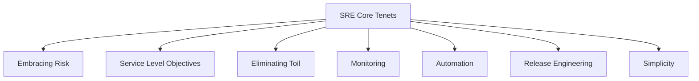

# Site Reliability Engineering (SRE)

## Introduction to SRE

Site Reliability Engineering (SRE) is Google's approach to running production systems at scale. It's what happens when you treat operations as a software problem and staff it with software engineers.

### SRE vs Traditional Operations

| Aspect | Traditional Ops | SRE |
|--------|-----------------|-----|
| **Focus** | Manual processes, reactive | Automation, proactive |
| **Team** | Ops specialists | Software engineers |
| **Change** | Risk-averse | Managed risk with error budgets |
| **Scaling** | Linear with service growth | Sub-linear through automation |
| **Incidents** | Fire-fighting | Learning opportunities |
| **Work** | Repetitive tasks | Engineering solutions |

### Core Tenets of SRE



## SRE Principles and Practices

### 1. Embracing Risk

Not all services require 100% availability. SRE quantifies risk and makes informed decisions.

#### Risk Analysis Framework
```python
def calculate_acceptable_downtime(slo_percentage):
    """
    Calculate acceptable downtime based on SLO
    """
    annual_minutes = 365 * 24 * 60
    uptime_minutes = annual_minutes * (slo_percentage / 100)
    downtime_minutes = annual_minutes - uptime_minutes
    
    return {
        'daily': downtime_minutes / 365,
        'weekly': downtime_minutes / 52,
        'monthly': downtime_minutes / 12,
        'quarterly': downtime_minutes / 4,
        'annual': downtime_minutes
    }

# Example SLO targets
slos = {
    '99%': calculate_acceptable_downtime(99),      # 3.65 days/year
    '99.9%': calculate_acceptable_downtime(99.9),  # 8.76 hours/year
    '99.95%': calculate_acceptable_downtime(99.95),# 4.38 hours/year
    '99.99%': calculate_acceptable_downtime(99.99),# 52.56 minutes/year
    '99.999%': calculate_acceptable_downtime(99.999)# 5.26 minutes/year
}
```

### 2. Service Level Objectives (SLOs)

SLOs are the foundation of SRE practices. They define the reliability targets for your service.

#### SLO Development Process
```yaml
# slo-config.yaml
apiVersion: slo/v1
kind: ServiceLevelObjective
metadata:
  name: api-latency-slo
  service: user-api
spec:
  description: "95% of requests complete within 300ms"
  objective: 99.9  # Target success rate
  window: 30d      # Rolling window
  
  sli:
    type: latency
    threshold: 300ms
    percentile: 95
    
  alerting:
    - type: burn_rate
      severity: page
      burn_rate: 14.4  # 1-hour burn rate
      window: 1h
    - type: burn_rate
      severity: ticket
      burn_rate: 6     # 6-hour burn rate
      window: 6h
```

### 3. Service Level Indicators (SLIs)

SLIs are the metrics that measure your service's behavior. Choose SLIs that directly impact user experience.

#### Common SLI Types

```python
from dataclasses import dataclass
from typing import List, Optional
from datetime import datetime, timedelta

@dataclass
class SLI:
    """Base class for Service Level Indicators"""
    name: str
    target: float
    measurement_window: timedelta
    
class AvailabilitySLI(SLI):
    """Measures service availability"""
    def calculate(self, successful_requests: int, total_requests: int) -> float:
        if total_requests == 0:
            return 100.0
        return (successful_requests / total_requests) * 100

class LatencySLI(SLI):
    """Measures request latency"""
    def calculate(self, latencies: List[float], percentile: float = 95) -> float:
        sorted_latencies = sorted(latencies)
        index = int(len(sorted_latencies) * (percentile / 100))
        return sorted_latencies[index] if sorted_latencies else 0

class ThroughputSLI(SLI):
    """Measures request throughput"""
    def calculate(self, request_count: int, time_period: timedelta) -> float:
        return request_count / time_period.total_seconds()

class ErrorRateSLI(SLI):
    """Measures error rate"""
    def calculate(self, errors: int, total: int) -> float:
        if total == 0:
            return 0.0
        return (errors / total) * 100

# Example SLI Dashboard Configuration
sli_dashboard = {
    "availability": AvailabilitySLI(
        name="API Availability",
        target=99.9,
        measurement_window=timedelta(days=30)
    ),
    "latency": LatencySLI(
        name="P95 Latency",
        target=300,  # milliseconds
        measurement_window=timedelta(hours=1)
    ),
    "error_rate": ErrorRateSLI(
        name="Error Rate",
        target=0.1,  # percentage
        measurement_window=timedelta(hours=1)
    )
}
```

## Error Budgets

Error budgets balance reliability with feature velocity. They're the allowed amount of unreliability within your SLO.

### Error Budget Calculation

```python
class ErrorBudget:
    def __init__(self, slo_target: float, window_days: int = 30):
        self.slo_target = slo_target
        self.window_days = window_days
        self.window_minutes = window_days * 24 * 60
        
    def calculate_budget_minutes(self) -> float:
        """Calculate error budget in minutes"""
        return self.window_minutes * (1 - self.slo_target / 100)
    
    def calculate_burn_rate(self, 
                           downtime_minutes: float, 
                           elapsed_days: float) -> float:
        """Calculate current burn rate"""
        budget_minutes = self.calculate_budget_minutes()
        expected_consumption = (elapsed_days / self.window_days) * budget_minutes
        actual_consumption = downtime_minutes
        return actual_consumption / expected_consumption if expected_consumption > 0 else 0
    
    def remaining_budget(self, consumed_minutes: float) -> dict:
        """Calculate remaining error budget"""
        total_budget = self.calculate_budget_minutes()
        remaining = max(0, total_budget - consumed_minutes)
        
        return {
            'total_budget_minutes': total_budget,
            'consumed_minutes': consumed_minutes,
            'remaining_minutes': remaining,
            'percentage_remaining': (remaining / total_budget * 100) if total_budget > 0 else 0,
            'status': self._get_status(remaining / total_budget if total_budget > 0 else 0)
        }
    
    def _get_status(self, remaining_percentage: float) -> str:
        if remaining_percentage > 0.5:
            return "HEALTHY"
        elif remaining_percentage > 0.25:
            return "WARNING"
        elif remaining_percentage > 0:
            return "CRITICAL"
        else:
            return "EXHAUSTED"

# Example usage
budget = ErrorBudget(slo_target=99.9, window_days=30)
print(f"Monthly error budget: {budget.calculate_budget_minutes():.2f} minutes")
# Output: Monthly error budget: 43.20 minutes
```

### Error Budget Policy

```yaml
# error-budget-policy.yaml
apiVersion: policy/v1
kind: ErrorBudgetPolicy
metadata:
  name: api-service-policy
spec:
  service: user-api
  
  thresholds:
    - remaining: 75%
      actions:
        - type: notification
          target: team-slack
          message: "Error budget at 75% - monitor closely"
    
    - remaining: 50%
      actions:
        - type: review
          description: "Review recent changes and incidents"
        - type: notification
          target: team-lead
    
    - remaining: 25%
      actions:
        - type: freeze
          scope: non-critical-features
          description: "Freeze non-critical deployments"
        - type: notification
          target: engineering-manager
    
    - remaining: 0%
      actions:
        - type: freeze
          scope: all-changes
          description: "Complete deployment freeze"
        - type: incident
          priority: P1
          description: "Error budget exhausted"
```

## Toil Reduction

Toil is manual, repetitive, automatable, tactical, devoid of enduring value, and scales linearly with service growth.

### Toil Identification and Measurement

```python
from enum import Enum
from typing import Dict, List
import time

class ToilCategory(Enum):
    MANUAL_RESTART = "manual_restart"
    LOG_ANALYSIS = "log_analysis"
    TICKET_HANDLING = "ticket_handling"
    DATA_CLEANUP = "data_cleanup"
    CONFIG_UPDATES = "config_updates"
    CAPACITY_REQUESTS = "capacity_requests"

class ToilTracker:
    def __init__(self):
        self.toil_records: List[Dict] = []
        
    def record_toil(self, 
                    category: ToilCategory, 
                    duration_minutes: float,
                    description: str,
                    automatable: bool = True):
        """Record toil activity"""
        self.toil_records.append({
            'timestamp': time.time(),
            'category': category.value,
            'duration_minutes': duration_minutes,
            'description': description,
            'automatable': automatable,
            'cost': self._calculate_cost(duration_minutes)
        })
    
    def _calculate_cost(self, minutes: float, hourly_rate: float = 150) -> float:
        """Calculate financial cost of toil"""
        return (minutes / 60) * hourly_rate
    
    def generate_report(self, days: int = 30) -> Dict:
        """Generate toil report"""
        cutoff = time.time() - (days * 24 * 3600)
        recent_toil = [r for r in self.toil_records if r['timestamp'] > cutoff]
        
        total_minutes = sum(r['duration_minutes'] for r in recent_toil)
        automatable_minutes = sum(
            r['duration_minutes'] for r in recent_toil if r['automatable']
        )
        
        by_category = {}
        for record in recent_toil:
            category = record['category']
            if category not in by_category:
                by_category[category] = 0
            by_category[category] += record['duration_minutes']
        
        return {
            'total_toil_hours': total_minutes / 60,
            'automatable_hours': automatable_minutes / 60,
            'automation_opportunity': (automatable_minutes / total_minutes * 100) 
                                     if total_minutes > 0 else 0,
            'estimated_savings': sum(r['cost'] for r in recent_toil if r['automatable']),
            'by_category': by_category,
            'top_automation_targets': sorted(
                by_category.items(), 
                key=lambda x: x[1], 
                reverse=True
            )[:3]
        }
```

### Toil Automation Examples

```python
# Example 1: Automated Restart on Memory Issues
import psutil
import subprocess
import logging

class AutoHealer:
    def __init__(self, service_name: str, memory_threshold: int = 80):
        self.service_name = service_name
        self.memory_threshold = memory_threshold
        self.logger = logging.getLogger(__name__)
        
    def check_and_heal(self):
        """Check service health and auto-heal if needed"""
        memory_percent = psutil.virtual_memory().percent
        
        if memory_percent > self.memory_threshold:
            self.logger.warning(f"Memory usage {memory_percent}% exceeds threshold")
            self._restart_service()
            self._send_notification(
                f"Auto-restarted {self.service_name} due to high memory"
            )
            return True
        return False
    
    def _restart_service(self):
        """Restart the service"""
        subprocess.run(['systemctl', 'restart', self.service_name])
        self.logger.info(f"Restarted {self.service_name}")
    
    def _send_notification(self, message: str):
        """Send notification to team"""
        # Implement Slack/email notification
        pass

# Example 2: Automated Capacity Scaling
from kubernetes import client, config

class AutoScaler:
    def __init__(self, namespace: str = "default"):
        config.load_incluster_config()
        self.v1 = client.AppsV1Api()
        self.namespace = namespace
        
    def scale_based_on_metrics(self, deployment: str, cpu_threshold: int = 80):
        """Auto-scale deployment based on CPU usage"""
        # Get current metrics
        current_replicas = self._get_current_replicas(deployment)
        cpu_usage = self._get_cpu_usage(deployment)
        
        if cpu_usage > cpu_threshold:
            new_replicas = min(current_replicas * 2, 50)  # Max 50 replicas
            self._scale_deployment(deployment, new_replicas)
            return f"Scaled {deployment} from {current_replicas} to {new_replicas}"
        elif cpu_usage < cpu_threshold * 0.5:
            new_replicas = max(current_replicas // 2, 2)  # Min 2 replicas
            self._scale_deployment(deployment, new_replicas)
            return f"Scaled {deployment} from {current_replicas} to {new_replicas}"
        
        return f"No scaling needed for {deployment}"
    
    def _scale_deployment(self, name: str, replicas: int):
        """Scale deployment to specified replicas"""
        body = {"spec": {"replicas": replicas}}
        self.v1.patch_namespaced_deployment_scale(
            name=name,
            namespace=self.namespace,
            body=body
        )
```

## On-Call Practices

Effective on-call is crucial for maintaining service reliability while preserving team health.

### On-Call Structure

```python
from datetime import datetime, timedelta
from typing import List, Optional
import random

class OnCallSchedule:
    def __init__(self, engineers: List[str], rotation_days: int = 7):
        self.engineers = engineers
        self.rotation_days = rotation_days
        self.schedule = []
        self.overrides = {}
        
    def generate_schedule(self, weeks: int = 12):
        """Generate on-call schedule"""
        start_date = datetime.now()
        
        for week in range(weeks):
            week_start = start_date + timedelta(weeks=week)
            primary = self.engineers[week % len(self.engineers)]
            secondary = self.engineers[(week + 1) % len(self.engineers)]
            
            self.schedule.append({
                'week_start': week_start,
                'week_end': week_start + timedelta(days=self.rotation_days),
                'primary': primary,
                'secondary': secondary
            })
    
    def add_override(self, date: datetime, original: str, replacement: str):
        """Add schedule override for swaps"""
        self.overrides[date.date()] = {
            'original': original,
            'replacement': replacement
        }
    
    def get_on_call(self, date: Optional[datetime] = None) -> dict:
        """Get on-call engineers for a specific date"""
        if date is None:
            date = datetime.now()
        
        # Check for overrides first
        if date.date() in self.overrides:
            override = self.overrides[date.date()]
            return {
                'primary': override['replacement'],
                'secondary': self._get_backup(override['replacement'])
            }
        
        # Find scheduled on-call
        for rotation in self.schedule:
            if rotation['week_start'] <= date <= rotation['week_end']:
                return {
                    'primary': rotation['primary'],
                    'secondary': rotation['secondary']
                }
        
        return {'primary': None, 'secondary': None}
    
    def _get_backup(self, primary: str) -> str:
        """Get backup on-call engineer"""
        available = [e for e in self.engineers if e != primary]
        return random.choice(available) if available else None

# On-Call Metrics
class OnCallMetrics:
    def __init__(self):
        self.incidents = []
        
    def record_incident(self, 
                       engineer: str,
                       severity: str,
                       response_time_minutes: float,
                       resolution_time_minutes: float,
                       pages_received: int = 1):
        """Record incident metrics"""
        self.incidents.append({
            'timestamp': datetime.now(),
            'engineer': engineer,
            'severity': severity,
            'response_time': response_time_minutes,
            'resolution_time': resolution_time_minutes,
            'pages_received': pages_received,
            'after_hours': self._is_after_hours()
        })
    
    def _is_after_hours(self) -> bool:
        """Check if current time is after hours"""
        now = datetime.now()
        return now.hour < 9 or now.hour >= 17 or now.weekday() >= 5
    
    def calculate_burden(self, engineer: str, days: int = 30) -> dict:
        """Calculate on-call burden for an engineer"""
        cutoff = datetime.now() - timedelta(days=days)
        engineer_incidents = [
            i for i in self.incidents 
            if i['engineer'] == engineer and i['timestamp'] > cutoff
        ]
        
        total_pages = sum(i['pages_received'] for i in engineer_incidents)
        after_hours_pages = sum(
            i['pages_received'] for i in engineer_incidents if i['after_hours']
        )
        
        return {
            'total_incidents': len(engineer_incidents),
            'total_pages': total_pages,
            'after_hours_pages': after_hours_pages,
            'average_response_time': sum(i['response_time'] for i in engineer_incidents) / 
                                    len(engineer_incidents) if engineer_incidents else 0,
            'average_resolution_time': sum(i['resolution_time'] for i in engineer_incidents) / 
                                      len(engineer_incidents) if engineer_incidents else 0,
            'burden_score': self._calculate_burden_score(engineer_incidents)
        }
    
    def _calculate_burden_score(self, incidents: List[dict]) -> float:
        """Calculate burden score (0-100)"""
        if not incidents:
            return 0
        
        score = 0
        score += len(incidents) * 5  # 5 points per incident
        score += sum(1 for i in incidents if i['after_hours']) * 10  # 10 points for after-hours
        score += sum(1 for i in incidents if i['severity'] == 'P1') * 15  # 15 points for P1
        
        return min(score, 100)  # Cap at 100
```

### Incident Response Runbooks

```yaml
# runbook-template.yaml
apiVersion: runbook/v1
kind: IncidentRunbook
metadata:
  name: high-latency-response
  service: user-api
spec:
  triggers:
    - alert: HighLatency
      threshold: "p95 > 500ms for 5 minutes"
  
  severity: P2
  
  steps:
    - name: Initial Assessment
      actions:
        - description: "Check dashboard for traffic patterns"
          link: "https://grafana.example.com/d/api-overview"
        - description: "Verify upstream dependencies"
          command: "kubectl get pods -n dependencies"
    
    - name: Immediate Mitigation
      actions:
        - description: "Enable rate limiting if traffic spike"
          command: |
            kubectl patch configmap api-config \
              -p '{"data":{"rate_limit":"1000"}}'
        - description: "Scale up if CPU > 80%"
          command: "kubectl scale deployment user-api --replicas=10"
    
    - name: Investigation
      actions:
        - description: "Check recent deployments"
          command: "kubectl rollout history deployment/user-api"
        - description: "Analyze slow queries"
          query: |
            SELECT query, avg_duration, count
            FROM pg_stat_statements
            WHERE avg_duration > 100
            ORDER BY avg_duration DESC
            LIMIT 10;
    
    - name: Resolution
      actions:
        - description: "Rollback if recent deployment"
          command: "kubectl rollout undo deployment/user-api"
        - description: "Clear cache if data issue"
          command: "redis-cli FLUSHDB"
    
    - name: Verification
      actions:
        - description: "Confirm latency back to normal"
          metric: "p95_latency < 300ms"
        - description: "Check error rates"
          metric: "error_rate < 0.1%"
  
  escalation:
    - after: 30m
      to: senior-sre
    - after: 60m
      to: engineering-manager
```

## Capacity Planning

Predicting and provisioning resources before they're needed.

### Capacity Planning Model

```python
import pandas as pd
import numpy as np
from sklearn.linear_model import LinearRegression
from datetime import datetime, timedelta

class CapacityPlanner:
    def __init__(self, service_name: str):
        self.service_name = service_name
        self.metrics_history = pd.DataFrame()
        
    def load_metrics(self, metrics: pd.DataFrame):
        """Load historical metrics data"""
        self.metrics_history = metrics
        
    def predict_capacity(self, 
                        metric: str, 
                        days_ahead: int = 90,
                        growth_buffer: float = 1.2) -> dict:
        """Predict future capacity needs"""
        if metric not in self.metrics_history.columns:
            raise ValueError(f"Metric {metric} not found")
        
        # Prepare data for regression
        df = self.metrics_history[[metric]].dropna()
        df['days'] = (df.index - df.index[0]).days
        
        # Train model
        X = df[['days']]
        y = df[metric]
        model = LinearRegression()
        model.fit(X, y)
        
        # Predict future
        future_days = np.array([[df['days'].max() + days_ahead]])
        predicted_value = model.predict(future_days)[0]
        
        # Calculate required capacity
        current_value = df[metric].iloc[-1]
        required_capacity = predicted_value * growth_buffer
        
        return {
            'metric': metric,
            'current_value': current_value,
            'predicted_value': predicted_value,
            'required_capacity': required_capacity,
            'growth_rate': (predicted_value / current_value - 1) * 100,
            'recommendation': self._generate_recommendation(
                metric, current_value, required_capacity
            )
        }
    
    def _generate_recommendation(self, 
                                metric: str, 
                                current: float, 
                                required: float) -> str:
        """Generate capacity recommendation"""
        if 'cpu' in metric.lower():
            cores_needed = int(required / 1000)  # Convert millicores to cores
            return f"Provision {cores_needed} additional CPU cores"
        elif 'memory' in metric.lower():
            gb_needed = int(required / 1024)  # Convert MB to GB
            return f"Provision {gb_needed} GB additional memory"
        elif 'storage' in metric.lower():
            tb_needed = int(required / 1024)  # Convert GB to TB
            return f"Provision {tb_needed} TB additional storage"
        else:
            increase_percent = (required / current - 1) * 100
            return f"Increase capacity by {increase_percent:.1f}%"

# Resource Utilization Analyzer
class ResourceAnalyzer:
    def __init__(self):
        self.thresholds = {
            'cpu': {'warning': 70, 'critical': 85},
            'memory': {'warning': 75, 'critical': 90},
            'disk': {'warning': 80, 'critical': 95},
            'network': {'warning': 70, 'critical': 85}
        }
    
    def analyze_utilization(self, metrics: dict) -> dict:
        """Analyze resource utilization"""
        analysis = {}
        
        for resource, value in metrics.items():
            if resource in self.thresholds:
                threshold = self.thresholds[resource]
                
                if value >= threshold['critical']:
                    status = 'CRITICAL'
                    action = f"Immediate scaling required for {resource}"
                elif value >= threshold['warning']:
                    status = 'WARNING'
                    action = f"Plan scaling for {resource} soon"
                else:
                    status = 'OK'
                    action = None
                
                analysis[resource] = {
                    'value': value,
                    'status': status,
                    'action': action,
                    'headroom': 100 - value
                }
        
        return analysis
    
    def calculate_right_sizing(self, 
                              usage_data: pd.DataFrame,
                              percentile: int = 95) -> dict:
        """Calculate right-sizing recommendations"""
        recommendations = {}
        
        for column in usage_data.columns:
            p95_value = usage_data[column].quantile(percentile / 100)
            max_value = usage_data[column].max()
            mean_value = usage_data[column].mean()
            
            if p95_value < 30:  # Underutilized
                recommendations[column] = {
                    'status': 'OVERPROVISIONED',
                    'current_p95': p95_value,
                    'recommendation': 'Reduce allocation by 50%'
                }
            elif p95_value > 80:  # Near capacity
                recommendations[column] = {
                    'status': 'UNDERPROVISIONED',
                    'current_p95': p95_value,
                    'recommendation': 'Increase allocation by 50%'
                }
            else:
                recommendations[column] = {
                    'status': 'RIGHT_SIZED',
                    'current_p95': p95_value,
                    'recommendation': 'No change needed'
                }
        
        return recommendations
```

## Reliability Testing

Proactively testing system reliability through various methods.

### Chaos Engineering

```python
import random
import time
import requests
from typing import List, Callable

class ChaosMonkey:
    def __init__(self, target_services: List[str], dry_run: bool = True):
        self.target_services = target_services
        self.dry_run = dry_run
        self.experiments = []
        
    def add_experiment(self, 
                      name: str, 
                      action: Callable, 
                      probability: float = 0.1):
        """Add chaos experiment"""
        self.experiments.append({
            'name': name,
            'action': action,
            'probability': probability
        })
    
    def run_chaos(self, duration_minutes: int = 60):
        """Run chaos experiments"""
        end_time = time.time() + (duration_minutes * 60)
        results = []
        
        while time.time() < end_time:
            for experiment in self.experiments:
                if random.random() < experiment['probability']:
                    result = self._execute_experiment(experiment)
                    results.append(result)
            
            time.sleep(60)  # Check every minute
        
        return results
    
    def _execute_experiment(self, experiment: dict) -> dict:
        """Execute a single chaos experiment"""
        service = random.choice(self.target_services)
        
        print(f"Executing {experiment['name']} on {service}")
        
        if self.dry_run:
            print(f"[DRY RUN] Would execute: {experiment['name']}")
            return {
                'experiment': experiment['name'],
                'service': service,
                'status': 'dry_run',
                'timestamp': time.time()
            }
        
        try:
            experiment['action'](service)
            return {
                'experiment': experiment['name'],
                'service': service,
                'status': 'success',
                'timestamp': time.time()
            }
        except Exception as e:
            return {
                'experiment': experiment['name'],
                'service': service,
                'status': 'failed',
                'error': str(e),
                'timestamp': time.time()
            }

# Chaos Experiments
def kill_pod(service: str):
    """Kill a random pod"""
    import subprocess
    pods = subprocess.check_output(
        f"kubectl get pods -l app={service} -o name",
        shell=True
    ).decode().strip().split('\n')
    
    if pods:
        pod = random.choice(pods)
        subprocess.run(f"kubectl delete {pod}", shell=True)

def inject_latency(service: str, delay_ms: int = 1000):
    """Inject network latency"""
    import subprocess
    subprocess.run(
        f"kubectl exec deployment/{service} -- "
        f"tc qdisc add dev eth0 root netem delay {delay_ms}ms",
        shell=True
    )

def consume_cpu(service: str, percentage: int = 80):
    """Consume CPU resources"""
    import subprocess
    subprocess.run(
        f"kubectl exec deployment/{service} -- "
        f"stress --cpu 2 --timeout 60s",
        shell=True
    )

# Load Testing
class LoadTester:
    def __init__(self, target_url: str):
        self.target_url = target_url
        self.results = []
        
    def run_load_test(self, 
                     requests_per_second: int,
                     duration_seconds: int,
                     ramp_up_seconds: int = 10):
        """Run load test with ramping"""
        import asyncio
        import aiohttp
        
        async def make_request(session):
            start = time.time()
            try:
                async with session.get(self.target_url) as response:
                    return {
                        'status': response.status,
                        'latency': time.time() - start,
                        'success': response.status < 400
                    }
            except Exception as e:
                return {
                    'status': 0,
                    'latency': time.time() - start,
                    'success': False,
                    'error': str(e)
                }
        
        async def run_test():
            async with aiohttp.ClientSession() as session:
                tasks = []
                
                for second in range(duration_seconds):
                    # Calculate current RPS with ramp-up
                    if second < ramp_up_seconds:
                        current_rps = int(requests_per_second * (second / ramp_up_seconds))
                    else:
                        current_rps = requests_per_second
                    
                    # Send requests for this second
                    for _ in range(current_rps):
                        tasks.append(make_request(session))
                    
                    # Wait for the next second
                    await asyncio.sleep(1)
                
                # Collect results
                results = await asyncio.gather(*tasks)
                return results
        
        self.results = asyncio.run(run_test())
        return self._analyze_results()
    
    def _analyze_results(self) -> dict:
        """Analyze load test results"""
        if not self.results:
            return {}
        
        successful = [r for r in self.results if r['success']]
        failed = [r for r in self.results if not r['success']]
        latencies = [r['latency'] for r in successful]
        
        return {
            'total_requests': len(self.results),
            'successful_requests': len(successful),
            'failed_requests': len(failed),
            'success_rate': len(successful) / len(self.results) * 100,
            'latency_p50': np.percentile(latencies, 50) if latencies else 0,
            'latency_p95': np.percentile(latencies, 95) if latencies else 0,
            'latency_p99': np.percentile(latencies, 99) if latencies else 0,
            'max_latency': max(latencies) if latencies else 0,
            'errors': {r.get('error', 'unknown') for r in failed}
        }
```

## SRE Tools and Automation

### Monitoring and Alerting

```yaml
# prometheus-rules.yaml
apiVersion: monitoring.coreos.com/v1
kind: PrometheusRule
metadata:
  name: sre-alerts
spec:
  groups:
  - name: slo-alerts
    interval: 30s
    rules:
    - alert: ErrorBudgetBurnRate
      expr: |
        (
          rate(http_requests_total{status=~"5.."}[1h])
          / rate(http_requests_total[1h])
        ) > 14.4 * 0.001  # 14.4x burn rate for 99.9% SLO
      for: 5m
      labels:
        severity: page
        team: sre
      annotations:
        summary: "High error budget burn rate for {{ $labels.service }}"
        description: "{{ $labels.service }} is burning error budget 14.4x faster than normal"
        runbook: "https://runbooks.example.com/ErrorBudgetBurn"
    
    - alert: HighLatency
      expr: |
        histogram_quantile(0.95,
          sum(rate(http_request_duration_seconds_bucket[5m])) by (le, service)
        ) > 0.5
      for: 10m
      labels:
        severity: warning
        team: sre
      annotations:
        summary: "High latency for {{ $labels.service }}"
        description: "P95 latency is {{ $value }}s for {{ $labels.service }}"
    
    - alert: PodCrashLooping
      expr: |
        rate(kube_pod_container_status_restarts_total[15m]) > 0
      for: 5m
      labels:
        severity: warning
        team: sre
      annotations:
        summary: "Pod {{ $labels.pod }} is crash looping"
        description: "Pod {{ $labels.pod }} has restarted {{ $value }} times in 15 minutes"
```

### SLO Monitoring Dashboard

```python
# slo_dashboard.py
from prometheus_client import Counter, Histogram, Gauge
import time

# Metrics
request_duration = Histogram(
    'request_duration_seconds',
    'Request duration in seconds',
    ['service', 'endpoint', 'method']
)

request_total = Counter(
    'request_total',
    'Total number of requests',
    ['service', 'endpoint', 'method', 'status']
)

error_budget_remaining = Gauge(
    'error_budget_remaining_percentage',
    'Remaining error budget as percentage',
    ['service']
)

class SLODashboard:
    def __init__(self, prometheus_url: str):
        self.prometheus_url = prometheus_url
        self.services = {}
        
    def register_service(self, 
                        service_name: str,
                        slo_target: float,
                        window_days: int = 30):
        """Register a service for SLO monitoring"""
        self.services[service_name] = {
            'slo_target': slo_target,
            'window_days': window_days,
            'error_budget': ErrorBudget(slo_target, window_days)
        }
    
    def update_metrics(self):
        """Update SLO metrics for all services"""
        for service_name, config in self.services.items():
            # Query Prometheus for success rate
            success_rate = self._query_success_rate(service_name, config['window_days'])
            
            # Calculate error budget consumption
            error_rate = 100 - success_rate
            allowed_error_rate = 100 - config['slo_target']
            budget_consumed = (error_rate / allowed_error_rate * 100) if allowed_error_rate > 0 else 100
            budget_remaining = max(0, 100 - budget_consumed)
            
            # Update gauge
            error_budget_remaining.labels(service=service_name).set(budget_remaining)
            
            # Generate alerts if needed
            if budget_remaining < 25:
                self._send_alert(
                    service_name, 
                    f"Error budget critically low: {budget_remaining:.1f}% remaining"
                )
    
    def _query_success_rate(self, service: str, days: int) -> float:
        """Query Prometheus for service success rate"""
        query = f'''
            sum(rate(request_total{{service="{service}",status!~"5.."}}[{days}d]))
            /
            sum(rate(request_total{{service="{service}"}}[{days}d]))
            * 100
        '''
        # Execute query against Prometheus
        # This is a simplified example
        return 99.95  # Placeholder
    
    def _send_alert(self, service: str, message: str):
        """Send alert to team"""
        print(f"ALERT [{service}]: {message}")
```

### Automated Remediation

```python
# auto_remediation.py
from typing import Dict, Callable, Any
import logging

class AutoRemediator:
    def __init__(self):
        self.remediations = {}
        self.logger = logging.getLogger(__name__)
        
    def register_remediation(self, 
                           alert_name: str,
                           condition: Callable,
                           action: Callable,
                           max_attempts: int = 3):
        """Register an automated remediation"""
        self.remediations[alert_name] = {
            'condition': condition,
            'action': action,
            'max_attempts': max_attempts,
            'attempts': 0
        }
    
    def handle_alert(self, alert: Dict[str, Any]) -> bool:
        """Handle incoming alert with automated remediation"""
        alert_name = alert.get('alertname')
        
        if alert_name not in self.remediations:
            self.logger.info(f"No remediation registered for {alert_name}")
            return False
        
        remediation = self.remediations[alert_name]
        
        # Check if we've exceeded max attempts
        if remediation['attempts'] >= remediation['max_attempts']:
            self.logger.error(
                f"Max remediation attempts reached for {alert_name}"
            )
            self._escalate(alert)
            return False
        
        # Check if condition is met
        if not remediation['condition'](alert):
            self.logger.info(f"Condition not met for {alert_name}")
            return False
        
        # Execute remediation
        try:
            self.logger.info(f"Executing remediation for {alert_name}")
            remediation['action'](alert)
            remediation['attempts'] += 1
            
            # Verify remediation worked
            if self._verify_remediation(alert):
                self.logger.info(f"Remediation successful for {alert_name}")
                remediation['attempts'] = 0  # Reset counter
                return True
            else:
                self.logger.warning(f"Remediation failed for {alert_name}")
                return False
                
        except Exception as e:
            self.logger.error(f"Remediation error for {alert_name}: {e}")
            self._escalate(alert)
            return False
    
    def _verify_remediation(self, alert: Dict[str, Any]) -> bool:
        """Verify remediation was successful"""
        # Implement verification logic
        # Could query metrics, check service health, etc.
        return True
    
    def _escalate(self, alert: Dict[str, Any]):
        """Escalate to human intervention"""
        self.logger.critical(f"Escalating alert: {alert}")
        # Send page, create incident, etc.

# Example remediations
def restart_service_condition(alert: Dict) -> bool:
    """Check if service restart is appropriate"""
    return alert.get('labels', {}).get('alertname') == 'ServiceDown'

def restart_service_action(alert: Dict):
    """Restart the affected service"""
    service = alert.get('labels', {}).get('service')
    import subprocess
    subprocess.run(f"kubectl rollout restart deployment/{service}", shell=True)

def scale_up_condition(alert: Dict) -> bool:
    """Check if scale-up is needed"""
    return (alert.get('labels', {}).get('alertname') == 'HighLoad' and
            float(alert.get('value', 0)) > 80)

def scale_up_action(alert: Dict):
    """Scale up the deployment"""
    service = alert.get('labels', {}).get('service')
    import subprocess
    current = subprocess.check_output(
        f"kubectl get deployment {service} -o jsonpath='{{.spec.replicas}}'",
        shell=True
    )
    new_replicas = int(current) * 2
    subprocess.run(
        f"kubectl scale deployment {service} --replicas={new_replicas}",
        shell=True
    )

# Setup auto-remediation
remediator = AutoRemediator()
remediator.register_remediation(
    'ServiceDown',
    restart_service_condition,
    restart_service_action
)
remediator.register_remediation(
    'HighLoad',
    scale_up_condition,
    scale_up_action
)
```

## SRE Metrics and KPIs

### Key Performance Indicators

```python
class SREMetrics:
    def __init__(self):
        self.metrics = {
            'availability': [],
            'latency': [],
            'error_rate': [],
            'toil_percentage': [],
            'incident_frequency': [],
            'mttr': [],
            'deployment_frequency': [],
            'change_failure_rate': []
        }
    
    def calculate_sre_score(self) -> float:
        """Calculate overall SRE maturity score"""
        scores = {
            'availability': self._score_availability(),
            'performance': self._score_performance(),
            'toil': self._score_toil(),
            'incidents': self._score_incidents(),
            'velocity': self._score_velocity()
        }
        
        weights = {
            'availability': 0.25,
            'performance': 0.20,
            'toil': 0.20,
            'incidents': 0.20,
            'velocity': 0.15
        }
        
        total_score = sum(
            scores[metric] * weight 
            for metric, weight in weights.items()
        )
        
        return total_score
    
    def _score_availability(self) -> float:
        """Score based on availability SLO achievement"""
        if not self.metrics['availability']:
            return 0
        
        avg_availability = sum(self.metrics['availability']) / len(self.metrics['availability'])
        
        if avg_availability >= 99.99:
            return 100
        elif avg_availability >= 99.9:
            return 80
        elif avg_availability >= 99:
            return 60
        else:
            return 40
    
    def _score_toil(self) -> float:
        """Score based on toil percentage"""
        if not self.metrics['toil_percentage']:
            return 50
        
        avg_toil = sum(self.metrics['toil_percentage']) / len(self.metrics['toil_percentage'])
        
        if avg_toil <= 20:
            return 100
        elif avg_toil <= 30:
            return 80
        elif avg_toil <= 40:
            return 60
        elif avg_toil <= 50:
            return 40
        else:
            return 20
    
    def generate_report(self) -> dict:
        """Generate SRE metrics report"""
        return {
            'sre_maturity_score': self.calculate_sre_score(),
            'metrics_summary': {
                metric: {
                    'current': values[-1] if values else None,
                    'average': sum(values) / len(values) if values else None,
                    'trend': self._calculate_trend(values)
                }
                for metric, values in self.metrics.items()
            },
            'recommendations': self._generate_recommendations()
        }
    
    def _calculate_trend(self, values: list) -> str:
        """Calculate metric trend"""
        if len(values) < 2:
            return 'insufficient_data'
        
        recent = values[-5:]
        older = values[-10:-5]
        
        if not older:
            return 'insufficient_data'
        
        recent_avg = sum(recent) / len(recent)
        older_avg = sum(older) / len(older)
        
        if recent_avg > older_avg * 1.1:
            return 'improving'
        elif recent_avg < older_avg * 0.9:
            return 'degrading'
        else:
            return 'stable'
    
    def _generate_recommendations(self) -> list:
        """Generate recommendations based on metrics"""
        recommendations = []
        
        if self.metrics['toil_percentage'] and self.metrics['toil_percentage'][-1] > 40:
            recommendations.append({
                'priority': 'high',
                'area': 'toil_reduction',
                'recommendation': 'Toil exceeds 40%. Prioritize automation efforts.'
            })
        
        if self.metrics['mttr'] and self.metrics['mttr'][-1] > 60:
            recommendations.append({
                'priority': 'high',
                'area': 'incident_response',
                'recommendation': 'MTTR exceeds 1 hour. Improve runbooks and automation.'
            })
        
        if self.metrics['error_rate'] and self.metrics['error_rate'][-1] > 1:
            recommendations.append({
                'priority': 'medium',
                'area': 'reliability',
                'recommendation': 'Error rate exceeds 1%. Review recent changes and add testing.'
            })
        
        return recommendations
```

## Best Practices

### SRE Team Structure
1. **Embedded SREs**: SREs embedded in product teams
2. **Centralized SRE**: Central team supporting multiple products
3. **Hybrid Model**: Mix of embedded and centralized

### Cultural Practices
1. **Blameless Postmortems**: Focus on prevention, not punishment
2. **Error Budget Policy**: Clear consequences for budget exhaustion
3. **Shared Ownership**: Developers participate in on-call
4. **Continuous Learning**: Regular training and knowledge sharing

### Technical Practices
1. **Progressive Rollouts**: Canary deployments, feature flags
2. **Observability First**: Instrument everything
3. **Automation**: Automate all repetitive tasks
4. **Documentation**: Runbooks, architecture diagrams, decision records
5. **Disaster Recovery**: Regular DR testing and validation

## Conclusion

SRE transforms operations into a software engineering discipline, bringing:
- **Reliability through engineering**: Systematic approach to reliability
- **Balanced risk**: Error budgets balance features and reliability
- **Reduced toil**: Automation frees engineers for valuable work
- **Data-driven decisions**: Metrics guide all reliability decisions
- **Scalable operations**: Sub-linear operational growth

The journey to SRE is gradual—start with SLOs, reduce toil, and build reliability into your culture.

---

[Back to Main README](./README.md)