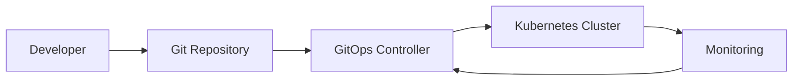

# GitOps Implementation Guide

GitOps is a paradigm that applies Git workflows to infrastructure and application deployments. It uses Git as the single source of truth for declarative infrastructure and applications.

## Core Principles

1. **Declarative**: The entire system is described declaratively
2. **Versioned**: The canonical desired system state is versioned in Git
3. **Automated**: Approved changes are automatically applied to the system
4. **Observable**: The system provides feedback on its actual state

## GitOps Workflow



## Tools Comparison

| Feature | ArgoCD | Flux v2 | Jenkins X | Spinnaker |
|---------|---------|---------|-----------|-----------|
| Kubernetes Native | ✅ | ✅ | ✅ | ❌ |
| Multi-Cluster | ✅ | ✅ | ✅ | ✅ |
| UI | ✅ | ❌ | ✅ | ✅ |
| Helm Support | ✅ | ✅ | ✅ | ✅ |
| Kustomize | ✅ | ✅ | ✅ | ❌ |
| Policy Engine | ❌ | ✅ | ❌ | ✅ |

## ArgoCD Implementation

### Installation

```bash
kubectl create namespace argocd
kubectl apply -n argocd -f https://raw.githubusercontent.com/argoproj/argo-cd/stable/manifests/install.yaml
```

### Example Application

See [argocd/example-app.yaml](./argocd/example-app.yaml) for a complete example.

### Best Practices

1. **App of Apps Pattern**: Manage multiple applications
2. **Sealed Secrets**: Encrypt secrets in Git
3. **Progressive Delivery**: Use Argo Rollouts
4. **Multi-Tenancy**: Separate projects and RBAC

## Flux v2 Implementation

### Installation

```bash
flux bootstrap github \
  --owner=$GITHUB_USER \
  --repository=$GITHUB_REPO \
  --branch=main \
  --path=./clusters/production
```

### Example Configuration

See [flux/example-source.yaml](./flux/example-source.yaml) for repository setup.

### Key Features

1. **Source Controller**: Manages Git/Helm repositories
2. **Kustomize Controller**: Applies manifests
3. **Helm Controller**: Manages Helm releases
4. **Notification Controller**: Alerts and webhooks

## DORA Metrics with GitOps

GitOps directly improves DORA metrics:

1. **Deployment Frequency**: Automated deployments via Git commits
2. **Lead Time**: Reduced manual steps
3. **MTTR**: Quick rollbacks via Git revert
4. **Change Failure Rate**: Preview environments and automated testing

### Tracking Deployments

```yaml
# Annotation for tracking deployments
metadata:
  annotations:
    dora.metrics/deployment-id: "deploy-123"
    dora.metrics/commit-sha: "abc123"
    dora.metrics/timestamp: "2024-01-20T10:30:00Z"
```

## Security Considerations

1. **Least Privilege**: GitOps controllers with minimal permissions
2. **Secrets Management**: Use Sealed Secrets or SOPS
3. **Policy Enforcement**: OPA Gatekeeper or Kyverno
4. **Audit Logging**: Track all changes via Git

## Multi-Environment Setup

```text
.
├── environments/
│   ├── dev/
│   │   ├── kustomization.yaml
│   │   └── patches/
│   ├── staging/
│   │   ├── kustomization.yaml
│   │   └── patches/
│   └── production/
│       ├── kustomization.yaml
│       └── patches/
├── base/
│   ├── deployment.yaml
│   ├── service.yaml
│   └── kustomization.yaml
```

## Progressive Delivery

Combine GitOps with progressive delivery for safer deployments:

1. **Canary Deployments**: Gradual traffic shifting
2. **Blue-Green**: Instant rollback capability
3. **Feature Flags**: Application-level controls
4. **A/B Testing**: Data-driven rollouts

## Observability

Essential metrics for GitOps:

- Sync status and frequency
- Drift detection alerts
- Resource health metrics
- Deployment velocity

## Troubleshooting

Common issues and solutions:

1. **Sync Failures**: Check RBAC and resource quotas
2. **Drift Detection**: Enable auto-sync or investigate manual changes
3. **Performance**: Tune sync intervals and resource limits
4. **Secrets**: Verify encryption and key management

## Resources

- [OpenGitOps](https://opengitops.dev/)
- [ArgoCD Documentation](https://argo-cd.readthedocs.io/)
- [Flux Documentation](https://fluxcd.io/docs/)
- [GitOps Working Group](https://github.com/gitops-working-group/gitops-working-group)
